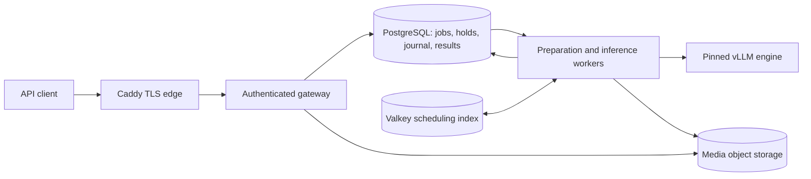

# Inference API and worker runtime

The consumer gateway is `uvicorn --factory infrx.gateway.app:create_app`. It is deployed behind Caddy at `https://marlin2b.callbill.ai`; see [current state](../../STATUS.md) for release identities and unfinished production acceptance. The current consumer regime is CREDIT, not the former USD usage-spill path.

## Runtime

PostgreSQL owns acceptance, credit holds, leases/fences, output journal, terminal state and settlement. Valkey is rebuildable. Workers perform bounded preparation and generation; accepted work must survive gateway reconstruction. The removed legacy chat/usage-spill/replay path is not a supported operating procedure.

## Consumer surface

- `/v1/models` projects the served model, capabilities, rates and availability from runtime/catalog state.
- `/v1/chat/completions`: synchronous JSON or streamed text output; explicit async work uses `/v1/jobs`.
- Job status/result/cancel and upload creation/parts/completion enforce tenant ownership and bounded replay/expiry.
- Finite-video URL, inline data and uploaded handles are implemented. Discover current caps from `/v1/models`; the qualified profile currently caps clips at 82 seconds / 64 MiB. Streaming output is not live-video input.
- New admissions recheck revoked credentials in the durable path. Reads/cancels may use cached identity for up to 60 seconds while its source answers; source outages retain the documented cached-access behavior. Unknown credentials during a dependency outage are not silently accepted.
- Completed/failed/cancelled requests follow the exact CREDIT charging policy; retries do not create a second debit. Historical USD records retain their original unit.

See [contract rulings](../../research/plan/08-contracts-v1-encoding.md), [durable protocols](../../research/plan/02-durable-protocols.md) and the App's [executable examples](../app/app/(console)/docs/examples.ts). No tools/function-calling, native live video or structured-output guarantee is advertised. OpenRouter publication is deferred.

## Configuration

`infrx/config.py`, `infrx/contracts/limits.py` and deployment preflight define configuration and bounds. Pilot startup requires its configured durable dependencies; object-store admission is not replaced by process memory if its bucket is missing. Sensitive database/auth values are injected by the rollout workflow.

The runtime uses separate identities and permissions for serving, monitoring and provider work. A broad service-role credential is never a browser credential. The legacy shared `GATEWAY_API_KEY` is refused in pilot mode. Retired `USAGE_LOG`/`USAGE_FAILED_LOG` declarations may remain in deployment configuration, but no usage-spill writer or replay program remains.

## Source map

| Path under `infrx/` | Responsibility |
|---|---|
| `gateway/app.py`, `gateway/pilot.py`, `gateway/routes/` | Consumer composition, admission and HTTP routes |
| `state/`, `operations/` | SQL adapters, audited grants/keys/rates, reconciliation and headless operations |
| `media/` | Secure fetch, upload lifecycle, bounded preparation/cache and retention |
| `scheduling/`, `worker/` | Dispatch, leases, preparation, engine requests and settlement |
| `lab/compose.py`, `lab/control/app.py` | Provider services; not every interface has a complete production adapter |
| `traces/`, `evaluation/`, `judge/`, `rollouts/` | Optional provider workflows with separate flags, permissions and acceptance |
| `contracts/` | Executable shared records, ports, fixtures and conformance |

Lab evaluation/pipeline read models, dedicated roles and real engine smoke have carried gaps. Eval-worker double-debit and trace retry tests must close before their respective enablement. Consumer serving does not depend on completing these features. [Carried register](../../research/plan/consumer-v1/10-carried-work-register.md).

## Clients and operations

`client_example.py` and `models/marlin2b/dataset.py` provide headless/resumable workflows; use their current `--help` and the [client protocol](../../research/plan/consumer-v1/05-client-and-load-testing.md). Keep stable item identities and payloads across retries, respect advertised limits/Retry-After and record terminal outcomes.

`python -m infrx.operations.cli --help` lists account/key/card/credit operations. They require the appropriate database/actor context, audit reason and idempotency key. Secret output goes to protected files, not logs. The live approved rate is recorded in [STATUS.md](../../STATUS.md); the original provisional seed is not the active rate authority.

Production deploys use the [rollout runbook](../../infra/rollout/README.md), with a frozen release, preflight, migration proof, drain, smoke, rollback and evidence. Do not replace that workflow with `git pull` plus an uncoordinated installer restart.

## Tests

From the repository root: `make api-env`, then relevant `api-test`, `api-lint`, `api-typecheck` and `api-mutants` targets. Tests live under `tests/<track>`; the [supported environment](../../tests/integration/ENVIRONMENT.md) supplies task-local PostgreSQL/PostgREST/Valkey/S3-compatible services. API typing currently uses a documented baseline.

Backend-local, browser, GPU, load and recovery gates are separate. [Test guide](../../tests/integration/README.md) and [current review evidence](../../research/plan/evidence/coordinator/2026-10-01-launch-review/verification.md) state what ran, what skipped and what remains unproved.
