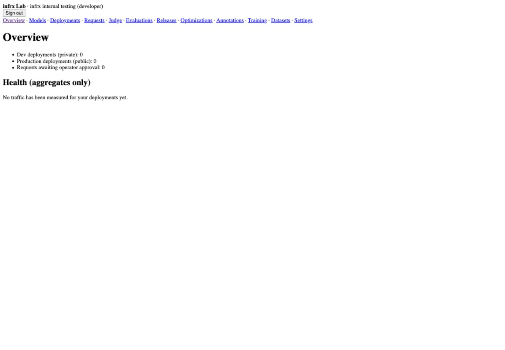
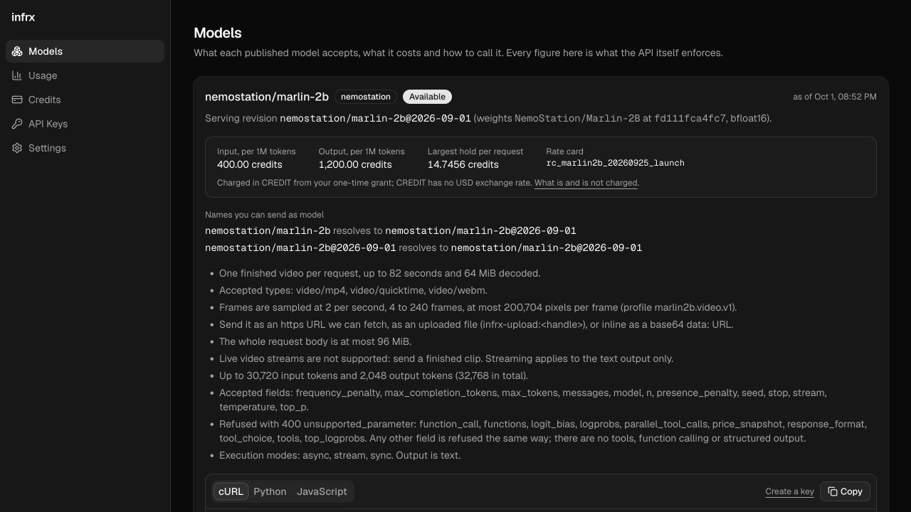
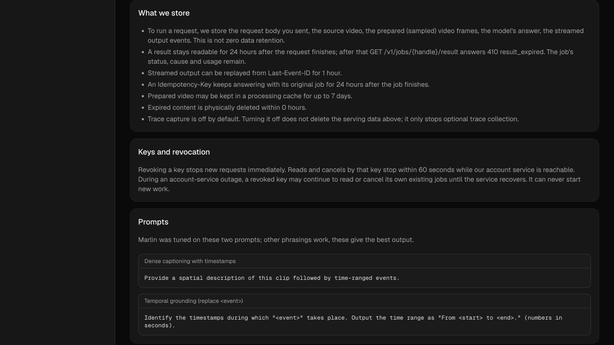

# Current product audit

Audit date: 2026-10-01. Sites: [Consumer App](https://app.callbill.ai), [Provider Lab](https://lab.callbill.ai). Source baseline and caveats are in the [entry point](README.md).

Method: inspect the actual rendered pages, save and reopen screenshots, follow navigation and open the key-creation dialog without submitting, inspect source/ports, then test mobile keyboard behavior. Lab: provisioned developer, empty workspace. Consumer: verified test account, 10,000 credits, no keys or requests. Desktop captures are 1280×720 (App) and 1440×1000 (Lab); mobile App is 390×844. Sign-in capture uses the initial 576×863 viewport. This is an expert workflow review, not evidence that users completed these tasks unaided.

No key, model, deployment, dataset, publication or inference was created. Populated request/result states, viewer/admin accounts, signup delivery, GPU readiness, pricing accuracy and SOP quality were **not tested live**. These require the [verification matrix](07-handoff.md).

## Journey evidence

Health: **Blocked** = observed task cannot proceed in this environment; **Needs work** = possible but unclear/inaccessible; **Usable** = inspected part has a reasonable path, not full acceptance.

| Step | Screen and observation | Health | Evidence |
|---|---|---|---|
| L1 | Sign in: plain browser controls, labels and fields run together; no product explanation or recovery guidance | Needs work | [01](evidence/01-lab-sign-in.png) |
| L2 | Overview: 12 equally weighted inline links; zero counters and no next action | Needs work | [02](evidence/02-lab-overview.png) |
| L3 | Models: four internal fields sit permanently below an empty list; no guided registration or field examples | Needs work | [03](evidence/03-lab-models.png) |
| L4 | Deployments: tells user to register a model without linking the action; no deployment journey | Needs work | [04](evidence/04-lab-deployments.png) |
| L5 | Requests: service cannot list this workspace; page suggests reselecting workspace without diagnosing cause | Blocked | [05](evidence/05-lab-requests.png) |
| L6 | Evaluations: records cannot be read; failure replaces page identity and task guidance | Blocked | [06](evidence/06-lab-evaluations.png) |
| L7 | Datasets: raw JSON mapping + JSONL upload; preview/import presented together, minimal prerequisite guidance | Needs work | [07](evidence/07-lab-datasets.png) |
| L8 | Settings: accurate role summary, but technical yes/no list with no coherent app shell | Needs work | [16](evidence/16-lab-settings.png) |
| C1 | Sign in: readable centered form, recovery link, visible focus styling | Usable | [08](evidence/08-app-sign-in.png) |
| C2 | Models: useful catalog, but IDs, hashes and limits precede first-call setup; key creation below first viewport | Needs work | [09](evidence/09-app-first-screen.png) |
| C3 | Keys: clear creation button and one-time-secret pattern; empty state lacks task-linked guidance | Usable with improvements | [10](evidence/10-app-api-keys.png), [11](evidence/11-app-create-key.png) |
| C4 | Usage: duplicated balance metrics dominate empty request list; no return to first-call setup | Needs work | [12](evidence/12-app-usage.png) |
| C5 | Credits: available/reserved/spent distinction is useful; raw ledger reason leaks internal naming | Usable with improvements | [13](evidence/13-app-credits.png) |
| C6 | Docs: substantial contract-backed content but no visible contents navigation; video examples need replacement input | Needs work | [14](evidence/14-app-docs.png) |
| C7 | Settings: useful distinction between serving retention and optional trace capture | Usable with copy correction below | [15](evidence/15-app-settings.png) |
| C8 | Retention: physically deleted “within 0 hours” conflicts with unknown bound | Needs correction before launch | [17](evidence/17-app-retention.png) |
| C9 | Mobile: text reflows; menu does not close on Escape and closed offscreen links still receive focus | Needs correction | [18](evidence/18-app-mobile.png), [19](evidence/19-app-mobile-escape.png) |

### Representative evidence

Current Lab overview:

Current consumer entry screen:

Observed retention claim:

## Findings and priorities

Severity is task impact, not a universal launch decision. P1 = fix before exposing the affected journey; P2 = meaningful usability improvement; P3 = polish. Existing backend launch blockers remain separate.

| ID | Priority / evidence | Finding and consequence | Required change / owner |
|---|---|---|---|
| UX-A01 | P1, live + public API + source | Public `/v1/models` returns `physical_deletion_bound_s: null`; `retentionFacts` checks only `!== undefined`, then `duration(null)` coerces null to zero. UI claims an immediate physical deletion guarantee that is not established. | UX-01: normalize unknown wire values; render no deadline without an accepted numeric bound; test real null payload through catalog → Docs. Review other expiry copy. |
| UX-A02 | P1, reproduced mobile + source | Open menu → Escape leaves menu open. Close it → focus Open menu → Tab focuses invisible logo link at x=-224. Drawer has no modal focus lifecycle. | UX-02: accessible drawer, inert hidden content, Escape/focus return and active-page semantics. |
| UX-A03 | P1 for Lab usability, live | Lab has no visual system or shell hierarchy. Every feature competes with basic model/deployment setup. | UX-03: shared visual language, grouped navigation, workspace context, page identity and states. |
| UX-A04 | P1 for Lab journey, live + source | Requests/evaluations fail, yet navigation looks fully operational. Generic error advice cannot resolve a missing composition. | UX-03/05 + existing backend owners: capability-aware landing states, accurate failure reason and retry; never count service failure as zero traffic. |
| UX-A05 | P2, live | Consumer's first screen prioritizes implementation metadata over getting an endpoint working. | UX-04: first-call panel, compact model summary, progressive disclosure and completion based on persisted request evidence. |
| UX-A06 | P2, live + source | Video example contains `https://example.com/clip.mp4`; selecting an existing key inserts its public prefix plus ellipsis into the credential position. Neither is runnable without replacement. | UX-04: reliable text connectivity test first, environment variable always, clearly labeled video input step and upload guide. No fake secret. |
| UX-A07 | P2, live | Lab registration/derive/import/review forms expose digests, UUIDs, basis points and JSON with little guidance; multiple operations share one page. | UX-03/06/08: explicit flows, readable reference selectors where catalogs exist, generated stable operation IDs, advanced JSON fallback where needed. |
| UX-A08 | P2, live | Empty lists provide little forward movement; all-zero overview looks like health. | All UI lanes: task-specific empty states, stage-aware next action and “No measured requests” rather than 0% errors. |
| UX-A09 | P2, live + source | Important retry, retention and scope facts are hard to find in a long Docs page. Async cURL example uses an unbounded loop and fixed sleep despite describing server poll hints. | UX-04/01: contents/anchors; bounded status polling and clear terminal errors while preserving tested API contracts. |
| UX-A10 | P2, source-only | Consumer expired result copy says content was removed; read expiry is not evidence of physical deletion. | UX-01/07: “This result is no longer available”; preserve result TTL and browser-cache protections. |
| UX-A11 | P2, source-only | A Lab deployment record's `active` state and `smoke: passed` cannot alone prove a real serving engine is ready. Port lacks readiness source/time or endpoint proof. | UX-03 + contract CX-02: label recorded state honestly; only evidence-backed readiness permits connection instructions. |
| UX-A12 | P3, live | Ledger reason `initial_signup_grant`, external-link icon for internal Docs, and dense duplicated balance panels impair consistency. | UX-02/07: friendly labels, correct icons, one authoritative credit explanation. |

The null retention payload was read from the public endpoint during this audit, with no credential. It contained result TTL 86400, stream TTL 3600, idempotency TTL 86400, cache TTL 604800, and a null physical-deletion bound. This corroborates UX-A01 without inferring any storage deletion behavior.

## Preserve the useful implementation

- App's visual tokens, typography and Base UI primitives; key-dialog action identity and one-time secret lifecycle.
- Live model catalog and generated SDK examples; CREDIT accounting precision and unit separation.
- Result no-store reads, expiry timers, bfcache handling and bounded status polling.
- Server-derived provider workspace, read-only viewer role, separate operator approval and customer-content grants.
- Immutable dataset/experiment references, comparison uncertainty and explicit missing evidence.

## Coverage limits and follow-up

The live Lab had no records. Populated tables, deep links, revision changes, results, grant expiry and long-running jobs below are **specified**, not proven by the screenshots. Role testing requires distinct fixtures/logins. The absent evaluation service must be fixed before a styled screen can be accepted as functional. Public signup remains governed by CAPTCHA, email delivery and grant tests. A beautiful mockup changes none of those gates.

After implementation, run moderated tasks with at least three representative model users and three provider engineers. Observe unaided first-call setup, deployment-state interpretation and failed-request recovery. Record misclicks, assistance and completion time; treat these as findings, not statistically representative conversion estimates. Suggested usability target: each participant can identify their next action and explain whether the endpoint is actually ready without help.
