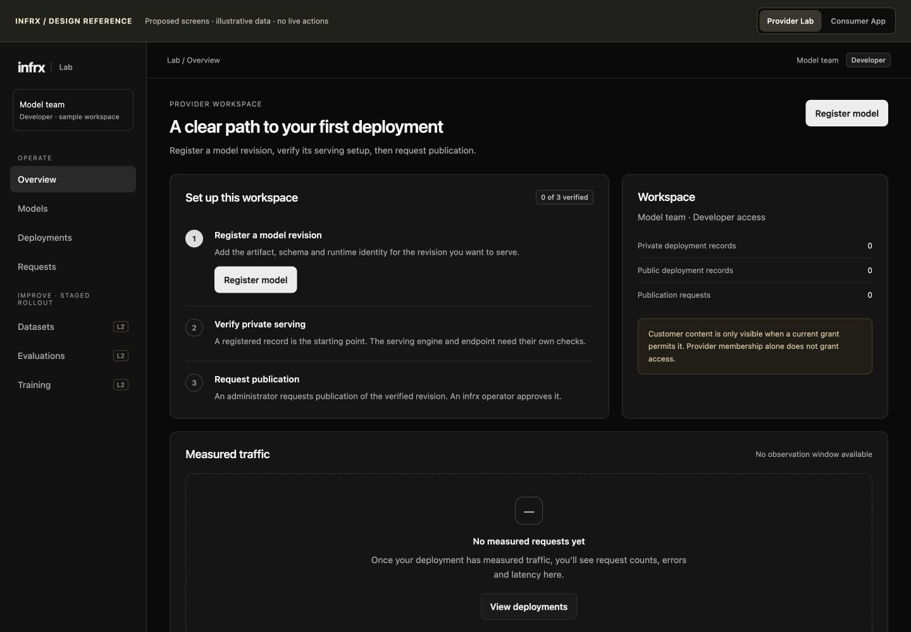
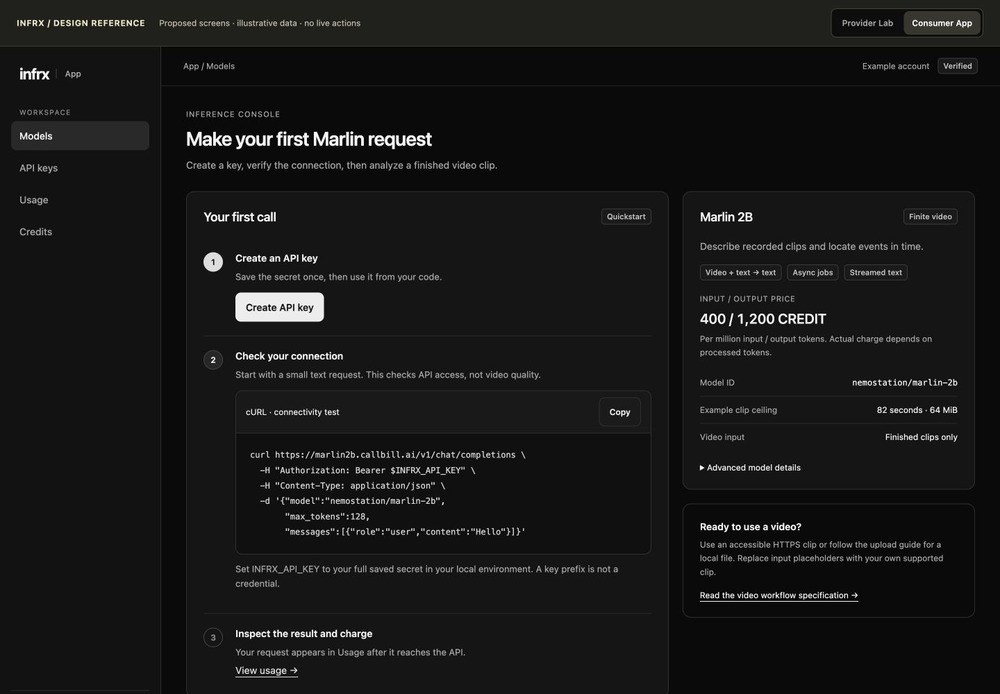

# App and Lab UX implementation package

**2026-10-01 · Proposed design, not implemented.** Source reviewed: local `795f1e7b`, including upstream `6462ed06`. Live App and Lab were inspected with a provisioned developer/test account. Exact Lab web release remains unverified. [STATUS](../../../STATUS.md) owns deployment and launch decisions.

The immediate outcome is two understandable products: a customer can obtain a key, make a valid Marlin call and inspect its result; a provider can register a model revision, understand its deployment state and inspect authorized evidence. Shipping the full improvement loop is a later phase and does not block the consumer pilot.

## Deliverables and reading order

1. [Live-product audit](01-audit.md): 19 screenshots, reproduced problems, source findings and limits of verification.
2. [Visual screen reference](design-reference.html): 11 representative screens with desktop/mobile layouts and interactive state examples. Open locally in a browser. All sample records are illustrative; no backend calls or mutations. The complete navigation and remaining screens are specified in the numbered documents, not all rendered in this reference.
3. [Design system and navigation](02-foundations.md): shared visual language, component behavior, permissions and responsive rules.
4. [Lab screen specifications](03-lab.md): launch shell/control/observability, then the dataset → evaluation → improvement loop.
5. [Consumer App specifications](04-consumer.md): prioritized changes to the existing app, preserving its contracts and useful components.
6. [Service mapping and missing contracts](05-service-contracts.md): what can be built now and what needs a backend dependency.
7. [Parallel implementation plan](06-implementation.md): owned workstreams, files, dependencies, exact exit criteria and integration order.
8. [Verification and fresh-session prompt](07-handoff.md): complete implementation instruction and evidence requirements.

## Recommended sequence

| Order | Deliverable | Why |
|---|---|---|
| 1 | Correct retention claims; fix mobile navigation keyboard behavior; preserve existing launch checks | Observed trust/accessibility defects in the live consumer experience |
| 2 | Consumer first-call journey, keys, request/result readability and navigable documentation | Reduces friction before the invited pilot |
| 3, parallel with 2 | Lab shell, sign-in, workspace selection, model registration and deployment views | Turns current working forms into a coherent provider tool |
| 4 | Lab request views and explicit service availability | Useful only with verified trace integration; absent data must not look healthy |
| 5 | Guided datasets and evaluation comparison | Backend listings, rights and accounting gates must pass before activation |
| 6 | Annotation, teacher batches, external training and controlled releases | Complete the improvement loop incrementally; no invented hosted-training service |

The visual design uses the App's existing neutral dark theme, Geist typography, compact navigation and restrained semantic colors. It adds hierarchy and task guidance, rather than a new brand. No paid plans, credit purchase, GPU fleet controls, live-video input or one-click arbitrary model hosting are implied.

## What this package establishes

- A chosen design direction, route map, interaction/state specifications and implementation-ready work boundaries.
- Live evidence for the inspected account and source mappings for other states. It is an expert review, **not a completed usability study or production certification**.
- Existing API-first consumer scope. An in-browser inference playground is deliberately deferred until its upload, charging, duplicate-submission and result-lifetime contracts are separately approved.
- An honest Lab launch: registration means a private record exists; publication is an operator decision; hardware readiness requires evidence.

Design details here supersede earlier UI sketches for these journeys. Product contracts, permissions, accounting, launch gates and runbooks still take precedence. If a design requires a contract change, implement the named dependency or ship the specified unavailable state; never invent data to match a mockup.

Screenshots contain the test account's business email/workspace name, but no password, API secret, customer video or request content. Keep them as internal repository evidence. The HTML reference uses generic identities.

## Preview and verification

The reference was opened in a browser and its 11 screens checked at 1440px. Representative App/Lab flows were checked at 390px; App reflow at 320px and Lab at 768px. Key-dialog dismissal/focus return, registration review, content-access selection and expired-result selection were exercised. This verifies the reference, not the production implementation. [Evidence index](evidence/README.md) and [reference verification](previews/README.md).

