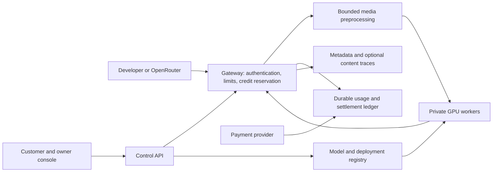

# System boundaries, economics, and distribution

Recommended design direction, 2026-09-19. This is a product architecture, not a deployment specification.

## Separate inference, administration, and accounting

Begin with a small control service, a gateway, private GPU workers and durable state. Candidate AWS components are EC2 GPU workers, an SSE-capable load-balancing path, RDS PostgreSQL for commercial state, Redis for shared rate-limit state, S3 for artifacts, and a durable event queue. Select exact orchestration after checking operational requirements; Kubernetes is not a prerequisite for the first model.

Keep payment calls out of the inference path. Use durable reservations/settlement and asynchronously project usage into dashboards. An observability outage must not erase billable usage. If credit authorization cannot be made safely, reject new prepaid work rather than creating uncontrolled spend. Define limited, explicit failure behavior for existing streams.

Core entities: organization, project, member, model owner, customer, API key, model, model version, deployment, endpoint, rate plan, usage event, reservation, credit grant, ledger entry, payment, trace and distribution channel. Keep the owner separate from the caller even while we are the only owner. Namespace model IDs and distinguish private model access from public catalog visibility.

## Build versus integrate

| Area | Recommendation |
|---|---|
| Serving engine | Reuse the current vLLM path after validation and pinning; own the Marlin preprocessing/contract adapter |
| Gateway | Evaluate LiteLLM for keys, permissions and rate limits; prove video/streaming passthrough and desired enforcement behavior before adoption |
| Payments | Integrate a payment provider; retain an authoritative internal consumption ledger and reconcile externally |
| Traces | Evaluate Langfuse integration/self-hosting; avoid rebuilding a full tracing application for the pilot |
| Metrics | Reuse an operational monitoring stack; instrument model/preprocessing timings |
| Product-specific layer | Build owner onboarding, model registry, entitlements, rate-plan binding, credit settlement, commercial console and distribution mapping |

LiteLLM documents spend controls and Langfuse accepts supplied model usage/cost. Neither documentation alone proves the transactional guarantees required for our hard prepaid balance. [LiteLLM](https://docs.litellm.ai/docs/proxy/virtual_keys), [Langfuse](https://langfuse.com/docs/observability/features/token-and-cost-tracking)

Stripe supports prepaid/promotional billing credits applied to eligible usage-based invoices. Treat that invoice workflow separately from real-time admission. Its documented restrictions also matter before creating a multi-seller credit marketplace; do not assume a service-credit integration automatically supports third-party payments. [Billing credits](https://docs.stripe.com/billing/subscriptions/usage-based/billing-credits)

## Billing rules to specify before implementation

Recommended initial rules:

- Denied, invalid and pre-execution failed requests have no inference charge.
- Reserve input plus bounded maximum output cost before GPU execution. For videos, reserve conservatively from bounded preprocessing inputs, then refine with authoritative counts. No unbounded output setting on prepaid calls.
- Settle exactly once per request against the rate version captured at admission. Use idempotent usage ingestion and payment webhooks.
- On cancellation, stop compute and bill only authoritative completed usage under the published cancellation policy; if usage is uncertain, hold for reconciliation rather than inventing counts.
- Platform-caused failures are credited under an explicit policy. Keep their infrastructure cost in internal cost reports even when customer revenue is zero.
- Internal retry attempts share a logical request identity; a fresh client submission is normally a new request. Do not promise streaming replay/idempotency without implementing it.
- Record credit grants, purchases, holds, settlements, releases, refunds and adjustments separately. Use fixed-precision currency accounting; keep inference token counts separate from monetary credits.

Request traces are operational records. The financial ledger is the source of truth for charges. Sampling a trace must never sample away a billable usage event.

## Marlin-specific launch implications

The public model card describes video captioning and temporal grounding and labels the repository Apache-2.0 with gated access. Record the accepted gate terms and artifact provenance during onboarding. Do not present this specialist as a general chat or tool-calling model. [Model card](https://huggingface.co/NemoStation/Marlin-2B)

Local experiment evidence in [results notes](../../marlin2b/results/notes.md) reports:

- vLLM uses an architecture override; canonical caption/find prompts matter.
- Explicit video preprocessing changes the tested clip's prompt usage from 12,221 to 2,061 tokens.
- Two tested source clips have different throughput despite similar final prompt sizes.
- Repeated identical inputs may benefit from multimodal caching; those results cannot establish production unit costs.

Consequently the service must own preprocessing defaults, validate unique real clips, and measure upload/download, decode, frame sampling, vision encoding, queue and generation separately. Record duration, bytes, sampled frames, processing profile and usage without retaining source content unnecessarily.

“OpenAI compatible” describes a tested interface subset. Video content requires an explicitly documented extension/adapter; a working text request does not prove video portability. The direct service should provide simple caption/find examples while preserving the compatible transport.

## Pricing and contribution margin

Start with separate input/output per-token prices for the compatible API. Show a per-clip/video-minute estimate as an aid only, with processing-profile assumptions. Consider a separate per-video tariff later if it better matches customers' job; do not mix incompatible billing units in partner reporting.

For each period:

**Revenue** = sum of billable input tokens × input rate + billable output tokens × output rate, with rates converted to per-token units and explicit discounts/credits.

**Serving cost** = GPU and CPU capacity + storage + network + preprocessing + gateway/observability overhead + failed/retried work.

**Contribution** = revenue − serving cost − payment/channel costs.

Track infrastructure cost at two levels: workload allocation estimates per request, and actual aggregate spend reconciled to AWS. Batched GPU time is shared; do not present per-request GPU allocation as a precise measured bill. Include idle capacity. Keep staff/support cost visible separately when assessing business sustainability.

Benchmark at low, medium and high utilization with mixed clips and an explicit latency target. Use the repository's [pricing source of truth](../cross-cutting/cloud-pricing.md) for pinned infrastructure rates. No new hardware-price assumptions or launch token rates are introduced here.

For external private models, a minimum capacity commitment is preferable initially to promising profitable pay-per-token hosting at arbitrary utilization. Public shared models can use consumption pricing after demand and capacity are understood. Owner revenue share and platform fees remain commercial decisions, not assumed percentages.

## OpenRouter path

The current application page requires an OpenAI-compatible streaming Chat Completions endpoint and usage counts for streaming and non-streaming. It describes review of reliability, pricing, performance and data policies, followed by integration tests. Providers set per-token USD prices and are paid through monthly invoicing. It also states there is an application backlog with priority for proprietary models. These conditions make admission a dependency, not a promised launch channel. [Provider application](https://openrouter.ai/providers/apply)

Prepare:

1. Stable model IDs, capability/context metadata, price versions and endpoint credentials.
2. Streaming/non-streaming parity, accurate usage, error handling and cancellation evidence.
3. Latency/throughput/reliability measurements under representative offered load.
4. Published retention/training policies and a supported video payload contract.
5. A separate partner account, quota, price plan and usage reconciliation process; monthly settlement must not accidentally use the direct customer's prepaid policy.
6. Explicit rights/authorization to distribute each model and commercial onboarding information.

OpenRouter documents `video_url` content with URL or base64 input, with support varying by provider. Verify its Marlin routing/metadata requirements during onboarding; model listing does not follow merely from supporting text Chat Completions. [Video inputs](https://openrouter.ai/docs/guides/overview/multimodal/videos)

Metadata-only telemetry can coexist with no stored prompt/output content, but retention disclosures must match every layer, including gateway logs and media caches. The provider relationship exposes a partner account; do not assume we receive the identity of each underlying OpenRouter consumer.

## Verification log

- 2026-09-19: Reviewed OpenRouter provider/video docs, Marlin public card and local benchmark notes, Stripe credits, LiteLLM and Langfuse docs. Architecture and billing policies are recommendations. No AWS configuration, live performance, payment integration or provider acceptance was verified in this session.
