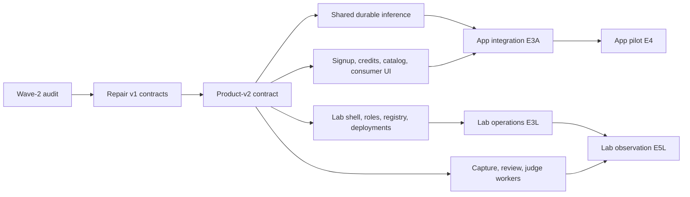

# Implementation amendment — App and Provider Lab

Revision 2026-09-21. Read [product architecture](../platforms/README.md) first. This amendment supersedes conflicting routing, credit-unit, signup and release-dependency instructions in the original module briefs. Unchanged durable protocols remain binding.

## Current State Summary

Wave 2 of the original 45-task plan is now imported at `271add9`. [The audit](10-wave2-platform-audit.md) records actual completion evidence, local corrections and the new revision tasks. The table below preserves the original conceptual mapping; **F2 changes now occur in F2R/F2P, D1 changes in additive D1R, C1 database integration in C0 and the implemented V1 move in V1M**. Do not reset those original tasks or rewrite 0001–0005.

Hosted state and unpushed other-system work remain unverified. The audit branch includes bounded runtime/test fixes in addition to this design package. No production mutation is implied.

## What changes immediately

1. Keep App focused on verified consumer signup, individual promotional credits, public models, keys and own usage. Add the missing signup journey; current invite-only behavior is a historical baseline.
2. Replace the earlier zero-balance/operator-only signup rule with a one-time 10,000 grant per individual. CREDIT amounts are a separate unit from existing USD data; do not implement this as a cosmetic rename.
3. Preserve shared runtime D/M/Q/W/G work. Add trusted wallet, provider, serving revision and rate-card identity to contracts. Lab uses the same inference infrastructure.
4. Route provider trace/review/evaluation UI V to Lab. Split C actions and the mixed D6/G4/T2 tasks to remove unnecessary dependencies. Backend trace and judge implementations remain reusable modules.
5. Give App and Lab separate integration/deployment gates. App can ship with capture disabled; it cannot ship unmetered or bypass privacy tests for enabled capture.
6. Introduce provider roles and customer-data access grants before exposing provider analysis. Org ownership is not provider or operator authorization.

## Preserve, modify, move, defer

The [manifest](tasks.json) is version 3. Every original task ID remains identifiable. Six mixed tasks are marked `superseded-for-scheduling`; their replacement IDs are the active work units. Existing commits against the old IDs can satisfy successor slices after review. Baseline statuses preserve imported progress; amendment_status and revision_tasks identify pending product changes.

| Original ID | Disposition | Active ID(s) | Product / milestone | Required change |
|---|---|---|---|---|
| F1 | keep | F1 | shared; APP-M0 | Preserve completed extraction and existing security fixes. |
| F2 | preserve + revise | F2R, F2P | shared; APP-M0 | Freeze CREDIT, individual grant, consumer/provider scopes and serving/rate identities before merging conflicting feature contracts. |
| D1 | preserve + expand | D1R | shared; APP-M1 | Add user-owned CREDIT wallets and grant uniqueness; preserve USD history; add minimal provider/model/deployment ownership. One migration owner. |
| D2 | modify | D2 | shared; APP-M1 | Resolve wallet from trusted consumer context; pin deployment and CREDIT rates in the admission transaction. |
| D3 | keep | D3 | shared; APP-M1 | Preserve fenced execution, recovery and cancellation. |
| D4 | keep | D4 | shared; APP-M1 | Preserve committed journal and replay guarantees. |
| D5 | modify | D5 | shared; APP-M1 | Settle CREDIT once; preserve legacy USD regime; grant operations support A1. |
| D6 | split | D6F, D6J | shared; LAB-M1 | Separate feedback acceptance from judge-budget coordination. |
| M1 | keep | M1 | shared; APP-M1 | Keep URL/base64 security and bounded materialization. |
| M2 | keep | M2 | shared; APP-M1 | Keep versioned preprocessing and tenant-separated caches. |
| M3 | keep | M3 | shared; APP-M1 | Keep owned upload lifecycle. |
| Q1 | keep | Q1 | shared; APP-M1 | Keep deterministic scheduling interface. |
| Q2 | keep | Q2 | shared; APP-M1 | Keep rebuildable Valkey index. |
| Q3 | keep | Q3 | shared; APP-M1 | Keep outbox and index recovery. |
| W1 | modify | W1 | shared; APP-M1 | Include immutable serving revision/capabilities; no generic robotics runtime yet. |
| W2 | keep | W2 | shared; APP-M1 | Keep lease-aware execution and completion. |
| W3 | keep | W3 | shared; APP-M1 | Keep measured capacity, pin and drain work. |
| G1 | modify | G1 | shared; APP-M1 | Separate credential audiences; enforce published model capability/rate and trusted wallet mapping. |
| G2 | keep | G2 | shared; APP-M1 | Keep sync/SSE behavior; consume revised snapshots. |
| G3 | keep | G3 | shared; APP-M1 | Keep explicit async, cancellation and owned replay. |
| G4 | split | G4U, G4F, G4T | shared; APP-M1 | Uploads must not depend on feedback/judge/traces. |
| G5 | defer-from-launch | G5 | shared; APP-M3 | Useful optional callbacks; no consumer M2 dependency. |
| T1 | reuse-later | T1 | shared; LAB-M1 | Shared capture; consumer launch may disable it. All bounds/privacy tests required if enabled. |
| T2 | split | T2I, T2F | shared; LAB-M1 | Inference projection must not depend on judge coordination; feedback is a separate projection adapter. |
| T3 | reuse-later | T3 | shared; LAB-M1 | Keep retention/deletion; apply provider access grants at read/export boundary. |
| J1 | reuse-later | J1 | lab; LAB-M1 | Judge dry-run is Lab scope, independent of consumer launch. |
| J2 | modify | J2 | lab; LAB-M1 | Use provider-purpose grants and explicit Lab USD budgets; never consume consumer credits implicitly. |
| J3 | move-ui-dependencies | J3 | lab; LAB-M1 | Calibration uses Lab actions/review permissions. |
| C1 | preserve + integrate | C0 | shared; APP-M1 | Separate consumer and provider entry points; minimal consumer usage comes from PG, independent of CH. |
| C2 | modify | C2 | shared; LAB-M1 | Content access requires source ownership/expiry plus provider-purpose grants when applicable. |
| C3 | split | C3A, C3F, C3L | shared; APP-M1 | Separate consumer actions from feedback and Lab judge actions. |
| U1 | modify | U1 | app; APP-M1 | Credits instead of USD; own request history from authoritative usage; legacy USD separately labeled. |
| U2 | modify | U2 | app; APP-M1 | Consumer keys/privacy remain in App; no Lab settings. |
| U3 | modify | U3 | app; APP-M1 | Protected platform operator controls remain temporarily in App; provider role never mints credits. |
| V1 | move | V1M | lab; LAB-M1 | Provider trace explorer goes to apps/lab, using explicit authorized dataset/request scope. |
| V2 | move | V2 | lab; LAB-M1 | Provider content/review UI goes to Lab; reusable own-request components can later serve App. |
| V3 | move | V3 | lab; LAB-M1 | Judge/calibration presentation goes to Lab. |
| I1 | modify | I1 | shared; APP-M0 | Inventory current remote state and separate App/Lab deploy identities; no infrastructure mutation. |
| I2 | split | I2A, I2L | shared; APP-M2 | Separate consumer runtime deployment from Lab deployment. |
| I3 | modify | I3 | shared; APP-M2 | Consumer recovery gate depends on E3A; Lab recovery is separate and conditional services tested if enabled. |
| I4 | keep | I4 | shared; APP-M3 | Fleet remains separately gated after pilot. |
| E1 | keep | E1 | shared; APP-M0 | Reuse representative corpus/benchmark evidence; no repeated-clip shortcut. |
| E2 | modify | E2 | shared; APP-M1 | Add two-user/two-provider fixtures and separate App/Lab test discovery. |
| E3 | split | E3A, E3L, E5L | shared; APP-M1 | Separate consumer integration, Lab operations and Lab observation gates. |
| E4 | modify | E4 | app; APP-M2 | Consumer pilot includes verified signup/grant/rates and usage; judge and provider UI are not prerequisites. |

## File ownership and moves

| Existing/planned area | Action | Owner and timing |
|---|---|---|
| `apps/app` auth, catalog, keys, usage, Credits and consumer settings | Keep and adapt | A/U for views; C for business actions; D for financial mutation |
| `apps/app` protected `/admin` | Keep temporarily for platform operators | U3/C3A; do not turn it into provider Lab |
| Planned App trace pages and judge/review components | Route to `apps/lab` | V; if already implemented, coordinator moves in a dedicated commit after reviewing imports and tests |
| `apps/app/lib/services` and server actions | Split consumer/provider entry points; extract common internals only once | C; provider actions in Lab, shared server package if needed |
| `apps/app/supabase/migrations` | Keep physical location, share logical authority | D alone; no copied or renumbered history |
| `apps/infrx-api/infrx/state`, media, scheduler, worker and gateway | Reuse | Existing D/M/Q/W/G owners; apply revised contracts without rewriting healthy modules |
| `apps/infrx-api/infrx/traces` and judge worker | Reuse as shared backend / Lab workflow | T/J; do not move Python code into Next.js |
| Lab shell, auth, model/deployment views | New app implementation in later work | L, coordinated workspace setup; do not copy App with its permissions |
| Package/lockfiles, root navigation/build/test wiring | Single coordinator change | S/F; avoid concurrent package extraction |

Routes absent from this checkout are proposed destinations. Use V1M and inspect the committed trace files before any move. Preserve a consumer own-request detail view only where its scope is explicit; do not delete useful shared rendering code when moving provider features.

## Contract revision and compatibility

F2P publishes contract revision 2 after F2R repairs: CREDIT wallet/amount types, individual grant key, consumer/provider authorization contexts, immutable model/serving/deployment/rate identities, separate Lab budget denomination and capability metadata. Reject mixed schema/unit payloads explicitly or implement a named compatibility adapter with tests; never guess the unit from a field name.

D1R adds migration coverage for historical USD and new CREDIT records. D1 already created USD-based durable holds in 0003–0005; retain/drain old jobs in the original regime. A1 provides idempotent initial-grant issuance/backfill. No account or grant history is deleted to make an upgrade pass.

Minimal publication records are part of App's operator-managed catalog path A3. Lab L3/L4 later provide provider workflows over those records; App does not await L3. Provider permissions and source grants are separate from capture/evaluation consent. The existing one-dimensional org query filter is insufficient for provider analysis across consenting consumers.

## New task dependencies and release gates

The active manifest explicitly splits D6 into D6F/D6J; G4 into uploads/feedback/trace export; T2 into inference/feedback projection; C3 into App/feedback/Lab actions; I2 into App/Lab deploy; and E3 into App, Lab operations and Lab observation integration. Retired mixed IDs must not appear in new dependencies.

App release depends on E3A + I2A/I3 + E4. Lab operations release depends on E3L + I2L. Lab observation release adds E5L and actual deployment evidence for its workers. App has no dependency on V/J/L tasks. If optional capture/callbacks are enabled for App, include their feature suites; feature-disabled startup must prove these services are not required.

## Cross-system reconciliation procedure

The remote coordinator reads [the handoff](PLATFORM-SPLIT-HANDOFF.md), inventories branches/worktrees and maps commits to old/new task IDs. Record each slice as not started, in progress, implemented against old contract, contract-updated, or integrated with evidence. Maintain append-only handback records; do not infer completion from this plan's `planned` labels.

For changes not yet implemented, use new destinations immediately. For active overlapping files, let the current owner finish a coherent commit and assign one amendment owner. For integrated provider pages, migrate only after Lab shell/shared imports exist. Update fixtures first, migrate database forward, update adapters, then UI. New sessions branch from the coordinator's committed amended base; existing sessions cherry-pick/rebase only under that coordinator's reconciliation plan.

No remote work has been interrupted or messaged by this planning session. Product milestone decomposition beyond initial App and Lab foundation remains intentionally gated; see [Lab roadmap](../platforms/06-lab-roadmap.md).
