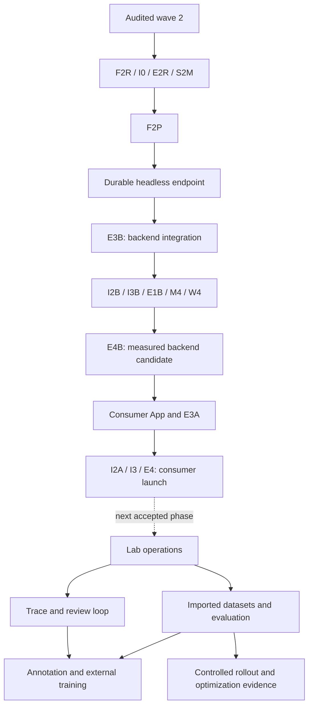

# Complete implementation plan — Marlin backend, then App, then Lab

**2026-09-24 superseding dispatch:** [Program 22](22-consumer-v1-implementation.md), [handoff/prompt 24](24-consumer-v1-session-handoff.md) and the current [manifest](tasks.json) replace older next-task lists in this document. Existing implementation is preserved; S3 reconciles it, F2C freezes corrections, E3C/E4C close backend readiness, then App. Use this document for unchanged baseline contracts/ownership and historical context, not to restart completed waves.

Updated 2026-09-22: **complete the robust, measured and optimized Marlin2B inference backend first; launch the consumer App next, then provider Lab.** SOP verification over large robotics datasets remains the lead application. [Backend-first handoffs](18-marlin-backend-first.md) define the current execution gate. This package covers the complete agreed two-platform roadmap without making the whole roadmap a launch dependency.

## Current objective and what “complete” means

The next implementation session completes the headless Marlin endpoint: scoped API keys/tenant controls, immutable model/rate resolution, secure finite-video preparation, sync/SSE and explicit async, durable execution/accounting, recovery/restore, operational telemetry and measured media/GPU optimization. E3B proves local backend integration; E4B certifies the final real-GPU endpoint envelope. App signup/onboarding/catalog/credits/usage pages follow this backend candidate. Individual credits and existing financial invariants are retained through shared backend functions; no temporary unmetered runtime is introduced.

The Lab roadmap remains concrete and ready for later sessions: provider operations → observations/review → imported datasets and comparisons → annotation/external training → controlled release/optimization evidence. Activate App feature work after the backend candidate is accepted, then Lab after the App candidate. Missing GPU/staging infrastructure is not a reason to silently switch to frontend or Lab scope.

| Completion level | Evidence required | What it does not establish |
|---|---|---|
| Implemented | Reviewed current-HEAD code, discovered unit/contract tests, meaningful failure oracles | Real-service wiring, deployed behavior or model accuracy |
| Integrated locally | Actual DB/storage/queue/auth adapters and headless backend journey; later App/Lab gates add browser journeys; restart/race/denial cases | Real GPU, hosted environment or external paid adapter correctness |
| Release ready | Local gates plus allocated staging/GPU/restore/load evidence, migration/rollback, approved rates and environment inputs | That production has already changed |
| Released | Authorized deployment and hosted smoke/monitoring evidence tied to deployed SHA/config | Other roadmap features or other models/hardware |
| Complete agreed platform | All core App and Lab M0–M4 journeys integrated, plus per-enabled-feature release evidence | Speech, generic robot control, every chip, fully managed RL training or other conditional work |

A missing service is **pending**, never a skipped pass. Synthetic test endpoints establish software behavior, not model improvement. Build/review work is authorized; this plan is not blanket authorization for cloud purchases, paid teachers/training, physical actuation or a main merge that auto-deploys App.

## Authoritative reading and baseline

1. [Fresh-session handoff and prompt](16-fresh-session-handoff.md).
2. [Backend-first scope and eight new briefs](18-marlin-backend-first.md), this full roadmap and [pending inputs/carryovers](15-pending-inputs.md).
3. [Product architecture](../platforms/README.md), [App spec](../platforms/03-app-spec.md), [credit policy](../platforms/02-credits.md); read Lab spec when assigned that phase.
4. [Manifest v4](tasks.json), [contracts](01-contracts.md), [durable protocols](02-durable-protocols.md), [execution protocol](03-execution-protocol.md), and the selected task's brief.
5. [Audit](10-wave2-platform-audit.md) for findings and [revision handoffs](11-wave3-revision-handoffs.md) for nine mandatory corrections. Earlier module algorithms remain valid except where explicitly amended.

Main was imported at `271add946771ddc4efc3cbc2044758443080759b`; audit commit is `07dfb64`. Use the committed tip of `codex/wave2-platform-audit` containing this package, reconcile newer main changes, and record the selected integration SHA. The old instruction to start from main alone misses this amendment until it has actually merged. The original 77 manifest records and statuses are preserved; v4 now adds 42 planned packages across the complete-plan/backend-first revisions (119 total, 113 active, six retired). Historical audit counts stay historical.

Already done: F1/F2/D1/E1/I1 original integration, ten other wave-2 modules implemented, S1 audit implementation and bounded audit fixes. Still pending: product-v2 CREDIT/identity/schema revision, real runtime composition, consumer journey, all runnable Lab work and hosted/GPU release evidence. `apps/lab` is currently only a README. The [audit evidence](evidence/wave2-platform-audit.md) reports actual earlier tests; this documentation update does not rerun or certify runtime behavior.

## Delivery order

| Stage | Work and exit | Parallel development / guardrail |
|---|---|---|
| B0 — review and repair | Review audit HEAD; F2R, I0, E2R and S2M → F2P | F/I/E/S2M have distinct code/doc ownership. Publish accepted contracts before feature owners start. |
| B1 — durable endpoint | D1R → D2–D5/A1; G1R/G2/G3/G4U/G6B; M/Q/W → E3B | Headless provisioned-client journey. No App/Lab process required. D owns shared entitlement and accounting; other runtime lanes use committed fixtures. |
| B2 — deploy and measure | I2B, I3B and E1B | Reproducible backend deployment, recovery/restore and measured real-GPU baseline independent of frontends. |
| B3 — optimize and certify | M4/W4 → E4B | Controlled video-preparation and serving experiments; final combined quality/load/soak/fault evidence. |
| A1 — consumer frontend next | A2/A3, C0/C3A, U1R/U2/U3 | Activate after backend candidate acceptance; reuse G6B/D/A1 primitives and validated runtime. |
| A2 — working App | G2/G3 composition after durable/runtime gates; E3A | Complete signup→key→Marlin request→usage→exhaustion with Lab unavailable. No fake production account data. |
| A3 — consumer launch | I2A/I3/E4 plus signup/callback and remaining App inputs | Reuse I2B/I3B/E4B; add App deployment/browser evidence and rerun backend checks affected by changes. |
| L0 — operate provider | L1–L4/E3L/I2L | Activate after App candidate acceptance. Assisted registry, dev/prod, roles, publication and rollback. |
| L1 — observe and review | V1M, C2, D6F/D6J, T/J/V/C3F/C3L/G4F/G4T → E5L | Own/consented evidence, dry-run judge first; content rights and loss metrics required. |
| L2 — compare candidates | F3/D7; N1/N2/N4, H1, B1–B4, I5 → E6L | Imported owned datasets do not wait for traces, E5L, a live judge or training. |
| L3 — improve | D8/N3/P1–P4/I6 → E7L | Existing annotation + external training bundle/checkpoint workflow; second authorized iteration. |
| L4 — release experiments | D9/R1–R4/I7 → E8L | Can run independently of L3 after L2. Stable cohorts, budgeted shadow, rollback and measured variants. |
| Conditional expansion | G5 callbacks; I4 fleet; X1–X6 video/robotics/hardware | Only after their activation criteria; speech and commercial scope remain parked. |

These are dependency bands, not instructions to wait for every task in a band before starting the next. The manifest's start and integration edges govern; the current backend-first scope governs which ready work is dispatched. Staging evidence may block release without blocking local integration. Lab M2's offline workflow deliberately does not depend on customer traces.

Delivery priority is backend → App → Lab. Technical reuse edges and release evidence are explicit in the manifest. A blocked live target does not automatically activate a later product phase.

## S2M — Marlin SOP inference launch profile

**Owner:** S coordinator, with F/M/W/E review. **Start:** S1 code-ready. **Integrates into:** W3/G6B/E1B/E4B and later A3/E4. **Owned output:** `research/workloads/marlin-sop.md` (to create); fixture changes via F/E. **Oracles:** MARLIN-SOP, MEDIA-PARITY, BACKEND-JOURNEY.

1. **S2M.a:** Inspect the actual Marlin artifact/processor/config and current preparation/benchmark code. Pin model and preprocessing revisions; specify supported modalities, request shape, finite-video limits, response modes and documented output capabilities. Do not infer action generation or native streaming from the user's VLA application context.
2. **S2M.b:** Supply an owned or authorized SOP-oriented example and a client recipe for a large dataset: per-episode/source IDs, bounded uploads and concurrency, stable idempotency, explicit async polling/resume, failures and exact usage. This is a tested API recipe using existing job primitives; a giant batch UI/service is not a launch prerequisite.
3. **S2M.c:** Separate endpoint conformance from task-quality certification. Record rubric, ground truth, temporal event matching, dataset licenses/splits and quality thresholds as pending Lab inputs if absent. A functioning model endpoint can launch with honest capability limits; it cannot claim verified SOP accuracy without evidence.

**Done:** docs and smoke inputs match the actual endpoint, unsupported media/modalities/output features are rejected, interruption/resume does not create duplicate accepted jobs, and W3/E1B/E4B test the pinned Marlin profile. Never label a fake engine or historical single-clip result as validation on the large robotics dataset. Each slice targets 2–8 hours; split before assignment if inspection exposes larger work.

## Worktree ownership and useful parallelism

Use `codex/<task>-<slug>` branches in isolated worktrees from a recorded committed integration SHA. One owner per mutable path. Maximum useful parallelism is determined by contracts and disjoint files, not a promised session count. During backend-first work, dispatch F/I/E/S2M immediately, then D/M/Q/W/G lanes as dependencies permit; A1 is shared D-owned entitlement work. Frontend C/U/A2/A3 work follows the backend gate. Performance experiments sharing a GPU are serialized; code/fixture work can proceed in disjoint worktrees. After activation, N/H/B/P/R add separate Lab feature roots; UI/backend sublanes may split further once their shared fixtures are committed.

| Shared surface | Single writer / rule |
|---|---|
| SQL migrations, financial/job repositories | D. Reserve sequence at integration; D8 and D9 may design concurrently but migrations are merged and tested serially. Never rewrite 0001–0005. |
| Common schemas and fixtures | F on explicit revision tasks; coordinator publishes atomic Python/TypeScript changes. |
| Auth/query clients and wallet/registry services | C/shared owners. N/B/P/R own explicitly assigned feature actions, reuse authorization and repositories. |
| App/Lab navigation, composition roots, CI/test discovery, workspace/lockfiles | Coordinator. Worker supplies a small integration request; no parallel edits. |
| Runtime gateway/engine | G/W. R/X request narrow hooks or an explicit path transfer; they do not patch the same file concurrently. |
| Lab shell versus features | L shell/models/deployments; V trace views; N datasets; B evaluations/experiments; P annotations/training; R releases/optimization. |
| Verification | Module owners own focused suites; E owns cross-module and browser gate suites. Actual reviewer is separate from implementation where available; never fabricate review signoff. |

Every worktree handback gives owned files, SHA, contracts changed, tests and skips, failure proof, migration/rollback, unresolved inputs and next compatible task. The coordinator updates the manifest and assignment ledger after merging, not every worker. Do not stop at a planning document or fake-only shell when the assigned goal is implementation.

## Release and scope boundaries

- **Backend first:** E3B local; I2B/I3B/E1B/M4/W4 → E4B for a measured robust endpoint. No Next.js application dependency.
- **App launch:** E3A local; E4 plus I2A/I3 and actual release inputs for pilot. No L/V/J/N/H/B/P/R/F3/D7–D9 prerequisite. Capture off is valid.
- **Lab operations/observations:** E3L/I2L and E5L independently; customer content requires current source-purpose grants.
- **Complete core locally:** E3A/E3L/E5L/E6L/E7L/E8L, actual services and supported manual training connector. Publish each milestone's evidence separately.
- **Complete enabled release:** every enabled feature's local and staging evidence, actual model/adapter validation and authorized environment changes. Unselected automatic paid connectors and conditional extensions remain unavailable.
- **Additional compute/model work:** use serving variants and R3 evidence. X tasks gate new modality transports and hardware adapters; no broad platform guarantee before a measured supported combination.

No dates or staffing estimates are invented. At assignment, split each package's listed slices into reviewable 2–8-hour units and estimate from code/environment facts. Keep the acceptance oracle unchanged when splitting. Review the critical path after each merge; use [the complete task ledger](17-task-ledger.md) to see pending scope and [the pending-input register](15-pending-inputs.md) to avoid hidden blockers.
