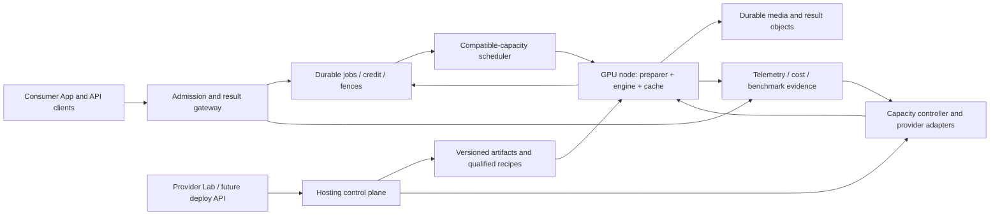

# 23 — Inference hosting: next product discussion and validation roadmap

Status: **proposal for discussion after the consumer implementation handoff**, not an approved fleet deployment. Prepared 2026-09-24. The active delivery scope remains [consumer v1](22-consumer-v1-implementation.md). Existing conditional I4 and later Lab/X tasks remain in [the manifest](tasks.json); this document does not add an independent executable task graph.

## Product boundary

The intended follow-on product takes a supported model artifact and a declared workload, produces a qualified deployment recipe for available hardware, exposes an authenticated versioned endpoint, scales within an explicit cost/latency envelope and makes performance/recovery measurable. Consumer App uses those endpoints; provider Lab manages model versions, experiments and publication. A shared hosting control plane supplies both.

“Feature compatible with Modal” needs a specific surface. The proposed scope is **managed inference hosting**: reproducible model deployment, hardware selection, concurrency/queueing, scale-up/down including optional scale-to-zero, durable weights, secrets/network policy, endpoint versions, metrics, logs, rollback and billing attribution. General Python function execution, arbitrary containers, notebooks, sandboxes and a full cloud developer platform are not implied. Confirm the desired SDK/CLI/API experience during discussion before committing to their compatibility.

Primary references reviewed 2026-09-24:

- Modal's Function scaling controls distinguish minimum, maximum and spare containers and an idle scale-down window; default idle behavior can reach zero. Keeping warm capacity trades idle cost for startup latency. These Function controls are a reference, not proof of equivalent behavior for every Modal product surface. [Modal scaling](https://modal.com/docs/guide/scale)
- Cold-start work and placement of model weights are separate concerns to measure, not one “startup time.” [Modal cold starts](https://modal.com/docs/guide/cold-start), [model weights](https://modal.com/docs/guide/model-weights)
- vLLM's serving benchmark exposes request-rate controls and TTFT/TPOT/ITL/end-to-end and goodput criteria. [vLLM serving benchmark](https://docs.vllm.ai/en/latest/cli/bench/serve/)
- SGLang's serving benchmark supports arrival rate and concurrency controls; its non-streaming first-response timing must not be compared directly with streamed TTFT. [SGLang benchmark](https://docs.sglang.io/docs/developer_guide/bench_serving)

These sources inform the proposed tests below. They do **not** establish Marlin compatibility with SGLang, any speed/cost advantage, available GPU inventory or an appropriate universal autoscaling policy.

## Proposed architecture and retained interfaces

This is a target boundary, not the current deployment. Today shared services and GPU processing are partly colocated and upload lifecycle still needs repairs. Before separating them, make uploaded handles/state durable (M5/D10), GC safe (M6), restore reproducible (I8) and telemetry truthful. Prepared local video paths require affinity: a worker/engine pair must share the right local artifact, or rehydrate it from durable storage with a versioned cache key. Do not label the gateway/worker fleet stateless while cross-process local references remain.

Persist desired deployment state, recipe/artifact hashes, hardware requirements, capacity bounds, generation/fencing and observed state. Controllers reconcile idempotently; a retried provider API call cannot create unlimited duplicate instances. Admission/settlement stay independent of a GPU node's lifecycle. An autoscaler must not become a second financial authority.

## Capability matrix and order for discussion

| Priority / proposal | Product outcome | Prerequisite | Verifiable exit |
|---|---|---|---|
| H0: workload and recipe qualification | Know what one model/hardware/runtime combination can actually serve | Consumer backend evidence, supported model contract | Pinned artifacts, engine/processor compatibility, resource bounds, correctness/parity and baseline cost/latency profile |
| H1: replaceable GPU data plane | GPU capacity can be replaced without losing accepted work | Durable uploads/GC, artifact restoration, separate control services | Two-node compatibility/affinity test, crash recovery, no cross-node lost media or duplicate terminal accounting |
| H2: bounded load management | Route/queue fairly within measured memory/latency limits | H0 capacity model, H1 identities/leases | Overload and noisy-neighbor tests; bounded queue age and graceful drain |
| H3: scale-up/down and optional zero | Buy capacity only within a declared policy while meeting cold/warm objectives | H1/H2, approved cloud/budget/availability target | Burst/idle/capacity-shortage/control-plane-restart matrix; exact node accounting; no stranded jobs or oscillation |
| H4: qualified custom hosting | A provider supplies model card/weights and gets a tested endpoint recipe | Registry, isolation, H0 qualification automation | Supported new model goes artifact→validation→staging→benchmark→publish→rollback; unsupported combination fails clearly |
| H5: reproducible Modal comparison | Customer can compare equivalent workload outcomes and costs | One qualified deployment on each provider, explicit paid-test budget | Repeatable raw-data report with matching workload/quality, cold/warm and idle costs, limits and uncertainty |

H5 baseline measurements can start before fleet work once resources and model support are approved. Repeat them after H3/H4 to compare platform behavior, not just an isolated engine. Runtime support and autoscaling are separate hypotheses: don't change hardware, engine, quantization and scaling policy simultaneously and then attribute all improvement to one change.

## GPU scaling and scale-down contract to decide

Inputs should include oldest eligible queue age, estimated remaining work and deadlines, running/prefill/decode pressure, warm/starting/draining capacity, startup time and provider availability. Raw request count or GPU utilization alone is insufficient when a short text request and near-cap video have very different preparation/memory costs. Begin with a conservative measured service model; refine estimates with telemetry and bounded error margins.

Specify min/max/warm-buffer capacity, scale-to-zero eligibility, cooldown/hysteresis, maximum provisioning concurrency, spend ceilings and cold-start admission policy. Make the chosen behavior explicit to users: accepted durable wait with deadline, temporary rejection or always-warm service. An unavailable GPU allocation must cause bounded queueing/backpressure, not endless hidden retries or a fictional ready replica.

Scale-down protocol: stop new assignment → drain or deliberately transfer work through the existing fence protocol → resolve uncertain engine output/usage → flush durable state/telemetry → release capacity → reconcile provider termination/billing. Expired node leases must not allow late workers to publish/settle. Controller failure, duplicate events, provider timeout and partial termination need executable tests. Keep minimum capacity when availability/latency targets require it; zero is an option, not a universal cost win.

A machine image/EBS snapshot can accelerate filesystem recovery; it is not a snapshot of a loaded GPU's VRAM. Measure weights-download, load, compilation and warmup separately. The earlier suggestion of two warm replicas and four new GPUs remains an unapproved hypothesis. Decide policy from measured demand, startup, outage tolerance and budget.

## Load management and placement

- Queue across tenants with preserved fairness and per-tenant admission/inflight bounds; scheduling within a compatible GPU pool accounts for input/output work and memory. Do not silently replace existing fairness semantics with a new algorithm without tests.
- Route only to a node qualified for the model revision, modality, precision, processor, adapter and hardware. Cache locality is an optimization after correctness; a miss must remain recoverable.
- Distinguish admitted, preparing, queued-for-engine and decoding work. Limit each stage's concurrency and memory. Observe CPU/video decode/storage/DB saturation alongside GPU metrics.
- Give requests bounded deadlines, cancellation and explicit backpressure. If an admitted request cannot meet a deadline during cold start, preserve accounting/output semantics and return the documented outcome.
- Prove two-node work stealing/rebuild, draining, network partition and regional/cloud capacity loss in an isolated test environment before multi-region/high-availability claims.

## Custom model hosting and hardware-aware engines

Model-card/weight submission must produce a **qualification job**, not execute arbitrary model-repository code in the production service. Capture owner/access/license declaration, immutable weight revision/digest, architecture, tokenizer/processor/template, dtype/quantization, required custom code, modality/schema, memory/context limits, generation defaults and intended hardware. Scan/validate artifacts in an isolated controlled recipe; private weights stay in protected storage. Review any required remote code/image before enabling it.

Build a compatibility matrix for exact model architecture × engine version × GPU/accelerator × precision/quantization × modality. Treat vLLM and SGLang as selectable qualified adapters, not guaranteed interchangeable backends. Keep provider-specific settings behind a common validated deployment contract. Unsupported kernels, memory configurations or processors fail qualification with diagnostic evidence; no automatic “best engine” claim from package availability.

Qualification stages: parse/card/artifact validation → load/warmup → protocol and media conformance → task/parity corpus → capacity/latency/memory sweep → fault/restore → staging endpoint → reviewed publication. Optimization candidates (quantization, pruning, speculative decoding) create new versioned recipes/artifacts and repeat quality/performance checks. A smaller cost number cannot waive output correctness or alter the customer's approved model without versioned rollout.

Lab can later present these jobs/recipes and compare model versions. First implement stable control-plane APIs and evidence; the consumer endpoint contract need not expose every kernel flag.

## Fair Modal comparison protocol

Use two comparison tracks, explicitly labelled:

1. **Controlled runtime:** same GPU class/count where available, weights/processor/template/runtime version, precision, input bytes, generation/stop settings and output validity. This isolates infrastructure differences as far as practical. If the same hardware/runtime is unavailable, state that constraint and avoid a causal platform-speed claim.
2. **Best qualified configuration:** each provider's supported configuration tuned within the same workload, quality, latency and cost constraints. This measures achievable product value but combines hardware/runtime/platform effects.

For each, distinguish direct-engine tests from the equivalent customer-facing durable gateway path. Comparing our full upload/credit/queue/result service with a bare remote engine answers a different question; report both paths rather than hiding overhead. Freeze client location/network, corpus/transport, warmup, cache state, arrival process, timeout/retry policy and output-length distribution. Reuse [the E1C protocol](consumer-v1/05-client-and-load-testing.md) for invalid runs, replay detection and raw outcomes.

Measure cold-to-first-valid-result, warm upload/admission/queue/prep/TTFT/e2e, p50/p95/p99 with sample sizes, accepted and rejected traffic, SLO goodput, unique clip-seconds/hour, restart/drain recovery and sustained overload. Keep video-only and mixed workload separate; non-streaming response time is not streaming TTFT. Verify equivalent output quality/parity before accepting speed results.

Cost report includes actual provider bill or explicitly sourced price estimate **as of run date**, GPU + CPU/RAM, billed startup/idle/warm buffers, storage, network/egress, retries/rejected work, control-plane allocation and autoscaling lag. State attribution method, billing granularity and excluded engineering/support costs. Report USD per unique successful video-hour, SLO-qualified video-hour and total workload bill. Promotional credits and per-token customer pricing are separate business units, not inference infrastructure cost.

Run repeated warm trials, explicit cold trials and a realistic idle/burst duty cycle. Fixed 100% utilization alone hides the economic consequence of warm buffers and scale-to-zero. Publish raw sanitized attempts, complete configs, metric definitions and uncertainty, including losing or invalid runs. No Modal performance or price advantage is assumed in this roadmap; measurements require allocated accounts/resources and explicit test budgets.

## Decisions for our next discussion

1. Initial hosting customer and deploy contract: only our qualified Marlin/provider models, or provider self-service weights? What custom code is permissible?
2. Latency/availability promise: always warm, scale-to-zero async, or both tiers? What maximum wait is acceptable for a large SOP corpus?
3. Initial hardware/cloud scope and per-environment spend cap; one runtime first versus qualifying a second; actual SGLang compatibility evidence.
4. Data-plane topology/regions, private artifact/data requirements and model isolation boundary.
5. Representative corpus/quality rubric and the exact Modal product/configuration to compare; accountable owners and time/cost budget.

V1 should leave stable artifact identity, metrics, bounded admission, durable lifecycle, restoration and test evidence to support these decisions. It should not delay a usable consumer endpoint by building a speculative general compute platform.
