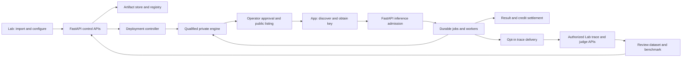

# Marlin: model to endpoint to improvement, through APIs

**2026-10-01 · implementation specification, not a completed implementation.** This package follows the user's requirement that both web apps be thin FastAPI clients. It supersedes the UX package wherever that package permits product logic or product-database access in Next.js. [STATUS](../../../STATUS.md) remains the deployment/launch authority.

The existing Marlin endpoint works as a provisioned service. The complete provider → consumer → trace → judge journey is **not connected**. A new provider cannot upload its first model through the current API. Creating a Lab revision does not launch an engine. Several consumer and judge features work through Next.js/Supabase rather than FastAPI. Source tests of individual domains are useful but do not establish the requested end-to-end product.

## Read in this order

1. [Observed lifecycle and gaps](audit.md): step-by-step journey, source evidence and live outcomes.
2. [API and frontend contracts](contracts.md): ownership, complete screen-to-API mapping, model onboarding, deployment, publication, tracing and judging.
3. [Implementation work packages](implementation.md): priorities, dependencies, owned paths and verifiable exits.
4. [API-only acceptance and session prompt](verification.md): repeatable production workflow, failure tests, evidence and continuation instructions.
5. [Executed probes](evidence/deployed-api-probe.json) and [host observations](evidence/host-observations.json): actual deployed checks. [probe.py](probe.py) reproduces the bounded read/refusal audit; it is **not** the future lifecycle acceptance runner.

## Marlin example: the intended experience

| Step | Provider in Lab / operator | Consumer in App | Backend receipt that makes it true |
|---|---|---|---|
| 1 | Create **Marlin SOP verification** model project; import a pinned repository or upload model files/card | — | Verified immutable artifact manifest; rights/source; supported runtime profile |
| 2 | Choose approved L40S + vLLM profile, model input limits, harness and private endpoint | — | Durable deployment operation; capacity allocation; engine identity and readiness evidence |
| 3 | Run a finite-video smoke and task-specific SOP benchmark | — | Actual responses, exact revision pins, usage and benchmark report; readiness and quality are separate |
| 4 | Provider administrator proposes release; operator approves price, limits and publication | Model appears with capabilities, availability, documentation and credit rate | Atomic listing/version change plus an endpoint route to the qualified deployment |
| 5 | — | Verify account, receive one-time 10,000 credits, create a key, upload a short clip, call the endpoint | Consumer API records, durable job/result, pinned rate and exactly one settlement |
| 6 | Read aggregate operational health; inspect only authorized request metadata/content | Inspect own request, result, credits; optionally grant capture/sharing/judging permissions | Current consent/purpose checks, durable trace delivery, authorized trace read API |
| 7 | Select rubric, judge/model, payer, budget and a bounded sample; run judge | Can revoke data-use permission | Judge operation, spend receipt, scored/abstained results and evidence availability |
| 8 | Review failures, produce a rights-cleared dataset, evaluate a new revision and propose release | Receives approved revision; history preserves old pins | Lineage → immutable dataset → experiment → release evidence and rollback target |

Marlin is currently exposed as **finite video/text in, text out**. It is not a robot-action endpoint or live-video streaming service. Token streaming does not change that. The live catalog explicitly rejects `response_format` and tool calling; a structured SOP response cannot be promised as a supported constrained-output mode today.

The diagram is the target, not a deployment inventory. Private/public audiences, customer content grants and operator release authority remain distinct throughout it.

## What was actually executed

- Fetched upstream `main`: `1a991367`, whose change since `6462ed06` is tracker/session metadata. Reviewed source includes `6462ed06`, local documentation reconciliation and UX commit `a1df2cc5`.
- At **21:36–21:38 UTC**, the existing E4C container was running on the sole Marlin host; no final report was present for run `20261001T181109Z`. Did not restart services, allocate another GPU, change prices/grants or submit competing inference.
- Signed in through the existing identity provider; retrieved the test user's single developer membership through the **legacy Supabase RPC**. This is explicitly an external bootstrap, not proof of a FastAPI workspace API.
- Ran **33 HTTP probes**, completed **21:40:25 UTC**. Public model discovery and authorized empty control/dataset/release lists worked. First-model registration, traces, evaluation/training listings and proposed console/judge API namespaces did not complete the lifecycle. Registration post-checks still showed zero model/deployment records.
- Re-ran the focused control-operation, control-route and Lab-auth suites: **33 passed, 18 PostgreSQL cases deselected**, two dependency deprecation warnings. No PostgreSQL, real engine, judge or full lifecycle acceptance is claimed.

There were **zero admitted inference submissions, zero launched deployments and zero judge calls** in this audit. The unauthenticated inference POST correctly returned 401. Completing the missing components is necessary before the all-API lifecycle can be executed; this package does not relabel a CLI deployment or a mocked judge as that result.

## Delivery order

1. Preserve the independent consumer pilot closure in [review 26](../26-launch-readiness-review-2026-10-01.md); ingest the active E4C result first.
2. Finish the consumer/session/control API boundary and migrate the two frontends. A thin frontend is a release criterion for the new work, not a claim about current code.
3. Support one approved Marlin hosting profile end to end: adopt/verify existing provisioned hardware, then isolated candidate deployment from a verified artifact. Do not make a general Modal clone a prerequisite.
4. Enable consented request inspection and a bounded real judge run, with separate provider spending and media-aware scoring.
5. Close dataset/evaluation accounting and composition gates, then the improvement/release loop. Autoscaling, SGLang, heterogeneous GPUs, hosted training and broad custom-model support remain subsequent capabilities.

The work-package IDs in this folder are planning identifiers. Before dispatch, map them into the existing [task manifest](../tasks.json) and carried-work register; do not create a second completion tracker or mark old gates passed based on this audit.
