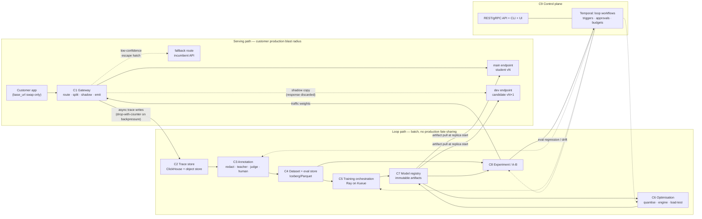
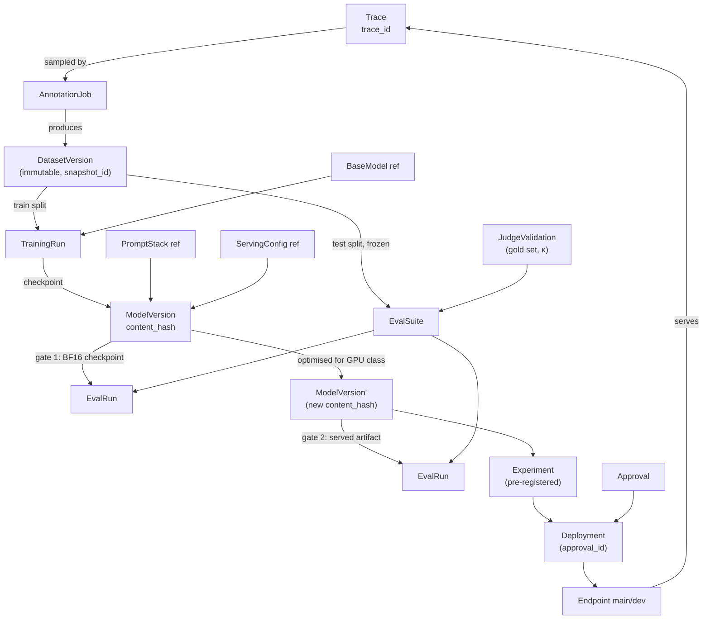

# Closed-loop platform architecture and data model

Research date **2026-09-19**. This document is the structural layer of the
programme framed by
[`research/platform/00-goal-and-problem-statement.md`](00-goal-and-problem-statement.md):
it takes that document's nine-stage loop (S1 traffic → S9 rollout), its seven
invariants (I1–I7) and its component decomposition, and turns them into
components, entities, schemas, orchestration, automation policy, governance
controls, a build/buy call per box and a cost model for the platform itself.

**It does not re-derive** anything already established elsewhere in the repo.
Legend, cost formulas and the `low`/`high`/`res1y` price tiers are
[`research/METHODOLOGY.md`](../METHODOLOGY.md); serving stack, autoscaling,
concurrency, cold start and fleet economics are
[`research/scaling/`](../scaling/); per-model and per-GPU numbers are
[`research/models/`](../models/) and [`research/matrix/`](../matrix/).
Terminology (S1–S9, I1–I7, "student", "teacher", "incumbent", "parity",
"gate twice") is doc 00's and is used unchanged.

> **⚠️ Numbering note.** Doc 00 §6's decomposition table assigns the label
> "doc 06" to *model and inference optimisation on target hardware*. This file
> is `06-platform-architecture.md` by instruction of the research programme, and
> is a **cross-cutting** document that spans doc 00's 01–09 rather than
> replacing any one of them. Whoever builds the `research/platform/README.md`
> index should reconcile the two numbering schemes; where this document needs to
> refer to the optimisation component it calls it **"the optimisation service"**
> and points at [`matrix/gpu-optimizations.md`](../matrix/gpu-optimizations.md).

| Marker | Meaning |
|---|---|
| `[src](url)` | Primary source, fetched 2026-09-19. |
| **⚠️ TO BE VERIFIED** | No primary source found, or the claim is an inference; the reasoning is stated inline. |
| `est.` | Arithmetic from METHODOLOGY formulas or from sourced inputs; shown, not measured. |
| `meas.` | A published measurement, cited. |

> **Research-method caveat, stated up front and identically to doc 00.** This
> session's **web-search budget was exhausted before this agent started** (200/200
> WebSearch calls consumed by earlier agents in the programme). Every source
> below was reached by **WebFetch or `curl` against a known URL**, or by
> following links from a fetched page. The consequence: the tool comparisons in
> §3 and §6 cover **the tools I could name and fetch, not an exhaustive scan of
> the orchestration or LLMOps market.** Anything absent is missing, not
> disproven. Twenty-plus distinct primary sources were fetched; they are listed
> in §Sources with what each one actually supports.

---

## 0. The five sentences

1. **The platform is two systems that must not share fate**: a low-latency
   serving path the customer's production depends on, and a batch loop that
   reads its exhaust — coupled only through an append-only trace stream and an
   immutable artifact registry.
2. **Everything the platform sells is a claim about a number**, so every number
   must be reproducible from a lineage graph rooted in immutable, content-addressed
   artifacts; the data model is therefore the product, and the UI is a view over it.
3. **Four things version independently and all four must be pinned together** —
   base weights, adapter/checkpoint, prompt stack, and serving config — because
   doc 00's gate-twice rule (§1.2) is exactly the statement that a checkpoint is
   not an artifact.
4. **Orchestration splits cleanly**: a durable-execution engine (Temporal) owns
   the month-long, human-interrupted *loop*; a GPU-native engine (Ray, admitted
   through Kueue) owns the hour-long *jobs* — using one tool for both is the
   most common and most expensive architecture mistake available here.
5. **The platform's own cost of goods is idle GPU and human adjudication, not
   storage and not teacher tokens** — trace storage for 100 customer tasks is
   **$72/month** at object-store prices on §8.1's own 12-month-cumulative basis
   (100 × $0.72; a single month's *increment* is $6, which is where the
   "under $10" of earlier drafts came from — **corrected 2026-09-19**), while one
   unpacked dedicated replica per task is $540k/month at `b300 · low`
   (100 × 730 h × $7.40 = $540,200, §8.3).

---

## 1. Component architecture

### 1.1 The ten components

Each row states what the component owns, whether it is on the customer's
production critical path, what it scales with, and what breaks if it dies. The
"blast radius" column is the one that drives the architecture: only three
components can take a customer's production down, and everything else should be
built so that it cannot.

| # | Component | Owns | On serving critical path? | Scales with | Blast radius if it fails |
|---|---|---|---|---|---|
| C1 | **Gateway / inference** | OpenAI- and Anthropic-compatible request routing, model/version resolution, traffic splitting, shadow fan-out, trace emission, admission control | **Yes** | Requests/s, concurrent streams | **Customer production down.** The only true SPOF |
| C2 | **Trace store** | Append-only request/response records; search, slicing, retention, export | No (writes are async) | Requests/s × payload bytes | Loop starves; serving unaffected if the write path degrades to drop-with-counter |
| C3 | **Annotation service** | Teacher calls, judge calls, rubric scoring, human review queues, disagreement mining, PII redaction on egress | No | Examples/day × teacher token cost | Training data stops accumulating; a stuck redactor must **fail closed** (§5.2) |
| C4 | **Dataset / eval store** | Versioned splits, frozen eval suites, gold sets, eval-run results, judge-validation records | No | Datasets × rows | Every quality claim becomes unreproducible |
| C5 | **Training orchestration** | SFT/DPO/RL/distillation job submission, checkpointing, resume, run records | No | Concurrent jobs × GPU-hours | Loop stalls at S5 |
| C6 | **Optimisation service** | Quantisation, engine/format selection, parallelism, speculative decoding, load-test-to-SLO, per-GPU artifact build | No | Candidates × target GPU classes | Loop stalls at S8; last good artifact keeps serving |
| C7 | **Model registry** | Immutable versioned artifacts (weights + tokenizer + chat template + prompt stack + serving config), lineage, promotion state | **Yes, on cold start only** | Artifacts × size | New replicas cannot start; running replicas keep serving |
| C8 | **Experiment / A-B service** | Assignment, shadow diffing, sequential/fixed-horizon statistics, per-slice results, promote/rollback decisions | **Yes** (assignment is read from the gateway) | Experiments × requests | Traffic split freezes at last known config — **design it so this is the failure mode** |
| C9 | **Control plane / API / UI** | The resource model (§2, §7), auth, RBAC, quotas, budgets, audit, webhooks | No | Users × objects | Nothing changes; nobody can change anything |
| C10 | **Tenancy & isolation** | Namespaces/vClusters, network policy, key management, per-tenant storage prefixes, residency routing | Cross-cutting | Tenants | Tenant isolation violation — the one failure that ends the business |

**The design rule that follows from the table.** C1, C7 (cold-start reads) and
C8 (assignment reads) are the only components in the customer's production
blast radius. Every other component must be *crash-only from the serving path's
point of view*: the gateway buffers traces locally and drops with a counter
rather than blocking a request; assignment is cached in-process with a
last-known-good TTL; the registry is read at replica start and never during a
request. Doc 00's I7 (rollback under one minute) is only achievable if the
rollback path touches C1, C7 and C8 and nothing else.

Gateway internals — engine choice, routing, KV-aware load balancing, admission
control, autoscaling and cold start — are **not** re-specified here. They are
[`scaling/02-serving-stack-and-routing.md`](../scaling/02-serving-stack-and-routing.md),
[`scaling/03-concurrency-and-admission-control.md`](../scaling/03-concurrency-and-admission-control.md),
[`scaling/05-autoscaling-and-predictive-scaling.md`](../scaling/05-autoscaling-and-predictive-scaling.md)
and [`scaling/06-cold-start.md`](../scaling/06-cold-start.md). This document
only adds the three things the loop requires of the gateway: version resolution,
shadow fan-out, and trace emission.

### 1.2 Diagram



Two arrows in that diagram carry the whole thesis and both are dotted:
**gateway → dev (shadow)** and **A-B → gateway (weights)**. Doc 00 §5.6 ranks
shadow diffs and demonstrated rollback above the statistics as what actually
closes a sale; those two edges are where they live.

### 1.3 Data flows and volumes

Volumes are computed for one customer task at three traffic levels, using doc 00's
canonical request shape: **4,000 input tokens (50 % cached) + 512 output tokens =
4,512 tokens/request**.

**Per-request payload sizing** (`est.`, from a 4-characters-per-token English
heuristic — ⚠️ **TO BE VERIFIED**, no primary source fetched for the ratio;
it is used only for storage sizing, never for cost-per-token):

| Field | Naive (store everything verbatim) | Content-addressed (store the repeated parts once) |
|---|---:|---:|
| System prompt / policy stack (1–20k tok) | 16 KB | 32 B (hash reference) |
| Tool definitions (5–50 JSON-Schema tools) | 1.5–15 KB | 32 B (hash reference) |
| Retrieved documents (RAG) | 0–20 KB | 32 B per chunk hash |
| User turn | 0.5–2 KB | 0.5–2 KB |
| Model output (512 tok) | ~2 KB | ~2 KB |
| Metadata (ids, timings, token counts, versions, costs) | ~1 KB | ~1 KB |
| **Total per request** | **~20 KB** | **~4 KB** |

**Content-addressing the prompt stack is a 5× storage reduction and it is also
a correctness feature**, because the hash *is* the `prompt_stack_version` that
doc 00 §2.2 demands in every trace ("prompt-hash in every trace"). It is prior
art, not invention: OpenPipe's own feature list included "Prune large chunks of
duplicate text like system prompts"
[[src](https://raw.githubusercontent.com/OpenPipe/OpenPipe/main/README.md)].

| Flow | Trigger | Payload | Rate @ 1M req/mo | Rate @ 10M req/mo | Destination | Retention |
|---|---|---|---:|---:|---|---|
| **F1** Trace write | Every request | 4 KB deduped | 4 GB/mo | 40 GB/mo | C2 hot (ClickHouse) + cold (object store) | 90 d hot / 12–24 mo cold, per-tenant |
| **F2** Shadow diff | Shadowed request | 2 KB (candidate output + diff score) | +2 GB/mo | +20 GB/mo | C2 | Same as F1 |
| **F3** Sampling for annotation | Schedule / threshold | Trace ids | 1–5 % of F1 | 0.1–1 % of F1 | C3 | — |
| **F4** Teacher call (egress) | Annotation job | 4,512 tok/example | 10k–100k examples per round | idem | Teacher API or self-hosted teacher | Response stored as label |
| **F5** Judge call | Eval run | ~5,200 tok/judgement | ~4k–16k per gate (§8.1) | idem | Judge model (≠ teacher, doc 00 §5.1) | Score row |
| **F6** Dataset materialisation | Annotation complete | Parquet, ~2 KB/row | 200 MB per 100k rows | idem | C4 (Iceberg) | Immutable, forever |
| **F7** Checkpoint write | Training step / end | 0.06–500 GB (LoRA → full weights) | 1–20 per round | idem | C7 (object store) | Keep promoted + last N |
| **F8** Artifact pull | Replica start / scale-out | 20–500 GB | Per cold start | idem | C7 → GPU node | — |
| **F9** Assignment read | Every request | <1 KB, cached | In-process | In-process | C8 → C1 | TTL seconds |
| **F10** Audit event | Every control-plane mutation | ~1 KB | thousands/mo | idem | Append-only audit log | 7 y (§5.7) |

**The number that matters and is counter-intuitive:** F1+F2 at 10M requests/month
is **60 GB/month**. At Cloudflare R2's **$0.015/GB-month** standard storage
[[src](https://developers.cloudflare.com/r2/pricing/)] that is **$0.90/month**;
at Backblaze B2's **$6.95/TB/30-days**
[[src](https://www.backblaze.com/cloud-storage/pricing)] it is **$0.42/month**
(`est.`). Two years of accumulation at that rate is **1.44 TB = $21.60/month**
at R2. **Trace storage is free. Trace *processing* — the teacher and judge tokens
in F4/F5, and the human time behind them — is the cost** (§8).

F8 is the one flow that is genuinely large and it is a cold-start problem, not a
storage problem: [`scaling/06-cold-start.md`](../scaling/06-cold-start.md) owns
it. The architectural consequence for the registry is only this: **artifacts
must be pullable by content hash from a store co-located with the GPU fleet**,
because a 500 GB pull over a WAN is a multi-minute cold start that breaks I7.

### 1.4 Multi-tenancy and isolation

Four tiers, in increasing cost and decreasing blast radius. The platform should
sell tiers 1–3 and be *able* to do tier 4.

| Tier | Mechanism | Isolates | Does **not** isolate | When to use |
|---|---|---|---|---|
| **T1 Logical** | `tenant_id` on every row, storage prefix per tenant, row-level policy in the control plane | Data, by convention and code | Compute, noisy neighbours, a control-plane bug | Never alone for enterprise; the baseline every tier builds on |
| **T2 Namespace** | K8s namespace + NetworkPolicy + ResourceQuota + separate service accounts and KMS keys | Network, quota, credentials | Kernel, node, GPU memory between co-scheduled pods | Default for most customers |
| **T3 Virtual cluster** | vCluster: "a fully isolated Kubernetes environment provisioned for a single tenant… its own API server, controller manager, and resource namespace" [[src](https://www.vcluster.com/docs/vcluster/introduction/what-are-virtual-clusters)] | The K8s API surface | **Not a security boundary on shared nodes** — the docs are explicit that shared-node deployment "isn't a security boundary for untrusted tenants" and "suits internal, trusted tenants such as developer platforms, CI environments, and testing" [[ibid.](https://www.vcluster.com/docs/vcluster/introduction/what-are-virtual-clusters)] | Isolating *our own* environments (dev/staging/eval), or trusted-tenant API isolation |
| **T4 Dedicated nodes** | vCluster private nodes — "Network, storage, and compute are fully isolated per tenant, with no cross-tenant visibility at the infrastructure level" [[ibid.](https://www.vcluster.com/docs/vcluster/introduction/what-are-virtual-clusters)] — or simply a separate cluster/region | Everything | Nothing | Regulated customers, residency requirements, and anyone whose contract says "single tenant" |

**The trap to name explicitly.** Tier 3 reads like isolation and is not, on
shared nodes; the vendor says so in its own documentation. A platform that sells
"isolated clusters" while running shared-node vClusters is making a claim its
supplier disclaims. Use T2 as the honest default and T4 as the honest premium.

**The unit-economics tension.** Doc 00 §4.5 establishes that idle GPU dominates
cost of goods and names multi-tenant adapter serving (S-LoRA-style unified
paging, "up to 4×" throughput over HF PEFT and vLLM
[[src](https://arxiv.org/abs/2311.03285)]) as "the single highest-leverage
architecture decision in the whole platform". That decision **directly
contradicts T4**: adapter packing means many tenants' adapters resident in one
process's GPU memory. vLLM exposes this as `--enable-lora` with `max_loras`
bounding how many adapters run concurrently in a batch, `--max-lora-rank` sizing
the memory reservation, and runtime `/v1/load_lora_adapter` /
`/v1/unload_lora_adapter` endpoints gated behind `VLLM_ALLOW_RUNTIME_LORA_UPDATING`
— which vLLM's own docs warn "comes with security risks. It should not be used in
production unless it is an isolated, fully trusted environment"
[[src](https://docs.vllm.ai/en/latest/features/lora.html)].

**Resolution, and it is a product decision not a technical one:** pack adapters
**within** a tenant freely (many tasks, many candidate versions, one base); pack
**across** tenants only for customers on a shared-infrastructure contract tier
that says so, and never for a T4 customer. Price the two tiers differently, and
make the runtime-loading endpoint reachable only from the control plane's own
network namespace, never from a tenant-facing surface.

---

## 2. Data model

### 2.1 Entities

The resource model is small on purpose — nine core entities plus three join
entities. Every ID is a prefixed, sortable identifier (`proj_…`, `mv_…`); every
mutable pointer is an *alias* onto an immutable version, borrowing MLflow's
distinction: "Aliases allow you to assign a mutable, named reference to a
particular version of a registered model", so `models:/MyModel@champion`
resolves through the alias [[src](https://mlflow.org/docs/latest/ml/model-registry/)].

| Entity | Key fields | Mutable? | Store |
|---|---|---|---|
| **Project** | `id`, `tenant_id`, `name`, `residency_region`, `budget_policy_id`, `teacher_policy_id` | Yes (config) | Postgres |
| **Task** | `id`, `project_id`, `modality` (text/video), `contract_spec` (request/response schema, tool set, streaming semantics), `slice_definitions[]`, `parity_spec` (metric, δ, α, power — doc 00 §5.2) | Versioned | Postgres + object store |
| **ModelVersion** | `id`, `task_id`, `base_model_ref`, `adapter_ref`, `prompt_stack_ref`, `serving_config_ref`, `training_run_id`, `content_hash`, `created_at`, `licence`, `provenance` | **No — immutable** | Postgres (metadata) + object store (bytes) |
| **DatasetVersion** | `id`, `task_id`, `split` (train/dev/test/gold/safety), `row_count`, `source_query`, `annotation_job_ids[]`, `dedup_policy`, `content_hash`, `snapshot_id` | **No — immutable** | Iceberg table + Parquet |
| **EvalSuite** | `id`, `task_id`, `dataset_version_id` (test split), `scorers[]`, `judge_model_ref`, `judge_validation_id`, `frozen_at` | **No — immutable once frozen** | Postgres + object store |
| **EvalRun** | `id`, `eval_suite_id`, `model_version_id`, `per_slice_results`, `ci_bounds`, `judge_agreement`, `cost`, `started_at`, `artifact_hash_evaluated` | **No** | Postgres + ClickHouse (per-example) |
| **AnnotationJob** | `id`, `task_id`, `sampling_spec`, `teacher_model_ref`, `teacher_policy_id`, `redaction_profile_id`, `human_review_policy`, `input_trace_ids`, `output_dataset_version_id`, `cost`, `status` | Status only | Postgres |
| **Experiment** | `id`, `task_id`, `arms[]` (model_version_id + weight), `assignment_unit` (user/session — **never request**, doc 00 §5.4), `design` (fixed-horizon / sequential), `pre_registered_at`, `stopping_rule`, `result` | Pre-registration immutable; result appended | Postgres |
| **Endpoint** | `id`, `task_id`, `channel` (`main` \| `dev` \| `shadow`), `url`, `contract_version`, `auth_policy` | Yes | Postgres |
| **Deployment** | `id`, `endpoint_id`, `model_version_id`, `weight`, `gpu_class`, `replica_spec`, `activated_at`, `deactivated_at`, `activated_by`, `approval_id` | Append-only history | Postgres |
| **Trace** | `trace_id`, `tenant_id`, `task_id`, `endpoint_id`, `model_version_id`, `prompt_stack_hash`, `tool_set_hash`, OTel `gen_ai.*` attributes, content refs, outcome signal, feedback | **No — append-only** | ClickHouse + object store |
| **Approval** | `id`, `subject_type`, `subject_id`, `decision`, `actor`, `rationale`, `policy_version`, `at` | **No** | Append-only audit log |

**Why `ModelVersion` has four refs and not one.** Doc 00's I4 (contract fidelity)
and the gate-twice rule (§1.2) both fail if the served artifact can differ from
the gated one. The four axes drift independently in practice:

| Axis | Changes when | Who changes it | Silent-failure mode if unpinned |
|---|---|---|---|
| `base_model_ref` | New base release, new quantised export | Platform | A different `lm_head` format changes outputs (see [`matrix/fit-matrix.md`](../matrix/fit-matrix.md) for the per-GPU format substitutions this repo already documents) |
| `adapter_ref` | Every training run | Platform | — |
| `prompt_stack_ref` | **Customer edits their prompt** | Customer, outside our control | Doc 00 §2.2: "silent distribution shift that invalidates the eval" |
| `serving_config_ref` | Engine version, attention kernel, quantisation, speculative-decoding config, parallelism | Optimisation service | Doc 00 §3.3 "quantisation drift": the served artifact ≠ the gated checkpoint |

`content_hash` = hash over all four refs plus the tokenizer and chat template.
**An EvalRun records `artifact_hash_evaluated`, not `model_version_id` alone.**
That single field is the mechanical enforcement of gate-twice.

### 2.2 Lineage graph



The cycle in that graph — `Endpoint → Trace → AnnotationJob → … → Deployment →
Endpoint` — is doc 00's loop. It is also doc 00 §8.3's model-collapse hazard:
the student's own outputs re-enter as traces. **The lineage graph is what makes
the guard enforceable**: every `Trace` row carries the `model_version_id` that
produced it, so "never train on the student's own outputs as labels" is a
`WHERE` clause, not a policy document.

**The query the platform must be able to answer in one hop**, because it is what
a customer asks when a number looks wrong:

> *"This eval run says 87.2 %. Show me: which rows, from which traces, annotated
> by which teacher under which policy, redacted by which profile, trained into
> which checkpoint, quantised by which config, judged by which judge validated
> against which gold set, and who approved the promotion."*

If that is more than one graph traversal, the data model is wrong.

### 2.3 Schemas

#### Trace row (ClickHouse)

Standardise on the **OpenTelemetry GenAI semantic conventions**, whose status is
explicitly **Development**, not stable, as of 2026-09-19 — every `gen_ai.*`
attribute in the spans document is badged `Development`
[[src](https://raw.githubusercontent.com/open-telemetry/semantic-conventions-genai/main/docs/gen-ai/gen-ai-spans.md)].
The conventions moved out of the main semconv repo into a dedicated one, which
"define[s] Semantic Conventions for Generative AI (GenAI), including spans,
metrics, and events for GenAI clients, MCP (Model Context Protocol), and
provider-specific conventions"
[[src](https://github.com/open-telemetry/semantic-conventions-genai)].

Attributes worth adopting verbatim rather than inventing (all `Development`
stability, from the spans doc):

| Attribute | Why it matters here |
|---|---|
| `gen_ai.operation.name` (Required), `gen_ai.provider.name` (Required) | Distinguishes our endpoint from the incumbent's in the same store |
| `gen_ai.request.model`, `gen_ai.response.model` | The incumbent-vs-candidate join key |
| `gen_ai.conversation.id` | **The randomisation unit.** Doc 00 §5.4 forbids request-level randomisation for multi-turn; this is the session key that makes session-level assignment possible |
| `gen_ai.prompt.name`, `gen_ai.prompt.version` | Exactly doc 00 §2.2's prompt-hash requirement, already standardised |
| `gen_ai.usage.input_tokens`, `…output_tokens`, `…cache_read.input_tokens`, `…cache_write.input_tokens`, `…reasoning.output_tokens` | The cost model (doc 00 §4.4 needs cache-read counts to compare against the customer's *actual* incumbent bill, not list) |
| `gen_ai.response.time_to_first_chunk` | I3 latency parity, client-side |
| `gen_ai.response.finish_reasons` | Doc 00 §2.3's refusal-shape fidelity check |
| `gen_ai.input.messages`, `gen_ai.output.messages`, `gen_ai.system_instructions`, `gen_ai.tool.definitions` | All four are **`Opt-In`** — the spec deliberately does not capture content by default |

And the matching metrics, all `Development`: `gen_ai.client.token.usage`,
`gen_ai.client.operation.duration`, `gen_ai.client.operation.time_to_first_chunk`,
`gen_ai.client.operation.time_per_output_chunk`, `gen_ai.server.request.duration`,
`gen_ai.server.time_to_first_token`, `gen_ai.server.time_per_output_token`, plus
the agent metrics `gen_ai.invoke_agent.duration`,
`gen_ai.invoke_agent.inference_calls`, `gen_ai.invoke_agent.tool_calls`
[[src](https://raw.githubusercontent.com/open-telemetry/semantic-conventions-genai/main/docs/gen-ai/gen-ai-metrics.md)].
`gen_ai.server.time_to_first_token` and `gen_ai.server.time_per_output_token` are
the server-side TTFT/TPOT that [`scaling/03`](../scaling/03-concurrency-and-admission-control.md)
and [`scaling/04`](../scaling/04-throughput-and-utilization.md) already reason in —
so the platform's SLO dashboard and the repo's cost model share one vocabulary
for free.

**The content-storage decision is already made for us by the spec.** The GenAI
conventions state that message content "is likely to be large", "may contain
media", and "may be larger than observability backend limits for telemetry
envelopes or attribute values", and they define a hook mechanism:
"Instrumentations MAY support user-defined in-process hooks to handle content
upload… The hook SHOULD be invoked regardless of the span sampling decision", and
"The hook implementation SHOULD be able to enrich and modify provided span,
instructions, and message objects"
[[src](https://raw.githubusercontent.com/open-telemetry/semantic-conventions-genai/main/docs/gen-ai/gen-ai-spans.md)].

That is precisely the right seam for **PII redaction and content-addressing**:
one hook, invoked before serialisation, that (a) redacts, (b) writes the blob to
the object store under its hash, (c) replaces the attribute with the reference.
Because the spec says the hook runs regardless of the sampling decision, content
capture is not coupled to trace sampling — which matters, because doc 00 §5.4's
shadow-first strategy needs 100 % content coverage while span sampling may be
much lower.

Physical layout:

| Table | Engine | Partition | Order by | TTL |
|---|---|---|---|---|
| `traces_hot` | ClickHouse `MergeTree` | `toYYYYMM(ts)`, `tenant_id` | `(tenant_id, task_id, ts, trace_id)` | 90 d → move to cold |
| `trace_content` | Object store, content-addressed `tenant/<t>/sha256/<hash>` | — | — | Per-tenant retention (§5.3) |
| `scores` | ClickHouse | `toYYYYMM(ts)` | `(tenant_id, eval_run_id, example_id)` | Retained with EvalRun |

ClickHouse is the right engine for this shape and the vendor's own framing says
why: it is "a high-performance, column-oriented SQL database management system
(DBMS) for online analytical processing (OLAP)" where "only the columns required
for a query are read from disk, avoiding unnecessary I/O for unused data", with a
documented example scanning "100 million rows in 92 milliseconds", "approximately
over 1 billion rows per second" [[src](https://clickhouse.com/docs/en/intro)].
Slicing a quarter of traffic by slice, model version and outcome is exactly that
access pattern. It is also what Langfuse chose: their self-hosting docs list
ClickHouse as the "High-performance OLAP database which stores traces,
observations, and scores", alongside Postgres as the "main database for
transactional workloads", Redis/Valkey "used for queue and cache operations", and
S3/blob storage to "persist all incoming events, multi-modal inputs, and large
exports" [[src](https://langfuse.com/self-hosting)]. **Four stores, same split as
§2.1's table.** That convergence is evidence the decomposition is right, and a
reason to adopt rather than build (§6).

#### Dataset rows (Parquet in a lakehouse table)

```
example_id            string      -- stable, content-derived
tenant_id, task_id    string
split                 enum(train, dev, test, gold, safety)
split_key             string      -- the entity split is grouped by (user/doc/session)
messages              struct      -- gen_ai input-messages JSON schema
target                struct      -- teacher completion | preference pair | rubric scores
target_source         enum(teacher, human, verifier, outcome_signal)
teacher_model_ref     string      -- nullable
teacher_policy_id     string      -- which agreement authorised this label (§5.5)
redaction_profile_id  string
source_trace_ids      array<string>
near_dup_cluster_id   string      -- for cross-split leakage checks
slice_labels          array<string>
created_at            timestamp
```

#### Why a lakehouse table format and not "Parquet in a bucket"

Doc 00 §8.4 requires: split by a stable entity and never by row; hold the test
split out of the annotation pipeline entirely; hash-dedup near-duplicates across
splits; timestamp splits; and **"treat any eval-set refresh as invalidating every
historical score."** That last clause is a *versioning* requirement, and plain
Parquet files cannot express it.

| Option | What it gives | What it costs | Verdict |
|---|---|---|---|
| **Apache Iceberg** (v1.11.0 latest as of fetch) | Snapshots, time travel, schema evolution, hidden partitioning, and explicit **branching and tagging** — the docs carry a dedicated "Branching and Tagging" page covering historical tags and audit branches [[src](https://iceberg.apache.org/docs/latest/)] [[src](https://iceberg.apache.org/docs/latest/branching/)] | A catalog service to run | **Recommended.** Tags give "this exact eval set, forever" a first-class name; audit branches give write-audit-publish for annotation batches |
| **Delta Lake** | "ACID transactions on Spark: Serializable isolation levels ensure that readers never see inconsistent data"; "Data versioning enables rollbacks, full historical audit trails, and reproducible machine learning experiments"; schema enforcement that "Automatically handles schema variations to prevent insertion of bad records during ingestion" [[src](https://docs.delta.io/latest/delta-intro.html)] | Historically Spark-centric | Equivalent on the guarantees that matter here; pick on ecosystem, not features |
| **lakeFS** | Git semantics over the whole bucket: "lakeFS provides version control over the data lake, using Git-like semantics"; a branch is "a consistent copy of a repository, isolated from other branches"; "Initial creation of a branch is a metadata operation that does not duplicate objects"; a commit is "an immutable checkpoint containing a complete snapshot of a repository" [[src](https://docs.lakefs.io/)] | A second system in the path of every read | **Only if** you need to version heterogeneous non-tabular data (video frames, checkpoints, eval fixtures) together with the tables. For video tasks this is a genuine argument |
| **Plain Parquet + a manifest** | Nothing to run | You rebuild snapshots, atomic commits and time travel by hand | Acceptable for the MVP with one customer; a liability at ten |

**Decision rule.** Text-only MVP: Iceberg tables for datasets, scores and
materialised eval results; object store for content and checkpoints; skip lakeFS.
Add lakeFS only when the video pipeline needs frame archives and eval fixtures
versioned atomically with the tables — the repo's Marlin-2B work
([`models/marlin2b/README.md`](../models/marlin2b/README.md) §9) means that day
comes, and a 240-frame-per-clip archive is exactly the "heterogeneous, huge,
must-be-reproducible" case lakeFS is for.

#### Vector index

Needed for three jobs, none of which is RAG-for-the-customer: (a) **near-duplicate
detection across splits** (doc 00 §8.4's contamination guard); (b)
**disagreement-mining retrieval** — "show me traces similar to this failure"
(doc 00 §7.2's version of a disengagement); (c) **stratified sampling** for
annotation, so the annotation budget is not spent 80 % on the head of the
distribution.

⚠️ **TO BE VERIFIED** — I did not fetch a primary source for any specific vector
database in this session (search budget exhausted), so no product recommendation
is made here. What *is* determinable from requirements: the index is derived,
rebuildable from the trace store, and never the system of record — which means it
can be the cheapest available option and can be thrown away on schema change. The
one real constraint is **per-tenant index separation** (§5.1), because an ANN
index that spans tenants is a cross-tenant retrieval bug waiting to happen.

### 2.4 Immutability and versioning rules

Seven rules; each one is a mechanism, not an aspiration.

1. **Content-address everything large.** Weights, adapters, prompt stacks,
   serving configs, eval fixtures and trace content go into the object store
   keyed by `sha256`. Identity is the hash; names are aliases (MLflow's model of
   mutable aliases over immutable versions
   [[src](https://mlflow.org/docs/latest/ml/model-registry/)]).
2. **`ModelVersion` is immutable and `content_hash` covers all four axes** (§2.1).
   An optimisation pass produces a **new** ModelVersion, never an edit.
3. **`DatasetVersion` is a snapshot id, not a query.** Materialise. A dataset
   defined as a live query is a dataset that silently changes under a published
   number.
4. **An `EvalSuite` freezes and never thaws.** Refreshing it creates a new suite;
   per doc 00 §8.4, historical scores against the old suite are not comparable and
   the UI must render them as such.
5. **Promotion is append-only.** `Deployment` rows are never updated; a rollback
   is a new row pointing at the older `ModelVersion`. I7's "under one minute" is
   then an insert plus a weight push, and the audit trail is free.
6. **Traces are append-only**, with deletion only by retention policy or a
   right-to-erasure request (§5.3) — and see doc 00 §8.2's honest caveat that
   deleting a trace does not delete it from the checkpoint it trained.
7. **Every derived number records the hashes it derived from.** `EvalRun` stores
   `artifact_hash_evaluated`, `dataset_version_id`, `judge_model_ref` and
   `judge_validation_id`. This is the single most important rule in the document:
   it is the difference between a platform and a spreadsheet.

---

## 3. Orchestration

### 3.1 What actually needs orchestrating

The workloads have wildly different shapes and that is the whole argument for
not using one engine:

| Job class | Duration | Resource | Failure characteristic | Concurrency |
|---|---|---|---|---|
| **The loop itself** (S1→S9, per task) | **Days to months**, with human approvals in the middle | None (coordination only) | Must survive process restarts, deploys, and a human going on holiday mid-approval | 1 per task, hundreds of tasks |
| Annotation batch | Hours | Network + teacher tokens (or GPU for a self-hosted teacher) | Partial failure is normal; retry per example | 10s |
| Training run | Hours to days | 1–64 GPUs, gang-scheduled | Node loss mid-run; must resume from checkpoint | 1–10 |
| Eval run | Minutes to hours | GPU (student) + network (judge) | Embarrassingly parallel | 10s–100s |
| Optimisation sweep | Hours | 1–8 GPUs per trial, many trials | Trials fail independently; that is fine | 10s |
| Load test to SLO | Minutes | Exclusive access to a replica | Must not be co-scheduled with anything | 1 per target |
| Shadow diffing | Continuous | CPU + GPU (candidate inference) | Streaming | Always on |

Note the **1,000× spread in duration** between the top row and the rest. An
engine tuned for one is wrong for the other.

### 3.2 The candidates

All rows from primary sources fetched 2026-09-19; the "not fetched" marks are
honest gaps, not judgements.

| Engine | What it is, in its own words | Strength for this platform | Weakness for this platform |
|---|---|---|---|
| **Temporal** | "Durable Execution runs your code to completion across crashes and outages, keeping retries, state recovery, and queue plumbing out of your business logic"; "Once started, a Workflow runs to completion, whether that takes seconds or months"; on worker crash the service "hands the work to another Worker, which replays the Event History and resumes at the line where execution stopped, with local variables and progress intact"; supports "Signals, Updates, and Queries on a running Workflow" for human-in-the-loop [[src](https://docs.temporal.io/evaluate/why-temporal)] | **Exactly the loop.** Months-long, human-interrupted, must survive every deploy. Signals *are* the approval gates (§4.3) | Not a data/GPU engine; no artifact lineage, no caching of expensive steps |
| **Flyte** | "Pure Python, no DSL"; principles of "Durability", "Reproducibility", "Recoverability"; "Type hints are required" on tasks; caching with "automatic versioning"/"override"/"disable" modes, content-based for DataFrames and files; Kubernetes-native with multi-tenancy; GPU support across NVIDIA/TPU/AMD/Neuron/Habana. Flyte 2 is current [[src](https://www.union.ai/_r_/flyte/en/latest/)] | **Typed interfaces + content-based caching + versioning is the closest OSS match to §2's requirements.** Multi-tenancy is first-class | Heavier to operate than the alternatives; ⚠️ the Flyte 1 → Flyte 2 transition is a live migration risk I did not size |
| **Ray** | "An open source framework to build and scale your ML and Python applications easily", with Ray Data (batch inference/processing), Ray Train (distributed training), Ray Tune (hyperparameter search, "thousands of parallel trials"), Ray Serve, RLlib [[src](https://docs.ray.io/en/latest/index.html)]. Ray Train "abstracts away the complexities of distributed computing" across "PyTorch, PyTorch Lightning, Hugging Face Transformers, Hugging Face Accelerate, DeepSpeed" [[src](https://docs.ray.io/en/latest/train/train.html)] | **The job layer.** Fault tolerance is explicit: three levels (worker/node/driver); on failure "all the workers are shut down, new nodes are added if necessary, and a new set of workers is started", resuming via `ray.train.get_checkpoint()`; configured by `ray.train.FailureConfig(max_failures=2)` — and note the default is **`max_failures=0`, fault tolerance disabled** [[src](https://docs.ray.io/en/latest/train/user-guides/fault-tolerance.html)] | Not a durable orchestrator for month-long flows; a Ray cluster is not a system of record |
| **Argo Workflows** | "an open source container-native workflow engine for orchestrating parallel jobs on Kubernetes", a CRD, supporting "a sequence of tasks or… dependencies between tasks using a directed acyclic graph (DAG)"; "a Cloud Native Computing Foundation (CNCF) graduated project" [[src](https://argo-workflows.readthedocs.io/en/latest/)] | Graduated, boring, ubiquitous; excellent as a *substrate* under something else | YAML-first; no typed interfaces, no lineage, no caching semantics of its own |
| **Kubeflow Pipelines** | "a platform for building and deploying portable and scalable machine learning (ML) workflows using containers on Kubernetes-based systems"; pipelines compose components "to form a computational directed acyclic graph (DAG)"; manages "pipeline definitions, runs, experiments, and ML artifacts"; runs on "a KFP-conformant backend such as the open source KFP backend"; community distribution **26.03** [[src](https://www.kubeflow.org/docs/components/pipelines/overview/)] | Artifact/metadata lineage built in; the vocabulary (run, experiment, artifact) already matches §2 | Heavy; the Kubeflow platform brings a lot you do not need. ⚠️ **Corrected 2026-09-19:** an earlier draft stated "Argo in the backend" as fact; the overview page names only "a KFP-conformant backend", and Argo appears once, in a *legacy* installation note about executor selection |
| **Dagster** | Asset-oriented; the docs organise around assets, "View lineage", partitions and backfills, schedules and sensors [[src](https://docs.dagster.io/getting-started/quickstart)] ⚠️ — the quickstart I fetched did not define the concepts in quotable terms, and `/getting-started/what-is-dagster` returned **404** | Asset-centric modelling maps unusually well to §2.2's lineage graph | ⚠️ I could not source the core definitions; do not adopt on my summary alone |
| **Prefect** | "an open-source orchestration engine that turns your Python functions into production-grade data pipelines with minimal friction"; flows/tasks as decorators; deployments; work pools and workers so you "deploy them anywhere—from a single process to containers, Kubernetes, or cloud services—without locking into a vendor"; dynamic runtime task creation; Prefect 3.0 "improved the runtime overhead of Prefect by up to 90%" [[src](https://docs.prefect.io/v3/get-started/index)] | Lowest friction to start; genuinely good dynamic DAGs | No typed artifacts or content-based caching; you build lineage yourself |
| **ZenML** | "an open-source framework for orchestrating production ML and LLM pipelines, including pipelines that run agentic workloads"; "portable, production-ready **pipelines**… with versioned artifacts, caching, and infrastructure abstracted behind [stacks]" [[src](https://docs.zenml.io/)] | The "stack" abstraction is a real answer to running the same pipeline on bare metal and on a serverless provider (§6) | ⚠️ Model-registry and orchestrator-backend specifics were not on the page I fetched |
| **Metaflow** | "makes it easy to build and manage real-life data science, AI, and ML projects" [[src](https://docs.metaflow.org/)] ⚠️ — the landing page I fetched contained no detail on flows/steps/artifacts/`@resources`/`@kubernetes`, so nothing more is claimed here | Strong reputation for artifact versioning and `resume` | ⚠️ Unsourced in this session; evaluate before adopting |
| **Airflow** | ⚠️ **Not fetched in this session.** No claim made | — | — |

### 3.3 The decision

**Two engines, one seam.**

- **Temporal owns the loop.** One long-running workflow per (task, loop
  iteration), with child workflows per stage. Human approvals are Signals.
  Budget ceilings are Workflow state. Rollback is a Signal to a running workflow,
  not a new deploy. The property no other candidate has is the one the loop needs:
  a workflow that outlives every process, deploy and person involved in it.
- **Ray owns the GPU jobs**, admitted through Kueue (§3.4). Ray Train for
  training, Ray Data for annotation and eval fan-out, Ray Tune for the
  optimisation sweep. Temporal Activities submit `RayJob` CRs and poll; they hold
  no GPU state themselves.
- **The seam is the artifact.** A Temporal Activity's only output is a
  content-hash written to the registry. If the Activity is retried, it either
  finds the hash already present (idempotent no-op) or recomputes it. This is the
  cheapest possible reproducibility mechanism and it removes the need for the
  orchestrator to have opinions about caching.

**Why not Flyte for both**, given it is the closest single-engine fit? Because
the loop's dominant characteristic is *waiting for a human for three weeks*, and
Flyte's caching/typing strengths are wasted there while its Kubernetes-native
execution model makes a month-long pending workflow an awkward object. **If the
team already runs Flyte, invert the recommendation**: use Flyte for stage
workflows and a small state machine in Postgres for the outer loop, and skip
Temporal. Running Temporal is not free, and the honest version of this section is
that the outer loop is ~2,000 lines of state machine if you would rather not.

**Resolved 2026-09-19 (was ⚠️ TO BE VERIFIED).** Temporal *does* publish Event
History limits, and they bind: a Workflow Execution's Event History has a **hard
limit of 51,200 Events or 50 MB**, with a **warning emitted after 10,240 Events
or 10 MB** [[src](https://docs.temporal.io/workflow-execution/limits)]. A loop
workflow that accumulates months of Activity results will cross the warning
threshold and can cross the hard limit, so **`continue-as-new` per loop iteration
is required, not optional** — which is what §6.2 already specifies. (Nexus
Operations carry a separate 30-operation cap on the same page.)

### 3.4 GPU scheduling across training and inference on one cluster

This is the hard part, and it is the direct continuation of
[`scaling/05-autoscaling-and-predictive-scaling.md`](../scaling/05-autoscaling-and-predictive-scaling.md)
§7 ("Multi-model fleet scheduling") and
[`scaling/01-bare-metal-cluster.md`](../scaling/01-bare-metal-cluster.md) §3
("Orchestration choices for bare metal").

**The conflict, stated concretely.** Serving replicas are long-lived, latency-SLO-bound
and must never be evicted. Training jobs are gang-scheduled (all-or-nothing),
long, and tolerant of preemption *if* they checkpoint. Eval and optimisation jobs
are short, bursty and highly parallel. On a shared 8×B300 node fleet these three
compete for the same GPUs, and the default Kubernetes scheduler has no concept
that can express the trade-off.

**Kueue** is the right primary. Its concepts map onto the problem without
translation: a **ClusterQueue** is "a cluster-scoped resource that governs a pool
of resources, defining usage limits and Fair Sharing rules"; a **LocalQueue** is
"a namespaced resource that groups closely related workloads belonging to a
single tenant"; a **ResourceFlavor** describes node characteristics "like
availability, pricing, or architecture"; a **Workload** is "the unit of
_admission_"; a **Cohort** is "a group of ClusterQueues that can borrow unused
quota from each other"; and **preemption** is "the process of evicting one or
more admitted Workloads to accommodate another Workload"
[[src](https://kueue.sigs.k8s.io/docs/concepts/)]. Versions v0.18/v0.19 are
current on the docs site as of fetch.

The quota fields are exactly the knobs needed:

- `nominalQuota` — "the quantity of this resource that is available for a
  ClusterQueue at a specific time"
- `borrowingLimit` — "the maximum amount of quota that this ClusterQueue is
  allowed to borrow from the unused nominal quota of other ClusterQueues in the
  same cohort"
- `lendingLimit` — "the maximum amount of quota that this ClusterQueue allows
  other ClusterQueues in the cohort to borrow when this ClusterQueue is not using
  its nominal quota"
- `queueingStrategy` — `StrictFIFO` (older workloads block newer) vs
  `BestEffortFIFO` (they do not; the default)
- `flavorFungibility` — `whenCanBorrow` / `whenCanPreempt`, each `MayStopSearch`
  or `TryNextFlavor`
  [[src](https://kueue.sigs.k8s.io/docs/concepts/cluster_queue/)]

And the preemption policy fields: `withinClusterQueue`, `reclaimWithinCohort`,
`borrowWithinCohort`, with candidate ordering by "Workloads with the lowest
priority" then "Workloads which got admitted the most recently", and Fair Sharing
adding `preemptionStrategies` of `LessThanOrEqualToFinalShare` or
`LessThanInitialShare` [[src](https://kueue.sigs.k8s.io/docs/concepts/preemption/)].

**Kueue integrates with Ray directly.** For RayJobs the requirements are precise:
the queue goes in `metadata.labels` as `kueue.x-k8s.io/queue-name: user-queue`;
"Kueue controls the `spec.suspend` field of the RayJob. When a RayJob is admitted
by Kueue, Kueue will unsuspend it by setting `spec.suspend` to `false`"; resources
are declared in `spec.rayClusterSpec`; **`spec.ShutdownAfterJobFinishes: true` is
required**; RayJobs "cannot reuse existing RayClusters"; and there is a hard cap
of **17 worker group specs** (the 18-PodSet-per-workload limit). Version floors:
"Make sure you are using Kueue v0.6.0 version or newer and KubeRay v1.1.0 or
newer", with RayJob autoscaling (`InTreeAutoscaling`) "supported since v0.15.2 and
v0.14.7" **and requiring the `ElasticJobsViaWorkloadSlices` feature gate to be
enabled** (gate added 2026-09-19; the earlier draft omitted it)
[[src](https://kueue.sigs.k8s.io/docs/tasks/run/rayjobs/)].

KubeRay itself provides the three CRDs — **RayCluster**, **RayJob**, **RayService** —
with "Optional autoscaling support [that] allows the KubeRay operator to size your
Ray clusters according to the requirements of your Ray workload", and supports
"heterogenous compute nodes (including GPUs) as well as running multiple Ray
clusters with different Ray versions in the same Kubernetes cluster"
[[src](https://docs.ray.io/en/latest/cluster/kubernetes/index.html)].

**Volcano** is the alternative and is stronger on one axis: it is "the first and
only official container batch scheduling project" accepted by CNCF, with gang
scheduling that "Ensure[s] all tasks of a job start simultaneously, suitable for
distributed training", plus binpack, fair-share/capacity with "Resource
sharing/preemption/reclaim based on queue quotas", multi-dimensional quota
"(CPU, Memory, GPU, etc.)", NUMA awareness, **network-topology-aware scheduling**
that "Considers network bandwidth characteristics between nodes", and
heterogeneous device scheduling; latest v1.15.0 [[src](https://volcano.sh/en/docs/)].

| Axis | Kueue | Volcano |
|---|---|---|
| Quota/borrowing model | **Richer** (`nominalQuota`/`borrowingLimit`/`lendingLimit`/cohorts) | Queue quotas with reclaim |
| Job-type coverage | Very broad — Jobs, CronJobs, Kubeflow jobs, LeaderWorkerSet, AppWrappers, TrainJobs, Deployments, StatefulSets, plain Pods, Argo Workflows, Tekton, Flux, Ray services and clusters [[src](https://kueue.sigs.k8s.io/docs/concepts/)] | Framework-oriented (Spark, TF, PyTorch, Flink, Argo, Ray) |
| Gang scheduling | Via admission of whole Workloads | **First-class and its headline feature** |
| Network-topology awareness | Not in the pages fetched ⚠️ | **Yes** — and on an NVLink/InfiniBand B300 fleet this is worth real throughput |
| Position | k8s-sigs project | CNCF batch-scheduling project |

**Recommendation: Kueue as the admission/quota layer; evaluate Volcano as the
node-level scheduler under it for multi-node training.** The two are not
mutually exclusive in principle — ⚠️ **still TO BE VERIFIED at 2026-09-19.** The
fact-check re-read Kueue's integration list and **Volcano does not appear on it**
[[src](https://kueue.sigs.k8s.io/docs/concepts/)]; no vendor page on either side
endorses the composition. Absence of evidence rather than evidence of conflict,
but the verification must happen before the cluster design is frozen. If only one can be run, pick Kueue
for a fleet that is mostly single-node training plus lots of eval, and Volcano
for a fleet that is mostly multi-node training.

**The queue design for this platform** (a concrete proposal, `est.`):

| ClusterQueue | Cohort | `nominalQuota` (B300 GPUs, of 8/node × N nodes) | `borrowingLimit` | `lendingLimit` | Priority | Preemptible? |
|---|---|---:|---:|---:|---|---|
| `serving-main` | `fleet` | Sized to p99 demand + headroom (see [`scaling/05`](../scaling/05-autoscaling-and-predictive-scaling.md) §6) | **0** | **0** | Highest | **Never** |
| `serving-dev-shadow` | `fleet` | 10–20 % of `serving-main` | 0 | Full | High | Only by `serving-main` |
| `training` | `fleet` | Baseline for one run | Full | Full | Medium | **Yes** — must checkpoint |
| `eval-opt` | `fleet` | Small | Full | Full | Medium-low | Yes |
| `batch-annotation` (self-hosted teacher) | `fleet` | 0 | Full | Full | **Lowest** | Yes, freely |

The three rules encoded there:

1. **`serving-main` lends nothing and borrows nothing.** Its quota is a hard
   reservation. A training job must never be able to make a customer's p99 worse.
   This costs money — it is doc 00 §4.5's idle-GPU problem made explicit — and it
   is non-negotiable, because I3 is a contractual latency claim.
2. **Everything else is a scavenger** on `serving-main`'s *lent* headroom… except
   that rule 1 forbids lending. The resolution: `serving-main`'s quota tracks
   *predicted* demand from [`scaling/05`](../scaling/05-autoscaling-and-predictive-scaling.md) §4,
   and the **difference between provisioned and predicted** is a separate
   `serving-headroom` ClusterQueue that lends freely. Training then fills the
   trough of the diurnal curve, which is precisely where doc 00 §4.5's idle GPU
   lives. **This is the single highest-value scheduling decision in the platform**:
   it converts the cost of the latency guarantee into training throughput.
3. **Batch annotation with a self-hosted teacher is the lowest-priority job in
   the fleet** and should be preempted by anything. It has no deadline, and doc 00
   §8.1 makes it the *default* path (open-weights teachers, no ToS exposure), so
   it will be a large and constant background load. Kimi-K3 at 8 GPUs
   ([`matrix/fit-matrix.md`](../matrix/fit-matrix.md)) is a whole node; running it
   as a preemptible scavenger is what makes it affordable.

### 3.5 Job specs and reproducibility

A job spec is reproducible when re-running it produces the same `content_hash`.
Required fields, all of which must be recorded in the run record:

| Field | Why |
|---|---|
| Container image **by digest**, never by tag | A tag is mutable; a `sha256` digest is not |
| Code revision (git sha) **and** a dirty-tree flag | A run from an uncommitted tree is not reproducible and must be labelled |
| Resolved dependency lock (uv/pip/poetry lock hash) | Transitive-dependency drift silently changes tokenizers |
| Input `DatasetVersion` ids (snapshot ids, not queries) | §2.4 rule 3 |
| Base model ref by hash | §2.1 |
| Hyperparameters, **fully resolved** (no defaults left implicit) | Library defaults change between versions |
| RNG seeds **and** a determinism flag | GPU nondeterminism means reproducibility is bitwise-approximate; say so rather than implying otherwise |
| GPU class, count, topology, engine version, kernel selections | [`matrix/gpu-optimizations.md`](../matrix/gpu-optimizations.md) — these change outputs |
| Kueue queue + priority + preemption count | A preempted-and-resumed run is a different run operationally; record it |

Flyte's model is worth copying even if Flyte is not adopted: typed interfaces
plus content-based caching with `automatic versioning` / `override` / `disable`
modes [[src](https://www.union.ai/_r_/flyte/en/latest/)] is exactly the
"recompute only if an input hash changed" behaviour §3.3's artifact seam needs.
Implemented directly, it is: hash the spec above, look for the hash in the
registry, skip if present.

**The determinism caveat, stated once and honestly.** GPU training and inference
are not bitwise deterministic across hardware, engine versions or batch
compositions. The platform must therefore claim **provenance**, not
**bit-reproducibility**: "this number was produced by these inputs under this
config", not "you will get this number again". ⚠️ **TO BE VERIFIED** — I fetched
no primary source quantifying run-to-run variance for the repo's models under
identical specs; **doc 00's §5.3 sample-size arithmetic implicitly assumes eval
noise is sampling noise only**, and if run-to-run variance is material, every
margin δ in that table is optimistic. This is a real and unsized risk.

---

## 4. The loop as automation

### 4.1 Triggers

| Trigger | Signal | Where it comes from | Sensible default | Cost of a false positive |
|---|---|---|---|---|
| **Volume threshold** | New traces since last round ≥ N | C2 | N = enough for the next round's dataset (doc 00 §5.3 sets the floor) | A wasted training round (§8.1: ~$5.5k on Tinker) |
| **Schedule** | Cron | C9 | Weekly annotation, monthly retrain | Low |
| **Input drift** | Distribution shift in embeddings / prompt-length / tool-mix vs the training distribution | C2 + vector index | Alert at a fixed divergence threshold ⚠️ (no sourced threshold; must be calibrated per task) | Retrain on noise |
| **Prompt-stack change** | `gen_ai.prompt.version` / prompt hash changed [[src](https://raw.githubusercontent.com/open-telemetry/semantic-conventions-genai/main/docs/gen-ai/gen-ai-spans.md)] | C1 | **Immediate: void the parity claim** (doc 00 §2.2) and notify | None — this must always fire |
| **Eval regression** | A scheduled re-run of the frozen suite against `main` drops | C8 | Run weekly; page on a per-slice drop beyond the judge's noise floor | Unnecessary investigation |
| **Online metric regression** | Outcome signal, user retry rate, thumbs-down, escalation rate | C1 + C2 | Sequential monitor with a pre-registered rule | Premature rollback (cheap; I7 makes it reversible) |
| **Safety-signal spike** | Refusal-rate change, PII-leak scorer, jailbreak detector | C3 scorers | **Any spike halts promotion unconditionally** (doc 00 I5) | Blocked promotion — an acceptable cost |
| **Shadow disagreement rate** | Candidate vs incumbent diff rate on shadowed traffic | C1 + C8 | Rising disagreement = candidate drifting or traffic drifting | Investigation |
| **Cost regression** | $/1M served rises above the committed figure | C1 + cost model | Recompute at every promotion (doc 00 I2) | — |
| **Incident** | Human files one | Humans | Always creates a permanent regression test (doc 00 §8.5) | None |

### 4.2 Policy ladder

Automation is a per-task, customer-chosen level, not a platform-wide mode. Each
level names its prerequisite.

| Level | What runs automatically | Prerequisite before this level is offered | Recommended for |
|---|---|---|---|
| **L0 Observe** | Trace capture, shadow diffing, drift monitoring, dashboards | Gateway integration only | Everyone, always. This is the MVP (doc 00 §9.1) |
| **L1 Auto-annotate** | Sampling + redaction + teacher/judge labelling on a schedule or threshold; datasets materialise automatically | Redaction profile validated; teacher policy recorded (§5.5); per-tenant budget set | Everyone at L0 for ≥1 month |
| **L2 Auto-train** | A training round fires on a trigger; a candidate checkpoint appears | Reproducible job spec (§3.5); training budget; a base student chosen | After one successful manual round |
| **L3 Auto-eval** | Gate 1 + optimisation + gate 2 run automatically; results published; **candidate goes to `dev` and shadow, never to `main`** | A **validated judge** (κ ≥ agreed floor on a ≥200-example gold set, doc 00 §9.1 criterion 4) and a frozen eval suite | The steady state for most customers |
| **L4 Auto-promote** | Promotion to `main` on a passing gate + passing online test | Everything above, **plus** a demonstrated rollback drill, an agreed δ/α/power, a safety gate, and a written customer authorisation naming the thresholds | ⚠️ Offer sparingly; see below |

**On L4.** Doc 00's §5 is one long argument that the customer is buying
*permission to switch*, and permission is a human act. There is a defensible
narrow L4 — **auto-promote a candidate that is strictly a re-optimisation of an
already-promoted model version** (same adapter, new quantisation or engine
config, gate 2 passing at equal quality and better cost/latency) — because the
quality claim was already approved and only the serving config changed. Offering
L4 for a **new adapter** means a machine decided the customer's product got
better. ⚠️ **TO BE VERIFIED** whether any customer will sign that; my inference is
that the first several will not, and that the correct product move is to make L3
+ one-click promote feel like L4.

### 4.3 Human approval points

Four, and they do not automate. Each is a Temporal Signal (§3.3) with a timeout
that fails **closed** (no promotion), never open.

| # | Gate | Who | What they see | Why a human |
|---|---|---|---|---|
| **H1 Parity spec** | Customer (product owner + ML lead) | Metric, δ, α, power, slice list, safety suite | Only the customer can define parity (doc 00 §1.1); this is a commercial commitment |
| **H2 Judge validation** | Platform + customer SME | κ vs the gold set, per-slice agreement, the judge's noise floor next to the measured delta | A judge below the floor makes every later number meaningless (doc 00 §5.1) |
| **H3 Teacher authorisation** | Customer legal/procurement | Which teacher, under whose agreement, with the clause quoted | Doc 00 §8.1. ⚠️ **Downgraded 2026-09-19:** the defensible statement is **two of three** major vendors prohibit the mechanism in terms I could re-read and re-verify — Anthropic (AUP, eff. 2025-09-15, *"Utilization of inputs and outputs to train an AI model (e.g., 'model scraping' or 'model distillation') without prior authorization from Anthropic"* [[src](https://www.anthropic.com/legal/aup)]; Commercial Terms §D.4 [[src](https://www.anthropic.com/legal/commercial-terms)]) and Google (Gemini API terms). **OpenAI's clause remains unread** (403), and doc 00 §8.1's own header sentence ("All three major teacher vendors prohibit…") overstates what its own body marks ⚠️. Either way this cannot be a checkbox |
| **H4 Promotion to `main`** | Customer | Eval deltas per slice with CIs, shadow disagreements with examples, safety result, cost statement vs the **batched/cached/tier-downed** incumbent (doc 00 §4.4), rollback drill timestamp | It is their production |

### 4.4 Budget controls

Without these the loop is an uncapped spend machine, and the failure is not
gradual: a mis-set sampling rate multiplied by a frontier teacher is a five-figure
overnight bill.

| Control | Mechanism | Enforcement point |
|---|---|---|
| **Per-task teacher-token budget** (per round and per month) | Counter decremented before each teacher call; job halts at zero and raises for approval | C3, pre-call |
| **Per-task GPU-hour budget** | Kueue `nominalQuota` + a Temporal-side accumulator | C5/C6 admission |
| **Per-tenant aggregate ceiling** | Hard cap across all tasks | C9 |
| **Cost-per-improvement circuit breaker** | If cumulative loop spend exceeds the projected saving at the customer's current volume (doc 00 §4.3's amortisation table), **stop and say so** | C9, evaluated at each round close |
| **Dry-run estimator** | Every job returns a cost estimate before it runs; the UI shows it before the button | C9 |

The circuit breaker is the ethically and commercially correct one and it is the
one that will be argued about internally: it can tell a paying customer that the
product does not make sense for them. Doc 00 §4.3 already frames this as "a
qualification filter". **Build it into the product, not into the sales
conversation.**

### 4.5 Safety gates

Per doc 00's I5, safety is a separate, non-negotiable gate that is never traded
against quality. Architecturally that means:

- Safety eval is its **own** `EvalSuite` with its own dataset split, run on every
  candidate, with **no threshold negotiation** and no aggregation into the quality
  score.
- It runs at **gate 2** (on the served artifact), not only gate 1 — quantisation
  can move refusal behaviour, and refusals are a small token fraction so they are
  under-represented in the distillation signal (doc 00 §3.3).
- A safety failure is a **hard stop** in the Temporal workflow that cannot be
  overridden by an L4 policy; only H4-with-explicit-override clears it, and the
  override is an audit event with a named human.
- Online: a safety-signal spike is a trigger (§4.1) that **initiates rollback
  automatically**. Rolling back on a false positive is cheap (I7); not rolling
  back on a true positive is not.

### 4.6 What "agentic" automation is realistic

The honest answer, because the word is doing a lot of work in this market.

**Already shipping as a product feature, so not a differentiator:** W&B Weave
ships an MCP server so coding agents can "read live production data, run
evaluations, and execute automatic iteration loops"
[[src](https://wandb.ai/site/weave/)], and Braintrust ships a "Loop agent" — "Braintrust's
built-in AI agent that can run evaluations, generate test cases, and iterate on
prompts autonomously" — **on Pro ($249/mo) and Enterprise only, not on the free
Starter plan** (verbatim quote and tier added 2026-09-19)
[[src](https://www.braintrust.dev/pricing)] (both as cited in doc 00 §7.1).

**Realistic today, in decreasing order of confidence:**

1. **Agent-as-analyst.** An agent with read access to C2/C4 that clusters
   failures, proposes slices, drafts regression cases from incidents and writes
   the investigation note. Output is a *proposal* a human accepts. Low risk, high
   value, and it is the fastest path to the disagreement-mining surface doc 00
   calls "directly demoable".
2. **Agent-as-experiment-designer.** Given the current results, propose the next
   configuration in {data mix, method rung on doc 00 §3.2's ladder,
   hyperparameters, base student, quantisation, engine config}. The agent picks;
   the platform runs it under budget; the human sees a ranked list.
3. **Agent-as-annotator-supervisor.** Route examples to teacher / rubric /
   human based on predicted difficulty and disagreement, and detect when the
   teacher is systematically wrong on a slice.

**Not realistic, and doc 00 says so directly:** an agent that closes the loop to
promotion. Doc 00's §6 is unambiguous — *"Do not build 09 first… an auto-research
loop over an unvalidated eval is a machine for overfitting"* — and the mechanism
is exactly the one in doc 00 §5.1: if the search objective is a judge with 80 %
human agreement, an optimiser will find the 20 %. **The guard is structural, not
behavioural: the agent may propose experiments but must never be able to write to
`EvalSuite`, the gold set, or a `Deployment` row.** Enforce it with RBAC (§5.6),
not with a prompt.

---

## 5. Security, privacy, governance

### 5.1 Tenant data isolation

Doc 00's I6 is absolute: "One customer's traffic never contributes to another's
model, ever, including via a 'shared base improvement'." The enforcement points:

| Layer | Mechanism | Test that proves it |
|---|---|---|
| Storage | Per-tenant object-store prefix **and per-tenant KMS key**; cross-tenant reads fail at the KMS boundary, not at an application `if` | Automated: attempt a cross-tenant read with a valid tenant credential; must fail |
| Query | `tenant_id` is a mandatory predicate injected by the data-access layer; no raw ClickHouse access from application code | Static analysis + a canary row per tenant |
| Training | A dataset's rows all carry `tenant_id`; a training job asserts a single distinct value before the first step | Assertion in the job template, failing the run |
| Serving | See §1.4 — adapter packing across tenants only on the shared-infrastructure tier | Config test on every deployment |
| Vector index | Per-tenant index, not a shared index with a filter | Index-name convention enforced at creation |
| Logs/metrics | No prompt or completion content in application logs, ever | Log scrubber + a CI test that greps for content fields |

### 5.2 PII

**The rule from doc 00 §8.2, unchanged: redact at the egress edge, not
after-the-fact.** Architecturally the edge is the OTel content hook (§2.3), which
the spec places *before* serialisation and says "SHOULD be invoked regardless of
the span sampling decision"
[[src](https://raw.githubusercontent.com/open-telemetry/semantic-conventions-genai/main/docs/gen-ai/gen-ai-spans.md)].
There are two egress boundaries and they need different treatment:

| Boundary | What crosses | Redaction | Failure policy |
|---|---|---|---|
| App → trace store | Everything | Structural redaction + detection; store both the redacted form and (if the tenant's policy allows) an encrypted original under a separate key | Fail **open** with a counter — never block the customer's production request |
| Trace store → teacher / judge / any third party | Sampled examples | **Detection must pass before egress** | Fail **closed** — an example that cannot be redacted is not sent |

**Do not write a PII detector.** Microsoft Presidio provides "fast identification
and anonymization modules for private entities in text and images", covering
"credit card numbers, names, locations, social security numbers, bitcoin wallets,
US phone numbers, financial data and more", across four modalities — text
(Analyzer), images including **DICOM** (Image Redactor), structured/semi-structured
data (Presidio Structured), and PDF
[[src](https://presidio.dataprivacystack.org/)]. Image and DICOM support matters
directly for the video-understanding track.

**Quote the caveat to the customer rather than hiding it**, because it is the
project's own: "Presidio can help identify sensitive/PII data in un/structured
text. However, because it is using automated detection mechanisms, there is no
guarantee that Presidio will find all sensitive information", and "additional
systems and protections should be employed"
[[ibid.](https://presidio.dataprivacystack.org/)]. The architectural consequence
is **defence in depth**: detection, plus structural rules (known-PII fields never
leave), plus per-tenant allow-listing of what may egress at all, plus the option
to use an in-tenant teacher so nothing egresses. Doc 00 §8.1's
open-weights-teacher-first design is also the strongest privacy posture
available — worth saying to buyers in exactly those terms.

### 5.3 Data residency and retention

| Requirement | Mechanism |
|---|---|
| Residency | `Project.residency_region` pins the object-store bucket, ClickHouse cluster, GPU fleet **and permitted teacher/judge endpoints**. A cross-region call is refused at the client, not logged and allowed |
| Retention | Per-tenant, per-entity: traces (hot/cold windows), content blobs, datasets, checkpoints, audit (7 y, §5.7) |
| Right to erasure | Deletes traces and content blobs by subject key; **and must state plainly what it does not do** |

**The honest statement doc 00 §8.2 demands.** Deleting a trace does not remove
its influence from a checkpoint that trained on it, and there is no cheap
un-training mechanism. The platform's answer is: (a) short retention windows;
(b) a documented retrain cadence so influence ages out; (c) recording, per
`DatasetVersion`, which subject keys contributed, so a deletion request can
*report* which model versions are affected; and (d) not claiming otherwise in the
contract. ⚠️ **TO BE VERIFIED** whether "we will retrain without your data at the
next scheduled round" satisfies a GDPR erasure request in practice — this is a
legal question I could not source, and doc 08 owns it.

### 5.4 Audit log

Append-only, separately stored, separately retained. Minimum event schema:

```
event_id, ts, tenant_id, actor (user|service|agent), actor_id,
action, subject_type, subject_id,
before_hash, after_hash,        -- for mutations of versioned objects
policy_version, approval_id,    -- for gated actions
request_id, source_ip, rationale
```

Events that must always be present: every `Deployment` insert (including
rollbacks); every `Approval`; every teacher call batch with its
`teacher_policy_id`; every egress of tenant data past the redaction boundary;
every eval-suite freeze; every budget override; every RBAC change; every
agent-proposed action and its human disposition (§4.6).

### 5.5 Licences and teacher-ToS compliance tracking

Doc 00 §8.1 is the most severe risk in the programme, and it has a direct data-model
consequence: **`teacher_policy_id` on every annotation job and every dataset row.**

| Object | Field | Contents |
|---|---|---|
| `TeacherPolicy` | `id`, `tenant_id`, `provider`, `model`, `authorisation_type` (`vendor_terms_permit` \| `tenant_negotiated` \| `open_weights` \| `customer_own_account`), `evidence_ref` (the document), `clause_quote`, `effective_from`, `effective_to`, `approved_by` | The per-tenant expression of doc 00 §8.1's "the customer's own authorisation is not ours" |
| `DatasetVersion` row | `teacher_policy_id` | So a dataset can be audited, and quarantined, per policy |
| `ModelVersion` | `derived_teacher_policy_ids[]` | So "which checkpoints are exposed if this authorisation is revoked?" is one query |

The clauses themselves, as established and quoted in doc 00 §8.1: Anthropic's AUP
prohibits "Utilization of inputs and outputs to train an AI model (e.g., 'model
scraping' or 'model distillation') without prior authorization from Anthropic"
[[src](https://www.anthropic.com/legal/aup)]; Anthropic's Commercial Terms §D.4
prohibit accessing the Services "to build a competing product or service,
including to train competing AI models"
[[src](https://www.anthropic.com/legal/commercial-terms)]; Google's Gemini API
terms state "You may not use the Services to develop models that compete with the
Services… You also may not attempt to reverse engineer, extract or replicate any
component of the Services" [[src](https://ai.google.dev/gemini-api/terms)]. Doc 00
records that **OpenAI's clause could not be read** (HTTP 403 to both WebFetch and
curl) and that no customer-facing claim may be made until it is. That is a
**product gate**, and the architecture expresses it as: `authorisation_type` has
no valid value for an OpenAI teacher until the clause is on file.

**Model and dataset licences** need the same treatment, one level down: every
base model carries a licence whose terms constrain commercial serving and
derivative distribution, and the registry must refuse to promote an artifact whose
licence is unrecorded. ⚠️ **TO BE VERIFIED** — per-model licence terms for the
repo's five models were not fetched in this session; [`research/models/`](../models/)
is the place that should carry them.

### 5.6 Access control and secrets

- **RBAC shaped by §4.6's structural guard.** Roles: `viewer`, `annotator`,
  `ml-engineer`, `approver`, `tenant-admin`, `platform-admin`, and a distinct
  `agent` principal with **read-everything, write-proposals-only**. The agent role
  must be *unable* to write `EvalSuite`, gold sets, `Approval` or `Deployment`.
- **Secrets**: per-tenant KMS keys; teacher API keys stored per `TeacherPolicy`
  and never shared across tenants; short-lived credentials for job pods; no
  long-lived cluster-wide model-provider key, because such a key makes §5.5's
  audit trail unfalsifiable.
- **Customer-supplied credentials.** The "customer's own account" teacher path
  (doc 00 §8.1) means holding the customer's provider key. Treat it as the most
  sensitive object in the system: per-tenant KMS, never logged, usage metered and
  visible to the customer in their own dashboard.

### 5.7 SOC 2 / ISO expectations

⚠️ **TO BE VERIFIED, and this is a sourcing gap worth naming.** The AICPA page I
fetched references SOC 2 in passing but "does not include the detailed
educational content" — no quotable definition of the Trust Services Criteria or
the Type 1/Type 2 distinction was obtainable
[[src](https://www.aicpa-cima.com/topic/audit-assurance/audit-and-assurance-greater-than-soc-2)].
`iso.org` returned **HTTP 403** for the ISO/IEC 42001 page. **Nothing is asserted
here about what those standards require.**

What *is* sourced is the **market expectation**: Baseten's pricing page states
that all plans include **SOC 2 Type II and HIPAA compliance**
[[src](https://www.baseten.co/pricing/)]. A platform holding customers' full
production prompts and outputs will be asked for at least as much. The
architectural implication, independent of the standards' text, is that the
controls in §5.1–§5.6 must be **evidenced automatically** — access reviews,
change approvals, encryption verification and retention enforcement must emit
audit events (§5.4) rather than be attested by screenshot, because the cost of an
audit is dominated by evidence collection.

---

## 6. Build vs buy

### 6.1 Per component

"Integration cost" is engineer-weeks to a working, tenant-isolated integration,
`est.` and ⚠️ unsourced — it is my estimate, and it is the number most likely to
be wrong.

| Component | OSS candidates | SaaS candidates | Integration cost | Call | Reasoning |
|---|---|---|---|---|---|
| **C1 Gateway** | vLLM / SGLang + an envoy-class proxy ([`cross-cutting/inference-engines.md`](../cross-cutting/inference-engines.md), [`scaling/02`](../scaling/02-serving-stack-and-routing.md)) | Baseten Dedicated, Fireworks | 6–10 wk | **Build** | It is the product's surface. Contract fidelity (I4), shadow fan-out and version resolution are ours and nobody sells them |
| **C2 Trace store** | **Langfuse** (self-hosted: Postgres + ClickHouse + Redis/Valkey + S3, all "open source components" [[src](https://langfuse.com/self-hosting)]); OTel Collector for ingest | Langfuse Cloud, Braintrust, W&B Weave | 2–3 wk | **Adopt (self-hosted)** | Doc 00 §9.2 already says "Not a trace-store or eval-UI rewrite". The four-store architecture is the one we'd build anyway |
| **C3 Annotation** | Presidio for PII [[src](https://presidio.dataprivacystack.org/)]; our own orchestration | Snorkel (expert data); NVIDIA Data Designer / Safe Synthesizer ⚠️ (NeMo Microservices sunset 2026-10-01, doc 00 §7.1) | 8–12 wk | **Build the pipeline, buy the components** | Disagreement mining and teacher-policy enforcement are differentiators; PII detection is not |
| **C4 Dataset/eval store** | Iceberg [[src](https://iceberg.apache.org/docs/latest/)] or Delta [[src](https://docs.delta.io/latest/delta-intro.html)]; lakeFS for non-tabular [[src](https://docs.lakefs.io/)]; Langfuse datasets/experiments | Braintrust, W&B Weave | 6–8 wk | **Build on OSS formats** | Doc 00: OpenAI's Evals platform goes read-only 2026-10-31 and shuts down 2026-11-30 — a direct warning against a vendor eval product |
| **C5 Training orchestration** | Ray Train + KubeRay [[src](https://docs.ray.io/en/latest/cluster/kubernetes/index.html)]; TRL/Axolotl/VeRL | **Tinker** — `ServiceClient` / `TrainingClient` / `SamplingClient`, "SFT, RL (GRPO, PPO), DPO, distillation. Write your own loop", weights exportable via `download()` / `build_hf_model()` / `build_lora_adapter()` / `publish_to_hf_hub()` [[src](https://tinker-docs.thinkingmachines.ai/)]; **Baseten Training Jobs** — `baseten train push --config config.py`, then `baseten train checkpoint deploy --job-id <job_id>`, supporting "Axolotl, TRL, VeRL, MS-Swift" [[src](https://docs.baseten.co/training/overview)] | 3–4 wk (buy) / 10+ wk (build) | **Buy first, keep the exit** | Doc 00 §6: "Buy the primitives; build only the orchestration and the artifact contract." Both vendors export weights, so the exit is real |
| **C6 Optimisation** | This repo | — | 8–12 wk | **Build** | [`matrix/gpu-optimizations.md`](../matrix/gpu-optimizations.md), [`cross-cutting/quantization-formats.md`](../cross-cutting/quantization-formats.md) and [`cross-cutting/serving-optimizations.md`](../cross-cutting/serving-optimizations.md) already are the intellectual property |
| **C7 Model registry** | **MLflow Model Registry** — registered models, versions that auto-increment, mutable **aliases** over immutable versions, tags, and "Each registered model version is linked to the MLflow run, logged model or notebook that produced it, enabling full reproducibility" [[src](https://mlflow.org/docs/latest/ml/model-registry/)] | W&B Registry | 2–4 wk to extend | **Adopt and extend** | MLflow's alias/version split is §2.4 rule 1 already implemented. It does **not** model the four-axis artifact (§2.1) — extend it, don't replace it |
| **C8 Experiment / A-B** | **GrowthBook** — "the open-source platform for feature flags and A/B testing", where "The exact same code that powers our Cloud platform is available for you to run entirely on your own infrastructure" [[src](https://docs.growthbook.io/)]; **OpenFeature** — "provides a shared, standardized feature flagging client — an SDK — which can be plugged into various 3rd-party feature flagging providers" (⚠️ **quote corrected 2026-09-19**: the earlier draft's "an open specification that provides a vendor-agnostic, community-driven API for feature flagging" is not the text at the cited URL), a CNCF **incubating** project, with Providers as "the 'translation layer' between the evaluation API and the flag management system in use" [[src](https://openfeature.dev/docs/reference/intro)] | **Statsig** — Developer free (2M events/mo), Pro **$150/mo** with "5M events included, then $0.05 per 1K events"; Sequential testing and CUPED on Pro+; warehouse-native on Enterprise [[src](https://www.statsig.com/pricing)] | 6–10 wk | **Build the statistics, adopt OpenFeature for assignment plumbing** | Doc 00 §6: doc 07 "is the product's differentiator and cannot be outsourced". But the *flag/assignment* layer is commodity, and OpenFeature keeps the vendor swap cheap. Statsig's sequential testing is worth studying against doc 00 §5.3's open peeking question |
| **C9 Control plane** | — | — | 10–16 wk | **Build** | It is the product |
| **C10 Tenancy** | K8s namespaces + NetworkPolicy; vCluster [[src](https://www.vcluster.com/docs/vcluster/introduction/what-are-virtual-clusters)] | — | 4–6 wk | **Build on K8s primitives** | §1.4 — and note vCluster's commercial licence is required for the private-node isolation that actually is a boundary |
| **Orchestration** | Temporal [[src](https://docs.temporal.io/evaluate/why-temporal)]; Flyte [[src](https://www.union.ai/_r_/flyte/en/latest/)]; Argo [[src](https://argo-workflows.readthedocs.io/en/latest/)] | Temporal Cloud | 4–6 wk | **Adopt Temporal + Ray** (§3.3) | — |
| **GPU scheduling** | Kueue [[src](https://kueue.sigs.k8s.io/docs/concepts/)]; Volcano [[src](https://volcano.sh/en/docs/)] | — | 3–5 wk | **Adopt Kueue** | §3.4 |

### 6.2 Recommended MVP reference stack — bare metal, this repo's cluster

Scoped to doc 00 §9.1's MVP: one customer, one text task, one student, one GPU
class. Everything below is either already in the repo's stack or is an adopt, and
the total new-build surface is C1's loop extensions, C3's pipeline, C8's
statistics and C9.

| Layer | Choice | Why this and not the alternative |
|---|---|---|
| Cluster | Kubernetes on the 8×B300 nodes ([`scaling/01`](../scaling/01-bare-metal-cluster.md) §3) | Already the repo's baseline |
| Serving | vLLM or SGLang per [`cross-cutting/inference-engines.md`](../cross-cutting/inference-engines.md); routing per [`scaling/02`](../scaling/02-serving-stack-and-routing.md) | Already analysed |
| Admission/quota | **Kueue** with the five ClusterQueues of §3.4 | Richest quota model; native RayJob support |
| GPU jobs | **KubeRay** (RayJob/RayCluster), Ray Train with `FailureConfig(max_failures≥1)` — the default of `0` disables fault tolerance [[src](https://docs.ray.io/en/latest/train/user-guides/fault-tolerance.html)] | One runtime for training, eval fan-out and sweeps |
| Loop orchestration | **Temporal**, one workflow per (task, iteration), `continue-as-new` per round | Months-long, human-signalled |
| Traces | **Langfuse self-hosted** (Postgres + ClickHouse + Redis/Valkey + S3-compatible) [[src](https://langfuse.com/self-hosting)], ingest via **OTel Collector** in gateway mode, content via the GenAI upload hook | §8.2 shows self-hosting wins almost immediately on cost |
| Object store | S3-compatible, co-located with the GPU fleet (F8's cold-start constraint, §1.3) | A WAN pull breaks I7 |
| Lakehouse | **Iceberg** tables (datasets, scores, materialised evals) + Parquet | Tags/branches give frozen eval suites a first-class name |
| Registry | **MLflow Model Registry**, extended with the four-axis `content_hash` | Aliases/versions are already right |
| Flags/assignment | **OpenFeature** SDK in the gateway; GrowthBook as the initial provider | Vendor-swappable by design |
| Statistics | **Build** — paired offline comparison, per-slice non-inferiority CIs, pre-registered stopping rules (doc 00 §5.2–5.3) | The differentiator |
| PII | **Presidio** at the egress hook, fail-closed | Do not write a detector |
| Training compute | **Tinker** or **Baseten Training Jobs** for round 1; in-house Ray Train once the loop is proven | Doc 00 §6: buy the primitives |
| Teacher | **Self-hosted open-weights** (Kimi-K3 or DeepSeek-V4.1-Flash, [`matrix/fit-matrix.md`](../matrix/fit-matrix.md)) as the lowest-priority Kueue queue | Doc 00 §8.1 — no legal dependency |

### 6.3 The alternative: serverless-first, no cluster

For a team that wants the loop before it wants a fleet. Swap four layers and keep
the rest; the provider landscape and its economics are
[`scaling/12-inference-providers.md`](../scaling/12-inference-providers.md).

| Layer | Bare metal | Serverless alternative | Trade |
|---|---|---|---|
| Serving | vLLM on owned B300s | Baseten Dedicated — H100 **$0.10833/min**, B200 **$0.16633/min**, T4 $0.01052/min, and "You only pay for the time your model is using compute" [[src](https://www.baseten.co/pricing/)] | No idle charge, so a low-volume task is far cheaper; but per-hour rates are ~1.3–1.7× the `b200 · low` planning price of $6.00 [[repo](../cross-cutting/cloud-pricing.md)] so high steady volume inverts it |
| Training | Ray Train on the fleet | Tinker (Qwen3.8-27B train **$4.103**/1M, sample $5.595, prefill $1.86 / cached $0.372; checkpoint storage **$0.10/GB-month**; "We provide an 80% discount on cached prefill tokens" — $1.86 → $0.372 — and a "Limited-time 50% discount" is annotated on *some* rows, ⚠️ **but not on Qwen3.8-27B's sample or train price**, which each carry a single figure (downgraded 2026-09-19 from "applies to most models"); the $4.103 used in §8.1 is therefore the undiscounted list rate) [[src](https://tinker-docs.thinkingmachines.ai/tinker/models/)], or Baseten Training (same per-minute GPU rates as deployments [[src](https://www.baseten.co/pricing/)]) | No GPU ops; you cannot run a custom kernel |
| Scheduling | Kueue + KubeRay | None — the provider queues | You lose the §3.4 headroom-scavenging lever, which is the main cost win of owning a fleet |
| Traces | Self-hosted Langfuse | Langfuse Cloud: Hobby free (50k units/mo), Core $29, Pro $199, Enterprise $2,499, each with 100k units included and graduated overage $8 → $7 → $6.50 → $6 per 100k [[src](https://langfuse.com/pricing)] | See §8.2 — crosses over fast |

**Decision rule.** Serverless until a task's steady-state GPU demand exceeds
roughly **one continuously-busy replica**, then own. Below that, doc 00 §4.5's
GPU floor dominates and a per-minute provider with no idle charge is strictly
better. Above it, per-minute rates are a markup on hardware you could be
utilising with §3.4's scavenger queues.

---

## 7. APIs and UX

### 7.1 The seven verbs as API objects

The platform owner's sentence — *add a base model, define the task, add data,
create an annotation pipeline, run training/evals/tuning/RLHF/SFT, get an
optimised endpoint, keep improving from production traffic* — maps one-to-one
onto §2.1's entities. That is the test of the data model: if a user action does
not correspond to creating or transitioning one entity, the model is missing
something.

| User action | API | Creates / transitions | Notes |
|---|---|---|---|
| **Add a base model** | `POST /v1/base-models` | `BaseModel` (by ref + hash + licence) | Licence is **required**; §5.5. Validates the model loads on at least one GPU class in the fleet ([`matrix/fit-matrix.md`](../matrix/fit-matrix.md)) |
| **Define the task** | `POST /v1/projects/{p}/tasks` | `Task` with `contract_spec`, `slice_definitions`, `parity_spec` | `parity_spec` (metric, δ, α, power) is **required to create the task**, not deferred. Doc 00 §5.2: anything vaguer is not a claim |
| **Connect traffic** | `POST /v1/tasks/{t}/endpoints` → returns a `base_url` | `Endpoint(channel=main)` initially proxying the incumbent | The customer's change is one base URL (I4). Day one, `main` *is* their existing model — the platform observes before it replaces |
| **Add data** | `POST /v1/tasks/{t}/datasets` (upload) or `POST …/datasets:fromTraces` (query + split spec) | `DatasetVersion` | Split key is mandatory and must be an entity, not a row (doc 00 §8.4) |
| **Create annotation pipeline** | `POST /v1/tasks/{t}/annotation-jobs` | `AnnotationJob` | Requires a `teacher_policy_id` (§5.5) and a `redaction_profile_id` (§5.2). Returns a **cost estimate before it runs** (§4.4) |
| **Run training** | `POST /v1/tasks/{t}/training-runs` | `TrainingRun` → `ModelVersion` | `method` names a rung on doc 00 §3.2's ladder: `prompt_swap`, `rejection_sft`, `sft`, `dpo`, `on_policy_distill`, `rl` |
| **Run evals** | `POST /v1/tasks/{t}/eval-runs` | `EvalRun` | Records `artifact_hash_evaluated`. Refuses to run against an unfrozen suite or an unvalidated judge |
| **Get an optimised endpoint** | `POST /v1/model-versions/{mv}/optimize` then `POST /v1/endpoints/{e}/deployments` | new `ModelVersion'` → `Deployment` | Optimisation emits a **new** version (§2.4 rule 2); gate 2 runs on it automatically |
| **A/B and promote** | `POST /v1/tasks/{t}/experiments` → `POST /v1/experiments/{x}:promote` | `Experiment` → `Approval` → `Deployment` | Pre-registration is immutable; promote requires H4 |
| **Roll back** | `POST /v1/endpoints/{e}:rollback` | New `Deployment` row pointing at the prior version | Must complete in < 60 s (I7) and be drillable on demand |

### 7.2 The CLI shape

The whole loop should be runnable from a terminal, because that is how the first
ten customers' ML engineers will evaluate it, and because a CLI that can do
everything is proof the API can.

```
plat task create --project acme --name support-triage \
      --contract openai-chat --metric exact_match --margin 0.02 --alpha 0.05 --power 0.8 \
      --slices product_area,language,escalated

plat endpoint create --task support-triage --channel main --upstream incumbent://gpt-5.6-sol
# → https://gw.plat.io/v1/t/support-triage   (one base_url change in the customer's app)

plat traces stats --task support-triage --since 30d
plat dataset from-traces --task support-triage --since 30d --split-by conversation_id \
      --train 0.8 --dev 0.1 --test 0.1 --freeze-test

plat annotate --task support-triage --teacher self://kimi-k3 --redaction strict \
      --sample stratified:slice --n 50000 --dry-run     # prints $ and GPU-hours first

plat judge validate --task support-triage --judge anthropic://sonnet-5 --gold 250
# → kappa 0.83, per-slice agreement …, noise floor ±1.9pp   (H2 gate)

plat train --task support-triage --base qwen3.8-27b --method on_policy_distill --backend tinker
plat eval --task support-triage --model-version mv_01J... --suite frozen-2026-09
plat optimize --model-version mv_01J... --target b300 --slo tpot=50ms   # → mv_01J...-nvfp4, gate 2

plat experiment create --task support-triage --arms main=0.9,candidate=0.1 \
      --unit conversation --design sequential --preregister
plat experiment shadow --task support-triage --candidate mv_01J...-nvfp4 --fraction 1.0
plat rollback drill --endpoint main        # prints elapsed; run this before any traffic moves
plat promote --experiment exp_01J...       # requires H4 approval
```

Two deliberate choices in that transcript. **`--dry-run` prints money before
anything runs** (§4.4). **`rollback drill` is a first-class verb**, because doc 00
§5.6 ranks "instant, demonstrated rollback" above the statistics in what closes a
sale — a thing you can demo is worth more than a thing you can prove.

### 7.3 UX patterns worth copying, and what each proves

| Product | The pattern | What to copy | What not to |
|---|---|---|---|
| **Tinker** | Four primitives, a local loop, remote compute: `ServiceClient` / `TrainingClient` / `SamplingClient` / `RestClient`, "Distributed training via API. Author code on a CPU machine — Tinker runs the compute", with `TrainingRun`, `Checkpoint`, `SampledSequence`, `ModelData`/`ModelInput` as the data types and `APIFuture` for async [[src](https://tinker-docs.thinkingmachines.ai/)] | **The exit**: `download()`, `build_hf_model()`, `build_lora_adapter()`, `publish_to_hf_hub()` [[ibid.](https://tinker-docs.thinkingmachines.ai/)]. Doc 00 §8.6 makes exportability the 2026 baseline; match it verb for verb | Primitives-only. Tinker deliberately is stage S5; our users want the loop, not the loop's ingredients |
| **Baseten** | Two commands from code to endpoint: `baseten train push --config config.py` then `baseten train checkpoint deploy --job-id <job_id>`, with checkpoints stored automatically so there is no need to "download and re-upload weights or configure separate serving infrastructure", plus resume-from-any-checkpoint and SSH/VS Code remote debugging [[src](https://docs.baseten.co/training/overview)] | **The train→deploy seam with zero weight-shuffling**, and remote debugging — a training job you cannot SSH into is a training job you cannot fix at 2am | — |
| **Braintrust** | An explicit workflow spine: Instrument → Observe → Annotate → Evaluate → Deploy → Admin, with traces feeding "Add human feedback and build datasets" [[src](https://www.braintrust.dev/docs/start)] | **The spine as the UI's information architecture.** It is doc 00's S1–S9 with better names | — |
| **OpenPipe** (historic) | Capture production traffic → fine-tune a smaller model → swap by changing the model name; "Switching from GPT 4 to a fine-tuned Mistral model only requires changing the model name"; plus "Query logs using powerful built-in filters" and "Prune large chunks of duplicate text like system prompts" [[src](https://raw.githubusercontent.com/OpenPipe/OpenPipe/main/README.md)] | **The one-string swap**, and prompt-stack deduplication (§1.3) | Its fate — see §7.4 |
| **Langfuse** | Traces / observations / scores as the three primitives, with datasets and experiments over them [[src](https://langfuse.com/pricing)] | The billable-unit definition doubles as a clean data model: traces, observations, scores | — |
| **Databricks Agent Bricks** | Knowledge Assistant and Supervisor Agent, with MLflow Tracing and Agent Evaluation to "measure quality, cost, and latency" and "use LLM judges to identify and resolve quality issues"; Agent Services **(Beta)**; page last updated **2026-09-15** [[src](https://docs.databricks.com/aws/en/generative-ai/agent-bricks/)] | Quality, cost **and latency** shown together — our I1/I2/I3 in one view | Being tied to one warehouse |
| **Predibase** | ⚠️ `predibase.com` **301-redirects to `rubrik.com/products/rubrik-agent-cloud`**, which returns **HTTP 403** (re-verified by curl 2026-09-19). Doc 00's open question 4 stands unresolved | — | — |

### 7.4 A resolved open question: OpenPipe

Doc 00's open question 5 asks for OpenPipe's current status, noting "Its historic
pitch is the closest to ours." **It is resolved, and the answer is a warning.**

`openpipe.ai` now serves a page whose meta description reads verbatim: *"The
OpenPipe platform has migrated to Weights & Biases and CoreWeave. Browse
migration details and the OpenPipe technical archive."*
[[src](https://openpipe.ai/) — retrieved by curl 2026-09-19]. ⚠️ The site is a
client-rendered SPA: `/migration` and `/archive` return HTTP 200 but no
server-rendered text, `docs.openpipe.ai` failed to resolve (curl exit code 000),
and `wandb.ai/site/openpipe/` returned 404. **The meta description is the only
first-party text I could extract; the migration's date, terms and what survives
are unverified.** The GitHub repository is separately frozen, carrying the note:
*"we've temporarily stopped development on the open-source version of OpenPipe to
integrate some proprietary third-party code"*, and its supported base models are
GPT-3.5-turbo, Mistral and Llama-2/3-era
[[src](https://raw.githubusercontent.com/OpenPipe/OpenPipe/main/README.md)] —
stale by roughly two model generations as of 2026-09-19.

**Read against doc 00 §8.6, this is the fourth data point in twelve months.**
NVIDIA's data-flywheel blueprint deprecated (April 2026); NeMo Microservices
sunset (2026-10-01); OpenAI Evals shutdown (2026-11-30) and its fine-tuning
platform winding down; and now the closest competitor to this platform's thesis
absorbed into a training-compute vendor and a neocloud. The pattern is not that
the thesis is wrong — doc 00 §3.1's evidence base says otherwise — it is that
**the independent closed-loop platform keeps getting acquired by whoever owns the
GPUs**. Which is a strategic observation this repo's owners should weigh, and
which argues, architecturally, for the exit guarantees in §6 being real: our
customers will ask what happens when it happens to us.

---

## 8. Capacity and cost of the platform itself

All figures `est.` unless marked, from sourced unit prices. Planning GPU prices
are the repo's own: `b300 · low` **$7.40/GPU-hour**, `b300 · high` **$15.00**,
`h100 · low` **$3.20**
[[repo](../cross-cutting/cloud-pricing.md)]; 730 hours/month.

### 8.1 Unit costs, per customer task, per loop round

Assumptions held constant: 1M requests/month; 4,000 in + 512 out per request;
one loop round per month; a 100k-example annotation batch; doc 00 §5.3's
n = 3,942 per arm for a 2 pp margin at p = 0.85.

| Line item | Arithmetic | Cost per round |
|---|---|---:|
| **Trace storage** (hot + cold, 4 KB/req deduped, 12-mo cumulative) | 12 × 1M × 4 KB = 48 GB × $0.015/GB-mo [[src](https://developers.cloudflare.com/r2/pricing/)] | **$0.72/mo** |
| **Trace store compute** (self-hosted Langfuse: Postgres + ClickHouse + Redis + workers) | ~3 CPU nodes ⚠️ unsourced sizing | **~$300–600/mo**, shared across all tasks |
| **Annotation — frontier teacher** (100k × 4,512 tok, GPT-6 Astra) | doc 00 §4.3(a) | **$6,560** (**$3,280** batched) |
| **Annotation — self-hosted open-weights teacher** (Kimi-K3 on B300) | 100k × 4,512 tok = 451.2M tok × $2.3811/1M [[repo](../matrix/cost-matrix.md)] | **$1,074** ⚠️ the blended rate assumes a 75/25 in:out mix; this workload is 88.6 % input, so the true figure is lower — treat $1,074 as an upper bound |
| **Training — bought** (Tinker, Qwen3.8-27B, 100k × 4,512 × 3 epochs = 1.354B tok) | 1,354 × $4.103/1M-tok [[src](https://tinker-docs.thinkingmachines.ai/tinker/models/)] | **$5,555** |
| **Training — self-hosted** (on-policy distillation, 1,800 GPU-h from doc 00 §3.2's published comparison) | 1,800 × $7.40 (`b300 · low`) | **$13,320** — or **$5,760** at `h100 · low`. ⚠️ **Attribution corrected 2026-09-19:** the 1,800 GPU-hours (vs 17,920 for the RL baseline; AIME'24 74.4 % vs 67.6 %) is the **Qwen team's figure from the Qwen3 Technical Report**, reproduced in Thinking Machines' blog — not Thinking Machines' own measurement — for a **Qwen3-8B-Base student with a Qwen3-32B teacher** [[src](https://thinkingmachines.ai/blog/on-policy-distillation/)]. Either way it is not a measurement on this repo's models |
| **Eval — candidate generation** (3,942 × 4,512 tok on our student) | 17.8M tok × $0.0602/1M [[repo](../matrix/cost-matrix.md)] | **$1.07** |
| **Eval — judge** (3,942 paired judgements, ~5,000 in + 200 out, Claude Sonnet 5 at $2/$10) | 3,942 × $0.012 | **$47** |
| **Eval — incumbent arm** | **$0** — paired design reuses production traces (doc 00 §5.3: "Always do this offline; it is free") | **$0** |
| **Judge validation gold set** (≥200 human-adjudicated examples) | ⚠️ **no sourced per-example rate.** At a hypothetical $2–$5/example | **$400–$1,000** ⚠️ |
| **Serving — one dedicated B300 replica** | 730 h × $7.40 | **$5,402/mo** |
| **Serving — dev + shadow replica** | idem | **+$5,402/mo** |
| **Checkpoint storage** (LoRA adapters, ~1 GB × 20 retained) | 20 GB × $0.10/GB-mo [[src](https://tinker-docs.thinkingmachines.ai/tinker/models/)] or $0.015 at R2 | **$0.30–$2.00/mo** |

**Three readings of that table.**

1. **The self-hosted open-weights teacher is 3× cheaper than the batched frontier
   teacher and carries no ToS exposure** ($1,074 vs $3,280). Doc 00 §8.1 argues
   for open-weights-teacher-first on legal grounds; the cost table says the same
   thing. That is a rare and welcome alignment and it should be the default.
2. **Evaluation token cost is negligible ($48) and evaluation *human* cost is
   not** (⚠️ $400–$1,000, unsourced). Doc 00 §4.3(c) flagged this as the largest
   and least-quantified cost; nothing I could fetch changes that. **It is the
   single biggest unsourced number in the platform's economics.**
3. **Serving dominates everything.** $10,804/month for main + dev on one dedicated
   B300 pair, against a one-time round cost of ~$7–19k. Within two months of
   steady state, the loop is a rounding error on the GPU bill — which is doc 00
   §4.5's corollary restated with this document's numbers.

### 8.2 Trace-store build vs buy, computed

Langfuse's billable unit is "any tracing data point sent to the platform --
including traces (complete application interactions), observations (individual
steps: spans, events, and generations), and scores (evaluations)"
[[src](https://langfuse.com/pricing)]. A single served request that emits 1 trace
+ 3 observations + 2 scores is **6 units**.

| Monthly requests | Units (×6) | Langfuse Cloud Pro bill (graduated) | Self-hosted infra |
|---:|---:|---:|---:|
| 100k | 600k | $199 + (5 × $8) = **$239** | ~$400 |
| 1M | 6M | $199 + 9×$8 + 50×$7 = **$621** | ~$400 |
| 10M | 60M | $199 + 9×$8 + 90×$7 + 400×$6.50 + 100×$6 = **$4,101** | ~$600 |
| 100M | 600M | $199 + 9×$8 + 90×$7 + 400×$6.50 + 5,500×$6 = **$36,501** | ~$1,500 ⚠️ |

Graduated tiers applied as published: $8.00/100k for 100k–1M, $7.00 for 1M–10M,
$6.50 for 10M–50M, $6.00 for 50M+, with 100k units included on Pro
[[src](https://langfuse.com/pricing)] — all four tier rates, the $199 Pro price
and the billable-unit definition re-verified 2026-09-19. **Arithmetic corrected
2026-09-19:** the 100M-request row summed to $36,101 in the earlier draft; its
stated components are right and their sum is **$36,501**
(199 + 72 + 630 + 2,600 + 33,000). The other three rows recompute exactly, and
no conclusion moves. Self-hosted infra sizing is ⚠️
**TO BE VERIFIED** — I fetched no primary source for ClickHouse node sizing at
these ingest rates, and the 100M row in particular is a guess.

**Crossover is between 1M and 10M requests/month**, i.e. almost immediately for
any customer worth running the loop for. **Recommendation: self-host from the
first paying customer**, use Langfuse Cloud only for the internal pilot. This is
also the right answer for §5.1 (tenant isolation) and §5.3 (residency), both of
which are easier when the store is ours.

### 8.3 Ten customer tasks

Assume each task at 1M requests/month (10M aggregate = 3.8 req/s average), one
loop round per task per month, and **all ten on the same base model** so adapter
packing is possible.

| Configuration | Serving GPUs | Serving $/mo (`b300 · low`) | Loop $/mo (10 rounds, open-weights teacher + Tinker training) | Platform infra | **Total** |
|---|---:|---:|---:|---:|---:|
| **A — Unpacked**: 1 main + 1 dev replica per task | 20 | $108,040 | $66,290 | ~$2,000 | **~$176k** |
| **B — Packed**: adapters on 2 shared bases (HA pair each) + 2 dev + 2 eval/training | 8 | $43,216 | $66,290 | ~$2,000 | **~$112k** |
| **C — Packed + headroom scavenging** (§3.4: training and annotation fill `serving-headroom`) | 8 serving, training free at the margin | $43,216 | ~$55,550 (training cost absorbed) | ~$2,000 | **~$101k** |

Serving-capacity check for configuration B, `est.` from the repo's own numbers:
10M requests/month = 3.8 req/s → decode load 3.8 × 512 = **1,946 tok/s**, against
Qwen3.8-27B on B300 at **12,463 tok/s/GPU** (bs 256, TPOT 20.5 ms) or 13,461
(bs 384) [[repo](../models/qwen3827b/README.md)]; prefill load 3.8 × 4,000 =
**15,200 tok/s** against ~44,671 tok/s/GPU effective prefill
[[ibid.](../models/qwen3827b/README.md) §"GB300/B300 prefill rate"]. **Under one
GPU of work at 100 % utilisation.** Eight GPUs is entirely a
redundancy-plus-peak-headroom decision, not a throughput one — which is doc 00
§4.5's GPU floor in its purest form, and the reason packing matters more than
throughput at this scale.

### 8.4 One hundred customer tasks

100 tasks × 1M req/mo = **100M requests/month = 38.1 req/s** aggregate.

Capacity, `est.`: decode 38.1 × 512 = **19,510 tok/s** ÷ 12,463 = **1.6 GPUs**;
prefill 38.1 × 4,000 = **152,400 tok/s** ÷ 44,671 = **3.4 GPUs**. **Total ≈ 5
GPU-equivalents at 100 % utilisation.** Apply a 3× peak-to-average ratio and a
50 % utilisation target (⚠️ both unsourced planning assumptions; the real curve is
[`scaling/05`](../scaling/05-autoscaling-and-predictive-scaling.md) §4's job) →
**~30 GPUs serving**, plus dev/shadow and eval.

| Configuration | Serving GPUs | Serving $/mo | Loop $/mo (100 rounds) | Platform infra | **Total** |
|---|---:|---:|---:|---:|---:|
| **Unpacked** (1 main + 1 dev per task) | 200 | **$1,080,400** | $662,900 | ~$8,000 | **~$1.75M** |
| **Packed**, 4 base families × ~25 adapters, HA, + dev + eval | ~40 | **$216,080** | $662,900 | ~$8,000 | **~$887k** |
| **Packed + scavenging + open-weights teacher** | ~40 | $216,080 | ~$430,000 | ~$8,000 | **~$654k** |

**The packing lever is worth ~$864k/month at 100 tasks (5× on serving).** It is
also the lever that collides with T4 tenant isolation (§1.4). **That collision is
the platform's central architectural trade-off and it should be priced, not
engineered around:** a shared-infrastructure tier at the packed cost, a
dedicated-infrastructure tier at the unpacked cost, and the difference stated
plainly to the buyer.

**What the customer was paying.** 100M requests at doc 00 §4.1's per-request
figures: Claude Opus 5 **$0.0238/request → $2.38M/month**; GPT-6 Astra
**$0.0476 → $4.76M/month**. Against the packed $654k, that is a **3.6×** and a
**7.3×** saving respectively.

**And now doc 00 §4.4's correction, which must never be omitted from a pitch.**
The honest comparison is the incumbent's own cheap tier, batched and cached:
Claude Haiku 4.5 at **$1 input / $0.10 cache-read / $5 output per 1M**, with
batch processing at **−50 %** [[src](https://claude.com/pricing)], on this
document's canonical request shape (4,000 in with 50 % cached + 512 out) is `est.`
**$0.00476/request list → $0.00238 batched → $238k/month** for the same 100M
requests. ⚠️ **Derivation corrected 2026-09-19:** the earlier draft attributed
$0.00476 to "Haiku 4.5 at $1.6625 blended", which is doc 00 §4.1's
75 %-input/25 %-output *blended* rate and would give $0.0075/request at 4,512
tokens. The $0.00476 figure itself is right — it is the per-request arithmetic on
doc 00 §4.1's own list prices, the same basis as the Opus 5 $0.0238 and Astra
$0.0476 above — but it does not follow from the blended rate, and using the
blended rate here would have produced $375k/month rather than $238k. Against our packed $654k, **we are 2.7× more expensive.** Against our
packed cost at a more realistic 200M requests/month (serving GPUs grow
sub-linearly; loop cost does not), the arithmetic improves but does not invert
easily.

**The conclusion that follows, and it is a product conclusion, not a cost one:**
at 100 tasks the platform's economics work against *frontier-tier* incumbents and
are marginal against *cheap-tier* incumbents. Doc 00 §4.3's amortisation table
already said to qualify customers on volume; §8.4 says to qualify them on
**which tier they are actually on**. A customer on Astra or Opus 5 is a customer.
A customer already on Luna or Haiku, batched, is a customer for the eval harness
and the observability — and that is still a product, just a different one.

### 8.5 Sensitivity

| Assumption | Base | If it is wrong by 2× | Effect on §8.4 total |
|---|---|---|---|
| Requests per task | 1M/mo | 2M/mo | Serving +~40 % (sub-linear); loop unchanged |
| Peak-to-average ratio ⚠️ | 3× | 6× | Serving **+100 %** — the largest single sensitivity |
| Adapter packing works | Yes | No | **+$864k/mo** (the unpacked row) |
| Teacher is open-weights | Yes | Frontier, batched | Loop **+$220k/mo** (3.05× on annotation) |
| Human adjudication cost ⚠️ | $400–1,000/task/round | $2,000 | Loop +$100k/mo — and this is the **unsourced** number |
| Trace payload per request ⚠️ | 4 KB deduped | 20 KB naive | Storage +$100/mo. Irrelevant. Ignore it |

The sensitivity table's own lesson: **two of the three biggest swings are
unsourced assumptions** (peak-to-average ratio, human adjudication cost), and the
third is an engineering decision we control (packing). Storage, which is what
people instinctively worry about, does not appear.

---

## Implications for the platform

**What to build.**

1. **The two-system split with a one-way coupling.** Serving path and loop path
   share only an append-only trace stream and an immutable registry. Every
   loop component must be crash-only from serving's perspective: gateway drops
   traces with a counter rather than blocking; assignment is cached with
   last-known-good; the registry is read at replica start, never per request.
   This is what makes I7 (sub-minute rollback) achievable at all.
2. **The four-axis `ModelVersion`** — base weights, adapter, prompt stack,
   serving config — with a `content_hash` over all four, and **`artifact_hash_evaluated`
   on every `EvalRun`**. That one field is the mechanical enforcement of doc 00's
   gate-twice rule, and without it the whole quality claim is unfalsifiable.
3. **The lineage graph as the product.** Every published number traversable in one
   hop to the traces, teacher policy, redaction profile, checkpoint, quantisation
   config, judge and approver that produced it. Build the graph before the UI.
4. **Temporal for the loop, Ray-on-Kueue for the jobs, an artifact hash as the
   seam.** The 1,000× duration spread between a month-long loop and an hour-long
   job is the reason; using one engine for both is the expensive mistake here.
   (If the team already runs Flyte, invert: Flyte for stages, a small Postgres
   state machine for the outer loop.)
5. **The `serving-headroom` ClusterQueue.** Size `serving-main`'s quota to
   predicted demand, put the provisioned-minus-predicted difference in a separate
   queue that lends freely, and let training and self-hosted-teacher annotation
   scavenge the diurnal trough. This converts doc 00 §4.5's idle-GPU cost —
   which the latency guarantee forces us to pay — into training throughput. It is
   the highest-value scheduling decision available.
6. **Budget controls with a cost-per-improvement circuit breaker**, including the
   one that tells a paying customer the loop does not make sense for them at their
   volume. Doc 00 §4.3 calls this a qualification filter; put it in the product.
7. **The four human gates** — parity spec, judge validation, teacher
   authorisation, promotion — as Temporal Signals that fail **closed** on timeout,
   with the agent principal structurally unable to write `EvalSuite`, gold sets,
   `Approval` or `Deployment` rows. RBAC, not a prompt.
8. **`teacher_policy_id` on every annotation job and dataset row**, and
   `derived_teacher_policy_ids[]` on every ModelVersion, so "which checkpoints are
   exposed if this authorisation is revoked?" is one query. Doc 00 §8.1 makes this
   the difference between a business and a lawsuit.
9. **`plat rollback drill` as a first-class verb.** Doc 00 §5.6 ranks a
   demonstrated rollback above the statistics in what closes a sale.

**What to buy or adopt.**

- **Langfuse, self-hosted** for traces — its four-store architecture (Postgres,
  ClickHouse, Redis/Valkey, S3) is the one we would build, and §8.2 shows
  self-hosting wins between 1M and 10M requests/month.
- **OpenTelemetry GenAI semantic conventions** for the trace schema — including
  the content-upload hook as the PII-redaction and content-addressing seam.
  Accept that the conventions are badged **Development**, not stable, and budget
  for schema migration.
- **Kueue** for admission and quota (with Volcano evaluated underneath for
  multi-node training), **KubeRay** for the GPU jobs, **Temporal** for the loop.
- **Iceberg or Delta** for datasets and scores; **MLflow Model Registry**
  extended with the four-axis hash; **Presidio** for PII; **OpenFeature** for
  assignment plumbing.
- **Tinker or Baseten Training Jobs** for the first rounds of training —
  and copy Tinker's export verbs (`download`, `build_hf_model`,
  `build_lora_adapter`, `publish_to_hf_hub`) as our own exit guarantee, because
  doc 00 §8.6 makes exportability the 2026 market baseline and §7.4 shows why
  customers will ask.

**What to avoid.**

- **Selling shared-node vCluster as isolation.** The vendor's own docs say it
  "isn't a security boundary for untrusted tenants". Use namespaces honestly or
  dedicated nodes honestly.
- **Cross-tenant adapter packing by default.** It is the $864k/month lever at 100
  tasks and it is also the fastest way to lose an enterprise deal. Price it as a
  tier; never make it the silent default.
- **Exposing vLLM's runtime LoRA loading endpoints on any tenant-reachable
  surface.** vLLM's own documentation warns against it in production outside "an
  isolated, fully trusted environment".
- **One orchestrator for both the loop and the jobs.** See implication 4.
- **A live-query `DatasetVersion` or a thawable `EvalSuite`.** Both silently
  invalidate published numbers.
- **`max_failures=0`.** Ray Train disables fault tolerance by default; on a
  multi-day training run on borrowed, preemptible quota, that default loses the run.
- **Claiming bit-reproducibility.** Claim provenance. And size run-to-run variance
  before trusting doc 00 §5.3's margins.
- **L4 auto-promotion for a new adapter.** The narrow, defensible L4 is
  re-optimisation of an already-approved adapter, where only the serving config
  changed and gate 2 passes.
- **Quoting the packed-cost saving against list prices.** §8.4: against a
  batched, cached, Haiku-tier incumbent we are currently *more* expensive at 100M
  requests/month. Know that number before a buyer computes it.

---

## Open questions

⚠️ Consolidated. Each names the owner.

1. **⚠️ Market coverage — unchanged from doc 00, and now doubly true.** This
   session had **zero web searches available**; §3's orchestration comparison and
   §6's build/buy table cover only tools I could name and fetch. Airflow was not
   fetched at all; Dagster's core concepts could not be sourced (its
   `what-is-dagster` page 404'd); Metaflow's landing page carried no technical
   detail. **Re-run §3.2 and §6.1 with search available before freezing the
   stack.** *Owner: this document, on a second pass.*
2. **⚠️ Kueue + Volcano composition — still UNVERIFIABLE at 2026-09-19.** §3.4
   recommends Kueue for admission and suggests Volcano for node-level multi-node
   scheduling. Re-checked on the fact-check pass: the Kueue concepts page lists a
   long integration set (Kubernetes Jobs/CronJobs/Deployments/StatefulSets/plain
   Pods, Kubeflow Jobs, LeaderWorkerSet, AppWrappers, TrainJobs, KubeRay,
   JobSets, Argo Workflows, Tekton, Flux MiniClusters, RayServices/Clusters/Jobs,
   HAMi vGPU, Dynamic Resource Allocation) and **Volcano is not among them**
   [[src](https://kueue.sigs.k8s.io/docs/concepts/)]. That is absence of
   evidence, not evidence of incompatibility (they occupy different layers), but
   it does mean **no vendor page endorses the composition**, so §3.4's
   "pick one" fallback should be treated as the live default until a POC says
   otherwise. *Owner: this document / cluster design.*
3. ~~**⚠️ Temporal Event History limits for month-long workflows.**~~
   **RESOLVED 2026-09-19.** The limits are published: **51,200 Events or 50 MB
   hard, with a warning after 10,240 Events or 10 MB**
   [[src](https://docs.temporal.io/workflow-execution/limits)]. §3.3's assumption
   was right and is now sourced: **`continue-as-new` per loop iteration is
   required, not optional.** What remains open is only the *sizing* — how many
   Events one loop iteration actually emits — which is an implementation
   measurement, not a documentation gap. *Owner: this document / implementation.*
4. **⚠️ Run-to-run variance under an identical job spec** (§3.5). Doc 00 §5.3's
   sample-size table assumes eval noise is sampling noise only. If GPU
   nondeterminism contributes materially, every margin δ in that table is
   optimistic and the platform's core statistical claim is weaker than stated.
   **This is the most consequential unsourced item in this document.**
   *Owner: doc 04 / doc 07.*
5. **⚠️ Human adjudication cost per example.** §8.1 and §8.5 both identify it as
   the biggest unsourced swing in the platform's economics, and doc 00 §4.3(c)
   said the same. No public benchmark found. **Get a real number from the first
   customer engagement and back-propagate it into every cost model in the repo.**
   *Owner: doc 03 / commercial.*
6. **⚠️ ClickHouse and lakehouse sizing at 100M+ requests/month** (§8.2's last
   row). The self-hosted infra figures above 10M req/mo are guesses.
   *Owner: this document / infra.*
7. **⚠️ Peak-to-average traffic ratio.** §8.4 uses 3× and §8.5 shows it is the
   largest serving-cost sensitivity. [`scaling/05`](../scaling/05-autoscaling-and-predictive-scaling.md) §4
   owns the real curve; this document should adopt its number rather than assume one.
   *Owner: scaling/05.*
8. **⚠️ Right-to-erasure and trained models** (§5.3). Whether "we will retrain
   without your data at the next scheduled round" satisfies a GDPR erasure
   request is a legal question, not an architectural one, and doc 00 §8.2 flagged
   it too. *Owner: doc 08.*
9. **⚠️ SOC 2 / ISO 42001 requirements.** Neither AICPA nor ISO would serve a
   quotable definition (403 / no content). §5.7 therefore asserts nothing about
   what the standards require, only what the market expects. *Owner: doc 08.*
10. **⚠️ OpenPipe's migration terms** (§7.4). The meta description on
    `openpipe.ai` is the only first-party text obtainable; the SPA served no
    rendered content and `docs.openpipe.ai` did not resolve. Date, terms, and
    what survived are unknown. **Doc 00's open question 5 is partially resolved:
    the platform migrated to Weights & Biases and CoreWeave.** *Owner: doc 09.*
11. **⚠️ Predibase / Rubrik** (doc 00 open question 4) remains unresolved:
    `predibase.com` still 301-redirects to `rubrik.com/products/rubrik-agent-cloud`,
    which still returns HTTP 403 (re-verified 2026-09-19). *Owner: doc 09.*
12. **⚠️ Vector index choice** (§2.3). No primary source fetched for any vector
    database; §2.3 states requirements only. *Owner: doc 03.*
13. **⚠️ Per-model licence terms** for the repo's five models (§5.5). The registry
    must refuse to promote an artifact with an unrecorded licence; the licences
    themselves are not in this document. *Owner: [`research/models/`](../models/).*
14. **⚠️ Whether any customer will authorise L4 auto-promotion** for a new adapter
    (§4.2). A product question, not a technical one. *Owner: commercial.*

---

## Sources

All fetched 2026-09-19 by WebFetch or `curl`. **No WebSearch was available to
this agent** (session budget 200/200 consumed before start), so this list is
reachable-by-URL, not a market scan.

**Orchestration and scheduling**

- [Temporal — Why Temporal](https://docs.temporal.io/evaluate/why-temporal) — durable execution, month-long workflows, Signals/Updates/Queries for human-in-the-loop, replay-based recovery.
- [Flyte documentation](https://www.union.ai/_r_/flyte/en/latest/) (via 301 from `docs.flyte.org`) — pure-Python, required type hints, caching modes, Kubernetes-native multi-tenancy, Flyte 2.
- [Prefect 3 — Get started](https://docs.prefect.io/v3/get-started/index) — flows/tasks/deployments/work pools, dynamic runtime tasks, "up to 90%" overhead reduction in 3.0.
- [Argo Workflows](https://argo-workflows.readthedocs.io/en/latest/) — container-native CRD engine, DAG/steps, artifacts, CNCF **graduated**.
- [Kubeflow Pipelines overview](https://www.kubeflow.org/docs/components/pipelines/overview/) — components/pipelines/runs/experiments/artifacts, Argo backend, distribution 26.03.
- [ZenML docs](https://docs.zenml.io/) — pipelines with versioned artifacts and caching, "stacks" as the infrastructure abstraction.
- [Dagster quickstart](https://docs.dagster.io/getting-started/quickstart) — assets, lineage, partitions, schedules, sensors ⚠️ concepts not quotable from the page fetched; `/getting-started/what-is-dagster` returned 404.
- [Metaflow docs](https://docs.metaflow.org/) ⚠️ — landing page only; no technical detail obtained.
- [Ray docs index](https://docs.ray.io/en/latest/index.html) — Ray Data/Train/Tune/Serve/RLlib.
- [Ray Train](https://docs.ray.io/en/latest/train/train.html) — framework coverage (PyTorch, Lightning, HF Transformers/Accelerate, DeepSpeed, TF, Keras, Horovod, XGBoost, LightGBM).
- [Ray Train fault tolerance](https://docs.ray.io/en/latest/train/user-guides/fault-tolerance.html) — three-level model, `FailureConfig(max_failures=…)`, **default 0 = disabled**, `ray.train.report()` / `get_checkpoint()`, driver resume via matching `RunConfig(storage_path, name)`.
- [KubeRay on Kubernetes](https://docs.ray.io/en/latest/cluster/kubernetes/index.html) — RayCluster / RayJob / RayService CRDs, optional autoscaling, heterogeneous GPU nodes.
- [Kueue concepts](https://kueue.sigs.k8s.io/docs/concepts/) — ClusterQueue, LocalQueue, ResourceFlavor, Workload, Cohorts, borrowing, preemption; supported job types; v0.18/v0.19.
- [Kueue ClusterQueue](https://kueue.sigs.k8s.io/docs/concepts/cluster_queue/) — `nominalQuota`, `borrowingLimit`, `lendingLimit`, `queueingStrategy` (StrictFIFO / BestEffortFIFO), `flavorFungibility`.
- [Kueue preemption](https://kueue.sigs.k8s.io/docs/concepts/preemption/) — `withinClusterQueue`, `reclaimWithinCohort`, `borrowWithinCohort`, candidate ordering, Fair Sharing `preemptionStrategies`.
- [Kueue — run RayJobs](https://kueue.sigs.k8s.io/docs/tasks/run/rayjobs/) — `kueue.x-k8s.io/queue-name` label, Kueue controls `spec.suspend`, `ShutdownAfterJobFinishes: true` required, "A Kueue managed RayJob cannot use an existing RayCluster", 18-PodSet limit → 17-worker-group cap, Kueue ≥ v0.6.0 / KubeRay ≥ v1.1.0, `InTreeAutoscaling` since v0.15.2 / v0.14.7 behind the `ElasticJobsViaWorkloadSlices` feature gate.
- [Temporal — Workflow Execution limits](https://docs.temporal.io/workflow-execution/limits) *(added 2026-09-19 by the fact-check)* — Event History hard limit **51,200 Events or 50 MB**, warning after **10,240 Events or 10 MB**; separate 30-operation Nexus cap. Resolves §3.3 and open question 3.
- [Volcano docs](https://volcano.sh/en/docs/) — CNCF's "first and only official container batch scheduling project", gang scheduling, binpack, queue quotas with preemption/reclaim, NUMA and network-topology awareness, v1.15.0.

**Data and observability**

- [OpenTelemetry GenAI semantic conventions — spans](https://raw.githubusercontent.com/open-telemetry/semantic-conventions-genai/main/docs/gen-ai/gen-ai-spans.md) — **Status: Development**; the `gen_ai.*` attribute registry; content-size guidance; the external-storage upload hook and its "regardless of the span sampling decision" requirement.
- [OpenTelemetry GenAI semantic conventions — metrics](https://raw.githubusercontent.com/open-telemetry/semantic-conventions-genai/main/docs/gen-ai/gen-ai-metrics.md) — client/server/workflow/agent metric names, all Development.
- [semantic-conventions-genai repository](https://github.com/open-telemetry/semantic-conventions-genai) — scope of the conventions.
- [OpenTelemetry Collector](https://opentelemetry.io/docs/collector/) — receivers/processors/exporters, agent vs gateway patterns, "mixed" component stability.
- [ClickHouse — What is ClickHouse](https://clickhouse.com/docs/en/intro) — column-oriented OLAP, "100 million rows in 92 milliseconds", "over 1 billion rows per second".
- [Langfuse self-hosting](https://langfuse.com/self-hosting) — Postgres (OLTP), ClickHouse (OLAP, "stores traces, observations, and scores"), Redis/Valkey, S3/blob; web + worker containers; "only depends on open source components".
- [Langfuse pricing](https://langfuse.com/pricing) — Hobby/Core/Pro/Enterprise, included units, graduated overage $8 → $7 → $6.50 → $6 per 100k, and the billable-unit definition.
- [Apache Iceberg docs](https://iceberg.apache.org/docs/latest/) — v1.11.0; snapshots, evolution, partitioning, reliability, branching/tagging.
- [Iceberg branching and tagging](https://iceberg.apache.org/docs/latest/branching/) — historical tags and audit branches ⚠️ retention specifics not quotable from the page fetched.
- [Delta Lake introduction](https://docs.delta.io/latest/delta-intro.html) — serializable ACID, data versioning for "reproducible machine learning experiments", schema enforcement.
- [lakeFS docs](https://docs.lakefs.io/) — Git semantics over object storage; zero-copy branching; commits as "an immutable checkpoint containing a complete snapshot".
- [MLflow Model Registry](https://mlflow.org/docs/latest/ml/model-registry/) — registered models, auto-incrementing versions, mutable aliases over immutable versions, run lineage.

**Privacy, isolation, compliance**

- [Microsoft Presidio](https://presidio.dataprivacystack.org/) (via 301s from `microsoft.github.io/presidio` → `data-privacy-stack.github.io`) — entity coverage, four modalities incl. DICOM, and the project's own "no guarantee that Presidio will find all sensitive information" caveat.
- [vCluster — what are virtual clusters](https://www.vcluster.com/docs/vcluster/introduction/what-are-virtual-clusters) — per-tenant API server; shared nodes "isn't a security boundary for untrusted tenants"; private nodes for full isolation.
- [vLLM LoRA](https://docs.vllm.ai/en/latest/features/lora.html) — `--enable-lora`, `max_loras`, `--max-lora-rank`, `/v1/load_lora_adapter`, `VLLM_ALLOW_RUNTIME_LORA_UPDATING` and its production warning.
- [AICPA — SOC 2](https://www.aicpa-cima.com/topic/audit-assurance/audit-and-assurance-greater-than-soc-2) ⚠️ — no quotable definition of the Trust Services Criteria or Type 1/Type 2 obtainable. `iso.org/standard/81230.html` (ISO/IEC 42001) returned **HTTP 403**.

**Products and pricing**

- [Tinker docs](https://tinker-docs.thinkingmachines.ai/) — `ServiceClient` / `TrainingClient` / `SamplingClient` / `RestClient`; `TrainingRun`, `Checkpoint`, `SampledSequence`; SFT/RL(GRPO,PPO)/DPO/distillation; `download()`, `build_hf_model()`, `build_lora_adapter()`, `publish_to_hf_hub()`.
- [Tinker models and pricing](https://tinker-docs.thinkingmachines.ai/tinker/models/) — per-1M prefill/sample/train by model (Qwen3.8-27B $1.86 / $5.595 / $4.103; Inkling $3.74 / $9.36 / $11.22 list), checkpoint storage $0.10/GB-month, "Limited-time 50% discount", "80% discount on cached prefill tokens".
- [Baseten Training overview](https://docs.baseten.co/training/overview) — `baseten train push --config config.py`, `baseten train checkpoint deploy --job-id <job_id>`, automatic checkpoint storage, Axolotl/TRL/VeRL/MS-Swift, SSH/VS Code debugging.
- [Baseten pricing](https://www.baseten.co/pricing/) — H100 $0.10833/min, B200 $0.16633/min, T4 $0.01052/min; "You only pay for the time your model is using compute"; training at the same per-minute rates; SOC 2 Type II and HIPAA on all plans.
- [Braintrust — get started](https://www.braintrust.dev/docs/start) — the Instrument → Observe → Annotate → Evaluate → Deploy → Admin spine.
- [Databricks Agent Bricks](https://docs.databricks.com/aws/en/generative-ai/agent-bricks/) — Knowledge Assistant, Supervisor Agent, MLflow Tracing, Agent Evaluation ("quality, cost, and latency"), Agent Services (Beta); page updated 2026-09-15.
- [GrowthBook docs](https://docs.growthbook.io/) — open-source flags + A/B, "The exact same code that powers our Cloud platform is available for you to run entirely on your own infrastructure".
- [OpenFeature](https://openfeature.dev/docs/reference/intro) — vendor-agnostic flag specification, Providers as the translation layer, CNCF **incubating**.
- [Statsig pricing](https://www.statsig.com/pricing) — Developer free (2M events/mo), Pro $150/mo with 5M events then $0.05/1K, sequential testing and CUPED on Pro+, warehouse-native on Enterprise.
- [Claude API pricing](https://claude.com/pricing) *(added 2026-09-19 by the fact-check)* — Haiku 4.5 $1 / $0.10 read / $1.25 write / $5; Sonnet 5 $2 / $0.20 / $2.50 / $10; Opus 5 $5 / $0.50 / $6.25 / $25; Fable 5.1 $10 / $0.25 / $12.50 / $50; "Save 50% with batch processing". Backs §8.1's judge line and §8.4's Haiku-tier comparison directly, instead of via doc 00.
- [Braintrust pricing](https://www.braintrust.dev/pricing) — Starter $0 / Pro $249/mo / Enterprise custom; "Loop agent — Braintrust's built-in AI agent that can run evaluations, generate test cases, and iterate on prompts autonomously", **Pro and Enterprise only**.
- [OpenPipe](https://openpipe.ai/) (curl, meta description only) — "The OpenPipe platform has migrated to Weights & Biases and CoreWeave."
- [OpenPipe README](https://raw.githubusercontent.com/OpenPipe/OpenPipe/main/README.md) — development halted on the OSS version; one-string model swap; log filtering; "Prune large chunks of duplicate text like system prompts"; base models stale to the Mistral/Llama-3 era.
- `predibase.com` → 301 → `rubrik.com/products/rubrik-agent-cloud` → **HTTP 403** (curl, 2026-09-19). Unresolved.

**Storage pricing**

- [Cloudflare R2 pricing](https://developers.cloudflare.com/r2/pricing/) — Standard $0.015/GB-month, Infrequent Access $0.01/GB-month, Class A $4.50/M, Class B $0.36/M, egress free, 10 GB-month free tier.
- [Backblaze B2 pricing](https://www.backblaze.com/cloud-storage/pricing) — $6.95/TB/30-days, free 3× monthly egress then $0.01/GB, Class A/B/C free.
- [AWS S3 pricing](https://aws.amazon.com/s3/pricing/) ⚠️ — the pricing tables did not render in the fetched content; no S3 figures are used in this document.

**Repo cross-references** (not external sources)

[`research/METHODOLOGY.md`](../METHODOLOGY.md) ·
[`research/platform/00-goal-and-problem-statement.md`](00-goal-and-problem-statement.md) ·
[`research/scaling/01`](../scaling/01-bare-metal-cluster.md) ·
[`02`](../scaling/02-serving-stack-and-routing.md) ·
[`03`](../scaling/03-concurrency-and-admission-control.md) ·
[`04`](../scaling/04-throughput-and-utilization.md) ·
[`05`](../scaling/05-autoscaling-and-predictive-scaling.md) ·
[`06`](../scaling/06-cold-start.md) ·
[`07`](../scaling/07-cost-engineering.md) ·
[`09`](../scaling/09-reference-architectures.md) ·
[`12`](../scaling/12-inference-providers.md) ·
[`matrix/cost-matrix.md`](../matrix/cost-matrix.md) ·
[`matrix/fit-matrix.md`](../matrix/fit-matrix.md) ·
[`matrix/gpu-optimizations.md`](../matrix/gpu-optimizations.md) ·
[`cross-cutting/cloud-pricing.md`](../cross-cutting/cloud-pricing.md) ·
[`cross-cutting/inference-engines.md`](../cross-cutting/inference-engines.md) ·
[`cross-cutting/quantization-formats.md`](../cross-cutting/quantization-formats.md) ·
[`cross-cutting/serving-optimizations.md`](../cross-cutting/serving-optimizations.md) ·
[`models/qwen3827b/README.md`](../models/qwen3827b/README.md) ·
[`models/marlin2b/README.md`](../models/marlin2b/README.md)

---

## Verification log (2026-09-19)

Adversarial fact-check of this document. Every external claim below was checked
by **opening the primary source**, never by trusting the citation already in the
text; every repo cross-reference was checked by opening the referenced file;
every derivation was recomputed with `python3`. **WebSearch was unavailable to
this pass as well** (session budget 200/200 consumed), so the check is
source-reopening and arithmetic, **not** a market re-scan — open question 1
stands unchanged and undiminished.

**40 claims checked — 29 CONFIRMED, 11 CORRECTED, 0 newly UNVERIFIABLE.**
No recommendation, build/buy call or architectural conclusion in this document
changed. The corrections are three arithmetic/derivation errors, four
attribution or quote errors, three over-claims downgraded, and one open question
closed with a source.

### Corrected

| # | § | Was | Now | Why it mattered |
|---|---|---|---|---|
| 1 | §8.2 | 100M-request Langfuse Cloud bill **$36,101** | **$36,501** | Pure summation slip; the stated components (199 + 9×8 + 90×7 + 400×6.50 + 5,500×6) were right. Recomputed against the live graduated tiers [[src](https://langfuse.com/pricing)]. The other three rows ($239 / $621 / $4,101) are exact. Crossover conclusion unchanged |
| 2 | §8.4 | "Haiku 4.5 at **$1.6625 blended**, halved by the Batch API, is `est.` $0.00476/request" | Derivation restated from Haiku 4.5's own list prices ($1 / $0.10 read / $5, batch −50 % [[src](https://claude.com/pricing)]) at the canonical 4,000-in-50 %-cached + 512-out shape | The **$0.00476 result is right**, but not from the route named: $1.6625/1M × 4,512 tok = **$0.0075/request**, which would have made the comparison $375k/month, not $238k. A reader reproducing the stated derivation would have got a different number and concluded the document was wrong about its own headline "we are 2.7× more expensive" |
| 3 | §0 sentence 5 | "trace storage for 100 customer tasks is **under $10/month**" | **$72/month** (100 × §8.1's $0.72), with the $6 single-month increment named as the other basis | §0 and §8.1 were quoting different bases for the same number. The rhetorical point (storage is free, GPUs are not) survives at $72 as easily as at $10 |
| 4 | §8.1 | "The 1,800 GPU-hours is **Thinking Machines' figure** for *their* Qwen3-8B/32B pair" | The **Qwen team's figure from the Qwen3 Technical Report**, reproduced in the TM blog; student Qwen3-8B-Base, teacher Qwen3-32B [[src](https://thinkingmachines.ai/blog/on-policy-distillation/)] | The numbers (1,800 vs 17,920 GPU-h; AIME'24 74.4 % vs 67.6 %) are confirmed verbatim, but they are a *third party's* published comparison quoted by a vendor, which is one more evidentiary hop than the text claimed. Doc 00 §3.1 line 221 carries the same misattribution and should be recut |
| 5 | §3.3, open Q3 | "⚠️ TO BE VERIFIED … I did not source a history-size limit" | **Resolved**: hard limit **51,200 Events or 50 MB**, warning after **10,240 Events or 10 MB** [[src](https://docs.temporal.io/workflow-execution/limits)] | This was the document's own #3 open question and it was a documentation gap, not a real one. §3.3's guess was correct — `continue-as-new` per iteration is **required** — and is now load-bearing rather than speculative |
| 6 | §4.3 H3 | "three of three major vendors prohibit the mechanism in terms" | **two of three** verified (Anthropic AUP + Commercial Terms §D.4; Google Gemini API terms); **OpenAI's clause still unread (403)** | Both Anthropic clauses re-read verbatim at source and confirmed exactly as quoted. But doc 00 §8.1's *header* asserts "All three" while its own body marks OpenAI ⚠️ — this document inherited the header, not the caveat. H3 is a legal gate; it must not over-state |
| 7 | §3.4 | RayJob autoscaling "supported since v0.15.2 and v0.14.7" | …**and requires the `ElasticJobsViaWorkloadSlices` feature gate** [[src](https://kueue.sigs.k8s.io/docs/tasks/run/rayjobs/)] | A version floor without its feature gate is a cluster-design instruction that silently does nothing |
| 8 | §6.1 C8 | OpenFeature quoted as "an open specification that provides a vendor-agnostic, community-driven API for feature flagging" | "provides a shared, standardized feature flagging client — an SDK — which can be plugged into various 3rd-party feature flagging providers" [[src](https://openfeature.dev/docs/reference/intro)] | The quoted string is not on the cited page. CNCF **incubating** and the Provider definition are confirmed verbatim |
| 9 | §3.2 | Kubeflow Pipelines "Argo in the backend" | "a KFP-conformant backend such as the open source KFP backend"; Argo appears once, in a *legacy* installation note | Stated as fact from a page that does not state it |
| 10 | §6.3 | Tinker's "Limited-time 50% discount" "applies to most models" | Annotated on *some* rows; **Qwen3.8-27B's sample and train prices carry a single figure** [[src](https://tinker-docs.thinkingmachines.ai/tinker/models/)] | §8.1's $5,555 training line uses $4.103 as list. If the 50 % discount applied it would be ~$2,778 and the "buy first" call would get cheaper, not dearer — so the over-claim was conservative, but it was still an over-claim |
| 11 | §4.6 | Braintrust "Loop Agent" | "Loop agent" verbatim, **Pro ($249/mo) and Enterprise only** [[src](https://www.braintrust.dev/pricing)] | §4.6's argument is that this is "already shipping so not a differentiator"; that it is paywalled above a free tier is part of the competitive read |

### Confirmed (source reopened, quote or number matched exactly)

**Storage and platform pricing** — Cloudflare R2 $0.015/GB-mo Standard, $0.01 IA,
Class A $4.50/M, Class B $0.36/M, free egress, 10 GB-mo free tier
[[src](https://developers.cloudflare.com/r2/pricing/)] · Backblaze B2 $6.95/TB/mo,
Class A/B/C free, 3× free egress then $0.01/GB
[[src](https://www.backblaze.com/cloud-storage/pricing)] · Langfuse Cloud Hobby
free 50k / Core $29 / Pro $199 / Enterprise $2,499, all with 100k units included,
graduated $8 → $7 → $6.50 → $6 per 100k, and the billable-unit definition
verbatim [[src](https://langfuse.com/pricing)] · Statsig Developer free 2M
events, Pro $150/mo with 5M then $0.05/1K, sequential testing and CUPED on Pro+
[[src](https://www.statsig.com/pricing)] · Baseten H100 $0.10833/min, B200
$0.16633/min, T4 $0.01052/min, "you only pay for the time your model is using
compute", SOC 2 Type II and HIPAA on all plans, training at the same per-minute
rates [[src](https://www.baseten.co/pricing/)] · Tinker Qwen3.8-27B prefill
$1.86 / cached $0.372 / sample $5.595 / train $4.103, Inkling $3.74 / $9.36 /
$11.22, checkpoint storage $0.10/GB-month, "We provide an 80% discount on cached
prefill tokens" [[src](https://tinker-docs.thinkingmachines.ai/tinker/models/)] ·
Claude Haiku 4.5 $1/$0.10/$5, Sonnet 5 $2/$0.20/$10, Opus 5 $5/$0.50/$25, Fable
5.1 $10/$0.25/$50, batch −50 % [[src](https://claude.com/pricing)].

**Orchestration and scheduling** — Temporal's durable-execution, months-long
workflow, replay-on-crash and Signals/Updates/Queries quotes, all verbatim
[[src](https://docs.temporal.io/evaluate/why-temporal)] · Ray Train "By default,
worker fault tolerance is disabled with `max_failures=0`" and the three-level
model [[src](https://docs.ray.io/en/latest/train/user-guides/fault-tolerance.html)] ·
Kueue's ClusterQueue / LocalQueue / ResourceFlavor / Workload / Cohort /
preemption definitions and the **v0.18 / v0.19** version selector
[[src](https://kueue.sigs.k8s.io/docs/concepts/)] · the RayJob integration's
`ShutdownAfterJobFinishes: true` requirement, "A Kueue managed RayJob cannot use
an existing RayCluster", the 18-PodSet → **17 worker-group** cap, and the Kueue
≥ v0.6.0 / KubeRay ≥ v1.1.0 floors
[[src](https://kueue.sigs.k8s.io/docs/tasks/run/rayjobs/)] · Volcano's "first and
only official container batch scheduling project", gang/binpack/NUMA/**network-topology-aware**
scheduling, **v1.15.0** latest [[src](https://volcano.sh/en/docs/)] · Argo
Workflows' definition and **CNCF graduated** status
[[src](https://argo-workflows.readthedocs.io/en/latest/)] · Prefect's description
and "improving the runtime overhead of Prefect by up to 90%"
[[src](https://docs.prefect.io/v3/get-started/index)] · Kubeflow Pipelines'
definition and distribution **26.03**
[[src](https://www.kubeflow.org/docs/components/pipelines/overview/)].

**Data and observability** — ClickHouse's OLAP definition, "100 million rows in
92 milliseconds" and "approximately over 1 billion rows per second", all verbatim
[[src](https://clickhouse.com/docs/en/intro)] · Langfuse self-hosting's four
components with their exact descriptions and "Langfuse only depends on open
source components" [[src](https://langfuse.com/self-hosting)] · the
`semantic-conventions-genai` repository's existence and scope
[[src](https://github.com/open-telemetry/semantic-conventions-genai)] · the spans
document's **Development** status badge, the content-upload hook and its
"regardless of the span sampling decision" requirement, and the **Opt-In**
marking on `gen_ai.input.messages` / `output.messages` / `system_instructions` /
`tool.definitions`, plus `gen_ai.prompt.name` / `prompt.version` and
`gen_ai.response.time_to_first_chunk` [[src](https://raw.githubusercontent.com/open-telemetry/semantic-conventions-genai/main/docs/gen-ai/gen-ai-spans.md)] ·
Apache Iceberg **1.11.0** latest with a dedicated Branching and Tagging page
[[src](https://iceberg.apache.org/docs/latest/)] · MLflow's alias definition,
`models:/MyModel@champion` resolution and the run-lineage sentence
[[src](https://mlflow.org/docs/latest/ml/model-registry/)].

**Privacy, isolation, legal** — all three vCluster quotes verbatim, including
"isn't a security boundary for untrusted tenants, so it suits internal, trusted
tenants such as developer platforms, CI environments, and testing"
[[src](https://www.vcluster.com/docs/vcluster/introduction/what-are-virtual-clusters)] ·
vLLM's "This feature comes with security risks. It should not be used in
production unless it is an isolated, fully trusted environment", plus
`--enable-lora` / `--max-loras` / `--max-lora-rank` and the two runtime endpoints
[[src](https://docs.vllm.ai/en/latest/features/lora.html)] · Presidio's entity
list, four modalities incl. DICOM, and the "no guarantee that Presidio will find
all sensitive information" caveat verbatim
[[src](https://presidio.dataprivacystack.org/)] · Anthropic's AUP distillation
clause verbatim, **effective 2025-09-15** [[src](https://www.anthropic.com/legal/aup)]
· Anthropic Commercial Terms **§D.4** verbatim
[[src](https://www.anthropic.com/legal/commercial-terms)].

**Products and competitors** — S-LoRA's "can improve the throughput by up to 4
times" over HuggingFace PEFT and vLLM "with naive support of LoRA serving", and
"serve thousands of LoRA adapters on a single GPU"
[[src](https://arxiv.org/abs/2311.03285)] · Tinker's four client classes, the
four export verbs, "SFT, RL (GRPO, PPO), DPO, distillation" and "Author code on a
CPU machine — Tinker runs the compute"
[[src](https://tinker-docs.thinkingmachines.ai/)] · Baseten's two CLI commands,
Axolotl/TRL/VeRL/MS-Swift, "You do not need to download and re-upload weights…",
resume-from-checkpoint and SSH/VS Code tunnels
[[src](https://docs.baseten.co/training/overview)] · Databricks Agent Bricks'
Knowledge Assistant + Supervisor Agent, Agent Services **(Beta)**, the
quality/cost/latency sentence, and page **last updated Sep 15, 2026**
[[src](https://docs.databricks.com/aws/en/generative-ai/agent-bricks/)] ·
GrowthBook's two quotes verbatim [[src](https://docs.growthbook.io/)] · W&B
Weave's MCP-server sentence [[src](https://wandb.ai/site/weave/)] · **OpenPipe's
meta description verbatim**, re-retrieved by `curl` — the served HTML is 646
bytes, a `<div id="root">` and nothing else, exactly as §7.4 describes
[[src](https://openpipe.ai/)] · `predibase.com` → 301 →
`rubrik.com/products/rubrik-agent-cloud` → **HTTP 403**, re-confirmed by `curl -sIL`.

**Repo cross-references (files opened, not assumed)** —
[`cross-cutting/cloud-pricing.md`](../cross-cutting/cloud-pricing.md): `b300 · low`
**$7.40**, `b300 · high` **$15.00**, `h100 · low` **$3.20**, `b200 · low`
**$6.00**, all exact ·
[`matrix/cost-matrix.md`](../matrix/cost-matrix.md): Kimi-K3 · B300 blended
**$2.3811**, Qwen3.8-27B · B300 blended **$0.0602**, both exact ·
[`models/qwen3827b/README.md`](../models/qwen3827b/README.md): **12,463**
tok/s/GPU at **20.5 ms** TPOT (bs 256), **13,461** (bs 384), and the blended
**44,671** tok/s/GPU B300 prefill rate from the mixed-precision note, all exact ·
[`platform/00-goal-and-problem-statement.md`](00-goal-and-problem-statement.md):
Opus 5 **$0.0238**/request and GPT-6 Astra **$0.0476** (§4.1), **n = 3,942** at
p = 0.85 / δ = 2 pp (§5.3), the **$6,560 / $3,280** frontier-teacher estimate
(§4.3a), the three ToS quotes (§8.1) and the three sunsets (§7), all as quoted.

### Derivations recomputed with `python3`

All of the following reproduce exactly: the 20 KB → 4 KB **5×** dedup ratio;
F1+F2 at 10M req/mo = **60 GB** → **$0.90** at R2 and **$0.42** at B2, and
**1.44 TB → $21.60/mo** at 24 months; §8.1's **$0.72** trace storage, **$1,074**
Kimi-K3 teacher (451.2M tok × $2.3811/1M), **$5,555** Tinker training (1.3536B
tok × $4.103/1M — exact is $5,553.82), **$13,320** / **$5,760** self-hosted
training, **$1.07** eval generation, **$0.012**/judgement → **$47** judge total
(5,000 in × $2 + 200 out × $10 per 1M — Sonnet 5's real prices), **$5,402**/mo
per replica; §8.3's **$108,040** / **$43,216** serving, **$66,290** loop,
**~$176k / ~$112k / ~$101k** totals, and 3.8 req/s → 1,946 decode / 15,200
prefill tok/s; §8.4's 38.1 req/s → **1.6** decode + **3.4** prefill ≈ 5
GPU-equivalents, **$1,080,400** / **$216,080** serving, **$662,900** loop,
**~$1.75M / ~$887k / ~$654k** totals, the **$864,320** packing lever at **5.0×**,
**$2.38M** / **$4.76M** incumbent bills at **3.6×** / **7.3×**, and **2.7×**
against the $238k batched-Haiku figure; §8.5's **$220,600** teacher swing at
**3.05×**. The 3.8 and 38.1 req/s figures use a 30.44-day month, consistent with
the 730 h/month used for GPU cost — the two conventions agree to 0.1 %.

### Structural notes for whoever owns the next pass

- **Doc 00 line 221 carries correction #4's misattribution** (the 1,800 GPU-hour
  figure credited to Thinking Machines rather than the Qwen3 Technical Report)
  and **doc 00 §8.1's header sentence carries correction #6's over-claim**
  ("All three major teacher vendors prohibit…" above a body that marks OpenAI
  ⚠️). Both should be recut there, not only here.
- **Open question 1 is untouched and still the largest gap in this document.**
  Two consecutive passes have now hit the same exhausted WebSearch budget. §3.2's
  orchestration table and §6.1's build/buy table remain *reachable-by-URL*, not a
  market scan; Airflow is still unfetched, Dagster's core concepts still
  unsourced, Metaflow still undocumented here. **Nothing in this verification
  log should be read as having narrowed that gap.**
