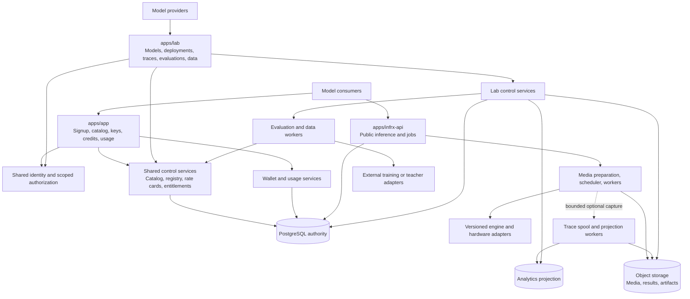

# Architecture and shared boundaries

**Latest sequence (2026-09-22):** finish the [Marlin endpoint backend](../plan/18-marlin-backend-first.md), including recovery and measured optimization; then launch App, then build Lab. Product requirements below are retained. Headless provisioning and backend gates remove the App UI from endpoint readiness.

Current delivery priority is the robust Marlin backend endpoint, followed by the SOP-use-case consumer App. The wider architecture is retained for sequential Lab delivery; see [the complete plan](../plan/12-complete-build-plan.md). A robotics dataset or VLA application context does not imply that the served Marlin artifact emits robot actions or supports live input. S2M verifies its actual protocol.

Status: target architecture. Existing and proposed locations are distinguished below. Product scope follows the [index](README.md).

## System shape

Applications are separately deployed presentation and server-action boundaries. Shared services are logical modules initially; this diagram does not mandate a new network service for each box. Gateway/worker availability does not depend on either Next.js application being up. Lab batch work has separate concurrency and budgets from interactive inference.

## Placement and reuse

| Component | Owns | Implementation placement / decision |
|---|---|---|
| App | Consumer onboarding, published catalog, consumer keys, credit balance and own request history | Existing `apps/app`; keep its deployment identity |
| Lab | Provider workspace, model versions, endpoint lifecycle, authorized traces, datasets, evaluations and improvement workflows | New `apps/lab`; only a README is created by this planning task |
| Public inference gateway | Auth, capability validation, immutable deployment/rate resolution, admission and public API | Existing `apps/infrx-api`; keep runtime independent from UI |
| Runtime | Secure media, scheduling, engine execution, durable completion | Existing F/D/M/Q/W/G tracks; preserve tested behavior |
| Shared identity and contracts | User/org identities, consumer/provider authorization types, SDK/OpenAPI fixtures | Proposed `packages/contracts` and `packages/platform-client`; coordinator creates packages only when extraction is useful |
| Server repositories | Narrow tenant and provider operations, signed content access, audit | Initially existing C modules with separated entry points; extract reusable implementations into proposed `packages/platform-server` at controlled integration |
| Shared UI | Generic controls, tokens and accessible tables | Proposed `packages/ui`; avoid copying whole console shells or business actions |
| Database | Durable identity, wallets, jobs, registry, permission grants and workflow state | One migration owner D; retain `apps/app/supabase/migrations` as the physical source initially despite its historical path |
| Telemetry | Operational metrics, accounting events, optional content traces | Shared capture infrastructure, separate purpose/visibility policies |
| Evaluation/data workers | Replays, annotations, evaluator runs and export jobs | Python modules may remain under `apps/infrx-api/infrx` initially, but run as separately configured workers; Lab controls them |

Do not move migrations, rename packages or replace workspace lockfiles across active worktrees. After reconciliation, one coordinator may extract shared packages in a dedicated commit with both apps' build checks. A physical move of migration history is unnecessary for either launch.

## Three forms of ownership

1. **Consumer ownership:** `consumer_org_id` controls requests, keys, uploads, results and usage. At initial signup each user has a personal consumer organization and a user-owned credit wallet linked to it.
2. **Provider ownership:** `provider_org_id` controls a model and its deployments. Membership is explicit; owning a consumer organization or knowing a model ID does not make someone a provider administrator.
3. **Platform operations:** protected operator permissions control infrastructure, customer suspension, promotional adjustments and public publication. These are not provider permissions.

Retain existing org IDs. Add organization capabilities and provider memberships; an organization may have both capabilities. Do not turn the existing free-text `models.provider` display field into authorization. Add a provider foreign key and versioned ownership record. Jobs carry both consumer identity and resolved provider/model/deployment IDs; this permits authorized analytics without changing who owns the request.

| Operation | Consumer | Provider member | Platform operator |
|---|---|---|---|
| Create/use consumer key | Authorized personal-org role | Only through a separate consumer identity | Explicit support/operations action |
| Read wallet or consumer-level usage | Own wallet/authorized own org | No automatic access | Audited operational need |
| Manage model/dev endpoint | No | Own provider, appropriate editor/deployer role | Audited operation |
| Publish public endpoint/rate | No | Propose own version | Approve and activate in initial Lab |
| Read service health for a model | Published status only | Own deployments; redacted aggregate operational metrics | Operational need |
| Read individual customer trace/content | Own request under retention policy | Explicit scoped access grant AND applicable capture consent | Explicit audited purpose; no unconditional UI-wide access |
| Export data / send to external judge / train | Own eligible data under separate controls | Separate permission for each purpose | Same purpose checks; role is not consent |

Provider roles initially: viewer (aggregate health), developer (dev configs/evals within assigned data access), administrator (members and publication proposals). Platform approval of public production changes remains separate. Consumer owner/member behavior is retained; team onboarding is deferred.

## Data access and lifecycle

Capture, provider sharing, external evaluation, and training reuse are four separate permissions. Full tracing does not imply any of the other three. Default customer content sharing with providers is off. Initial provider aggregate views expose request counts, errors and performance for owned deployments without customer names, keys, prompt content or per-customer drilldown. Per-customer diagnostics require a scoped grant.

An access grant records grantor, recipient provider, workload/model scope, data categories, allowed purposes, retention, external destinations where relevant, version and revocation. Queries authorize before accessing projections or issuing signed URLs. Join on trusted request/deployment identities; neither client-supplied org fields nor ClickHouse rows establish authorization.

Revocation blocks new access, exports and submissions immediately. Data materializations and dataset snapshots retain provenance and revocation links; copying to a dataset never strips source restrictions. Default behavior excludes revoked/expired data from new runs, invalidates dependent exports and schedules deletion of copies. Completed models cannot be assumed to forget previously used data; data-use terms and a documented response process are prerequisites to enabling training reuse. This is a feature boundary, not a claim that deletion can undo training.

Serving cache/results remain independent of optional trace capture. Keep the established 24h results, 7d processing cache, up to 90d full trace content and 13 calendar months trace metadata. Dataset retention is explicitly authorized on import; trace capture alone does not extend source retention. Accounting/audit have their own retention policy. No silent extension by changing a trace into a benchmark row.

## Shared domain records

| Record | Relationship / invariant |
|---|---|
| User, Organization, Membership, OrgCapability | Authentication identity is shared; authorization is checked per product and operation |
| Wallet, SignupGrant, CreditLedger, Hold | Grant entitlement belongs to the individual user; one wallet funds their initial personal consumer org across models |
| Model, ModelVersion, ServingVersion | Provider ownership; immutable artifact hashes, adapter, tokenizer, preprocessing, prompt/harness and runtime references |
| Endpoint, DeploymentRevision | Dev/prod names resolve to immutable revisions; in-flight requests keep their admitted revision |
| CatalogListing, RateCardVersion | Public listing references an approved production deployment and published credit rate |
| Request/Job, UsageEvent | Consumer-owned; resolved provider/deployment/rate IDs; one terminal settlement |
| Trace, Feedback, AccessGrant | Source ownership and independent capture/use permissions; annotation provenance |
| DatasetVersion, EvaluatorVersion, Experiment, EvaluationRun | Exact sample/split/config versions and output artifacts; stable lineage |
| TrainingRun, OptimizationRun | Optional later job records linking source data/config to resulting ModelVersion/ServingVersion |
| AuditEvent, OutboxEvent | Durable changes and replayable projection/automation effects |

## Publication and improvement flows

**Publication:** provider registers artifact → validates schema and supported runtime → creates private dev deployment → runs smoke/evaluation checks → proposes immutable production revision and rate card → platform activates approved listing → App catalog exposes it → gateway resolves it at admission. Rollback changes future resolution; it does not rewrite admitted requests, usage or benchmark evidence.

**Consumption:** verify signup → issue the individual's grant once → create key → validate published capability and credit rate → reserve credits/capacity and persist job → execute → persist result/settlement → return success → show own usage. Trace failure does not erase accounting or fail an otherwise completed inference.

**Improvement:** access-authorized traces or imported data → curated frozen dataset/splits → baseline/candidate evaluation → prompt/harness change or externally trained checkpoint → new immutable serving version → quality/performance gate → controlled promotion → monitor next deployment. Online A/B assignment is a later Lab capability and never silently changes the model a consumer explicitly pinned.

## Independent failure and release boundaries

- Lab outage, judge quota exhaustion or training failure cannot block ordinary App inference.
- PostgreSQL acceptance/accounting failure rejects new billable work; a cached API identity is not permission to bypass reservation.
- Analytics/capture is optional at consumer launch. If capture is enabled, its privacy, resource and recovery tests become mandatory even before Lab UI exists.
- Provider preview calls use a separate `provider_dev` CREDIT wallet, funded only by an explicit audited operator allocation, and a bounded priority lane. It starts at zero and receives no individual signup grant. Reuse hold/settlement mechanics; never debit a consumer wallet or bypass metering. External judge/training USD budgets remain separate.
- Heterogeneous backends must pass the same versioned quality/capability and accounting contracts. Select hardware internally until customers need a placement choice.
- ROS2 policy execution requires its own session/latency contract; persistent database admission per robot control tick is not imposed by the batch/video design.
