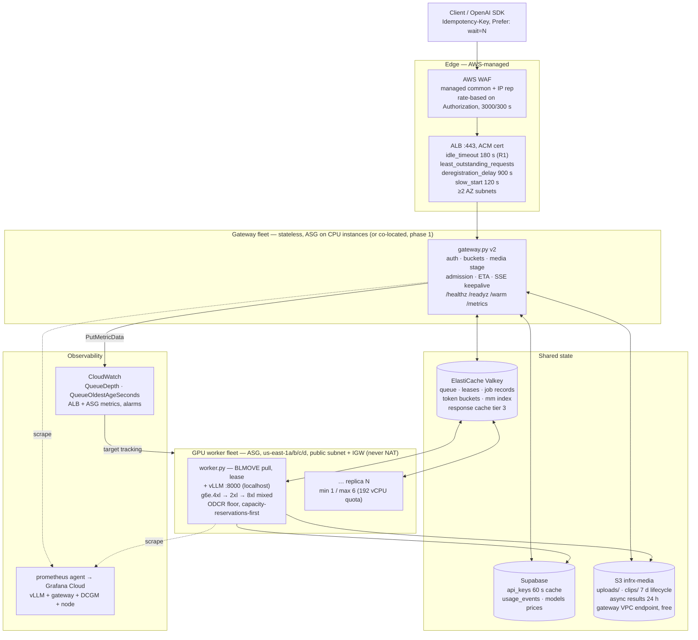

# Blueprint — the production API on AWS

> **Implementation amendment — 2026-09-20.** The current implementation authority is [the unified plan](../plan/README.md), especially [contracts](../plan/01-contracts.md) and [durable protocols](../plan/02-durable-protocols.md). The text below is historical research where it conflicts with those documents. Pilot is free with promotional holds/settlement; ordinary chat never automatically returns 202; PG owns jobs, admission, leases, output journal and terminal accounting. Memory/Valkey queues are rebuildable indices. Admission stages immutable input and commits job/hold/outbox before acknowledgment. Output commits before relay, terminal success after settlement; no retry after publication. Existing A0 fixes are preserved, not repeated. Per-request context is not aggregate concurrency; pixel area 200704 is an area limit, not a 448px long edge. Old Lua/layout/schema snippets require contract tests and must not be copied verbatim. New launch, ownership and test gates are in the plan package.


Assembly document, **2026-09-20**. This is document 09 of `research/production-api/`:
it takes the decisions already argued and sourced in
[`01`](01-requirements-and-traffic-model.md)–[`08`](08-cost-model-and-unit-economics.md)
and writes down **one system**, one set of numbers, one build order.

**No number in this document is new.** Every figure is carried from a linked
document, or is one stated multiplication on figures carried from linked
documents. Where two sibling documents disagree — and five of them do — both are
named, the disagreement is **resolved in §0.2**, and neither is silently
dropped. Uncertainty stays marked **⚠️ TO BE VERIFIED**.

**Legend** ([`../METHODOLOGY.md`](../METHODOLOGY.md#legend)): `[src]` + URL =
primary source; `meas.` = measured in this repo; `est.` = stated arithmetic on
measured or sourced inputs; **⚠️ TO BE VERIFIED** = best estimate, method
stated, no primary source.

---

## 0. The system in ten sentences, and the six contradictions it resolves

### 0.1 Ten sentences

1. This is a **CPU-I/O-bound multimodal service wearing an LLM costume**: 6× the
   prompt tokens costs 6 % of throughput, but 1080p-instead-of-360p source costs
   **2.3×** ([`02` §1.2 M3/M4](02-aws-architecture-options.md),
   [`notes.md` findings 5 and 7](../../models/marlin2b/results/notes.md)).
2. Therefore the architecture is ordered by **how much CPU work it removes from
   the request path**, not by how prettily it autoscales
   ([`06` §0](06-throughput-and-latency-optimization.md)).
3. The shape is **ALB → stateless gateway fleet → Valkey queue → queue-pull GPU
   workers (ASG, multi-AZ, mixed g6e sizes, ODCR floor)**, with Supabase for
   auth/usage and S3 for media and async results (§1).
4. "No dropped requests" means **durable admission before acknowledgement, a
   terminal state for everything admitted, and an explicit typed refusal with an
   honest `Retry-After` when the deadline cannot be met** — six conditions D1–D6
   ([`01` §2.4](01-requirements-and-traffic-model.md)), not an unbounded queue.
5. Scale-out lead time is **~5.3–8.8 min today** ([`02` §3.4](02-aws-architecture-options.md))
   and **~100–200 s** with a baked AMI ([`04` §3.1](04-autoscaling-and-capacity.md)),
   so **the queue matters ten times more than the orchestrator** and a 5-minute
   burst is met by admission control and headroom, never by scaling
   ([`01` §3.7](01-requirements-and-traffic-model.md)).
6. The single largest throughput lever is **transcode to ≤480p / 2 fps at
   ingest**, worth up to **2.28×** on the hardware we already rent, and it pays
   at a **0 % cache hit rate** ([`05` §2.2](05-caching.md)).
7. The single largest *cost* lever is **network topology**: NAT Gateway on an
   ingress-dominated workload costs more than the inference
   (+$29,443/month at scenario C — [`08` §2.2](08-cost-model-and-unit-economics.md)).
8. Autoscale on **backlog per replica**, target **47** (= 30 s wait × 1.57
   clips/s), with a separate slow scale-in and a step policy on oldest-queued-age
   ([`04` §1.3, §4.2](04-autoscaling-and-capacity.md)).
9. At the console's current `$0.10/$0.30` per 1M there is **no utilisation at
   which today's 1080p path is profitable** ([`08` §4.2](08-cost-model-and-unit-economics.md));
   the pricing change is the only item here that is linear in success.
10. Nine of the ten highest-value actions are **code in `gateway.py` and flags in
    `serve.sh`** — the AWS work is real but it is not where the wins are.

### 0.2 The six contradictions, resolved

These are documented disagreements between siblings. Each is resolved here so
that the Terraform and the code have one number.

| # | Disagreement | Resolution, and why |
|---|---|---|
| **R1** | **ALB `idle_timeout.timeout_seconds`**: `180` ([`01` F12](01-requirements-and-traffic-model.md)) vs `900` ([`02` §3.3](02-aws-architecture-options.md)) vs `600` ([`04` §7.3f](04-autoscaling-and-capacity.md), [`07` §2.3](07-reliability-observability-operations.md)). [`07` §2.3](07-reliability-observability-operations.md) names the three-way conflict and does not settle it. | **180 s**, with the SSE keepalive of §2.4 mandatory and the 202-upgrade rule of §2.2 mandatory. A long idle timeout is not a feature: it lets a wedged stream hold a connection for ten minutes. Valid range is 1–4000 s, default 60 s [src](https://docs.aws.amazon.com/elasticloadbalancing/latest/application/edit-load-balancer-attributes.html). |
| **R2** | **TTFT p95 SLO**: `≤ 6 s` ([`01` §2.3](01-requirements-and-traffic-model.md)) vs `≤ 8 s` ([`07` §1.1](07-reliability-observability-operations.md)). | **6 s**, for clips ≤30 s at ≤720p. [`07` §1.1](07-reliability-observability-operations.md) itself says *"`01` owns the SLO"*. Alert #8/#9 thresholds in [`07` §1.3](07-reliability-observability-operations.md) move to 6 s with it. |
| **R3** | **Source-fetch timeout**: connect 3 s / total 20 s / ≤3 redirects ([`01` F4](01-requirements-and-traffic-model.md)) vs `FETCH_TIMEOUT_S = 30` ([`03` §3.4](03-request-handling-and-queueing.md)). [`03`](03-request-handling-and-queueing.md)'s own verification log flags it as unreconciled. | **connect 3 s, total 20 s, ≤3 manually-revalidated redirects**. 20 s already exceeds the whole p95 request budget; 30 s buys nothing and holds a slot. |
| **R4** | **Warm pool**: *"N+1 for 1 % of the price, $16/month"* ([`08` §6.3](08-cost-model-and-unit-economics.md)) vs *"the warm pool degenerates; there is no version that is cheaper than simply running the instance"* ([`04` §2.5](04-autoscaling-and-capacity.md)). [`08`](08-cost-model-and-unit-economics.md) carries a correction box deferring to [`04`](04-autoscaling-and-capacity.md). | **No warm pool.** `g6e` cannot hibernate (`HibernationSupported=false`, and no accelerated family is on the [prerequisites list](https://docs.aws.amazon.com/AWSEC2/latest/UserGuide/hibernating-prerequisites.html)); a `Stopped` instance does not hold capacity; a warm pool is incompatible with Replace-Root-Volume deploys; and behind an ODCR it bills the full rate anyway. Buy the ODCR and **run the spare warm** (§3.5). |
| **R5** | **Where the queue lives**: in-process ([`02` §9.4](02-aws-architecture-options.md)) vs Redis ([`03` §2.1](03-request-handling-and-queueing.md)) vs SQS-behind-in-process ([`07` §3.6](07-reliability-observability-operations.md)). | **One ElastiCache Valkey cluster** holds the queue, the lease ledger, the job records, the token buckets and the media-cache index; the in-process path survives as the `REDIS_URL`-unset single-box mode ([`03` §2.1](03-request-handling-and-queueing.md)). **No SQS on the interactive path** — it breaks streaming ([`02` §9.2](02-aws-architecture-options.md)) and duplicates the lease protocol we need anyway. SQS returns only if the **OQ17 failover drill** shows a promotion can swallow an already-acknowledged 202 — that escape hatch is now a decision rule with a trigger and two named alternatives (OQ17), not a sentiment, and it is why §1.2 mandates a replication group with Multi-AZ and automatic failover rather than the single node this document first priced. |
| **R6** | **Headroom during a scale-out**: *"Keep N+1 warm so the fleet absorbs the first ~30 s of any spike"* ([`01` §3.7](01-requirements-and-traffic-model.md)) vs *"at 3 it is 39 % of the bill and the answer is the bounded queue plus the ODCR floor instead"* (§7.5) — while §3.3(d) actually ships `min-size 1`. | **Both, split by N.** The cost of a spare is **1/N** (§7.5): at N = 1 it is **+93.4 % of the fixed floor** ($1,636.72 on $1,753 on demand; +89.8 % at the 1y SP rate — §7.1), so there is no N+1 below N = 3 and `min-size 1` stands. But §7.5 never priced what the *missing* headroom does to a client, and the bounded queue does not cover it: §3.4a computes a **90–170 s window in which a default, non-opt-in streaming request is refused `429 sync_wait_exceeded`** on every scale-out at a doubling of load. The pilot buys that coverage with the **$0** lever rather than the $1,637 one — **`async_upgrade_enabled` defaults *on*** (§2.2, §3.4a), so the window returns 202s, which D3/D4 (§2.1) say are not drops. **This supersedes [`01` §3.7](01-requirements-and-traffic-model.md)'s "keep N+1 warm" at pilot scale**; it applies as written at N ≥ 3, where §7.5's 39 % makes the warm spare the better buy. |

Two further numbers this document pins because more than one sibling uses them
loosely: `WORKER_BUDGET_VIDEO_SECONDS` is **120**, not 80 — at 80 the largest
legal request can never be admitted ([`03` §3.2](03-request-handling-and-queueing.md)'s
own correction) — and the ALB `deregistration_delay.timeout_seconds` is **900**
([`07` §2.3](07-reliability-observability-operations.md)), which is the number
`TimeoutStopSec` must exceed.

---

## 1. Target architecture

### 1.1 The diagram



### 1.2 The prose, layer by layer

**Edge.** TLS terminates on the **ALB with an ACM certificate**, and Caddy is
deleted. That removes the Let's Encrypt renewal failure mode, the per-box cert
storage, and the ACME rate-limit risk a five-box scale-out storm would trigger
([`07` §5.5](07-reliability-observability-operations.md)). **Do not put API
Gateway anywhere near this path** — 30 s max integration timeout and a 10 MB
payload cap, neither increasable
[src](https://docs.aws.amazon.com/apigateway/latest/developerguide/http-api-quotas.html).
**Do not put CloudFront on it either**: its origin response timeout is 30 s by
default with a 1–120 s default quota, and its *response completion* timeout is
not idle-based at all
[src](https://docs.aws.amazon.com/AmazonCloudFront/latest/DeveloperGuide/DownloadDistValuesOrigin.html)
([`03` §1.2](03-request-handling-and-queueing.md)). An NLB is also out: a TLS
listener is fixed at **350 s and cannot be modified**
[src](https://docs.aws.amazon.com/elasticloadbalancing/latest/network/network-load-balancers.html).
The one open question the ALB creates is the **Elastic IP** — ALB IPs are
AWS-managed and change ([`02` OQ3](02-aws-architecture-options.md)); ask the
current callers before cutting DNS.

**Gateway fleet.** Stateless. Everything it needs is in Valkey, Supabase or S3.
In **phase 1 it is co-located** with vLLM on the GPU box (one systemd unit each,
as today); it becomes its own ASG on CPU instances only when
`marlin:cpu_stall_ratio` stays above 0.5 *after* the transcode lands
([`06` §2.5](06-throughput-and-latency-optimization.md)). Splitting
`gateway.py` into `gateway/queue/media/worker/usage` modules is not tidiness —
it is the prerequisite for `worker.py` to run on a different machine
([`03` §7.1](03-request-handling-and-queueing.md)).

**Queue.** One ElastiCache Valkey cluster (R5).
It carries: `q:{model}:{band}:{org}` lists, a WFQ ZSET of virtual finish times,
`q:{model}:ready`, `lease:{model}`, `job:{id}` hashes, `tb:{org}` buckets,
`idem:{org}:{key}`, and `mm:{sha256}` ([`03` §7.2](03-request-handling-and-queueing.md)).
With `REDIS_URL` unset the same code path runs in-process, which is how the
existing no-network tests keep passing.

**Required topology — this is D2's storage, not a cache.** A single node is not
an acceptable configuration for it, because D2 (§0.2) promises that acceptance is
durable before it is announced. The configuration is:

| Setting | Value | Why |
|---|---|---|
| Kind | **replication group** (cluster mode disabled), not a standalone cache cluster | Multi-AZ *"is only supported on Valkey and Redis OSS clusters with more than one node in each shard"* [src](https://docs.aws.amazon.com/AmazonElastiCache/latest/dg/AutoFailover.html) |
| Nodes | primary **+ ≥1 read replica in a different AZ** | *"You can enable Multi-AZ only on Valkey or Redis OSS (cluster mode disabled) clusters that have at least one available read replica"*, and ElastiCache *"will automatically enable Multi-AZ only if the cluster contains at least one replica in a different Availability Zone from the primary in all shards"* (same page) |
| `--multi-az-enabled --automatic-failover-enabled` | on | *"the read replica with the least replication lag is promoted to primary … Writes can resume as soon as the promotion process is complete, typically just a few seconds"* (same page) |
| Automatic backups | on, taken **from the replica** | Backups are *"written to Amazon Simple Storage Service (Amazon S3)"* and restore *"by creating a new … cache and populating it with data from a backup"*; *"we recommend that you create backups from one of the read replicas"* [src](https://docs.aws.amazon.com/AmazonElastiCache/latest/dg/backups.html) |
| AOF | **not a lever** | *"ElastiCache for Redis OSS Multi-AZ and append-only file (AOF) are mutually exclusive. If you enable one, you can't enable the other."* [src](https://docs.aws.amazon.com/AmazonElastiCache/latest/dg/AutoFailover.html) — this resolves [`07` §3.6](07-reliability-observability-operations.md)'s ⚠️: AOF is indeed not the durability story |

**Cost: 2 × `cache.t4g.micro` at $0.0128/h = $18.69/month**
([`08` §2.1](08-cost-model-and-unit-economics.md)) — $9.35/month more than the
single node this document previously priced, for the half of the no-drop promise
that no amount of gateway code can provide.

**The resulting RPO is *not* zero, and that is the whole of OQ17.** *"Valkey and
Redis OSS replication is asynchronous. Therefore, when a primary node fails over
to a replica, a small amount of data might be lost due to replication lag."*
(same page). ElastiCache does not publish a bound on that lag, so **the RPO is
"one replication lag", unquantified** ⚠️ TO BE VERIFIED by the drill in OQ17.
Three further sourced facts bound what the topology buys:

- **Whole-cluster failure loses everything.** *"Because the entire cluster failed,
  data is lost and all the new nodes start cold."* Snapshots are the recovery, and
  they are periodic S3 copies, not a point-in-time log — a restore is a new cache
  seeded from stale data, not a replay of the accepted jobs.
- **A customer-initiated reboot is a trap.** *"A customer-initiated reboot of a
  primary doesn't trigger automatic failover"*, and *"When the primary is rebooted,
  it's cleared of data when it comes back online. When the read replicas see the
  cleared primary cluster, they clear their copy of the data, which causes data
  loss."* So "reboot the cache" is never an ops step here; it drops every queued
  job. The runbook says *replace*, and lets automatic failover do it.
- **Valkey 9.0+ durability would make the RPO explicit**, if it is available on
  the node type we can afford: *"With durability, all committed data is persisted
  in a Multi-AZ transactional log. During failovers, synchronous writes ensure
  zero data loss, while asynchronous writes may lose up to 10 seconds of
  uncommitted data."* (same page). ⚠️ TO BE VERIFIED: engine-version availability,
  supported node types and the price delta on `cache.t4g.micro` were not
  established here. If it is available and cheap, it is the cleanest resolution of
  OQ17 and it retires the SQS escape hatch.

**Worker fleet.** **Queue-pull, not push** — the only thing a worker owns is
what it is actively executing, so "no drop" reduces to "leases expire", one
timer ([`03` §6.1](03-request-handling-and-queueing.md)). Workers are
`g6e.*` in an ASG across `us-east-1a/b/c/d` (g6e is *offered* in four AZs
[meas. 2026-09-20, [`04` §2.4](04-autoscaling-and-capacity.md)]), **in a public
subnet behind an Internet Gateway**. That last clause is worth
**+$29,443/month at scenario C** ([`08` §2.2](08-cost-model-and-unit-economics.md)):
NAT's $0.045/GB applies to ingress, and this workload is ingress.

**Supabase** keeps exactly the role it has: `api_keys` (60 s hit / 10 s miss
cache, stale-served on outage, **503 not 401** for unknown keys), `models`
prices (300 s), `usage_events` via the bounded background queue with
`usage.jsonl` / `usage_failed.jsonl` spill and `replay_usage.py`
([`05` §4.3](05-caching.md)). It gains `queue_wait_ms`, `outcome`, `attempts`,
`request_fingerprint`, a real `cached`, and a `cancelled` status.

**S3** holds three prefixes on one bucket: `uploads/` (presigned PUT,
[`05` §2.5](05-caching.md)), `clips/` (transcoded media cache, 7-day lifecycle),
and async job results (24 h). Reached through a **gateway VPC endpoint**, which
has *"no additional charge"*
[src](https://docs.aws.amazon.com/vpc/latest/privatelink/gateway-endpoints.html).

### 1.3 Every timeout and limit on the path, with its source

This table is the contract between the layers. A value that appears twice must
be the same value.

| Hop | Knob | Value | Default | Source |
|---|---|---|---|---|
| ALB | `idle_timeout.timeout_seconds` | **180** (R1) | 60 s, range 1–4000 | [src](https://docs.aws.amazon.com/elasticloadbalancing/latest/application/edit-load-balancer-attributes.html) |
| ALB | `client_keep_alive.seconds` | 3600 (leave) | 3600, range 60–604800; **does not reset on traffic** | [src](https://docs.aws.amazon.com/elasticloadbalancing/latest/application/edit-load-balancer-attributes.html) |
| ALB | `load_balancing.algorithm.type` | `least_outstanding_requests` | round robin | [src](https://docs.aws.amazon.com/elasticloadbalancing/latest/application/edit-target-group-attributes.html) |
| ALB | `deregistration_delay.timeout_seconds` | **900** | 300 s, range 0–3600 | [src](https://docs.aws.amazon.com/elasticloadbalancing/latest/application/load-balancer-target-groups.html) |
| ALB | `slow_start.duration_seconds` | **120** | 0 = disabled, range 30–900. **Incompatible with LOR** ⚠️ — see the note below | [src](https://docs.aws.amazon.com/elasticloadbalancing/latest/application/edit-target-group-attributes.html) |
| ALB health check | interval / timeout / healthy / unhealthy | **10 / 5 / 2 / 3** on `/readyz` | 30 / 5 / 5 / 2; the defaults cost **150 s** of the scale-out budget | [src](https://docs.aws.amazon.com/elasticloadbalancing/latest/application/target-group-health-checks.html), [`01` §3.7](01-requirements-and-traffic-model.md) |
| Gateway | SSE keepalive comment | **every 15 s** while queued or prefilling | vLLM's own `--sse-keep-alive-interval` defaults to **0 = off** | [`01` R-SSE](01-requirements-and-traffic-model.md), [`03` §1.3](03-request-handling-and-queueing.md) |
| Gateway | source fetch: connect / total / redirects | **3 s / 20 s / ≤3 revalidated** (R3) | today `FETCH_TIMEOUT_S=30`, `connect=5`, `MAX_REDIRECTS=3` already revalidated per hop (`gateway.py:55–56, 239–241, 267–271`) — only the two timeouts still differ | [`01` F4](01-requirements-and-traffic-model.md) |
| Gateway | `ffprobe` | **10 s**, bounded executor of 2–4 | today 30 s on the default 12-thread pool | [`03` §3.4, §4.2](03-request-handling-and-queueing.md) |
| Gateway | transcode | `max(15, 0.5 × duration)` | — | [`03` §3.4](03-request-handling-and-queueing.md) |
| Gateway | `MEDIA_DECISION_S` (D1's clock) | **2** — at which point it is a status or a durable 202 (§2.1) | no such bound today | [`01` §2.4 D1](01-requirements-and-traffic-model.md), [`10` §4.2](10-implementation-spec.md) |
| Gateway | `MEDIA_STAGE_CONCURRENCY` / `MEDIA_STAGE_QUEUE_MAX` | **8 / 16** — the only bound on requests *inside* the pre-admission stage (§2.3 gate 3) | **unbounded today**; `TRANSCODE_WORKERS`/`PROBE_WORKERS` bound executors, not arrivals | [`10` §8.3](10-implementation-spec.md) |
| Gateway | `PREPARING_TTL_S` | **120** > the stage's own ceiling `20 + 10 + 60 = 90` | — | [`10` §5.1, §7.5](10-implementation-spec.md) |
| Gateway | `SYNC_MAX_WAIT_S` / `SYNC_NOSTREAM_MAX_WAIT_S` | **30 / 10** | — | [`03` §1.5](03-request-handling-and-queueing.md) |
| Gateway | `SYNC_ADMIT_CEILING_S` (held connection) | **interactive 10 / standard 600 / free 120** — the tier's queue-wait p99 (§2.3) | — | [`03` §1.5](03-request-handling-and-queueing.md), [`10` §8.1](10-implementation-spec.md) |
| Gateway | `ASYNC_ADMIT_CEILING_S` (`/v1/jobs`) | **interactive 600 / standard 600 / free 120** (was `MAX_PROMISED_WAIT_S`) | — | [`03` §1.5](03-request-handling-and-queueing.md), [`10` §8.1](10-implementation-spec.md) |
| Gateway | `TTFT_TIMEOUT_S` / `TPOT_STALL_S` / `GENERATION_TIMEOUT_S` | **60 / 20 / 300** | today one flat `httpx.Timeout(600, connect=10)` | [`03` §3.4](03-request-handling-and-queueing.md) |
| Gateway | `MAX_QUEUE_HARD` / `MAX_QUEUE_BYTES` | **500 / 256 MiB** | llm-d's own bounds are `maxRequests: 200`, `maxBytes: 10Gi` | [`03` §2.5](03-request-handling-and-queueing.md) |
| Gateway | `MAX_VIDEO_SECONDS` / `MAX_VIDEO_MB` / body | **120 / 64 / ~86 MB** (`64 × 4/3 + slack`), body checked on `Content-Length` before reading | body limit absent today | [`01` §5.2](01-requirements-and-traffic-model.md), [`07` §4.2](07-reliability-observability-operations.md) |
| Gateway | `max_tokens` server cap | **2048** — a *policy* cap (the vendor helpers' default), not a model ceiling | unbounded today | [`07` §4.2](07-reliability-observability-operations.md) |
| Queue | `LEASE_TTL_S`, heartbeat | **120 s**, heartbeat at TTL/3 = 40 s | — | [`03` §6.2](03-request-handling-and-queueing.md) |
| Queue | `MAX_ATTEMPTS` before quarantine | **2** | — | [`03` §5.4](03-request-handling-and-queueing.md) |
| Queue | `RETRY_BUDGET_FRAC` | **0.10** of requests in a 1-minute window | — | [`03` §5.1](03-request-handling-and-queueing.md) |
| Worker | `WORKER_BUDGET_VIDEO_SECONDS` | **120** (§0.2), with "a single job always admits to an empty worker" | 80 in [`03`](03-request-handling-and-queueing.md), which rejects the largest legal request | [`03` §3.2](03-request-handling-and-queueing.md) |
| Worker | `WORKER_CONCURRENCY` (dispatch gate N+B) | **10** (N=8, B=2) | `MAX_INFLIGHT=16` *rejection*, not a gate | [`03` §3.2](03-request-handling-and-queueing.md) |
| vLLM | `--max-num-seqs` | **8** (the only measured concurrency) — in `marlin2b-vllm.service`, **not** `serve.sh` | 32 today | [`01` §3.2 C3](01-requirements-and-traffic-model.md), [`03` §3.2](03-request-handling-and-queueing.md) |
| vLLM | `--max-model-len` / `--gpu-memory-utilization` | 32768 / 0.90 (unchanged) | — | [`models/marlin2b/serve.sh`](../../models/marlin2b/serve.sh) |
| vLLM | `VLLM_ENGINE_ITERATION_TIMEOUT_S` | 60 (default, leave) | 60 | [`07` §3.3](07-reliability-observability-operations.md) |
| systemd | gateway `TimeoutStopSec` | **930** (> `deregistration_delay` 900) | unset ⇒ 90 s ⇒ **SIGKILL mid-generation today** | [`03` §6.3](03-request-handling-and-queueing.md), [`07` §2.4](07-reliability-observability-operations.md) |
| systemd | vLLM `ExecStop` | `docker stop -t 120`, `TimeoutStopSec=180` | `docker stop` grace is **10 s** | [`07` §2.4](07-reliability-observability-operations.md) |
| ASG | `DefaultInstanceWarmup` | **120** (launch hook does the real waiting) | not enabled by default; AWS suggests starting at 300 | [`04` §2.6, §4.2](04-autoscaling-and-capacity.md) |
| ASG | `--health-check-grace-period` | **480** | **CLI default 0 = disabled**, which kills every box during boot | [`07` §2.6](07-reliability-observability-operations.md) |
| ASG | launch / terminate lifecycle-hook heartbeat | **600 / 300**, `ABANDON` / `CONTINUE` | 3600 s default | [`04` §2.6, §7.2](04-autoscaling-and-capacity.md) |

⚠️ **One unresolved conflict inside this table.** AWS states *"the least
outstanding requests routing algorithm can not be used with slow start mode"*
[src](https://docs.aws.amazon.com/elasticloadbalancing/latest/application/edit-target-group-attributes.html),
yet [`07` §2.3](07-reliability-observability-operations.md) sets both.
[`02` §3.2](02-aws-architecture-options.md) reaches the right decision rule:
**prefer LOR and make `/readyz` honest** — a `/warm` gate that has actually
completed one real generation removes the reason slow start existed here. Set
`slow_start.duration_seconds = 0` and drop the 120 from the Terraform. This is
the one row above that differs from every sibling, and it differs because the
siblings contradict AWS.

---

## 2. Request lifecycle, and the no-drop guarantees

### 2.1 The definition being implemented

A request is **not dropped** iff all six hold
([`01` §2.4](01-requirements-and-traffic-model.md)):

- **D1** — within `MEDIA_DECISION_S` = **2 s** of the last request byte, the
  client holds either a **final status** or a **durable job id**. "If we cannot
  decide in 2 s, we accept" is implemented as: `job:{id}` is written to Valkey
  with `state=preparing` **before the source fetch opens** (§2.3), so a job id
  exists from the first byte; at `t = MEDIA_DECISION_S`, if the media stage has
  not landed, `stream=true` gets the SSE stream opened with
  `: {"state":"preparing","job_id":"job_…"}` and keepalives thereafter, and
  every other surface gets `202 + Location: /v1/jobs/{id}` while the stage
  continues. See [`10` §4.2, §5, §6](10-implementation-spec.md).
  **Why the restatement.** The old wording — *"a status within 2 s"* — is
  unsatisfiable on a cache miss, because the pre-admission media stage runs
  first and its own ladder is `FETCH_TIMEOUT_S + PROBE_TIMEOUT_S +
  TRANSCODE_TIMEOUT_S = 20 + 10 + max(15, 0.5 × duration)` = **90 s for a 120 s
  clip** ([`10` §5.1](10-implementation-spec.md)); `eta_s` does not exist until
  it lands, so §2.2's rule and [`10` §4.2](10-implementation-spec.md)'s
  response-selection table cannot run at all. Nor was the escape clause
  implementable: with no job id, no durable record and no 202 to return, there
  was nothing to accept *with*.
  **The choice made, of the two on the table**: keep the media stage before
  admission and make D1 "a status **or** a durable 202 within
  `MEDIA_DECISION_S`". Rejected: moving the stage after admission for URL
  inputs and estimating `video_seconds` from `Content-Length` until `ffprobe`
  lands — it needs a bytes→seconds estimator nothing in this tree measures, and
  it mis-prices exactly the case §2.3 exists to price correctly.
  **This 202 is not the queue-wait upgrade of §2.2**, but it rides the same
  key-level flag. §2.2's opt-in governs the branch where the alternative is a
  429 the client can act on; here the alternative is a silent socket that may
  sit for 90 s and then 504, so it fires by default — which costs nothing new,
  because §0.2 R6 already defaults `async_upgrade_enabled` **on** for the pilot.
  The documented exception is the key that turned it off: for it the media stage
  is a held connection, D1 degrades to the durable `preparing` record alone, and
  the wait is bounded by the §5.1 ladder rather than by `MEDIA_DECISION_S`. That
  is a worse contract and it is the client's explicit choice, the same trade
  §2.2 already names.
- **D2** — acceptance is **durable before it is announced**. Today nothing is:
  a `MAX_INFLIGHT` slot is a Python integer, so `systemctl restart
  marlin2b-gateway` drops up to 16 in-flight requests with no record anywhere.
- **D3** — an accepted request reaches `succeeded`, `failed` (typed),
  `cancelled`, or `expired`. `expired` is a first-class terminal state and is
  **never billed** — Anthropic's Message Batches vocabulary, adopted verbatim
  [src](https://platform.claude.com/docs/en/build-with-claude/batch-processing).
- **D4** — refusal is explicit, typed and retryable, with `Retry-After`
  [src](https://www.rfc-editor.org/rfc/rfc9110.txt) §10.2.3, §15.6.4;
  [src](https://www.rfc-editor.org/rfc/rfc6585.txt) §4.
- **D5** — the wait estimate is computed from live backlog and measured drain
  rate, and **jittered server-side**: `ceil(eta × U(1.0, 1.5))`. Today's constant
  `Retry-After: 2` synchronises every rejected client into a thundering herd.
- **D6** — retries are safe. `Idempotency-Key`, Stripe semantics, 24 h
  retention, same-key-different-body → 409
  [src](https://docs.stripe.com/api/idempotent_requests).

**A refusal at admission is not a drop. A 504 after 90 s of holding a connection
is.** ([`03` §1.1](03-request-handling-and-queueing.md))

### 2.2 The two surfaces, and the rule that picks

```
if request has Prefer: wait=N          -> hold the connection up to N seconds (max 300);
                                          on timeout return 202 + job id, do NOT cancel the work
elif stream == true and eta <= 30 s    -> SSE, keepalive comments every 15 s from enqueue
elif stream == false and eta <= 10 s   -> hold the connection, plain JSON
elif X-Infrx-Accept-Async: 1           -> 202 + Location: /v1/jobs/{id}
else                                   -> 429 queue_full + jittered Retry-After
                                          + a body naming POST /v1/jobs
```

`Prefer: wait=<seconds>` is Replicate's header, adopted
[src](https://replicate.com/docs/topics/predictions/create-a-prediction) — ⚠️ the
`max 300` is **ours**, not Replicate's, which documents a 60 s default and no
maximum ([`01` U4](01-requirements-and-traffic-model.md)).

The middle branch is the mechanism by which a burst does not become a drop: **a
request that would have been a 200 becomes a 202 when the fleet is busy**. It is
a behaviour change for existing clients, so it is opt-in
(`X-Infrx-Accept-Async: 1`, or a key-level `async_upgrade_enabled`) — but the
key-level flag defaults **on** for the pilot, not off, because with it off a
default client is refused for 90–170 s of every scale-out (§0.2 R6, §3.4a). A
pilot client that cannot accept a 202 on `POST /v1/chat/completions` gets
`async_upgrade_enabled = false` on its key, and the 429 window back, explicitly. Google's AIP-151 puts the async threshold at *"a good rule of
thumb is 10 seconds"* [src](https://google.aip.dev/151) — a 120 s clip at our
own SLO is 90 s, so **every clip over ~20 s belongs on the job surface**.

Endpoints ([`03` §7.3](03-request-handling-and-queueing.md)):
`POST /v1/chat/completions`, `POST /v1/jobs`, `GET /v1/jobs/{id}`,
`GET /v1/jobs/{id}/events` (SSE, resumable via `Last-Event-ID`),
`DELETE /v1/jobs/{id}`, `POST /v1/uploads`, `GET /v1/models`,
`/livez` `/readyz` `/warm` `/metrics`.

### 2.3 Admission

Five gates in order, each cheap enough to run before the expensive one:

1. **Auth** — unchanged, plus bounded LRU, single-flight and
   stale-while-revalidate ([`05` §4.1](05-caching.md)).
2. **Token buckets**, per org, two of them: requests/min and **video-seconds/min**.
   A Lua script makes check-and-consume atomic. Over-bucket ⇒ 429 with
   `Retry-After = ceil((needed − tokens) / refill_per_s)`; **never enters the
   queue** ([`03` §2.3](03-request-handling-and-queueing.md)). Buckets bound
   arrival **rate**, never concurrency — which is why gate 3 has to exist.
3. **Media-stage gate** — the concurrency bound on gate 4. Without it nothing
   caps how many requests sit *inside* the media stage, each holding an open
   client connection, an open upstream fetch and a temp file:
   `TRANSCODE_WORKERS=2` / `PROBE_WORKERS=2` bound the *executors*, so excess
   requests do not get refused, they silently pile up behind them. `MAX_QUEUE` /
   `MAX_QUEUE_BYTES` bound only the **post-admission** queue, which this stage
   has not reached yet.

```
media_inflight = requests holding a media-stage slot   # semaphore holders
media_waiting  = requests parked on the semaphore

if input is infrx://upload/<sha256> or data: and mm:{sha256} is an index hit
                                                 -> skip gates 3-4 entirely, go to gate 5
elif media_inflight < MEDIA_STAGE_CONCURRENCY    -> enter the stage
elif media_waiting  < MEDIA_STAGE_QUEUE_MAX      -> park on the semaphore
else 429 code=media_stage_busy,
     Retry-After = ceil((media_waiting + 1) / MEDIA_STAGE_CONCURRENCY
                        × t̂_media × U(1.0, 1.5))
```

   `t̂_media` is the EWMA of observed end-to-end media-stage seconds
   (`infrx_media_stage_seconds`, [`10` §10.3](10-implementation-spec.md)) — the
   same "measured, not modelled" discipline gate 5 uses, and the same D5 jitter.
   **Sizing** ([`10` §8.3](10-implementation-spec.md)):
   `MEDIA_STAGE_CONCURRENCY = 8` = `TRANSCODE_WORKERS + PROBE_WORKERS` (4) + a
   small queue so a slot is never idle while a fetch is in flight, and
   `MEDIA_STAGE_QUEUE_MAX = 16`. Worst case on one box is therefore 24 open
   upstream fetches and `24 × MAX_VIDEO_MB(64 MiB) = 1.5 GiB` of temp files —
   nothing against the 450 GB instance store on `g6e.2xlarge`
   ([`06` §4](06-throughput-and-latency-optimization.md)), and a number that
   **exists**, which is the point.
4. **Media stage** — mint `job_{id}` and write `job:{id}` with
   `state=preparing` **first**, *then* fetch (SSRF-guarded, streamed, capped) →
   `ffprobe` → content hash → cache lookup → transcode → cache write. It runs
   **before** admission because we need `video_seconds` to size the job and
   because a cache hit makes the job nearly free
   ([`03` §4.2](03-request-handling-and-queueing.md)). The job id comes first so
   that the record is durable from the first byte: that is what makes D1's 202
   returnable at `t = MEDIA_DECISION_S`, and what lets the reaper expire the
   request if the gateway dies mid-stage (§2.8) instead of losing it the way D2
   describes. `preparing` is a first-class state
   ([`10` §2, §5](10-implementation-spec.md)), never billed.
5. **Deadline admission**, in video-seconds, not requests — request counting
   mis-prices a 120 s clip by **11.5×** against a 10 s clip
   ([`01` §1.3](01-requirements-and-traffic-model.md)):

```
backlog     = Σ over queued requests of cost_units(r)          # video-seconds
in_flight   = Σ over running requests of remaining_cost_units(r)
drain_rate  = Σ over healthy replicas of measured_video_s_per_s   # EWMA, 60 s
eta         = (backlog + in_flight) / max(drain_rate, eps) + residual
              # scale-up does NOT reduce eta until the replica is healthy

promised    = eta + own_cost/drain_rate

if   promised <= SYNC_ADMIT_CEILING_S(band)   -> admit, hold the connection / SSE
elif promised <= ASYNC_ADMIT_CEILING_S(band)  -> admit on /v1/jobs (202); on the sync
                                                 surface, 429 sync_wait_exceeded
else 429 queue_full, Retry-After = ceil(eta × U(1.0, 1.5))

cost_units(r) = video_seconds × resolution_factor
resolution_factor = 1.0 post-transcode; 2.28 for a 1080p source at request time
```

([`01` §3.4, §3.6](01-requirements-and-traffic-model.md)). Three properties
matter: it is **measured, not modelled**; it **does not count capacity that has
not booted** — the single most common way an ETA lies; and it **refuses by
deadline, not by depth**, so 400 fast 10 s clips are fine while 40 slow 120 s
clips are not.

**Two ceilings, not one** ([`10` §8.1](10-implementation-spec.md) defines both;
this is the single admission ceiling in both documents). A held connection is
refused at the tier's own queue-wait p99 below — `interactive` at **10 s**, so a
20 s ETA never becomes 20 s of silence on a socket. The same request is *admitted*
on the job surface, where `ASYNC_ADMIT_CEILING_S` runs to 600 s, because a 202 the
client polls costs nobody a held connection. Sync and async differ by 60× on
`interactive` **on purpose**: that is the price of holding the wire, not a
tightening of what we accept.

**An SLO p99 used as a hard admission cap makes the SLO true by construction** —
every request that would have violated it is refused instead, and the violation
reappears as 429s. That is exactly why §2.5 counts 429 `queue_full` against the
admission-success SLO: set `SYNC_ADMIT_CEILING_S` too tight and the queue-wait
dashboard stays green while the *admission* SLO burns. Read the two together or
neither means anything.

**Queue bound.** `MAX_QUEUE = min(ASYNC_ADMIT_CEILING_S × μ̂ × 0.8, MAX_QUEUE_HARD)`
— the async ceiling, since that is the longest we may hold a job,
capped at 500 for host-memory reasons llm-d states explicitly
([`03` §2.5](03-request-handling-and-queueing.md)). Per-org cap at
`MAX_QUEUE / 4` so one tenant cannot own the queue
([`02` §10.5](02-aws-architecture-options.md)).

**Fairness** is three layers ([`01` §5.4](01-requirements-and-traffic-model.md)):
a per-tenant concurrency cap now; weighted-fair queuing keyed on **video-seconds
served**, not request count, at S2; published `x-ratelimit-*-video-seconds`
headers throughout. Record `org_id` on every queue entry from day one even
though layer 2 is deferred — the data must exist when contention does.

**SLO tiers** ([`01` §2.3](01-requirements-and-traffic-model.md)), a property of
the API key, not the request:

| | **interactive** (default) | **bulk** | **batch** |
|---|---|---|---|
| Surface | held connection or SSE | 202 + polling | 202 + polling, discounted |
| TTFT p95 | **≤ 6 s** ≤30 s clips ≤720p (R2) | n/a | n/a |
| Queue wait p95 / p99 | **≤ 3 s / ≤ 10 s** | ≤ 120 s / ≤ 600 s | ≤ 60 min / ≤ 4 h |
| E2E p95, s per clip-minute | **≤ 45** (worst measured is 30.3) | ≤ 90 | — |
| Availability, 30 d | **99.5 %** | 99.5 % | 99.0 % |
| Admission success, 30 d | **99.9 %** | 99.95 % | 99.99 % |

Note the deliberate inversion: **admission success is stricter than
availability**. We would rather take a request and be slow than refuse it. An
OpenRouter-fronted key is pinned to `interactive`, because the marketplace's own
guidance is *"Return early 429s if under load, rather than queueing requests"*
[src](https://openrouter.ai/docs/use-cases/for-providers) — and 429 is **not**
among the errors that affect its uptime score
([`01` §1.1 C1](01-requirements-and-traffic-model.md)).

### 2.4 Holding the connection

A non-streaming request queued for 40 s is 40 s of silence on the wire, and ALBs
*"do not support HTTP/2 PING frames"*
[src](https://docs.aws.amazon.com/elasticloadbalancing/latest/application/edit-load-balancer-attributes.html)
— application bytes are the only heartbeat that works. So:

- **Streaming**: emit `: {"queue_position":7,"eta_s":11.2}` then `: keep-alive`
  every 15 s from the moment of enqueue. Comments are ignored by every compliant
  SSE client [src](https://developer.mozilla.org/en-US/docs/Web/API/Server-sent_events/Using_server-sent_events),
  and they turn queue position into something we can *push*. vLLM ships the same
  primitive and its docstring names our failure verbatim
  ([`03` §1.3](03-request-handling-and-queueing.md)) — but ours must start at the
  **gateway**, while the request is still in *our* queue and vLLM has never heard
  of it.
- **Non-streaming**: there is no keepalive channel, which is the whole argument
  for the 10 s ceiling and the 202 upgrade. Push `stream: true` as the documented
  default in the console snippets.

Streamed jobs are published to `job:{id}:stream` rather than piped straight from
the worker socket, which makes `/v1/jobs/{id}/events` resumable and lets a *sync*
request survive a gateway restart ([`03` §7.3](03-request-handling-and-queueing.md)).
Batch stream chunks at ~50 ms so the Valkey write stays cheap.

### 2.5 429 semantics, and the status contract

| Code | `error.type` | When | Headers |
|---|---|---|---|
| 200 | — | completed | `Inference-Id`, `X-Queue-Wait-Seconds` |
| 202 | — | durably queued | `Inference-Id`, `Location`, `Retry-After` (poll hint), `X-Queue-Position`, `X-Queue-Estimated-Wait-Seconds` |
| 400 | `invalid_request_error` | >1 video, >120 s, bad scheme | — |
| 401 | `authentication_error` | unknown or revoked key | — |
| 402 | `insufficient_credits` | `sum(credit_ledger) ≤ 0` — **new**; no spend protection exists today | — |
| 409 | `idempotency_key_reuse` / `_conflict` | same key, different body / concurrent race | — |
| 413 | `payload_too_large` | decided from `Content-Length` **before reading** | — |
| 422 | `unprocessable_media` / `request_rejected` | undecodable, or quarantined poison | — |
| 424 | `source_unavailable` | fetch failed, or SSRF-blocked — **one generic body, no timing tell** | `Retry-After` |
| 429 | `rate_limit_error` | tenant over bucket | `Retry-After`, `X-RateLimit-*` |
| 429 | `queue_full` | fleet backlog exceeds the tier deadline | `Retry-After` = jittered drain estimate |
| 499 | — | client disconnected; logged, never returned | — |
| 502/504 | `upstream_error` | retried once on another replica first | `Retry-After` |
| 503 | `server_error` | cannot verify the key, or Valkey down — **fail closed, never a 200 we cannot honour** | `Retry-After: 5` |

Rate-limit header names are OpenAI's, because every client library already
understands them, plus our own
`x-ratelimit-{limit,remaining,reset}-video-seconds`
[src](https://developers.openai.com/api/docs/guides/rate-limits),
[`01` §2.6](01-requirements-and-traffic-model.md).

**Counting 429s as SLO errors is a deliberate choice with teeth**: it makes "the
queue was too small" a violation rather than a shrug
([`07` §1.4](07-reliability-observability-operations.md)).

### 2.6 Cancellation

Three links, each a separate fix ([`03` §3.3](03-request-handling-and-queueing.md)):

1. **Client → gateway**: vLLM's `with_cancellation` pattern — *not*
   `request.is_disconnected`, which does not work behind middleware.
2. **Gateway → vLLM**: the `httpx` stream context manager closes the upstream on
   generator close; the non-stream path needs the `await client.post(...)`
   wrapped in a cancellable `asyncio.Task`. ⚠️ **That a client-side stream close
   reliably reaches the engine as an abort is unverified** — the experiment is to
   hang up mid-stream and diff
   `vllm:request_success_total{finished_reason="abort"}`. Until then the
   "12.5 % of the box at c=8" saving is an upper bound, not a measurement.
3. **Gateway → queue**: a job cancelled while queued is removed from the list and
   marked `cancelled`. `DELETE /v1/jobs/{id}` does it explicitly.

Bill `completion_tokens` actually produced on a `cancelled` — not zero, not the
full request.

### 2.7 Exactly-once usage

- **One usage row per *job*, not per attempt.** The job id is `usage_events.id`,
  which is already the `Inference-Id` and already idempotent on the primary key
  (a 409 counts as success). A request retried three times bills once; `attempts`
  records the rework ([`03` §2.7](03-request-handling-and-queueing.md)).
- **Bill on terminal state only**, written by the worker holding the lease —
  never by the gateway, which may have lost the connection.
- **A replayed idempotent request writes no new row**; emit an
  `idempotency_replay` counter instead.
- **Every arrival gets a row, including rejections.** Today a 429 returns
  *before* writing anything, so a refusal is invisible in the console and in
  Supabase — which is why the admission-success SLI does not exist
  ([`01` §2.2 R-OBS](01-requirements-and-traffic-model.md)). The reconciliation
  test is `count(usage_events) + count(rejections) == count(arrivals)`, exactly
  ([`01` A19](01-requirements-and-traffic-model.md)).

### 2.8 What survives what

| Failure | Behaviour |
|---|---|
| Gateway process restart / deploy | Queued and in-flight jobs live in Valkey. SIGTERM: stop pulling, finish in-flight, exit (`TimeoutStopSec` 930). Streamed clients reconnect to `job:{id}:stream` with `Last-Event-ID`. |
| Gateway restart **during the media stage** (§2.3 gate 4) | The request is not queued yet, but it is already recorded: `job:{id}` was written with `state=preparing` before the fetch opened. The reaper sweeps `preparing` older than `PREPARING_TTL_S` = 120 s to terminal `failed` / `media_stage_lost`, **never billed**, so a client holding the D1 202 polls its job id and gets a typed answer instead of nothing. Temp files under `MEDIA_CACHE_DIR/tmp` are swept at boot; the cache is content-addressed, so a half-written entry is never visible. This is the row D2 exists for — today the same restart loses the request with no record anywhere. |
| Worker dies mid-generation | Lease expires within 120 s. Tokens already sent ⇒ terminal `stream_interrupted` (**you cannot resume a partial completion on another GPU** — the KV is on the dead card and re-prefilling produces a *different* continuation, [`03` §5.2](03-request-handling-and-queueing.md)). No tokens sent ⇒ requeued at the head, invisibly. |
| Worker dies with queued work | Nothing is queued *on* a worker. That is the whole reason for pull. |
| Poison clip | `attempts ≥ 2` ⇒ terminal `failed`/`quarantined`, content hash recorded, **never requeued**. Two attempts, not three: a second failure on a *different* worker is already strong evidence. |
| Valkey down | **503 + `Retry-After: 5`**, never a 200. Same discipline `authenticate()` already applies to Supabase. |
| **Valkey primary replaced / failover with queued jobs** | The one row that *can* contain a drop, and the reason §1.2 mandates the replica. Failover promotes the least-lagged replica in seconds, but replication is asynchronous and *"a small amount of data might be lost"* [src](https://docs.aws.amazon.com/AmazonElastiCache/latest/dg/AutoFailover.html) — a `job:{id}` written microseconds before the primary died can be gone after an id was already handed out in a 202. **The loss is bounded, not hidden**: the client keeps the job id (it is the only receipt), `GET /v1/jobs/{id}` on an id we have no record of returns a typed **`job_lost`** with a `Retry-After` — *not* a bare 404 and never a silent `expired` — and every such answer increments **`infrx_admitted_lost_total`**, which pages at any non-zero value (§6.5). A whole-cluster failure is the same row with every job in it: *"data is lost and all the new nodes start cold"* (same src). **Never reboot the primary** to clear a problem — a customer-initiated reboot does not fail over and *"the read replicas … clear their copy of the data"* (same src); replace the node instead. If a drill shows this row can fire on an *acknowledged* 202, OQ17's decision rule applies and the async tier stops living in Valkey alone. |
| Supabase down | Cached keys keep working (stale up to a 24 h ceiling), unknown keys 503, usage spills to `usage_failed.jsonl` and replays. Unchanged, plus a persisted key cache so a restart during an outage is a non-event. |
| Engine hung but alive | `/health` answers 200 throughout — it distinguishes only "engine dead" from "everything else" ([`07` §2.1](07-reliability-observability-operations.md)). The watchdog (§6.2) catches it. |

---

## 3. Autoscaling policy

### 3.1 Signal

Not GPU utilisation — and the argument here is sharper than the generic one and
it is **measured**: the box does 1.57 clips/s on a 1080p source and 3.58 on a
360p source at the *same* token budget, so **the L40S can be half idle while the
box is at 100 % of its real capacity**
([`04` §1.2](04-autoscaling-and-capacity.md)). Not KV occupancy either: at
Marlin's size `vllm:kv_cache_usage_perc` sits near zero at any concurrency this
box can reach, so scaling on it means the fleet never grows
([`04` §1.4](04-autoscaling-and-capacity.md)).

**Primary: backlog per replica.** AWS's own queue-driven law, with the
denominator corrected — AWS assumes one message at a time per instance; a Marlin
replica runs 8, so the divisor is the replica's **throughput**, not its residence
time ([`04` §1.3](04-autoscaling-and-capacity.md)):

```
acceptable_backlog_per_replica = acceptable_queue_wait_seconds × X_replica
                               = 30 s × 1.57 clips/s = 47        (1080p, today)
                               = 30 s × 3.58        = 107        (post-transcode)
```

**`TargetValue: 47` now**, and **re-derive it the day the transcode ships** — a
47 left in place against a 3.58 clips/s replica runs the fleet at a third of the
wait SLO and costs 3× ([`04` §7.3a](04-autoscaling-and-capacity.md)).

**Secondary: oldest-queued-request age**, as a step policy, because a large
breach deserves a disproportionate response in one action rather than N
sequential cold starts.

### 3.2 Why `N+1` is not the rule

If load steps from `N` replicas' capacity to `k×` it, `N+1` drains the backlog
only if `k < 1 + 1/N`. At `N=1, k=2` that condition **fails at exactly
break-even**: two replicas serve 3.14 req/s against arrivals of 3.14 req/s, so a
141-request backlog is *held*, not drained, and the 45 s wait is a permanent
floor ([`04` §3.4](04-autoscaling-and-capacity.md), corrected 2026-09-20). Every
row of that table is a "no".

So: **let target tracking compute the replica count directly** — it naturally
asks for `ceil(backlog / target)`, which for a `k×` step is `≈ k·N` — and keep
`N+1` for the one thing it is right for: the **idle floor**, which is `min_size`,
not a policy.

### 3.3 The concrete JSON

**(a) Target tracking on backlog per replica** — metric math, so no
`PutMetricData` job is needed for the denominator
[src](https://docs.aws.amazon.com/autoscaling/ec2/userguide/ec2-auto-scaling-target-tracking-metric-math.html):

```json
{
  "CustomizedMetricSpecification": {
    "Metrics": [
      { "Id": "m1", "ReturnData": false, "Label": "Queue depth",
        "MetricStat": { "Stat": "Average",
          "Metric": { "Namespace": "Infrx/Marlin2B", "MetricName": "QueueDepth",
                      "Dimensions": [{"Name":"Model","Value":"nemostation/marlin-2b"}] } } },
      { "Id": "m2", "ReturnData": false, "Label": "InService instances",
        "MetricStat": { "Stat": "Average",
          "Metric": { "Namespace": "AWS/AutoScaling", "MetricName": "GroupInServiceInstances",
                      "Dimensions": [{"Name":"AutoScalingGroupName","Value":"marlin2b-asg"}] } } },
      { "Id": "e1", "Expression": "m1 / m2", "Label": "Backlog per replica", "ReturnData": true }
    ]
  },
  "TargetValue": 47,
  "DisableScaleIn": true
}
```

`DisableScaleIn: true` because EC2 target tracking has **no scale-in cooldown of
its own** — `TargetTrackingConfiguration` accepts only `TargetValue`, a metric
spec and `DisableScaleIn`
[src](https://docs.aws.amazon.com/autoscaling/ec2/APIReference/API_TargetTrackingConfiguration.html).
The `ScaleInCooldown`/`ScaleOutCooldown` pair belongs to *Application* Auto
Scaling ([`02` §3.4 C5](02-aws-architecture-options.md)).

**(b) Step scaling on oldest-queued age**, attached to an alarm on
`Infrx/Marlin2B QueueOldestAgeSeconds > 60`, period 60 s, 1 datapoint. CLI bounds
are **relative to the breach threshold**, so these fire at 60 / 120 / 300 s of
head-of-queue age [src](https://docs.aws.amazon.com/autoscaling/ec2/userguide/as-scaling-simple-step.html):

```json
{ "AdjustmentType": "ChangeInCapacity", "MetricAggregationType": "Maximum",
  "StepAdjustments": [
    {"MetricIntervalLowerBound": 0,   "MetricIntervalUpperBound": 60,  "ScalingAdjustment": 1},
    {"MetricIntervalLowerBound": 60,  "MetricIntervalUpperBound": 240, "ScalingAdjustment": 2},
    {"MetricIntervalLowerBound": 240,                                  "ScalingAdjustment": 4}
  ]}
```

When several policies are active the group takes the **maximum** of what each
computes independently
[src](https://docs.aws.amazon.com/autoscaling/ec2/userguide/predictive-scaling-policy-overview.html),
which is what makes "target tracking as baseline + step scaling as panic button"
safe to run together.

**(c) Scale-in: a separate, slow step policy.** `backlog per replica < 15` for
**15 consecutive 1-minute periods** ⇒ −1. 15 minutes is deliberately ≫ the
100–200 s cold start, so a false scale-in costs at most one extra cold start per
quarter hour. The asymmetry is priced: one replica too many costs $2.24/h; one
too few costs a 120–200 s cold start during which the queue grows at the full
arrival rate ([`04` §4.2](04-autoscaling-and-capacity.md)).

**(d) The group.**

```bash
aws autoscaling create-auto-scaling-group \
  --auto-scaling-group-name marlin2b-asg --region us-east-1 \
  --min-size 1 --max-size 6 --desired-capacity 1 \
  --vpc-zone-identifier "{{subnet-1a}},{{subnet-1b}},{{subnet-1c}},{{subnet-1d}}" \
  --availability-zone-distribution '{"CapacityDistributionStrategy":"reservations-then-balanced"}' \
  --health-check-type ELB --health-check-grace-period 480 \
  --default-instance-warmup 120 \
  --target-group-arns "{{tg-marlin2b}}" \
  --capacity-reservation-specification '{
      "CapacityReservationPreference": "capacity-reservations-first",
      "CapacityReservationTarget": {"CapacityReservationIds": ["{{cr-marlin2b-1d}}"]}}' \
  --mixed-instances-policy '{
    "LaunchTemplate": {
      "LaunchTemplateSpecification": {"LaunchTemplateName":"marlin2b-worker","Version":"1"},
      "Overrides": [
        {"InstanceType":"g6e.4xlarge","ImageId":"{{ami}}"},
        {"InstanceType":"g6e.2xlarge","ImageId":"{{ami}}"},
        {"InstanceType":"g6e.8xlarge","ImageId":"{{ami}}"}]},
    "InstancesDistribution": {
      "OnDemandAllocationStrategy": "prioritized",
      "OnDemandBaseCapacity": 0,
      "OnDemandPercentageAboveBaseCapacity": 100,
      "SpotAllocationStrategy": "price-capacity-optimized"}}'
```

Every non-obvious choice, with its reason
([`04` §7.2](04-autoscaling-and-capacity.md)):

- **`max-size 6`, not 12.** The `Running On-Demand G and VT instances` quota is
  **192 vCPU** [meas. 2026-09-20]; with `g6e.8xlarge` (32 vCPU) in the overrides,
  12 replicas would be 384 vCPU and the group fails with `InstanceLimitExceeded`
  — self-inflicted, unlike `InsufficientInstanceCapacity`. Raise it only in
  lockstep with the quota.
- **`reservations-then-balanced`**, because AWS otherwise prioritises AZ balance
  over reservation use, and explicitly recommends this strategy *"for
  cost-sensitive workloads that use Capacity Reservations, such as GPU … or
  machine learning workloads"*
  [src](https://docs.aws.amazon.com/autoscaling/ec2/userguide/ec2-auto-scaling-availability-zone-balanced.html).
- **`capacity-reservations-first`**, not `-only`: use the guaranteed slots, then
  the open market, never fail a launch on principle.
- **On-demand 100 %**, because the `All G and VT Spot Instance Requests` quota is
  **0.0 vCPUs** [meas. 2026-09-20]. The spot strategy is set anyway so raising
  the quota is a one-field change.
- **`ImageId` on every override and `Version: "1"` not `$Latest`**, both required
  by Replace-Root-Volume deploys (§6.4)
  [src](https://docs.aws.amazon.com/autoscaling/ec2/userguide/replace-root-volume.html).
- **No instance weighting**: we have no measurement of `g6e.4xlarge`'s relative
  capacity to weight *with* ([`04` OQ4](04-autoscaling-and-capacity.md)).

**(e) Scheduled floor** during demo hours: `min-size 2` at 13:00 UTC Mon–Fri,
back to 1 at 23:00 ([`04` §7.3d](04-autoscaling-and-capacity.md)). This is the
whole of "predictive scaling" we can honestly do: AWS's predictive scaling needs
**≥24 h of history**, forecasts hourly for 48 h, updates every 6 h, and
explicitly distrusts mixed-instances groups
[src](https://docs.aws.amazon.com/autoscaling/ec2/userguide/predictive-scaling-policy-overview.html).
Revisit at 14 days of `usage_events`.

### 3.4 Pre-warm and the cold-start budget

| Stage | Today (pull at boot) | Baked AMI, EBS root |
|---|---:|---:|
| EC2 provision + boot | ~40–60 s ⚠️ | ~40–60 s ⚠️ |
| driver / docker ready | ~10–20 s ⚠️ | ~10–20 s ⚠️ |
| `docker pull` ~30 GB | ~120–400 s ⚠️ | **0** |
| `install.sh` pip + apt | ~20–40 s ⚠️ | **0** |
| weight load 5.4 GB | ~20–60 s ⚠️ | ~10–20 s ⚠️ |
| `torch.compile` + graph capture | ~120–180 s ⚠️ | **~10–30 s** with the compile cache |
| first request at production kwargs | **+18 s** `meas.` | pre-warmed by the launch hook |
| health gate → ALB registration | ~10–30 s | ~10–30 s |
| **Total** | **≈ 360–800 s** | **≈ 100–200 s** |

([`04` §3.1](04-autoscaling-and-capacity.md).) **Verdict on sub-90 s: not
achievable for a docker-based vLLM worker on EC2, and we should stop trying.** A
realistic, defensible target is **p50 ≈ 120 s, p95 ≈ 200 s** — size every design
against 200 s ([`04` §3.3](04-autoscaling-and-capacity.md)).

The three levers, in order of size:

1. **Mount a persistent `torch.compile` cache** — `serve.sh` runs
   `docker run --rm` with **no cache volume at all**, so every restart
   recompiles. vLLM says *"you can directly copy the whole
   `~/.cache/vllm/torch_compile_cache` directory … to save a great amount of
   compilation time"* [src](https://docs.vllm.ai/en/latest/design/torch_compile.html).
   Published compile-term deltas: **53 s → 4 s (−92 %)** and **34 s → 6 s
   (−82 %)** — ⚠️ the blog's *end-to-end* 82→16 s figure also includes the Run:ai
   Model Streamer on the weights term and does **not** transfer
   ([`04` §3.2](04-autoscaling-and-capacity.md), corrected). Marlin is 5.4 GB, so
   compile, not weights, is its dominant term — exactly the regime where the
   cache alone was worth −92 %. **This requires pinning `IMAGE` to a digest**: a
   moving `:nightly` tag invalidates the cache on every pull.
2. **Bake the AMI** — image + weights + compile cache + ffmpeg + pinned Python
   deps on the **EBS root**, with `VolumeInitializationRate: 300` (the documented
   maximum, range 100–300 MiB/s
   [src](https://docs.aws.amazon.com/ebs/latest/userguide/ebs-initialize.html)).
   ⚠️ The trap in "just bake a bigger AMI": 70 GiB of snapshot data at 300 MiB/s
   is still **~239 s** to fully hydrate, and at the default (unpredictable) rate
   it may be worse.
3. **Fire the warm-up request from the launch lifecycle hook**, before signalling
   `CONTINUE`, so the measured **18 s first-kwargs penalty** is never paid by a
   customer.

And a fourth that is the real "warm pool": **vLLM sleep mode**
(`POST /sleep?level=1|2`, `POST /wake_up`) turns an idle *reserved and running*
replica into a near-instant one. It is the only warm-capacity mechanism that
works for `g6e` ([`04` §3.3](04-autoscaling-and-capacity.md)) — ⚠️ unmeasured
here.

### 3.4a What a default client actually experiences during a scale-out

§3.4 is the fleet's view of a cold start. This is the client's, and it is the
half of *"requests queue until scale-up happens"* that §0.2 R6 settles.

Take a step in load at t = 0 on a fleet already at capacity: N replicas at
`X_replica` = **3.58 clips/s** post-transcode (**1.57** pre-transcode, if §4.1
is not shipped) [meas., [`models/marlin2b/README.md`](../../models/marlin2b/README.md)],
arrivals jumping to `k · N · X`. Until the new replica takes traffic the backlog
grows at `(k − 1) · N · X` per second, so a request arriving `t` seconds in is
quoted

```
eta(t) = backlog(t) / (N · X) = (k − 1) · t          [recomputed, python3]
```

— independent of both N and X, which is why fleet *size* never fixes this and
only *headroom* does. §2.2 routes a default client (streaming, no `Prefer:
wait`, not opted into 202) to **429 `sync_wait_exceeded`** the moment
`eta > SYNC_MAX_WAIT_S = 30` ([`10` §4.2](10-implementation-spec.md)), i.e. from
`t_refuse = 30 / (k − 1)` until the window closes at **T = 120 s** (cold start
p50) or **200 s** (p95):

| Load step `k` | `t_refuse` | 429 window, p50 (T = 120 s) | 429 window, p95 (T = 200 s) | Spare `s` for eta ≤ 30 s all window (p95) |
|---|---:|---:|---:|---:|
| 1.15 | 200 s | **0** | **0** | 0 % |
| 1.25 | 120 s | **0** | 80 s | 9 % |
| 1.5 | 60 s | 60 s | 140 s | 30 % |
| **2 (load doubles)** | 30 s | **90 s** | **170 s** | **74 %** |
| 3 | 15 s | 105 s | 185 s | 161 % |
| 5 | 7.5 s | 113 s | 193 s | 335 % |

**The threshold.** No default request is refused at all only while
`t_refuse ≥ T`, i.e. **k ≤ 1 + 30/T = 1.15** against the p95 cold start and
**1.25** against the p50. At N = 1 post-transcode that is an absolute arrival
ceiling of **4.12 clips/s** (1.15 × 3.58); pre-transcode, **1.81 clips/s**.
Anything steeper refuses default clients, and a doubling of load refuses them
for **90 s (p50) to 170 s (p95)** — which is the number [`01`
§3.7](01-requirements-and-traffic-model.md)'s *"absorbs the first ~30 s of any
spike"* was reaching for, 3–6× larger. ⚠️ Until §3.4's three levers ship, T is
today's **360–800 s** and the k = 2 window is **330–770 s**, not 90–170.

**The spare-capacity fraction.** Run the fleet at `(1 + s) · N · X` and the
quote grows at `(k − 1 − s)/(1 + s)` per second, so the whole window is covered
when

```
s ≥ (k − 1 − 30/T) / (1 + 30/T)   =   (k − 1.15)/1.15  at p95
                                      (k − 1.25)/1.25  at p50
```

At k = 2 that is **74 %** spare, which at N = 1 rounds to exactly one replica —
N+1. One spare at N = 1 covers load steps to **k = 2.3** (p95) / **2.5** (p50)
and no further. For scale: S3's burst ([`01`
§3.7](01-requirements-and-traffic-model.md)) is k ≈ 31.8 against one
pre-transcode replica, and would need **N ≥ 13** post-transcode to sit under
k = 1.15 — above `max-size 6` (§3.3(d)). **S3 is not a headroom problem and no
buyable amount of headroom fixes it**; that conclusion of 01 §3.7 stands
untouched.

**The pilot decision, in one line: default `async_upgrade_enabled` to *on* and
take 202s for the window.** It costs **$0**, a 202 is explicitly not a drop
under D3/D4 (§2.1), and the alternative — one spare replica — is **+93.4 % of
the fixed floor** (§7.1), §7.5's 1/N rule at its worst possible N. So
**§3.3(d)'s `min-size 1` is unchanged**, the scheduled `min-size 2` during demo
hours is unchanged, **§3.5's single ODCR is unchanged** (the floor, not a
spare), and **§7.5's table is unchanged** — its "N+1 hot spare: +38.9 % at 3
GPUs" line is a price we decline at N = 1 and revisit at N ≥ 3, not a line item
we buy. The only change anywhere is §2.2's default. ⚠️ TO BE VERIFIED that every
pilot client tolerates a 202 on `POST /v1/chat/completions`; each one that does
not gets `async_upgrade_enabled = false` on its key and the 429 window back,
which under D4 is a documented refusal rather than a drop.

### 3.5 Capacity fallbacks

Four layers, in the order a scale-out tries them:

1. **ODCR for the floor.** *"Reserve compute capacity … in a specific
   Availability Zone for any duration"*, *"no term commitment"*, but *"No billing
   discount"* and *"Active and unused Capacity Reservations count toward your
   On-Demand Instance limits"*
   [src](https://docs.aws.amazon.com/AWSEC2/latest/UserGuide/ec2-capacity-reservations.html).
   Use `--instance-match-criteria targeted`. **Reserve the p50, never the peak**
   ([`08` §5.2](08-cost-model-and-unit-economics.md)): at scenario B that is 1–2
   reservations; at C ~8. Reserving C's *peak* (23) costs $37,645/month on demand
   — **1.9× the whole modelled C bill**. Split across two AZs: it costs the same
   dollars and removes the correlated failure.
   **Savings Plans apply to reservations**, so reserving capacity we already run
   costs **$0 extra**.
2. **Type and AZ flexibility.** 3 types × 4 AZs = **12 launch pools** instead of
   1. Priority order `g6e.4xlarge → g6e.2xlarge → g6e.8xlarge` — best-value-first
   with the small size second because it is the most likely to exist. ⚠️ Adding
   `g6e.16xlarge` (1× L40S, 64 vCPU, $7.57719/h — **the best $/vCPU-h in the
   family**) makes it 16 pools, but caps the fleet at 3 replicas inside the
   192-vCPU quota ([`04` §2.4 C6](04-autoscaling-and-capacity.md)).
3. **A second GPU family as a separate ASG**, never as an override. `g6`/`g5`
   would *load* Marlin (5.4 GB in 24 GB) but their throughput is unmeasured and
   would break the single `X_replica` constant the whole control law rests on.
   Second target group, lower weight, if ever.
4. **A serverless overflow upstream.** Build the **seam, not the integration**:
   `UPSTREAMS` as a list rather than a single `UPSTREAM`, so adding a Modal or
   RunPod endpoint when `eta > 60 s` is a config change. ~30 lines today
   ([`02` §7](02-aws-architecture-options.md)). ⚠️ No SOC 2 or data-residency
   story exists for any provider in this repo, so the seam is the deliverable and
   the provider is not.

**Not available, and why, so nobody re-proposes them**: Capacity Blocks exclude
the entire G family
[src](https://docs.aws.amazon.com/AWSEC2/latest/UserGuide/capacity-blocks-using.html);
spot `g6e` is quota-blocked at 0 vCPUs with a Spot Placement Score of 1/10 in all
four AZs, and the measured `g6e.2xlarge` spot price is **$2.0354/h — 9 % off
on-demand and 44 % *above* the 1y Instance SP** [meas. 2026-09-20,
[`04` §2.9](04-autoscaling-and-capacity.md)]; warm pools are dead for four
independent reasons (R4); scale-to-zero and guaranteed capacity are **mutually
exclusive on AWS**, since the ODCR bills whether or not anything runs
([`04` §4.3](04-autoscaling-and-capacity.md)).

---

## 4. Caching plan

Four caches. Only the first two matter, and the first one is not really a cache.

### 4.1 Transcode at ingest — the 2.28×

Key `sha256(source bytes)`; value the clip normalised to what the model actually
consumes (≤448 px short edge, 2 fps, H.264, no audio, faststart). One ffmpeg
pass ([`03` §4.2](03-request-handling-and-queueing.md),
[`06` §2.2](06-throughput-and-latency-optimization.md)):

```bash
ffmpeg -nostdin -v error -threads 2 -y -analyzeduration 10M -probesize 10M \
  -i in.mp4 -t 120 \
  -vf "fps=2,scale='if(gt(iw,ih),448,-2)':'if(gt(iw,ih),-2,448)':flags=bilinear" \
  -an -sn -dn -c:v libx264 -preset veryfast -crf 28 -pix_fmt yuv420p \
  -movflags +faststart out.mp4
```

Three properties are load-bearing: **`fps=2` before `scale`** (filter order
decides whether you resize 300 frames or 20); **`-threads 2`**, because FFmpeg's
own default is `min(cpu_count + 1, 16)` and on a 4-physical-core box with 16
concurrent requests that is how you get a load average of 140 — take parallelism
from *requests*, not frames; **`-t 120`** enforces `MAX_VIDEO_SECONDS` in the
decoder rather than trusting the container header.

**This pays at a 0 % hit rate**, because the expensive step (decode at source
resolution) is replaced by a cheaper one whether or not the clip is ever seen
again ([`05` §2.2](05-caching.md)). Expected effect: **1.57 → ~3.5 clips/s**,
$0.000397 → $0.000174 per clip — ⚠️ upper-bounded by the measured 360p row, whose
source was a *different, smaller file*, not a transcode of the 1080p one
([`08` OQ1](08-cost-model-and-unit-economics.md)).

⚠️ **Gate it on parity.** Frame *count* is stable (the budget is computed from
duration, which pre-decimation does not change), but the frames *chosen* may
differ by sub-sampling phase. Diff the event boundaries `<0.0-1.5>` /
`<1.5-4.5>` / `<4.5-10.1>` that [`notes.md` finding 1](../../models/marlin2b/results/notes.md)
pins. If phase matters, drop `fps=2` and keep only `scale` — that alone captures
most of the win, since the 360p-vs-1080p delta is resolution, not frame rate.

### 4.2 Media cache — two tiers plus an index

```
request → h = sha256(bytes)
  ├─ /opt/dlami/nvme/mediacache/<h[:2]>/<h>.mp4    hit → 0 ms
  ├─ s3://infrx-media/clips/<h>.mp4                hit → ~50 ms, same region, free
  └─ miss → fetch → probe → transcode → write both
```

Tier 1 is free — *"no additional charge to use the instance store volumes"*
[src](https://docs.aws.amazon.com/AWSEC2/latest/UserGuide/InstanceStorage.html) —
and 450 GB at ~2 MB/clip is **~100,000 clips**. It is also **erased on stop,
terminate, instance-type change and automatic recovery**
[src](https://docs.aws.amazon.com/AWSEC2/latest/UserGuide/instance-store-lifetime.html),
which is the entire reason tier 2 exists: in an autoscaling fleet every new
instance starts with an empty tier 1. Tier 2 at a 7-day lifecycle costs
**$0.63–$92.89/month** across profiles C→A — under 6 % of one GPU at the worst
profile ([`05` §2.3, §5.4](05-caching.md)). S3 Express One Zone is **7.0× the
storage price** and is not a drop-in tier 1.5.

**A hit skips fetch, probe *and* transcode.** For the dominant real pattern of a
captioning API — same clip, several prompts — that is the difference between
3.8 s and ~1 s end to end.

**Dedup comes free** from content addressing: `If-None-Match: *` on `PutObject`
makes the race safe (*"the first write operation to finish succeeds"*, the loser
treats 412 as success)
[src](https://docs.aws.amazon.com/AmazonS3/latest/userguide/conditional-writes.html),
and a `dict[str, asyncio.Future]` keyed on the hash collapses concurrent requests
for the same clip onto one fetch+transcode. One dict, ~10 lines; do not reach for
a library.

**Then hand the same identity to vLLM.** Send `"uuid": "sha256:<h>"` on the
`video_url` part, so vLLM's processor cache keys on our identity rather than
re-hashing
[src](https://docs.vllm.ai/en/latest/features/multimodal_inputs.html). Send the
bytes too: the "skip sending media entirely" mode **fails the request on a cache
miss**, and a cache miss is exactly what happens after every vLLM restart. The
optimistic skip-payload path is gated on ⚠️ verifying that a uuid miss returns a
clean, retryable 4xx ([`05` §1.5](05-caching.md)).

### 4.3 vLLM's own caches

| Cache | Setting | Expected effect |
|---|---|---|
| **Multimodal processor cache** | `--mm-processor-cache-gb 8` (from 4) | It caches the processor *transform*, **not the fetch or the decode** — the key is built from already-decoded frames ([`05` §1.4](05-caching.md), read off `main` ⚠️). At the 120 s limit **one clip is ~10 % of the default 4 GiB cache** and long clips thrash it. 8 GiB is **host RAM**, 12.5 % of 64 GiB, charged per API-server/engine process — safe because we run one. Watch `vllm:mm_cache_hits / _queries`. |
| **Automatic prefix caching** | leave on, explicit | Worth **≲3 % on distinct clips** and ~100 % of prefill on an exact repeat: the video hash is folded into every block hash from the first placeholder onward, so two different clips share nothing past the chat-template preamble ([`05` §1.1–1.2](05-caching.md)). Keep it because disabling *both* it and the processor cache makes client `uuid`s be ignored, and A/B it once — a 2024-era measurement shows **−36.7 % throughput** on no-overlap prompts ⚠️ never re-measured. Set `cache_salt = org_id`: one line, and it closes the "has anyone recently captioned this clip" timing oracle. |
| **FP8 KV cache** | **no** | We use **~2.0 %** of the KV pool at 16 in flight. Halving 2 % to 1 % buys nothing and costs a timestamp-accuracy re-validation ([`05` §1.6](05-caching.md)). The same arithmetic kills LMCache/Mooncake/KV offload: they earn their keep when KV is scarce and prefixes are shared, and we have neither problem. |

### 4.4 Response cache

The only cache that removes the **decode** — the one line in the per-clip budget
that is irreducibly the model ([`05` §5.2](05-caching.md)).

```
key = sha256(org_id ‖ model_id ‖ sha256(original clip bytes) ‖ normalized_prompt
             ‖ canonical_params ‖ cache_epoch)
```

- **Per-org, never across organizations.** The industry position is unanimous:
  *"Different organizations never share caches, even if they use identical
  prompts"*
  [src](https://platform.claude.com/docs/en/docs/build-with-claude/prompt-caching);
  *"Caches are not shared across organizations"*
  [src](https://developers.openai.com/api/docs/guides/prompt-caching). A global
  cache would let tenant B learn that tenant A processed a given clip.
- **Only when `temperature == 0`, `n == 1`, no `seed`.** Above zero the customer
  asked for variety and a cache is a bug.
- **Key on the original bytes plus a `cache_epoch`** — an integer bumped whenever
  the transcode ladder, the budget function, the weights or the engine version
  change. One integer, one deploy-time bump, and every "did we invalidate that?"
  question becomes answerable.
- **TTL 24 h.** Tiers: in-process LRU → NVMe → Valkey (only once the fleet is >1).
- **Disclose it**: `X-Infrx-Cache: hit|miss|bypass`, an opt-out
  (`"cache": {"mode": "bypass"}`), and a docs paragraph. A response cache that is
  not disclosed is a bug.
- **Charge the cached rate on both legs.** `models.cache_usd_per_m` already
  exists; set it to `input_usd_per_m / 10`, the modal industry discount (the band
  is 5×–47×, most commonly 10×). Free is wrong — a hit still costs auth, storage
  and bandwidth, and free is an incentive to hammer the endpoint
  ([`05` §3.5](05-caching.md)). [`08` §4.4](08-cost-model-and-unit-economics.md)
  argues for **$0** instead, as a differentiator; that is a product call, and
  either is defensible once `usage_events.cached` is written truthfully.
- ⚠️ **One product decision blocks this**: storing response *text* qualifies the
  standing *"No prompt or video content is stored anywhere"* promise
  ([`apps/README.md`](../../apps/README.md) §4), even scoped to one org. The
  hashes-only fallback — in-flight dedup only — keeps the promise intact and is
  strictly weaker. Decide before building
  ([`05` §3.4](05-caching.md)).

### 4.5 Expected hit effects

From [`05` §5.3](05-caching.md), baseline 5,652 clips/GPU-hour at
$0.000397/clip. All rows `est.`, built by applying the measured 2.28× and the
profile hit-rate assumptions:

| Profile | media hit | transcoded | response hit | clips/GPU-h | $/clip | vs baseline |
|---|---:|---:|---:|---:|---:|---:|
| **A** batch backfill, today | 0 % | no | 0 % | 5,652 | $0.000397 | 1.00× |
| **A** + transcode | 0 % | **yes** | 0 % | ~12,888 | $0.000174 | **2.28×** |
| **B** interactive + transcode + media cache | 60 % | yes | 0 % | ~12,888 | $0.000174 | 2.28× |
| **B** + response cache at 10 % | 60 % | yes | 10 % | ~14,320 | $0.000157 | 2.53× |
| **C** steady developer API, everything | 40 % | yes | 30 % | ~18,411 | $0.000122 | 3.26× |

Read it twice. **The transcode column does all the work** — 2.28× in every
profile, with no hit rate required. Every other cache is worth tens of percent
*on top of* it, and only where repeats exist. And at profile A's volume, 2.28× is
**one fewer GPU** — which in a region where only one AZ reliably had g6e capacity
is not a cost saving, it is a **feasibility** saving.

The response cache's value on the profile a public launch actually starts in
(low volume, high repeat, lots of people running the docs example) is **latency
and headroom, not money**: a hit returns in ~10 ms instead of ~3.8 s and consumes
no in-flight slot.

**Not doing, so it does not get re-proposed**: CloudFront (wrong direction — our
video flow is *ingress* from customer origins, [`05` §2.6](05-caching.md)); fp8
KV; LMCache/Mooncake; prompt reordering to lift the APC ceiling from ~3 % to ~5 %
(it changes a fine-tuned prompt); `VLLM_BATCH_INVARIANT=1` (pays throughput for a
guarantee the response cache gives free).

---

## 5. Optimization plan

### 5.1 The measured baseline

One `g6e.2xlarge` (1× L40S 48 GB, 8 vCPU = **4 physical cores**), vLLM nightly
pulled 2026-09-19, `--max-model-len 32768`, `--gpu-memory-utilization 0.90`
([`06` §1.1](06-throughput-and-latency-optimization.md),
[`models/marlin2b/README.md`](../../models/marlin2b/README.md)):

| # | clip | c | prompt tok | TTFT p50 | TPOT p50 | clips/s | out tok/s |
|---|---|---:|---:|---:|---:|---:|---:|
| A | `sample-10s.mp4` 1080p 5.5 MB | 1 | 2,061 | 0.77 s | 6 ms | 0.50 | 100 |
| B | same | 8 | 2,061 | 3.35 s | 8 ms | **1.57** | 310 |
| C | same, processor-default budget | 8 | 12,221 | 3.70 s | 8 ms | 1.47 | 290 |
| D | `Big_Buck_Bunny_360_10s_1MB.mp4` 360p 1 MB | 8 | 1,928 | 0.66 s | 7 ms | **3.58** | 760 |

And the roofline that explains why every recommendation below is about CPU
([`06` §1.3](06-throughput-and-latency-optimization.md), `calc.`):

```
prefill compute per 10 s clip   = 13.31 TFLOP   (ViT 5.44 + LM 7.76 + attn 0.10)
aggregate at 1.57 clips/s       = 20.9 TFLOPS   =  5.8 % of the L40S's 362.05 dense BF16
decode MBU at batch 1           = 0.73          (healthy)
decode batch occupancy at c=8   = 2.5 of 8      => cpu_stall_ratio ≈ 0.69
```

**We are renting an L40S and using 5.8 % of its arithmetic**, while 5.5 of the 8
in-flight requests are, at any instant, downloading, probing, transferring,
decoding or resizing.

⚠️ **Two caveats that must be discharged before any of this is load-bearing.**
(a) Every row reused **one clip**, so vLLM's 4 GiB processor cache may have
absorbed part of the cost — the ratio survives, the absolutes may not
([`notes.md` finding 5](../../models/marlin2b/results/notes.md)). (b) Rows A–D
were almost certainly measured **against vLLM directly on :8000, not through the
gateway on :8001** — `bench.py`'s default `BASE_URL` is port 8000 and the rows
were taken with `--mm-kwargs auto`, which only has an effect when the gateway is
bypassed ([`06` §1.1](06-throughput-and-latency-optimization.md)). Consequence:
the 2.69 s TTFT gap between B and D belongs to the **transcode** half of §4.1,
not to the dedup half. Experiment 2 below must run **through the gateway** or it
measures neither. Also ⚠️ `models/marlin2b/results/bench.jsonl` **is not in the
repository**, so these rows cannot be re-derived or audited — commit it.

### 5.2 The ladder, in order

Each rung is cheaper than the one below and must be measured before the next is
attempted ([`06` §2.5](06-throughput-and-latency-optimization.md)).

| # | Change | Where | Expected | Evidence |
|---|---|---|---|---|
| 1 | ~~Stop fetching the video twice~~ — **DONE in `0952ca2`.** `prepare_video()` fetches once and hands vLLM an inline `data:` URL, so the engine never fetches. **The remaining media win is the transport**, not the fetch count: `prepare_video()` base64-encodes the whole clip into memory on every request (`base64.b64encode(g.read())`, +33 % expansion, plus the JSON body that carries it). Replace it with `file://{cache_path}` + `uuid` on a worker co-located with vLLM ([`10` §6.4](10-implementation-spec.md) transport table) | `gateway.py:337–339` | one full in-memory copy and one 33 %-expanded request body removed per URL clip. ⚠️ **TO BE VERIFIED** — no TTFT number is claimed until §12.4 exp 4 measures it through the gateway; `--allowed-local-media-path` must be set and `file://` accepted under the `--hf-overrides` remap | code at HEAD; [`10` §6.4](10-implementation-spec.md) |
| 2 | **Transcode to 448 px / 2 fps** in the same pass | `gateway.py` (`media.py`) | **up to 2.28×**, $0.000397 → $0.000174/clip | rows B vs D. **Not inflated by rung 1**: §5.1 caveat (b) establishes B and D were measured against vLLM directly on :8000, bypassing the gateway, so neither row ever contained a gateway fetch — the 1.57 → 3.58 ratio is transcode alone |
| 3 | **Bound every thread pool.** `probe_seconds` runs on the default executor (`run_in_executor(None, …)`, `gateway.py:333`) — `min(32, cpu+4)` = **12 ffprobe threads on 4 physical cores**, against vLLM's documented floor of 3 and its warning that *"the engine core process runs a busy loop and is particularly sensitive to CPU starvation"* | `gateway.py` | removes a measured contention source | [src](https://raw.githubusercontent.com/vllm-project/vllm/main/docs/configuration/optimization.md) |
| 4 | **Move base64 decode and ffmpeg off the event loop** into a bounded executor of `physical_cores − 1` | `gateway.py` | a 64 MB `data:` URL currently blocks every in-flight request on a single-worker uvicorn | [`06` §1.4](06-throughput-and-latency-optimization.md) |
| 5 | **Buy vCPUs**: `g6e.4xlarge`, +34 % price for 2× vCPU | launch template | break-even needs only **1.34×**; if throughput is linear in vCPU it is **1.49× cheaper per clip** (⚠️ corrected from a published 1.7×, which substituted the *resolution* ratio for the *vCPU* ratio) | [`01` §3.3 C2](01-requirements-and-traffic-model.md) |
| 6 | **NVDEC** (`pynvvideocodec`) | `serve.sh` | vLLM measured *"more than double the throughput"* — ⚠️ **on 8×H100, a different workload**. Requires CUDA MPS (a fourth systemd unit) and `--mm-ipc-gpu-memory-gb` carved out of KV | [src](https://vllm.ai/blog/2026-09-18-pynvvideocodec) |
| 7 | **Separate CPU transcode fleet** (`c7i`) | new ASG | only when `cpu_stall_ratio` stays > 0.5 *after* 1–5. It is not a new service — it is `gateway.py` run on cheap CPU boxes with `XCODE_WORKERS` high and no GPU | [`06` §2.5](06-throughput-and-latency-optimization.md) |

**The ordering inversion that makes rung 6 matter before rung 5:** if NVDEC
works, staying on `g6e.2xlarge` is **2.3× better than today and 35 % better than
moving to the 4xlarge** ($0.174 vs $0.233 per 1,000 clips) — because every size
then runs at the GPU ceiling and the extra vCPUs are wasted
([`02` §13.3](02-aws-architecture-options.md)). **Do not resize the fleet before
measuring the decoder.**

### 5.3 vLLM flags

The safe change is **two flags and a volume mount**
([`06` §3.10](06-throughput-and-latency-optimization.md)); everything else stays
behind an env var until §8's benchmarks run.

```diff
  exec docker run --rm --name "marlin2b-$PORT" --gpus "\"device=$GPU\"" --ipc=host \
    -p "${BIND:-127.0.0.1}:$PORT:8000" \
    -v "$WEIGHTS:/model:ro" \
+   -v "${VLLM_CACHE:-/opt/vllm-cache}:/root/.cache/vllm" \    # EBS root, not instance store
    -e VLLM_LOGGING_LEVEL="${VLLM_LOGGING_LEVEL:-INFO}" \
    "$IMAGE" /model \
    --served-model-name marlin2b \
    --hf-overrides '{"architectures":["Qwen3_5ForConditionalGeneration"]}' \
    --max-model-len "$MAX_MODEL_LEN" \
+   --max-num-batched-tokens "${MAX_BATCHED_TOKENS:-16384}" \
+   --renderer-num-workers "${RENDERER_WORKERS:-2}" \
+   --mm-processor-cache-gb "${MM_CACHE_GB:-8}" \
    --gpu-memory-utilization "${GPU_MEM:-0.90}" \
    --limit-mm-per-prompt '{"video":1,"image":4}' \
    --dtype bfloat16 \
    "$@"
```

Why each:

- **`--max-num-batched-tokens 16384`** is currently **unset**, and it is not only
  the prefill chunk size: vLLM's scheduler config sets
  `max_num_encoder_input_tokens = max_num_batched_tokens` and
  `encoder_cache_size = max_num_batched_tokens`, with a `TODO (ywang96): Make
  this configurable` — so on a video fleet it is simultaneously three budgets
  ([`06` §3.1](06-throughput-and-latency-optimization.md)). vLLM recommends
  `> 8192` for *"smaller models on large GPUs"*. **Pin it before baking a compile
  cache** — it is an input to the cache hash.
- **`--renderer-num-workers 2`**, not vLLM's own recipe's 4: on 4 physical cores,
  4 is more threads contending for the same cores. On `g6e.4xlarge`, 4 is right.
- **`--max-num-seqs 8`** in the **unit file**, not `serve.sh` — the box has been
  serving at 32 behind a gateway that hard-refuses at 16, so the effective limit
  is set at the wrong layer and 32 was never measured. `openrouter/PLAN.md:63`
  carries the same 32 and moves with it.
- **Encoder CUDA graphs** (`--compilation-config '{"cudagraph_mm_encoder": true}'`)
  are the one genuinely promising untried flag — vLLM's stated motivation is
  *"the overhead is more significant when the batch size is small or image size
  is small"*, and `Qwen3_5ForConditionalGeneration` is ✅ for images **and**
  video in its compatibility matrix. ⚠️ **But that matrix has no Ada (SM 8.9)
  column at all.** Experiment, not recommendation
  ([`06` §3.5](06-throughput-and-latency-optimization.md)).
- **Not doing**: FP8 weights (no checkpoint exists, and the payoff is 22 % of a
  c=1 request against §5.2 rung 2's 2.28×); FP8 KV (§4.3); FP8 ViT attention —
  vLLM's own table says it is a **0.87× regression at HD** and Marlin runs
  448×448, two steps below the crossover; video token pruning (the product *is*
  second-precise timestamps, and it is mutually exclusive with encoder CUDA
  graphs).

⚠️ **The unresolved kernel question.** Marlin has 18 Gated-DeltaNet layers of 24;
Qwen's FlashQLA claims a *"2–3× forward speedup"* over FLA Triton and supports
**SM90/100/103/120/121 — not SM89**. If the L40S falls back to Triton on 18 of 24
layers, that is a 2–3× penalty on the GDN **prefill**, which is the 68 % of the
request we care about, and it is the most likely candidate for the 0.62 s of
unexplained TTFT at c=1. Settle it with the one-off torch profile before any
instance decision ([`06` §3.6](06-throughput-and-latency-optimization.md)).

### 5.4 Targets

| Metric | today c=1 | today c=8 (1080p) | target | basis |
|---|---:|---:|---|---|
| TTFT p50 | 0.77 s | 3.35 s | **< 1.0 s** | row D is 0.66 s at c=8 once sources are 448 p. The double fetch is already gone (`0952ca2`), and rows A–D never contained it (§5.1 caveat b: measured on :8000, bypassing the gateway), so this target rests on the transcode alone |
| TTFT p95 | ⚠️ not recorded | ⚠️ not recorded | **< 2.5 s** (SLO ceiling 6 s, R2) | `bench.py` computes it; put it in the README table |
| TPOT p50 | 6 ms | 8 ms | **< 10 ms** | already met, MBU 0.73 |
| full caption (200 tok) | 1.97 s | 4.93 s | **< 2.5 s p50** | 1.0 + 200 × 8 ms |
| `find` / grounding | 0.4–0.8 s `meas.` | — | **< 1.0 s p95** | 12 output tokens — pure TTFT, so every ms saved in §5.2 lands on it |
| clips/s per replica | 0.50 | 1.57 | **~3.5** | the 2.28× |
| `cpu_stall_ratio` | — | 0.69 | **< 0.3** | alert above 0.5 — it means paying for a GPU to wait on ffmpeg |
| $/1,000 clips | — | $0.397 | **$0.174** | [`06` §5.2](06-throughput-and-latency-optimization.md) |

One production hazard hiding in the budget function: `budget_kwargs` produces a
**different kwargs dict for every distinct clip duration** — 119 distinct sets
across 0–120 s — and the first request at each new set may pay the measured
**18 s** penalty ([`06` §6.6](06-throughput-and-latency-optimization.md)).
⚠️ Whether that cost is per-set or once per process is unverified and **high
priority**. Mitigate by bucketing duration non-uniformly (fine below 30 s, coarse
above) rather than rounding frames uniformly — uniform ceiling-to-8 costs
**+100 % of tokens at the 4-frame floor** and only falls under 7 % from ~43 s
upward.

---

## 6. Reliability

### 6.1 Health, in three endpoints

vLLM's `/health` distinguishes exactly two states — **engine dead** and
everything else. It returns 200 while loading weights, while saturated at 32
running and 40 waiting, and while wedged in any way that does not raise
`EngineDeadError`
([`07` §2.1](07-reliability-observability-operations.md), read from source).
**It is a liveness probe, never a readiness probe.**

| Endpoint | Question | Implementation | Consumer |
|---|---|---|---|
| `/livez` | is this process alive? | 200 unconditionally, no upstream call | systemd |
| `/readyz` | should the LB send me traffic? | vLLM `/health` 200 **and** a real generation completed < 120 s ago (or `/warm` has passed since boot) **and** `queue_depth < cap` | ALB target group |
| `/warm` | can this box actually caption a clip? | one real 4 s 360p clip end to end through `/v1/chat/completions`, result cached 60 s | deploy gate, canary, launch hook |

`/warm` is the only probe that exercises what actually breaks: ffprobe present
and executable, the `mm_processor_kwargs` path, the vision encoder, the
`<think>` regex, and the 8 vCPUs. Keep the clip on the box and pass it as a
`data:` URL so the probe does not depend on the public internet. Cost: ~0.3 s of
GPU per probe; once a minute is 0.5 % of one GPU.

Two ALB behaviours to design around: **a newly registered target receives traffic
after one passing check, irrespective of `HealthyThresholdCount`** — so only
`/readyz` being honest protects a cold box; and **if every target is unhealthy
the ALB fails open** and routes to all of them — so an unhealthy box must still
return a *well-formed* 429 with `Retry-After`, because it will be asked
[src](https://docs.aws.amazon.com/elasticloadbalancing/latest/application/target-group-health-checks.html).

### 6.2 The watchdog

`Restart=always` handles crashes and does nothing for a hang. ~25 lines on a
30-second systemd timer ([`07` §3.3](07-reliability-observability-operations.md)):
if `vllm:num_requests_running > 0` **and** `vllm:iteration_tokens_total_count`
has not advanced for 4 consecutive checks (2 minutes), drain and
`systemctl restart marlin2b-vllm`. Two minutes is chosen against the workload:
the longest legitimate request is a 120 s clip at ≤2048 output tokens, which at
6–8 ms TPOT is ~16 s of generation. Pair it with a `page`-severity alert so the
restart is visible, not silent. `vllm:corrupted_requests` (NaNs in logits) is the
adjacent silent failure and means the GPU is sick.

### 6.3 Drain

The order that avoids 5xx — AWS: *"you must first deregister the target … and
allow time for existing connections to drain … This sequence prevents users from
experiencing 5XX errors"*
[src](https://docs.aws.amazon.com/elasticloadbalancing/latest/application/target-group-register-targets.html):

```
1. worker marks itself draining in Valkey → stops pulling, KEEPS heartbeating its leases
2. /readyz returns 503
3. ALB marks unhealthy (≤ 3 × 10 s), deregister-targets → state draining
4. in-flight finishes; anything still running at the hard deadline is RELEASED
   (lease ZREM + requeue), not left to expire — a clean handover, not a 120 s stall
5. SIGTERM gateway (TimeoutStopSec 930 > deregistration_delay 900)
6. docker stop -t 120 the vLLM container
7. terminate
```

**If a deregistering target closes the connection before the delay elapses, the
client gets a 500-level error**
[src](https://docs.aws.amazon.com/elasticloadbalancing/latest/application/edit-target-group-attributes.html)
— which is why `TimeoutStopSec` must *outlive* the in-flight requests, not race
them. Today it is unset, so systemd's 90 s default **SIGKILLs mid-generation**.

Termination lifecycle hooks are **best-effort** — *"If a termination lifecycle
hook times out, or is abandoned, Amazon EC2 Auto Scaling proceeds with
terminating the instance immediately"* — so the drain is driven by the
deregistration delay, and the `usage.jsonl` flush to S3 must be **incremental**,
not a single end-of-life upload.

### 6.4 Rollouts

Two kinds of change with different blast radii
([`07` §2.5](07-reliability-observability-operations.md)):

- **Plumbing** (gateway code, config) → **instance refresh with
  `Strategy: ReplaceRootVolume`**, `AutoRollback: true`, an `AlarmSpecification`
  wired to the 5xx and TTFT-p95 alarms, `BakeTime: 900`,
  `CheckpointPercentages: [50, 100]`. Root-volume replacement *"removes the need
  to launch new instances and avoids potential capacity constraints"* and is
  documented for exactly *"specialized instance types like GPU … instances"*
  [src](https://docs.aws.amazon.com/autoscaling/ec2/userguide/replace-root-volume.html).
  In a scarce family, replacing instances risks losing allocations we cannot get
  back.
- **Anything that can change tokens** (engine version, weights, budget function)
  → **blue/green** at 5 % on a weighted listener rule, with the parity check from
  [`models/marlin2b/README.md`](../../models/marlin2b/README.md) run against the
  green pool before the weight moves. Instance refresh has no traffic-shaping
  knob; a weighted forward action does.

With `MinHealthyPercentage: 100` + `MaxHealthyPercentage: 200` a refresh is
launch-before-terminate, which **can fail to launch** under g6e scarcity. That is
the *correct* failure: it stops the refresh with the old fleet intact.

**Never ship a gateway change and a schema change that depend on each other in
the same deploy.** Expand the schema, deploy, then contract — the gateway's
Supabase reads are a narrow `select` and a narrow `insert`, so this costs
nothing.

**Pin `serve.sh` to a validated digest, not `:nightly`.** A weekly job on a
canary instance outside the serving ASG pulls, boots, runs the parity check, runs
`bench.py` (must stay within 10 % of the recorded row) and — the step people
forget — **greps `/metrics` for every metric name our alerts use**. vLLM hides a
deprecated metric one minor version after deprecation
[src](https://docs.vllm.ai/en/latest/usage/metrics.html); an alert whose PromQL
matches nothing evaluates to "no data", which most configurations treat as "not
firing". That single change converts a class of silent outages into a Monday
ticket ([`07` §6.4](07-reliability-observability-operations.md)).

### 6.5 SLOs and alerts

SLOs are §2.3's table. Alerting is the SRE workbook's multiwindow multi-burn-rate
scheme — long and short windows must **both** exceed threshold, short = 1/12 of
long [src](https://sre.google/workbook/alerting-on-slos/):

| Severity | Long | Short | Burn rate | Budget consumed |
|---|---|---|---|---|
| Page | 1 h | 5 m | **14.4×** | 2 % |
| Page | 6 h | 30 m | **6×** | 5 % |
| Ticket | 3 d | 6 h | **1×** | 10 % |

Fifteen alerts is the budget ([`07` §1.3](07-reliability-observability-operations.md)),
and the rule for what pages is one sentence: **page only when a customer is
currently losing requests or waiting past the SLO, or when a request we accepted
has been lost.** The one exception to any noise-reduction instinct is
`infrx_admitted_lost_total > 0` — **there is no acceptable rate**; it is the
promise, and it pages at any non-zero value. (Named `gateway_admitted_lost_total`
in [`07` §1.3](07-reliability-observability-operations.md); the `infrx_` prefix of
[`10` §10](10-implementation-spec.md) wins.) It is incremented by exactly two
things: a job that reached a terminal-but-unanswered state, and a `job_lost`
answer after a Valkey failover (§2.8).

The `outcome` label is the load-bearing design decision: `ok`, `queued_ok`,
`client_error`, `rate_limited` (counts against the SLO — queue-too-small is a
violation), `error`, `lost`.

Two things that are **panels, not alerts**: `mm_cache` hit rate, and GPU
utilisation — the classic wrong autoscaling signal is also the wrong alerting
signal. And **never put a tenant identifier on a Prometheus label**; it belongs
in `usage_events`. At ~1.6k series per box ⚠️ `est.`, Grafana Cloud Free's 10k
ceiling holds ~6 boxes, so plan the move at 5.

**Synthetic canaries carry the whole path** — DNS, TLS, ALB, auth, ffprobe, vLLM,
`<think>` stripping — and, critically, ALB CloudWatch metrics are *"not
reported"* when no requests flow
[src](https://docs.aws.amazon.com/elasticloadbalancing/latest/application/load-balancer-cloudwatch-metrics.html),
so a `5XX_Count > 0` alarm never fires during a total outage. The canary's
traffic is what keeps the metric existing. Page on **3 consecutive failures**,
not 1. Budget it: the CloudWatch free tier is **100 canary runs/month**, so a
1-minute canary is ~43,200 runs and is a real line item.

**Runbooks** are [`07` §5](07-reliability-observability-operations.md): overload,
queue growing, cold-start storm, capacity unavailable, certificate expiry, bad
deploy, Supabase down, cost spike. Every paging alert carries a `runbook`
annotation pointing at one of those anchors. An alert without a runbook is a
request that someone reinvent the response at 3 a.m.

**Chaos, quarterly, announced, with CloudWatch-alarm stop conditions**
([`07` §6.2](07-reliability-observability-operations.md)). AWS FIS has an action
for the failure that actually threatens us —
`aws:ec2:asg-insufficient-instance-capacity-error` — and the `docker pause`
drill is the important one, because it is the only way to test the failure vLLM's
own `/health` cannot see.

### 6.6 Security, as reliability

**Already shipped, in commit `0952ca2`** — verified against `gateway.py` at HEAD
(481 lines) and `tests/test_media.py`: the fetch is SSRF-hardened. `fetch_client()`
sets `follow_redirects=False`; `resolve_public()` resolves every hostname and
`address_allowed()` rejects loopback / private / link-local (169.254.0.0/16 and
`fe80::/10`) / CGNAT / multicast / reserved / unspecified / v4-mapped-v6, **on
every redirect hop** (`MAX_REDIRECTS` + 1, `test_redirect_revalidated_every_hop`);
`fetch_video()` enforces `cap = MAX_VIDEO_MB * 2**20` on the stream and
pre-checks `Content-Length`; an `ALLOWED_VIDEO_MIME` allowlist gates the body;
and `prepare_video()` hands vLLM a `data:` URL, so the engine never fetches at
all and the checks are no longer TOCTOU. Items 1 and 2 of the pre-`0952ca2`
version of this list are therefore **closed**, and so is "fixing only the gateway
is not enough".

What is **still open**, and still blocking for a public launch, because it is
correctness rather than hardening ([`07` §4](07-reliability-observability-operations.md),
[`01` §5.1](01-requirements-and-traffic-model.md)):

1. **The error-class oracle.** The rejection class is handed back to the caller
   in the 400 body — `could not fetch video (blocked-address)` vs `(dns)` vs
   `(too-large)` vs `(http-404)` (`gateway.py:325–328`, asserted verbatim in
   `test_media.py::test_vllm_gets_a_data_url_not_the_original`). Exception *text*
   never escapes (`gateway.py:322–324` logs it and substitutes `fetch-failed`),
   so this is a much narrower oracle than the pre-fix one — but it still lets an
   authenticated caller port-scan and enumerate internal hosts by class. Collapse
   all six classes to **one generic 424 with no timing tell** and keep the class
   in the journal only. Plus IMDSv2 required with **hop limit 1** and an egress
   security group, neither of which is in `deploy/`.
2. **No request-body cap before reading.** `await req.json()`
   (`gateway.py:378`) reads the whole client body with no `Content-Length` check
   and no `MAX_REQUEST_BYTES`; `MAX_VIDEO_MB` bounds only the *fetched* clip, and
   a `data:` URL is decoded (`gateway.py:306–313`) after the body is already in
   RAM. The URL path is capped; the upload path is not.
3. **The unbounded probe pool.** `run_in_executor(None, probe_seconds, …)`
   (`gateway.py:333`) uses the default executor — `min(32, cpu+4)` = 12 ffprobe
   threads on 4 physical cores. Bound it (`PROBE_WORKERS`, §5.2 rung 3).
4. **The unbounded auth cache.** `_keys` and `_last_used` (`gateway.py:79–80`)
   are plain dicts keyed by attacker-supplied tokens, with a 10 s negative TTL
   (`MISS_TTL`) that recreates entries faster than they expire. A
   memory-exhaustion vector wearing a caching costume. Bound both with an LRU;
   also `hmac.compare_digest` for the legacy-key comparison at `gateway.py:87`.

And one latent correctness bug that disables the only limiter we have — still
present at HEAD: in the non-streaming path `inflight -= 1` (`gateway.py:423`)
runs *before* `data = r.json()` (`gateway.py:424`), so a truncated or non-JSON
upstream response decrements twice via the outer `except` (`gateway.py:478–479`).
`inflight` drifts negative and `MAX_INFLIGHT` **never fires again until
restart** — unbounded concurrency after the first such error
([`03` Implications 1](03-request-handling-and-queueing.md)). Fix with one
`try/finally`, or a semaphore, and add a regression test.

---

## 7. Cost

All prices us-east-1, Linux, on-demand, from the AWS price sheet with
`publicationDate` **2026-09-18T20:33:44Z**
[src](https://b0.p.awsstatic.com/pricing/2.0/meteredUnitMaps/ec2/USD/current/ec2-ondemand-without-sec-sel/US%20East%20(N.%20Virginia)/Linux/index.json);
Savings Plan rates from the SP API, `publicationDate` **2026-09-18T21:51:43Z**,
filtered to `discountedOperation == "RunInstances"` — ⚠️ filtering on usage type
alone mixes RHEL and SUSE in and overstates the SP price by 4–6 %
([`08` header](08-cost-model-and-unit-economics.md)). Add the `g6e`/`g6`/`g5`/
`c7i` rows to [`../cross-cutting/cloud-pricing.md`](../cross-cutting/cloud-pricing.md),
which is the repo's declared price source of truth and currently has **no
G-family row below `g7e`**.

### 7.1 The floor

| Line | $/month |
|---|---:|
| 1× `g6e.2xlarge` 24/7, on-demand ($2.24208/h × 730) | **$1,636.72** |
| …on a 1y No-Upfront g6e Instance SP ($1.41251/h) | **$1,031.13** |
| EBS gp3 root 200 GB ⚠️ (rate read from a worked example, not a us-east-1 row) | $16.00 |
| ALB hourly + idle LCU | $16.51 |
| ElastiCache Valkey `cache.t4g.micro` **× 2** (primary + replica, Multi-AZ — §1.2) | $18.69 |
| CloudWatch (40 metrics, 20 alarms, free tier applied) | $10–14 |
| Public IPv4, Route 53, ECR, S3 weights mirror | $6.51 |
| Supabase Pro + Vercel Pro | $45.00 |
| **Fixed floor, on-demand GPU** | **≈ $1,753** |
| **Fixed floor, 1y SP GPU** | **≈ $1,148** |
| **Fixed floor, GPU excluded** | **≈ $117** |

**The floor is one GPU.** Every non-GPU fixed line together is 7 % of it. There
is no meaningful saving in the control plane; the only levers are the GPU price
or not keeping one warm ([`08` §2.1](08-cost-model-and-unit-economics.md)).

### 7.2 The three scenarios

Post-transcode throughput (3.58 clips/s), 60 % running utilisation, one hot spare
for the 12 busy hours at B and C
([`08` §3](08-cost-model-and-unit-economics.md)). ⚠️ These scenarios are defined
in [`08`](08-cost-model-and-unit-economics.md), not measured — the endpoint has
one hand-made key. They are also **cut on a different axis** from
[`01` §1.7](01-requirements-and-traffic-model.md)'s S1/S2/S3 (clips/day vs peak
req/s); at assembly time keep S1/S2/S3 as the names and carry the volume columns
into `01` rather than maintaining two taxonomies
([`05` §5.1](05-caching.md)).

| | **A — Pilot** 10k/day | **B — Growth** 200k/day | **C — Scale** 2M/day |
|---|---:|---:|---:|
| Mean / peak rate | 0.12 / 0.35 clips/s | 2.31 / 6.94 | 23.15 / 69.44 |
| GPUs at peak (85 % of 3.58) | 1 | 3 | 23 |
| **Total, on-demand** | **$1,769.82** | **$2,797.79** | **$19,471.42** |
| **Total, 1y NU g6e Instance SP** | **$1,164.17** | **$1,842.27** | **$12,641.72** |
| Cost per clip (SP) | $0.003827 | $0.000303 | $0.000208 |
| Revenue @ current $0.10/$0.30 per 1M | $80.67 | $1,613.48 | $16,134.77 |
| **Gross margin (SP)** | **−1,343 %** | **−14.2 %** | **+21.6 %** |
| GPU utilisation | **3.2 %** | — | — |
| NAT, if used (1 / 2 downloads) | +$106 / +$180 | **+$1,503 / +$2,974** | **+$14,738 / +$29,443** |

### 7.3 Margin, and the one change that is linear in success

At the console's `$0.10/$0.30` per 1M
([`0002_seed_models.sql:18`](../../apps/app/supabase/migrations/0002_seed_models.sql)),
a 10 s clip bills **$0.0002652**, 78 % of it input. Break-even utilisation
`U* = cost_at_U1 / revenue_per_clip` ([`08` §4.2](08-cost-model-and-unit-economics.md)):

| Price tier | 1080p (today) | Post-transcode |
|---|---|---|
| On-demand $2.24208 | **149.6 % — impossible** | **65.6 %** |
| 1y NU g6e Instance SP $1.41251 | 94.2 % | **41.3 %** |
| 3y AU g6e Instance SP $0.84302 | 56.2 % | 24.7 % |
| SageMaker hosting $2.80260 | 187.0 % — impossible | 82.0 % |

**Read the top-left cell again: on today's path, at today's prices, on-demand,
the equation has no solution in [0, 1].** Not "we need more traffic".

The recommendation ([`08` §4.4](08-cost-model-and-unit-economics.md)) is to
**change the unit, then the number**: bill **per video-second** (the gateway
already computes and records `video_seconds`), launch at **$0.006/video-minute**
= $0.001 per 10 s clip ≈ **$0.38/$1.14 per 1M** token-denominated, keep a free
tier of 60 video-minutes, and make `usage_events.cached` real. That is ~70 %
all-in margin at B, ~80 % at C, and still **4.9× below** TwelveLabs, which bills
Analyze API input at **$1.75 per hour of video** plus $7.50/1M output tokens
[src](https://www.twelvelabs.io/pricing). We are currently priced at **5.4 % of
the nearest comparable commercial API** — `$0.10/$0.30` is a text-LLM price
applied to a video model.

Two facts that make the unit change urgent rather than tidy: token pricing is
**duration pricing with extra steps** (the model manufactures 2,061 billable
tokens from the clip's length; the customer sends 30 bytes of URL), and the bug
we *fixed* — honouring the training budget — **cut revenue per clip by 4.8× and
left our cost unchanged**, flipping the marginal margin from +66.9 % to −49.6 %.
A pricing unit that rewards wasting tokens is the wrong unit.

### 7.4 Purchase instruments

**Savings Plans, and no spot.** ([`08` §5.3–5.4](08-cost-model-and-unit-economics.md),
corrected 2026-09-20.) The gap between a Compute SP (−24.4 %) and a g6e Instance
SP (−37.0 %) is **12.6 points** — the price of being able to change your mind
about the family. Since §5.2 rung 5 and [`08` §1.5](08-cost-model-and-unit-economics.md)
both propose testing `g6`/`g5`, buy that flexibility first:

```
now        : 1y No-Upfront COMPUTE SP sized to 1 × g6e.2xlarge 24/7   (−24.4 %)
after the family is settled (≥3 months of stable traffic):
             convert the FLOOR portion to a 1y g6e INSTANCE SP        (−37.0 %)
never      : any 3-year commitment until the roadmap past Marlin is fixed
commit to  : the p50, never the mean and never the peak
```

**Spot is withdrawn.** The quota is 0.0 vCPUs, the Placement Score is 1/10 in all
four AZs, and the measured `g6e.2xlarge` price is $2.0354/h — **44 % more
expensive than the 1y Instance SP**. The "recommended mix" costs **$14,667/month
at scenario C against $11,629 for 100 % SP**. Keep the persisted queue and the
2-minute rebalance drain anyway: they are what make a node death survivable,
spot or not. Revisit only for **`g6e.8xlarge` at the measured $1.8147/h**, which
is cheaper in absolute dollars than a `g6e.2xlarge` on demand with 4× the vCPUs.

### 7.5 What "no drops" actually costs

| Component | Cost |
|---|---|
| In-process bounded queue | **$0** |
| Valkey, single node (shared depth, leases, buckets) — **not sufficient for D2** | **$9.34/mo** |
| Valkey, primary + replica, Multi-AZ + automatic failover — **the configuration D2 requires** (§1.2) | **$18.69/mo** |
| Holding 1,000 waiting clients on the ALB for an hour | **$0.0027** |
| N+1 hot spare | **+38.9 % at 3 GPUs, +4.3 % at 23** |

**The durable half of "no drops" costs $9.35/month.** That is the entire price
difference between a queue that survives a gateway restart and one that also
survives losing the node the queue is on — and it still does not buy an RPO of
zero, only an RPO of one replication lag (§1.2, OQ17).

**The cost of N+1 is 1/N.** At 23 GPUs buy it without thinking; at 3 it is 39 %
of the bill and the answer is the bounded queue plus the ODCR floor instead
([`08` §6.2](08-cost-model-and-unit-economics.md)). **There is no financial
argument for returning 429 instead of queueing** — only a latency-honesty one,
which §2 answers.

### 7.6 The sensitivity ranking

Baseline scenario C at the 1y SP rate ($12,642/mo, +21.6 %)
([`08` §3.4](08-cost-model-and-unit-economics.md)):

| Change | Δ bill | Δ margin |
|---|---:|---:|
| GPU nodes behind NAT, 2 downloads/clip | **+$29,443** | **−182 pp** |
| Transcode **not** shipped (1.57 clips/s) | **+$14,888** | **−92 pp** |
| Move to `g6.2xlarge` at equal throughput | **−$6,389** | +40 pp |
| On-demand instead of 1y Instance SP | +$6,830 | −42 pp |
| 100 % spot at the measured price | +$5,128 | −32 pp |
| Utilisation 60 % → 85 % | −$3,269 | +20 pp |
| Every non-GPU line deleted | −$1,003 | +6 pp |
| Hot spare removed entirely | −$516 | +3 pp |

**network topology > transcode > GPU family > purchase commitment > utilisation >
everything else.** The last two rows are what an engineer instinctively reaches
for; they are the least valuable.

---

## 8. Implementation plan

Seven phases. Each has an **exit criterion that is a measurement**, and each is
independently shippable and independently reversible. Phases 0–3 need **no AWS
resource changes at all** and deliver most of the no-drop guarantee, the caching
and the throughput.

### Phase 0 — Measure, and fix what is already broken

*No new infrastructure. Nothing below should be sized on today's numbers.*

| Create / change | What |
|---|---|
| `models/marlin2b/bench.py` | `videos nargs="+"`, `--distinct`, `--rate λ` (open-loop Poisson), `--form b64\|url`, and **record `BASE_URL` in every `bench.jsonl` row** (§5.1 caveat b). ~40 lines ([`06` §7.1](06-throughput-and-latency-optimization.md)). |
| `models/marlin2b/results/bench.jsonl` | **Commit it.** Rows A–D cannot currently be audited from the tree. |
| `models/marlin2b/results/notes.md` | ~~Fix the units error~~ — **DONE in `0952ca2`.** *"57–129 video-hours"* → **15.9–36.2**; *"$0.02–0.04 per video-hour"* → **$0.14 (1080p) – $0.06 (360p)**. |
| `apps/infrx-api/gateway.py` | The `inflight` double-decrement (one `try/finally` around `gateway.py:420–431`), a bounded `PROBE_WORKERS` executor in place of `run_in_executor(None, …)` at `gateway.py:333`, LRU bounds on `_keys` / `_last_used`, `hmac.compare_digest` for the legacy key, a `MAX_REQUEST_BYTES` / `Content-Length` check before `await req.json()`, and collapsing the fetch error classes to one generic 424. **Not here: the SSRF guard and the streamed size cap — both shipped in `0952ca2` and are in main.** |
| `apps/infrx-api/tests/test_gateway_auth.py` | Regression test for the `inflight` drift. (`tests/test_media.py` already covers the SSRF, per-hop-redirect, size-cap and `data:`-URL behaviour — keep it, do not rewrite it.) |
| `models/marlin2b/serve.sh` | `-v` for the compile cache on the **EBS root**; pin `IMAGE` to a digest. |
| `apps/infrx-api/deploy/marlin2b-vllm.service` | `--max-num-seqs 8`; `ExecStop=docker stop -t 120`; `TimeoutStopSec=180`. |
| `apps/infrx-api/deploy/marlin2b-gateway.service` | `TimeoutStopSec=930`. |
| `apps/infrx-api/openrouter/PLAN.md` | the same `--max-num-seqs` edit (line 63). |

**Benchmarks (the gate for everything after):**

- **B0.1** `bench.py -c 8 -n 32` on **32 distinct clips** at 1080p and 480p.
  *Exit:* clips/s within 20 % of the single-clip numbers, or §5.1's tables are
  revised downward. `vllm:mm_cache_hits / _queries ≈ 0` on the distinct run — if
  it is not, the clips are not distinct. Closes [`01` OQ1](01-requirements-and-traffic-model.md).
- **B0.2** concurrency sweep `-c 1,2,4,8,12,16,24,32 -n 64`. *Exit:* the knee is
  identified and `WORKER_CONCURRENCY` / `--max-num-seqs` are set to it, retiring
  the 8-vs-16-vs-32 inconsistency.
- **B0.3** 120 s and mixed-length clips. *Exit:* `WORKER_BUDGET_VIDEO_SECONDS` is
  measured, not derived from one 10 s point.
- **B0.4** `journalctl -u marlin2b-vllm` around a restart, with and without a
  seeded compile cache. *Exit:* stage 6 of §3.4 has a real number; `notes.md`
  gains a cold-start row. This closes the repo-wide gap that **no model here has
  a measured end-to-end cold start**.
- **B0.5** `nvidia-smi --query-gpu=memory.total`, and vLLM's KV-block count at
  boot. *Exit:* a `research/gpus/l40s.md` stub exists so the rest of the repo can
  cite the L40S by name.
- **B0.6** quota + AZ check: `service-quotas get-service-quota` for
  `L-DB2E81BA` and `L-3819A6DF`, `describe-instance-type-offerings`. *Exit:*
  on-demand quota ≥ 400 vCPU raised or ticketed, and the AZ list pinned.

### Phase 1 — The media path (the 2.28×)

| Create / change | What |
|---|---|
| **new** `apps/infrx-api/media.py` | fetch (SSRF-guarded, streamed, capped) → probe (bounded executor) → `sha256` → transcode (§4.1) → NVMe LRU + S3 → return a local path + duration + `mm_kwargs`. Single-flight on the hash. |
| `apps/infrx-api/gateway.py` | `prepare_video()` (`gateway.py:296–344`) becomes "download, hash, probe, transcode, cache, return a path": it already fetches once and hands vLLM the bytes, so what changes is **`file://{cache_path}` + `uuid` in place of the in-memory base64 copy** at `gateway.py:337–339`, plus the hash/transcode/cache steps. Also: module-scope `httpx.AsyncClient` for customer fetches (`fetch_client()` at `gateway.py:239–241` builds a new one per request = a fresh TCP+TLS handshake every time); bounded `XCODE_WORKERS` executor. |
| `models/marlin2b/serve.sh` | `--mm-processor-cache-gb 8`, `--max-num-batched-tokens 16384`, `--renderer-num-workers 2`; once the gateway is the only fetcher, `--allowed-media-domains` restricted and `VLLM_MEDIA_URL_ALLOW_REDIRECTS=0` ⚠️ (the empty-string form is **not** documented as deny-all — use a single unroutable placeholder domain). |
| **new** AWS: S3 bucket `infrx-media` | prefixes `uploads/`, `clips/`; 7-day lifecycle; **gateway VPC endpoint** (free); instance-role policy scoped to it. |

**Gate:** caption parity against `reference.py` on both sample clips — the same
three event boundaries ([`notes.md` finding 1](../../models/marlin2b/results/notes.md)).
**Exit:** `bench.py -c 8 -n 32 --distinct` **through the gateway**
(`BASE_URL=…:8001/v1`) shows ≥ 1.8× the phase-0 1080p number, and TTFT p50 on a
public-URL clip drops from ~3.2 s below 1.5 s.

### Phase 2 — No-drop on one box

| Create / change | What |
|---|---|
| **new** `apps/infrx-api/queue.py` | bounded queue, WFQ dispatch, lease/reap, ETA estimator, token buckets. In-process when `REDIS_URL` is unset. |
| **new** `apps/infrx-api/usage.py` | the `usage_events` queue + jsonl spill, moved out of `gateway.py`; **off the event loop**. |
| **new** `apps/infrx-api/config.py` | every knob of §1.3 in one env-driven place. |
| `apps/infrx-api/gateway.py` | `MAX_INFLIGHT` **removed**; admission per §2.3; `X-Queue-*` headers; computed jittered `Retry-After`; SSE keepalives; `with_cancellation`; per-phase timeouts; per-org queue cap; `402` on exhausted credits. |
| `apps/app/supabase/migrations/` | `usage_events` += `queue_wait_ms`, `eta_s_predicted`, `attempts`, `outcome`, `request_fingerprint`, `cancelled` status, real `cached`; `organizations` += a `limits` jsonb. |
| `apps/app` (console) | the Usage page shows queue wait and ETA error; the Docs page documents queueing, the new headers, what a 429 now means, and "use `stream: true`". |

**Exit:** run [`01`](01-requirements-and-traffic-model.md)'s A8 (50 req/s for
300 s) and A19. Pass = every request gets, within `MEDIA_DECISION_S` = 2 s,
either a final status or a durable job id (a `202 + Location`, or an SSE stream
opened with `state:"preparing"`) — and **every `preparing` record reaches a
terminal state**, none are left hanging; every refusal carries `Retry-After` and
a typed code (`queue_full`, `media_stage_busy`); the returned ETA is within
**±30 %** at p50 and **never understates at p95**;
`count(usage_events) + count(rejections) == count(arrivals)` exactly. Also A6
(restart mid-flight — **this test fails today by construction**, and per §2.8 it
now covers a restart *during the media stage* too) and A9 (idempotency).

### Phase 3 — Observability and the async surface

| Create / change | What |
|---|---|
| `apps/infrx-api/gateway.py` | `/metrics` (Prometheus text), `/livez` `/readyz` `/warm`; `Server-Timing` stage spans (`fetch`, `probe`, `xcode`, `upstream`) in `usage.jsonl`. |
| `apps/infrx-api/gateway.py` | `POST /v1/jobs`, `GET /v1/jobs/{id}`, `GET /v1/jobs/{id}/events`, `DELETE /v1/jobs/{id}`, `POST /v1/uploads` (presigned PUT, per-org byte quota). |
| **new** `apps/infrx-api/deploy/marlin2b-watchdog` + timer | §6.2. |
| `apps/infrx-api/deploy/install.sh` | logrotate drop-in for `usage.jsonl`; a systemd timer that runs `replay_usage.py` automatically; assert `VLLM_DEBUG_LOG_API_SERVER_RESPONSE` and `VLLM_SERVER_DEV_MODE` are unset. |
| **new** monitoring | prometheus agent → Grafana Cloud Free; the four-row dashboard; the fifteen alerts and the burn-rate rules. |

**Exit:** the four-row dashboard is live; `marlin:cpu_stall_ratio` and
`decode_batch_occupancy` are recording rules; a `docker pause` on the vLLM
container is detected and recovered within 2.5 minutes.

### Phase 4 — The front door

| Create / change | What |
|---|---|
| **new** `apps/infrx-api/deploy/alb.tf` (or a documented CLI sequence) | ALB across ≥2 AZ subnets, ACM cert, target group on `/readyz` per §1.3, access logs to S3 with a 30-day lifecycle, WAF web ACL (managed common with `SizeRestrictions_BODY` **excluded**, IP reputation, rate-based on `Authorization` at 3,000/300 s). |
| **delete** `apps/infrx-api/deploy/Caddyfile` | and the `docker run caddy` block in `install.sh`. |
| `apps/infrx-api/deploy/install.sh` | gateway binds `0.0.0.0:8001` inside the security group. |
| Route 53 | `marlin2b.callbill.ai` becomes an ALB alias. ⚠️ **Decide the Elastic IP question first** — ask current callers whether they firewall by IP. |
| `models/marlin2b/README.md` | the "Public endpoint" section. |

**Exit:** A15 — a 120 s clip on the `interactive` surface with a 90 s queue wait,
both streaming and not. Streaming survives via keepalives; non-streaming is
upgraded to 202 rather than cut. Zero 5xx during a drain-restart under 6 req/s.

### Phase 5 — The fleet

| Create / change | What |
|---|---|
| **new** `apps/infrx-api/deploy/ami/` | Packer or EC2 Image Builder: vLLM image at a validated digest, weights, compile cache, ffmpeg, pinned Python deps (`requirements.txt` with hashes), exporters — on the **EBS root**. |
| `apps/infrx-api/deploy/install.sh` | shrinks to "write `/etc/marlin2b-gateway.env` from SSM/Secrets Manager and start the units". |
| `models/marlin2b/model.env`, the units | `WEIGHTS_ROOT` and `USAGE_LOG` **off the instance store** (it is cryptographically erased on stop, and `usage_failed.jsonl` is today's only durability net for billing data). |
| **new** `apps/infrx-api/deploy/asg/` | launch template (§3.3d, `VolumeInitializationRate: 300`, IMDSv2 required hop limit 1), ASG, lifecycle hooks, the four scaling policies, the scheduled floor. |
| **new** AWS | targeted ODCR for the floor + 1 in the AZ with capacity, split across two AZs; ElastiCache Valkey; Secrets Manager entry for the Supabase service-role key. |
| `apps/infrx-api/worker.py` | the pull loop as its own systemd unit (`marlin2b-worker.service`). |

**Exit:** A7 — two replicas, steady 6 req/s, `terminate-instances` on one. Pass =
no 5xx reaches a client, queued jobs re-dispatch within 30 s, p99 stays inside
the tier SLO. Plus a measured cold start p95 < 200 s from the baked AMI, and a
`ReplaceRootVolume` refresh with `AutoRollback` that survives a deliberately bad
AMI.

### Phase 6 — Economics and the long tail

| Create / change | What |
|---|---|
| `apps/app/supabase/migrations/` + `cost()` in `gateway.py` | the pricing unit change (§7.3) and `cache_usd_per_m`. |
| `apps/infrx-api/gateway.py` | response cache (§4.4), gated on the operator's content-retention decision. |
| purchase | the 1y No-Upfront **Compute** SP sized to the floor. |
| `research/cross-cutting/cloud-pricing.md` | the `g6e`/`g6`/`g5`/`c7i` rows, with the Linux-filter caveat. |
| benchmarks | **B6.1** `bench.py -c 8` on `g6.2xlarge` (break-even **1.56 clips/s**) and `g5.2xlarge` (**1.94**) — *"a half-day experiment worth more than every other optimization in this document"*, upside **−55 % of every GPU dollar** plus better AZ availability. **B6.2** NVDEC with CUDA MPS. **B6.3** `g6e.4xlarge` (break-even **1.34×**). **B6.4** encoder CUDA graphs on Ada. |
| deferred | EKS/Karpenter/KEDA until a second GPU shape or the bare-metal cluster; SageMaker async as a `POST /v1/batch` lane only; llm-d/Dynamo until there is a measured cache-affinity win to route on. |

### The benchmark gates between phases, in one list

| Gate | Blocks | Pass criterion |
|---|---|---|
| B0.1 distinct clips | every capacity number | clips/s within 20 % of single-clip, or the tables are recut |
| B0.2 concurrency knee | `--max-num-seqs`, `WORKER_CONCURRENCY` | the knee is identified |
| B0.4 cold start | `DefaultInstanceWarmup`, the ETA's `μ̂_effective` term, phase 5 | p95 measured |
| Parity on the transcode | phase 1 shipping | identical event boundaries |
| Phase-1 throughput | phase 5's replica-count arithmetic | ≥ 1.8× phase 0 on 1080p, through the gateway |
| A8 burst | phase 4 | ETA ±30 % at p50, never understating at p95 |
| A7 node kill | GA | zero 5xx, re-dispatch < 30 s |
| B6.1 L4/A10G | any Savings Plan commitment | measure before you reserve |

---

## 9. Portability to the bare-metal cluster

The destination is [`../scaling/10-blueprint.md`](../scaling/10-blueprint.md):
8×B300 nodes, five model pools, Kubernetes. What survives the move and what does
not:

**Stays, unchanged** — and it is most of the value:

- `gateway.py` / `queue.py` / `media.py` / `worker.py` / `usage.py`. The
  admission logic, the ETA estimator, the WFQ dispatcher, the lease protocol and
  the reaper are ours and run anywhere. *"There is no cluster autoscaler"* on
  bare metal ([`../scaling/05` §3.7](../scaling/05-autoscaling-and-predictive-scaling.md)),
  so the queue-and-admit logic is exactly what carries the most value across.
- The Valkey queue, with a self-hosted Valkey instead of ElastiCache.
- The transcode + content-hash media cache. On bare metal S3 becomes MinIO, which
  the cluster already runs as its weight store.
- The `/livez` `/readyz` `/warm` split, the watchdog, the drain ordering, the
  parity gate, the digest-pinning weekly re-validation.
- Prometheus + DCGM + the fifteen alerts and the burn-rate rules. The cluster
  already runs Prometheus and DCGM exporter
  ([`../scaling/10` §1.1](../scaling/10-blueprint.md)).
- The SLO table, the status-code contract, the idempotency semantics, the
  `x-ratelimit-*-video-seconds` headers. These are the *product*.

**AWS-specific, and what replaces it:**

| AWS | Bare metal |
|---|---|
| ALB + ACM | HAProxy or Envoy; on the target cluster, the **Agent Router** at L1 ([`../scaling/10` §1.1](../scaling/10-blueprint.md)) |
| ASG + target-tracking + step policies | a fixed node pool; the same control law becomes **KEDA's Redis-list scaler** with `listLength: 47` and a Prometheus trigger on `infrx_queue_oldest_age_seconds > 60` — the arithmetic is identical ([`04` §7.4](04-autoscaling-and-capacity.md)) |
| ODCR, mixed instances, AZ distribution | nothing — capacity is the rack you own. The whole of §3.5 evaporates, which is the single biggest simplification of the move |
| CloudWatch metric math, `PutMetricData` | Prometheus recording rules, already written |
| Baked AMI + `VolumeInitializationRate` | a DaemonSet staging weights to node NVMe + `fastsafetensors` ([`../scaling/10` §1.2](../scaling/10-blueprint.md)) |
| Instance refresh / Replace Root Volume | a Deployment rollout |
| S3 + gateway VPC endpoint | MinIO |
| Supabase | unchanged — it is SaaS either way |

**The one thing that must be written now to make it a port rather than a
redesign**: exposing `/metrics` from the gateway in Prometheus format, which
makes the AWS and Kubernetes paths share one observability surface. Write the
EKS/Karpenter/KEDA manifests in the same PR as documentation (~100 lines,
[`04` §7.4](04-autoscaling-and-capacity.md)) and **do not run them** — do not
operate a Kubernetes control plane to serve one 2B model on one GPU per replica.

Move to Kubernetes when **any** of these becomes true
([`02` §4.3](02-aws-architecture-options.md)): ≥3 models with different GPU
shapes needing bin-packing; multi-GPU replicas where gang scheduling matters
(DeepSeek-V4.1-Flash); a measured cache-affinity win worth an EPP plugin; or the
bare-metal cluster arriving and wanting one set of manifests.

---

## 10. Risks and open questions

### 10.1 The five risks that would change this blueprint

| # | Risk | Why it matters | Mitigation / test |
|---|---|---|---|
| **K1** | **Every throughput number rests on benchmarks that reused one clip**, with a 4 GiB processor cache on by default. | §3's `TargetValue: 47`, §7's entire cost model, and §5's targets all scale linearly with `X_replica`. | B0.1. If it moves, recut §3.1, §5.4 and §7 before anything is bought. |
| **K2** | **The transcode may not reproduce the 360p row.** The 3.58 clips/s measurement used a *different, smaller source file*, not a transcode of the 1080p one. | Every margin sign in §7 depends on it; it is the difference between −14.2 % and +70 % at scenario B. | Phase 1's exit criterion, measured through the gateway. |
| **K3** | **g6e capacity.** We know the type is *offered* in four AZs; we do **not** know on-demand capacity is grantable there. ⚠️ The claim that other AZs returned `InsufficientInstanceCapacity` has **no survey in this repo** — the only evidence is that the dev box happens to run in 1d. | If it is real, scale-out can fail, which is incompatible with no-drop, and the ODCR is the only instrument (Capacity Blocks exclude G, spot is quota-zero). | An actual launch attempt per AZ, then the ODCR. FIS drill `aws:ec2:asg-insufficient-instance-capacity-error`. |
| **K4** | **Pricing.** At current list prices the API loses money at every scenario, and on the 1080p path it loses **more the more successful it is** (−$0.00013 marginal per clip). | A pricing bug that is linear in success is worse than an outage. | §7.3. This is the one item that should not wait for the rest of the architecture. |
| **K5** | **`gateway.py`'s residual hardening gaps.** The SSRF hole this row used to describe **is closed**: commit `0952ca2` shipped hostname resolution + address filtering (loopback / private / link-local / CGNAT / multicast / reserved / v4-mapped-v6), per-hop redirect re-validation with `follow_redirects=False`, a streamed `MAX_VIDEO_MB` cap with a `Content-Length` pre-check, and an inline `data:` URL to vLLM so the engine never fetches — all four covered by `tests/test_media.py`. What remains: the **error-class oracle** in the 400 body (`blocked-address` / `dns` / `too-large` / `http-<status>` are distinguishable), **no `Content-Length` or body cap before `await req.json()`**, the **unbounded `run_in_executor(None)` probe pool** (12 ffprobe threads on 4 cores), the **unbounded `_keys` / `_last_used` dicts**, and the **`inflight` double-decrement** that disables `MAX_INFLIGHT` after the first non-JSON upstream response. | The oracle and the auth-cache growth are blocking for an external key; the `inflight` drift is blocking for *any* traffic, since it removes the only limiter. | §6.6 and §8 phase 0, plus A10 (five SSRF probes must all return an identical 424 with no timing tell) and the `inflight` regression test. |

### 10.2 Open questions, consolidated

Each names the measurement that closes it. Most are already open in a sibling;
the sibling is cited so the answer lands in the right place.

1. **Is the measured throughput an artefact of the multimodal processor cache?**
   ([`01` OQ1](01-requirements-and-traffic-model.md)) — B0.1. *Highest priority:
   it is the foundation of every capacity number here.*
2. **Does transcoding a 1080p source to ≤480p actually reproduce 3.58 clips/s?**
   ([`08` OQ1](08-cost-model-and-unit-economics.md)) — phase 1.
3. **What is the throughput of a 120 s clip, and of mixed lengths?** Everything
   extrapolates linearly in video-seconds from 10 s clips, and there is no reason
   to expect linearity when the prompt is 11.5× larger
   ([`03` open](03-request-handling-and-queueing.md)) — B0.3.
4. **What is the real end-to-end cold start on our AMI?** Two of five stages are
   `est.`, and no model in this repo has a measured end-to-end cold start
   ([`04` OQ1](04-autoscaling-and-capacity.md),
   [`../scaling/06` OQ1](../scaling/06-cold-start.md)) — B0.4.
5. **Does NVDEC work on L40S with this image, and is it worth the MPS daemon?**
   The *"more than double"* figure is 8×H100 on a different workload, and MPS
   without driver r610's static SM partitioning means a decoder fault can be
   reported to the engine ([`06` §2.3, §4](06-throughput-and-latency-optimization.md))
   — B6.2.
6. **Does the L40S fall back to FLA Triton on 18 of 24 GDN layers?** SM89 is not
   on FlashQLA's supported list; the penalty would land on *prefill*
   ([`06` §3.6](06-throughput-and-latency-optimization.md)) — the one-off torch
   profile.
7. **Is the 18 s first-kwargs penalty per kwargs-set or once per process?**
   119 distinct sets exist across 0–120 s
   ([`06` §6.6](06-throughput-and-latency-optimization.md)) — one restart plus
   two clips of different durations.
8. **Does a gateway-side `httpx` stream close actually abort the request inside
   vLLM?** ([`03` UNVERIFIABLE 31](03-request-handling-and-queueing.md)) — hang
   up mid-stream, diff `vllm:request_success_total{finished_reason="abort"}`.
9. **Does the `uuid` field survive our `--hf-overrides` remap, and does a uuid
   miss return a clean retryable 4xx?** ([`05` §1.5](05-caching.md)) — one `curl`
   against the local vLLM. Gates the optimistic skip-payload path only.
10. **Does vLLM's HTTP server bind before the engine is ready** on the nightly
    image? ([`07` OQ1](07-reliability-observability-operations.md)) — poll
    `:8000/health` from t=0.
11. **Is L4 (`g6.2xlarge`) within break-even?** 1.56 clips/s, 44 % of the price,
    **4 NVDEC engines against the L40S's 3**, and a far higher-volume family in
    us-east-1 ([`08` §1.5](08-cost-model-and-unit-economics.md)) — B6.1. *Measure
    before you reserve.*
12. **What is the real request mix?** Operation split, clip-length distribution,
    source-resolution mix, streaming share, URL-vs-base64 share, repeat rate —
    every one is an assumption ([`01` A1](01-requirements-and-traffic-model.md),
    [`08` §7.4](08-cost-model-and-unit-economics.md)). `request_fingerprint` and
    a source-resolution column do not exist yet and are a one-column migration
    each.
13. **Can customers be required to upload to a presigned S3 URL instead of
    supplying arbitrary URLs?** If yes, the entire SSRF class, the duplicate
    download, the unbounded-body risk and most of the egress security-group
    surface disappear at once. **The single highest-leverage decision in this
    program, and it is a product decision, not ours**
    ([`07` OQ11](07-reliability-observability-operations.md)).
14. **Does the response cache's storage of response text qualify the "no content
    stored" promise?** An operator decision that blocks §4.4; the hashes-only
    fallback is available ([`05` §3.4](05-caching.md)).
15. **Is `expired` billable?** We adopt "not billed", but a clip that consumed GPU
    work before being abandoned has a real cost
    ([`01` OQ13](01-requirements-and-traffic-model.md)).
16. **Does any current caller depend on the Elastic IP `100.57.145.167`?** ALB
    IPs are AWS-managed and change ([`02` OQ3](02-aws-architecture-options.md))
    — ask before cutting DNS. Blocks phase 4.
17. **Can a Valkey failover drop an acknowledged 202?** Partly answered in §1.2:
    AOF is not a lever (mutually exclusive with Multi-AZ), snapshots are S3 copies
    and not a log, and the documented failover behaviour is *"a small amount of
    data might be lost due to replication lag"* with no published bound
    [src](https://docs.aws.amazon.com/AmazonElastiCache/latest/dg/AutoFailover.html).
    What remains is a measurement, and it is now a **decision rule with a trigger,
    not an open question**:

    > **Trigger — the failover drill.** Before the async tier carries real traffic,
    > and again after any engine-version upgrade: enqueue a known set of job ids,
    > then `aws elasticache test-failover` (the page's own supported mechanism,
    > ≤15 shards per rolling 24 h), then read every id back.
    >
    > **If every acknowledged id survives**: keep Valkey as the sole async store.
    > Record the measured loss and the drill date here.
    >
    > **If any acknowledged id is missing** — i.e. the RPO can swallow a 202 we
    > already answered — the async tier stops living in Valkey alone, and exactly
    > one of these ships before launch:
    >
    > 1. **Move the async tier to SQS** per [`10` §3.7](10-implementation-spec.md),
    >    which is R5's recorded escape hatch and is already mapped key-by-key.
    >    Cost is bounded ($0.37/$7.30/$73.01 per month at A/B/C,
    >    [`08` §6.1](08-cost-model-and-unit-economics.md)) and the interactive
    >    streaming path does **not** move (SQS breaks it, [`02` §9.2](02-aws-architecture-options.md)).
    > 2. **Write the `job:{id}` record to Supabase synchronously before the 202**,
    >    and demote Valkey to the *index* — queue order, leases, counters, all
    >    reconstructible. The 202 then waits on a Postgres commit rather than on an
    >    async replica, and a failover costs position in the queue, never the job.
    >
    > Do **not** take a third option of "accept the risk and rely on the client
    > retrying": D2 says acceptance is durable *before* it is announced, and a
    > client retry after a lost 202 is a duplicate, not a recovery.

    ⚠️ TO BE VERIFIED: Valkey 9.0+ durability (§1.2) may make this moot with a
    documented 10 s ceiling on uncommitted async writes and zero loss on
    synchronous ones; its availability and price on our node type are unknown.
    Supersedes [`07` OQ8](07-reliability-observability-operations.md).
18. **⚠️ The `g6e.2xlarge` on-demand price, the SP rates and the account-local
    measurements** (quotas, placement scores, spot history, AZ offerings) are
    single-source and day-specific [meas. 2026-09-20, account 641134885443]. They
    are the largest single-point-of-failure inputs in §7 and cannot be re-derived
    from any public source ([`04` U1](04-autoscaling-and-capacity.md)).

---

## Implications for our system

In the order the work should be done. Each names the file or resource.

1. **Run phase 0's six benchmarks before building anything else.** They replace
   every ⚠️ the capacity, cost and autoscaling numbers rest on, and B0.1 alone
   can move §3's target value, §5's targets and §7's entire margin table.
   *Changes:* `models/marlin2b/bench.py`, `results/bench.jsonl` (commit it),
   `results/notes.md` (the 3.6× units error).
2. **Fix the five correctness bugs still open in `apps/infrx-api/gateway.py`** —
   `inflight` double-decrement, unbounded probe pool, unbounded auth cache, no
   body cap before `req.json()`, and the fetch **error class** still returned to
   the caller. These are not hardening. (SSRF address filtering, per-hop redirect
   re-validation and the streamed size cap shipped in `0952ca2`; exception *text*
   no longer escapes.)
3. **Transcode once, and stop copying the clip through base64**
   (`media.py` + `gateway.py`). The largest throughput lever (up to 2.28×). The
   fetch-once half is already done; what is left is the transcode and the
   `file://` transport.
4. **Replace `MAX_INFLIGHT` with the three limits and a deadline-bounded queue**
   (`queue.py`), admission in video-seconds against a measured drain rate,
   computed jittered `Retry-After`, SSE keepalives, per-phase timeouts. This is
   the core of the program.
5. **Make the gateway observable** — `/metrics`, `/livez` `/readyz` `/warm`,
   stage spans, `queue_wait_ms` and `outcome` on every arrival **including
   rejections**. Without it nothing above can be confirmed or refuted, and the
   admission-success SLI does not exist.
6. **Add `POST /v1/jobs` and `POST /v1/uploads`**, and document both contracts in
   the console Docs page and `apps/README.md`.
7. **Front door: ALB + ACM across ≥2 AZs; delete the Caddyfile.** Idle timeout
   **180** (R1), LOR, `deregistration_delay` 900, `slow_start` 0, health checks
   at 10 s on `/readyz`. Decide the Elastic IP question first.
8. **Bake the AMI and move state off the instance store**, then the ASG with the
   four policies of §3.3, `max-size 6` until the 192-vCPU quota moves, and a
   targeted ODCR for the floor + 1 split across two AZs.
9. **Fix the pricing unit and the price** (§7.3). The only change that is linear
   in success, and it does not depend on any of the above.
10. **Buy a 1y No-Upfront Compute Savings Plan sized to the floor**, and convert
    to a family Instance SP only after the family is settled. **No spot.**
11. **Benchmark `g6.2xlarge` and `g5.2xlarge` before any commitment.** Break-even
    1.56 / 1.94 clips/s; upside up to −55 % of every GPU dollar plus better AZ
    availability.
12. **Write the EKS/KEDA manifests as documentation in the same PR**, and do not
    run them (§9).
13. **Add the `g6e`/`g6`/`g5`/`c7i` rows to
    [`../cross-cutting/cloud-pricing.md`](../cross-cutting/cloud-pricing.md)** —
    it is the repo's declared price source of truth and has no G-family row below
    `g7e`, so every Marlin cost figure in the repo currently cites nothing.

---

## Sources

This document introduces **two new external sources**, both fetched **2026-09-20**
for §1.2 / §2.8 / OQ17, because no sibling had established the ElastiCache topology
that D2 depends on:

- [Minimizing downtime in ElastiCache by using Multi-AZ](https://docs.aws.amazon.com/AmazonElastiCache/latest/dg/AutoFailover.html)
  — Multi-AZ requires >1 node per shard and ≥1 available read replica; promotion
  *"typically just a few seconds"*; *"replication is asynchronous … a small amount
  of data might be lost due to replication lag"*; Multi-AZ and AOF are mutually
  exclusive (this answers [`07` §3.6](07-reliability-observability-operations.md)'s ⚠️);
  a customer-initiated primary reboot does not fail over and clears the data;
  whole-cluster failure starts every node cold; Valkey 9.0+ durability quote.
- [Snapshot and restore](https://docs.aws.amazon.com/AmazonElastiCache/latest/dg/backups.html)
  — backups are written to S3 and restored *into a new cache*, and should be taken
  from a read replica. Not a point-in-time log, therefore not an RPO story.

Every other `[src]` link above is
carried from the sibling that fetched and verified it on 2026-09-20; each such
sibling has its own Sources section and Verification log. The primary documents
relied on most heavily, by sibling:

- **[`01-requirements-and-traffic-model.md`](01-requirements-and-traffic-model.md)** —
  SLOs, D1–D6, the status contract, the capacity arithmetic, Erlang-C, the burst
  analysis, SSRF, the acceptance tests A1–A20.
- **[`02-aws-architecture-options.md`](02-aws-architecture-options.md)** — the
  five AWS shapes, the lag budget, the load-balancer decision, where the queue
  lives, the instance-price table, the migration path.
- **[`03-request-handling-and-queueing.md`](03-request-handling-and-queueing.md)** —
  the timeout ladder, the queue data structures, WFQ, the wait estimator, the
  lease protocol, cancellation, retries, poison quarantine, `gateway.py` v2.
- **[`04-autoscaling-and-capacity.md`](04-autoscaling-and-capacity.md)** — the
  signal ladder, backlog-per-replica, the ASG/launch-template/policy JSON, the
  cold-start budget, ODCR vs Capacity Blocks vs spot vs warm pools, the quota.
- **[`05-caching.md`](05-caching.md)** — prefix caching's real ceiling, the
  processor cache's key, the media cache, presigned uploads, the response cache,
  the hit-rate scenarios.
- **[`06-throughput-and-latency-optimization.md`](06-throughput-and-latency-optimization.md)** —
  the roofline, the per-request budget, the CPU rule, the transcode command, the
  vLLM flags, MPS, the instance ladder, the benchmark plan.
- **[`07-reliability-observability-operations.md`](07-reliability-observability-operations.md)** —
  the fifteen alerts, the burn-rate rules, `/health` vs `/readyz` vs `/warm`,
  drain, instance refresh, the watchdog, the eight runbooks, WAF/IAM, chaos and
  canaries.
- **[`08-cost-model-and-unit-economics.md`](08-cost-model-and-unit-economics.md)** —
  the three units, the corrected `notes.md` arithmetic, the price tables, the
  scenarios, break-even, Savings Plans, the cost of no-drops, the sensitivity
  ranking.
- **In-repo**: [`models/marlin2b/results/notes.md`](../../models/marlin2b/results/notes.md)
  (the 2026-09-19 measurements), [`models/marlin2b/README.md`](../../models/marlin2b/README.md),
  [`models/marlin2b/serve.sh`](../../models/marlin2b/serve.sh),
  [`apps/infrx-api/gateway.py`](../../apps/infrx-api/gateway.py),
  [`apps/infrx-api/deploy/`](../../apps/infrx-api/deploy/),
  [`apps/README.md`](../../apps/README.md).
- **Bare-metal target**: [`../scaling/10-blueprint.md`](../scaling/10-blueprint.md),
  [`../scaling/03`](../scaling/03-concurrency-and-admission-control.md),
  [`../scaling/05`](../scaling/05-autoscaling-and-predictive-scaling.md),
  [`../scaling/06`](../scaling/06-cold-start.md),
  [`../scaling/08`](../scaling/08-reliability-and-operations.md).

---

## Verification log

- **2026-09-20** — Gap G6, the admission ceiling. §2.3 admitted on
  `tier.queue_wait_p99` while [`10` §8.1](10-implementation-spec.md) set
  `MAX_PROMISED_WAIT_S = interactive 600` and gated everything on it — a 20 s ETA
  refused here, held 600 s there. Resolved to one pair of names used by both
  documents: `SYNC_ADMIT_CEILING_S(band)` = the tier's queue-wait p99 from §2.3's
  SLO table (`interactive` 10 s) for the held-connection surface,
  `ASYNC_ADMIT_CEILING_S(band)` = 600 s for `/v1/jobs` and the age-out. §1.3's
  config row split in two, §2.3's admission block and queue bound rewritten, and
  the note added — in both documents — that 429s count against the
  admission-success SLO (§2.5), because an SLO p99 used as a hard admission cap
  makes the SLO true by construction and hides the violation in the 429 rate.
- **2026-09-20** — Gap **G7** closed. §0.2 gains **R6** (01 §3.7's *"keep N+1
  warm"* vs §7.5's *"no N+1 at small N"*), §3.4 gains **§3.4a**, and §2.2's
  `async_upgrade_enabled` default flips off → on for the pilot. Every figure in
  §3.4a is derived with `python3` from numbers already in the tree —
  `X_replica` 1.57 / 3.58 clips/s
  ([`models/marlin2b/README.md`](../../models/marlin2b/README.md)),
  `SYNC_MAX_WAIT_S` = 30 ([`10` §4.2](10-implementation-spec.md)), cold start
  p50 120 s / p95 200 s and today's 360–800 s (§3.4), the $1,636.72 / $1,744
  floor (§7.1) — **no new external source and no new measurement**. The one ⚠️
  added is client 202-tolerance, which only the pilot clients can answer.

- **2026-09-20** — Gap **G1** closed: §6.6, §5.2, §5.4, §8 phase 0, §10.1 K5 and
  §1.3 described a gateway that no longer exists. Re-read
  [`apps/infrx-api/gateway.py`](../../apps/infrx-api/gateway.py) (481 lines, not
  346) and [`tests/test_media.py`](../../apps/infrx-api/tests/test_media.py) at
  HEAD. Commit `0952ca2` landed **after** `01`–`08` and shipped the SSRF-hardened
  fetch-once media path: `follow_redirects=False`, `resolve_public()` +
  `address_allowed()` on every redirect hop, a streamed `MAX_VIDEO_MB` cap with a
  `Content-Length` pre-check, and a `data:` URL to vLLM so the engine never
  fetches. Four claims were therefore **false and are removed**: K5's "live
  security bug … arbitrary authenticated SSRF … plus an unbounded-body OOM path";
  §6.6 items 1 and 2; §5.2 rung 1's "stop fetching the video twice" and its
  "~40 % off TTFT"; and phase 0's scheduling of work already in main. **Kept as
  still-real residual work**: the error-class oracle in the 400 body
  (`gateway.py:325–328`), no body cap before `await req.json()`
  (`gateway.py:378`), the unbounded `run_in_executor(None, probe_seconds, …)`
  pool (`gateway.py:333`), the unbounded `_keys` / `_last_used` dicts
  (`gateway.py:79–80`), the `inflight` double-decrement (`gateway.py:423` vs
  `424`, outer `except` at `478–479`), `FETCH_TIMEOUT_S=30` / `connect=5` vs R3's
  3/20, `cached: False` hard-coded (`gateway.py:417`), the constant
  `Retry-After: 2` (`gateway.py:377`), and no `TimeoutStopSec`. §5.2 rung 1 is
  restated as the **`file://` transport** replacing the in-memory base64 copy at
  `gateway.py:337–339`, which is the remaining media win; rung 2's 2.28×
  is confirmed **not** inflated by the removed double fetch, because §5.1 caveat
  (b) establishes rows B and D were measured on :8000, bypassing the gateway
  entirely. Every `gateway.py:NNN` citation in this document re-checked against
  the 481-line file. No new external source and no new measurement.
- **2026-09-20** — Gap **G5** closed: the pre-admission media stage was
  unbounded and D1 was unsatisfiable on the cache-miss path. §2.1 restates D1
  ("a final status **or** a durable job id within `MEDIA_DECISION_S` = 2 s") and
  records which of the two candidate fixes was taken and why the other was
  rejected; §2.3 grows from four gates to five — a **media-stage gate**
  (`MEDIA_STAGE_CONCURRENCY` 8 / `MEDIA_STAGE_QUEUE_MAX` 16 ⇒ `429
  media_stage_busy`) in front of a stage that now mints the job id and writes
  `job:{id}` `state=preparing` **before** the fetch; §1.3 gains three config
  rows; §2.8 gains the "gateway restart during the media stage" row; §8 Phase 2's
  exit criterion and [`01` A8](01-requirements-and-traffic-model.md) are
  restated to match. Mechanism, `PREPARING`, F28/F29 in
  [`10` §2, §4.2, §5, §6, §7.5, §8.3, §11](10-implementation-spec.md).
  Arithmetic: the stage's own ceiling is `FETCH_TIMEOUT_S + PROBE_TIMEOUT_S +
  TRANSCODE_TIMEOUT_S = 20 + 10 + max(15, 0.5×120) = 90 s`, hence
  `PREPARING_TTL_S = 120`; the gate's worst case is `(8 + 16) × MAX_VIDEO_MB
  (64 MiB) = 1.5 GiB` of temp files against the 450 GB instance store — both
  recomputed here from knobs already in [`10` §5.1, §8.2,
  §8.3](10-implementation-spec.md). **No new external source and no new
  measurement.** One ⚠️: `MEDIA_STAGE_CONCURRENCY = 8` is sized from the
  executor pools, not measured — §8 Phase 2's A8 run is what re-pins it. Also
  merged the duplicate `## Verification log` heading two entries above this one.

### Implementation-plan amendment log — 2026-09-20

Documentation reconciliation only: incorporated the unified plan and review corrections above. Historical measurements and previous verification entries remain unchanged; new implementation/live tests are pending.
