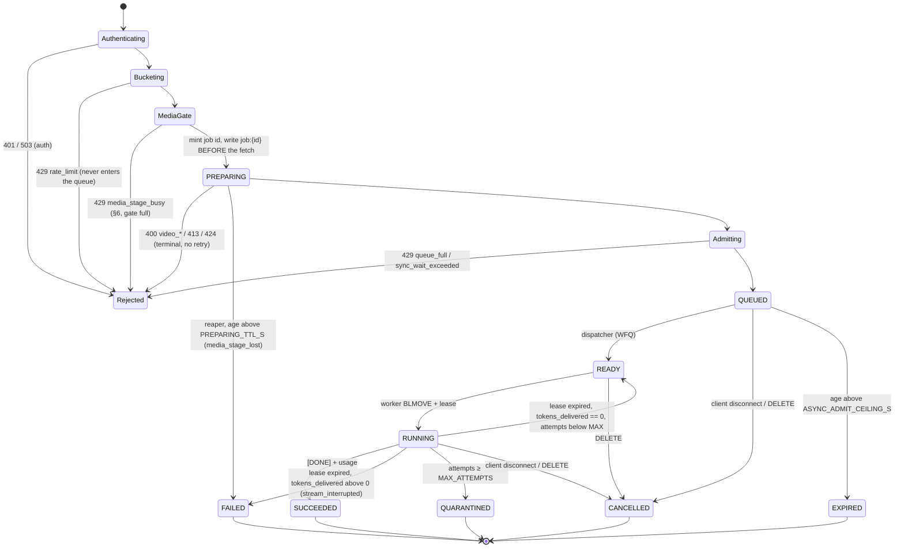
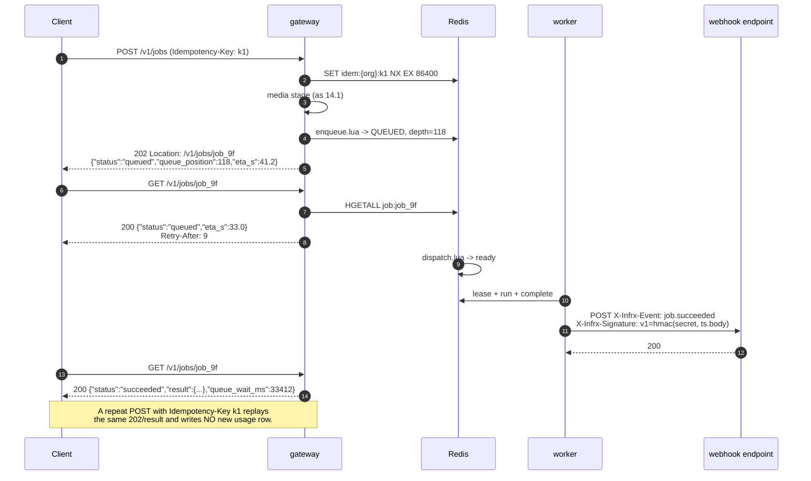
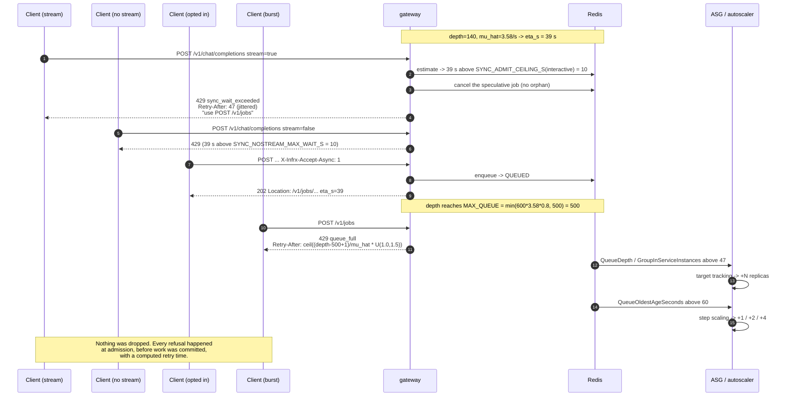
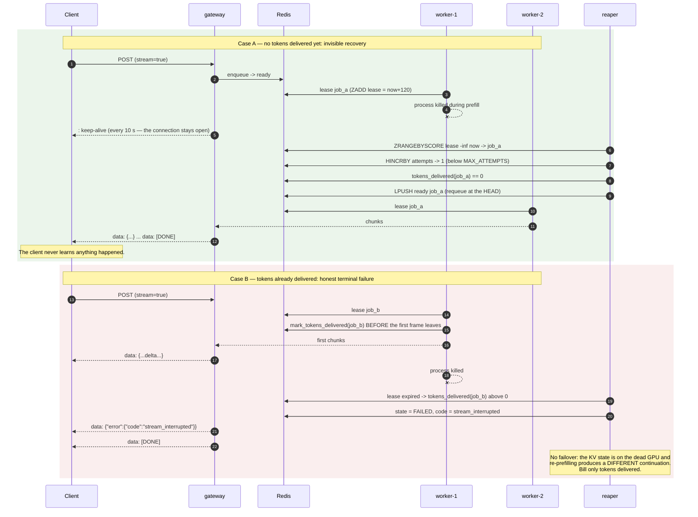

# Implementation spec — gateway v2, worker, queue, transcode

**Spec date: 2026-09-20.** This is an *engineering* document, not a research
document: everything here is a decision, a signature, a key name, a number, or a
test. It is written to be implemented without further research.

It **links and never re-derives**. Where a number appears, it is either measured
in this repo (cited), pinned in a sibling research document (cited), or marked
**⚠️ TO BE VERIFIED** with the experiment that closes it.

| Where a claim came from | Read |
|---|---|
| Admission, queueing, backpressure, retries, leases, the overload staircase | [`03-request-handling-and-queueing.md`](03-request-handling-and-queueing.md) |
| Scaling signals, ASG/EKS mechanics, capacity scarcity, cold start, drain | [`04-autoscaling-and-capacity.md`](04-autoscaling-and-capacity.md) |
| Where the time actually goes, transcode, vLLM flags, instance sizing, SLOs | [`06-throughput-and-latency-optimization.md`](06-throughput-and-latency-optimization.md) |
| Caching layers and the tenant-isolation rules on them | [`05-caching.md`](05-caching.md) |
| Requirements, traffic model, unit economics | [`01-requirements-and-traffic-model.md`](01-requirements-and-traffic-model.md), [`08-cost-model-and-unit-economics.md`](08-cost-model-and-unit-economics.md) |
| Engine-internal queues, status codes, the multimodal concurrency wall | [`../scaling/03-concurrency-and-admission-control.md`](../scaling/03-concurrency-and-admission-control.md) |
| Measured numbers | [`models/marlin2b/results/notes.md`](../../models/marlin2b/results/notes.md), [`models/marlin2b/README.md`](../../models/marlin2b/README.md) |
| Prices | [`../cross-cutting/cloud-pricing.md`](../cross-cutting/cloud-pricing.md) (⚠️ still has **no `g6e` row**; `g6e.2xlarge` = **$2.24208/h** is pinned in [`01` §3.8–3.9](01-requirements-and-traffic-model.md)) |
| The code being replaced | [`apps/infrx-api/gateway.py`](../../apps/infrx-api/gateway.py) (481 lines at `0952ca2`), [`apps/infrx-api/tests/test_media.py`](../../apps/infrx-api/tests/test_media.py), [`apps/infrx-api/deploy/`](../../apps/infrx-api/deploy/) |

### The five rules this spec is built on

1. **A request we accept is never lost.** It completes, or it fails with a
   terminal explained error. A request we cannot promise is refused *at
   admission*, before work is committed, with a computed `Retry-After` and a
   pointer to the async contract ([`03` §1.1](03-request-handling-and-queueing.md)).
2. **Queue centrally, pull from workers.** Late binding; a dead worker loses a
   lease, not a request ([`03` §6.1–6.2](03-request-handling-and-queueing.md)).
3. **Three limits, not one**: engine `--max-num-seqs` = N, per-worker dispatch
   gate = N + B, central burst queue = hundreds
   ([`03` §3.2](03-request-handling-and-queueing.md)).
4. **Transcode before the GPU box sees the bytes**, content-addressed. Worth a
   measured 1.57 → 3.58 clips/s on 1080p sources
   ([`notes.md` finding 7](../../models/marlin2b/results/notes.md), meas.
   2026-09-19).
5. **Single-box mode must keep working.** `REDIS_URL` unset ⇒ in-process queue,
   worker as a task in the gateway process, no network. This is the same
   degenerate-mode discipline `SUPABASE_URL`-unset already has, and
   [`tests/test_gateway_auth.py`](../../apps/infrx-api/tests/test_gateway_auth.py)
   depends on it.

### Decisions this spec makes that the research left open

Four places where the research documents disagree or flagged "reconcile before
implementation". An implementer needs one answer, so here it is, with the
reasoning and a pointer back.

| # | Conflict | Decision |
|---|---|---|
| D1 | Fetch timeout: [`01` F4](01-requirements-and-traffic-model.md) says connect 3 s / total 20 s / ≤3 redirects; [`03` §3.4](03-request-handling-and-queueing.md) says `FETCH_TIMEOUT_S = 30`. Flagged for reconciliation in `03`'s verification log, contradiction 4 | **Take `01`'s numbers**: `FETCH_CONNECT_TIMEOUT_S=3`, `FETCH_TIMEOUT_S=20`, `FETCH_MAX_REDIRECTS=3`. `03` never defended 30; 20 s is the tighter bound on a hostile-URL tarpit and still 26× the p50 fetch of a 5.5 MB clip on a 5 Gbps link |
| D2 | Transcode geometry: [`03` §4.2](03-request-handling-and-queueing.md) scales to **448 px short edge**, [`06` §2.2](06-throughput-and-latency-optimization.md) to **448 px longest edge**. On a 16:9 source these differ by 3.1× in pixels per frame | **Neither. Scale to the model's own budget**: ≤ **200,704 px per frame**, aspect preserved, never upscaled (§6.2). 448×448 = 200,704 exactly, which is where both numbers came from; for non-square sources the pixel budget is the constraint the processor actually applies (`size.longest_edge = frames × 200,704`, [`notes.md` finding 3](../../models/marlin2b/results/notes.md)). Short-edge-448 overshoots the budget 1.78× on 16:9; longest-edge-448 undershoots 0.56× and throws away resolution the model would have used |
| D3 | `WORKER_BUDGET_VIDEO_SECONDS = 80` < `MAX_VIDEO_SECONDS = 120`, so the largest legal request can never be admitted ([`03` §3.2](03-request-handling-and-queueing.md), flagged ⚠️ in place) | **`WORKER_BUDGET_VIDEO_SECONDS = 120`**, plus an explicit carve-out: a job always admits to a worker with zero in-flight video-seconds, whatever its size. The two agree — a 120 s clip is ~23.5 K tokens against a 32,768-token window, i.e. N = 1 by model length anyway |
| D4 | `--max-num-seqs` is **32** in [`marlin2b-vllm.service`](../../apps/infrx-api/deploy/marlin2b-vllm.service); `MAX_INFLIGHT` is **16** in the gateway; the only concurrency ever benchmarked is **8** ([`03` §3.2](03-request-handling-and-queueing.md), [`04` §6.3](04-autoscaling-and-capacity.md), [`06` §3.2](06-throughput-and-latency-optimization.md) all flag it) | **Ship with `ENGINE_MAX_NUM_SEQS = 8`, `WORKER_CONCURRENCY = 10` (= N + 2)** — the measured point plus llm-d's B — and treat both as re-pinned by the step-load sweep in §12.4. Keep 32 in the unit file only until that sweep runs; it is not a measurement, it is a leftover |

---

## 1. Module layout

```
apps/infrx-api/
  gateway/
    __init__.py
    app.py              FastAPI app factory, lifespan, middleware, routes wiring
    auth.py             api_keys lookup + cache (lifted verbatim from gateway.py)
    admission.py        buckets → idempotency → estimate → enqueue → contract choice
    endpoints_chat.py   POST /v1/chat/completions   (sync + SSE)
    endpoints_jobs.py   POST /v1/jobs, GET/DELETE /v1/jobs/{id}, /events
    endpoints_meta.py   GET /v1/models, /livez, /readyz, /health, /metrics
    endpoints_uploads.py POST /v1/uploads (presigned S3 PUT)
    sse.py              keep-alive wrapper + with_cancellation (vLLM's pattern)
    dispatcher.py       WFQ pop -> ready list; runs only where ROLE includes "gateway"
    reaper.py           lease expiry -> requeue / fail / quarantine; leader-elected
  worker/
    __init__.py
    loop.py             lease -> run -> ack/nack; heartbeat; drain
    vllm_client.py      streaming relay, stall timers, <think> strip, usage extract
    canary.py           synthetic 1-token generation for /readyz
  queue/
    __init__.py         Queue protocol (the only interface the rest imports)
    redis_queue.py      Redis/Valkey implementation (§3)
    memory_queue.py     in-process asyncio implementation, REDIS_URL unset (§3.6)
    estimate.py         mu-hat / s-hat EWMA, ETA, Retry-After, MAX_QUEUE
    buckets.py          per-org token buckets (requests/min, video-seconds/min), Lua
    idempotency.py      Stripe semantics (§4.7)
    scripts/            *.lua, loaded by SCRIPT LOAD at startup
  media/
    __init__.py
    fetch.py            SSRF-guarded streaming fetch with a byte cap (§6.1)
    probe.py            ffprobe on a bounded executor (§6.3)
    transcode.py        the one ffmpeg invocation (§6.2)
    cache.py            L1 NVMe LRU + L2 S3 + Redis index (§6.4)
    budget.py           budget_kwargs(), quantised (§6.5) — lifted from gateway.py
  shared/
    __init__.py
    config.py           every knob in §8, one place, env-driven, frozen dataclass
    ids.py              job ids, request hashing, content hashing
    models.py           Job, JobState, MediaRef, Usage — plain dataclasses
    metrics.py          prometheus_client registry + the names in §10
    usage.py            usage_events queue + jsonl spill (lifted from gateway.py)
    errors.py           InfrxError hierarchy -> (status, type, code, retry_after)
    log.py              structured JSON log lines with job_id/org_id
  deploy/
    marlin2b-gateway.service    + TimeoutStopSec=930, MemoryMax
    marlin2b-worker.service     NEW
    marlin2b-vllm.service       --max-num-seqs re-pinned (D4)
    Caddyfile                   + stream_timeout (06 §6.2); deleted at ALB cutover
    install.sh                  shrinks; ROLE selects which units are enabled
    replay_usage.py             unchanged
  tests/
    test_gateway_auth.py        unchanged, must keep passing with no env vars
    test_admission.py           §12.1
    test_queue_contract.py      §12.1 — same suite run against both queue impls
    test_media.py               §12.1
    test_integration_fake_vllm.py §12.2
    fake_vllm.py                the fake engine (§12.2)
  loadtest/
    arrival.py                  open-loop load generator (§12.3)
```

**Why this split and not fewer files.** The only structural requirement is that
`worker/` can run on a *different machine* from `gateway/`
([`03` §7.1](03-request-handling-and-queueing.md)); everything else follows from
that. `queue/__init__.py` exports a `Queue` protocol and nothing else imports
`redis_queue` or `memory_queue` directly, so the single-box path and the fleet
path are the same code with a different constructor. `shared/` is imported by
both processes and must have no FastAPI and no Redis import at module scope.

**`ROLE`** (env, default `gateway,worker,dispatcher,reaper`) selects which
background tasks a process starts. One box: everything in one process. A fleet:
gateway boxes run `gateway,dispatcher,reaper`, GPU boxes run `worker`.

**Lifted verbatim, do not rewrite.** `authenticate()` / `touch()` /
`_keys` (gateway.py:78–121), `cost()` / `get_prices()` / `spill()` / `ingest()` /
`enqueue()` (gateway.py:124–190), `THINK` and its streaming strip logic
(gateway.py:76, 463–472 — [`06` §6.3](06-throughput-and-latency-optimization.md)
verified it correct and O(1)), `budget_kwargs()` (gateway.py:199–203 —
[`notes.md` finding 3](../../models/marlin2b/results/notes.md) verified it
reproduces the training grid). These are working, tested code; moving them into
modules is a `git mv`, not a redesign. Two exceptions to "verbatim": `_keys` /
`_last_used` (gateway.py:79–80) gain LRU bounds and the legacy-key comparison at
gateway.py:87 gains `hmac.compare_digest`, per [`09` §6.6](09-blueprint.md).
`fetch_video()` / `resolve_public()` / `address_allowed()` / `video_mime()`
(gateway.py:206–293) are also lifted, with the three §6.1 changes.

---

## 2. Data structures

`shared/models.py`. Plain dataclasses, `slots=True`, no ORM, no pydantic except
at the HTTP boundary (FastAPI already does that).

```python
class JobState(str, Enum):
    PREPARING  = "preparing"    # in the pre-admission media stage (§6); written
                                # BEFORE the source fetch opens, so the request has
                                # a durable record from the first byte (09 §2.1 D1,
                                # 09 §2.8). Never billed.
    QUEUED     = "queued"       # in a WFQ tenant list
    READY      = "ready"        # dispatched to the ready list, awaiting a lease
    RUNNING    = "running"      # leased by a worker
    SUCCEEDED  = "succeeded"
    FAILED     = "failed"
    CANCELLED  = "cancelled"    # client hung up or DELETE /v1/jobs/{id}
    EXPIRED    = "expired"      # aged past ASYNC_ADMIT_CEILING_S while queued
    QUARANTINED = "quarantined" # killed >= MAX_ATTEMPTS workers (03 §5.4)

TERMINAL = {SUCCEEDED, FAILED, CANCELLED, EXPIRED, QUARANTINED}

@dataclass(slots=True)
class MediaRef:
    sha256: str            # of the SOURCE bytes — the cache key everywhere
    duration_s: float      # ffprobe, of the source (== transcoded, after -t)
    frames: int            # clamp(round(duration*2), 4, 240), even (budget.py)
    cache_path: str        # L1: /opt/dlami/nvme/cache/{h[:2]}/{h}.mp4
    s3_key: str | None     # L2: transcoded/{h}.mp4
    bytes_out: int
    mm_kwargs: dict        # budget_kwargs(duration), quantised (§6.5)
    hit: Literal["miss", "l1", "l2", "index"]   # -> usage_events.cached

@dataclass(slots=True)
class Job:
    id: str                # "job_" + uuid4().hex + "." + hmac(JOB_ID_KEY,uuid)[:16]
                           # the HMAC suffix makes "did we issue this?" answerable
                           # with no stored state, which is what §11 F28 needs;
                           # usage_events.id is the uuid half (03 §2.7)
    org_id: str | None     # None for the legacy GATEWAY_API_KEY path
    api_key_id: str | None
    model: str             # "nemostation/marlin-2b"
    band: int              # 100 interactive | 0 standard | -10 free
    body: dict             # the OpenAI request, video part rewritten to the cache ref
    media: MediaRef | None
    stream: bool
    contract: Literal["sync", "async"]
    idem_key: str | None
    request_hash: str      # sha256(canonical_json(body minus "stream"))
    webhook: dict | None   # {"url": ..., "secret": ...}
    state: JobState
    attempts: int
    worker: str | None
    enqueued_at: float     # unix seconds, the clock for queue age and expiry
    started_at: float | None
    finished_at: float | None
    eta_s_predicted: float # what we told the client at admission (03 §2.4)
    tokens_delivered: int  # the retry-safety flag (03 §5.1): >0 means no failover
    result: dict | None    # the final OpenAI completion object
    error: dict | None     # {"type","code","message"}
```

**Invariants the implementation must hold, and a test must assert:**

- `tokens_delivered > 0` ⇒ the job may never be requeued (§5, §12.1-Q6).
- Exactly one `usage_events` row per **job id**, whatever `attempts` is
  ([`03` §2.7](03-request-handling-and-queueing.md)).
- `state` only moves forward through §5's state machine; a transition into a
  terminal state is a compare-and-set, so two racing writers cannot both win.
- `media.sha256` is the hash of the **source** bytes, never the transcoded
  bytes: the transcoded output depends on the ffmpeg version, the source does
  not, and a cache keyed on the output would miss on every ffmpeg upgrade.

---

## 3. Queue: Redis key schema

Primary store is **Redis / ElastiCache Valkey**, one logical queue per model,
with the dispatcher in the gateway
([`03` §2.1](03-request-handling-and-queueing.md) argues this against SQS at
length; §3.7 below is the SQS mapping for the async tier if we ever take it).

### 3.1 Keys

| Key | Type | TTL | Contents | Written by |
|---|---|---|---|---|
| `q:{model}:{band}:{org}` | LIST | — | job ids, `RPUSH` tail / `LPOP` head, FIFO within a tenant | admission |
| `q:{model}:{band}:active` | ZSET | — | org → virtual finish time (WFQ, §3.3) | admission, dispatcher |
| `q:{model}:ready` | LIST | — | dispatched, awaiting `BLMOVE` by a worker | dispatcher |
| `q:{model}:leased:{worker}` | LIST | — | this worker's in-flight job ids | worker (via `BLMOVE`) |
| `lease:{model}` | ZSET | — | job id → lease expiry, unix seconds | worker, reaper |
| `job:{id}` | HASH | 24 h | the `Job` fields, JSON-encoded per field | everyone |
| `job:{id}:stream` | STREAM | 1 h | SSE chunks, `MAXLEN ~ 4096` | worker |
| `svc:{model}` | HASH | — | `mu_ewma`, `s_ewma:{bucket}`, `lambda_ewma`, `resid_ewma` | worker on completion |
| `tb:{org}` | HASH | 1 h | token bucket `{req_tokens, vs_tokens, ts}` | buckets.lua |
| `idem:{org}:{key}` | STRING | 24 h | `{job_id}:{request_hash}` | admission |
| `mm:{sha256}` | HASH | 7 d | transcode cache index: `duration_s, frames, bytes, s3_key, mm_kwargs` | media |
| `mm:lock:{sha256}` | STRING | 120 s | `SET NX` single-flight on transcode (§6.4) | media |
| `workers` | HASH | — | worker id → `{state, budget, inflight_vs, last_seen, l1_hashes_card}` | worker heartbeat |
| `lock:reaper` | STRING | 30 s | `SET NX EX 30` leader election | reaper |
| `lock:dispatch:{model}` | STRING | 10 s | `SET NX EX 10` — one dispatcher per model | dispatcher |

Key namespace is prefixed by `REDIS_PREFIX` (default `infrx:`) so a shared
ElastiCache can host staging and prod.

### 3.2 Why a ZSET for leases and a LIST for `ready`

`BLMOVE` is the primitive: *"Pops an element from a list, pushes it to another
list and returns it. Blocks until an element is available otherwise"*, O(1),
since 6.2.0 [src](https://redis.io/docs/latest/commands/blmove/). The
destination is the worker's own lease list, so a crash **between** the pop and
the `ZADD lease` still leaves the job discoverable in `q:{model}:leased:{worker}`
— that window is why the reaper also scans lease lists of workers whose
`workers` hash entry has gone stale (§7.5).

`ready` stays short — high-water `Σ workers × WORKER_CONCURRENCY` — so ordering
decisions stay late. Everything behind `ready` is still re-orderable, which is
the whole point of holding the burst centrally
([`03` §6.2](03-request-handling-and-queueing.md)).

### 3.3 WFQ, in the two Lua scripts that matter

Fairness is **by predicted service time, not request count**: Marlin requests
vary **11.4×** in prompt tokens between a 10 s and a 120 s clip (2,061 vs
~23.5 K, [`03` §2.3](03-request-handling-and-queueing.md), recomputed there).

`enqueue.lua` — KEYS: active zset, tenant list, job hash; ARGV: org, job_id,
predicted_service_s, weight, now, job JSON, max_queue, max_queue_bytes.

```lua
-- returns {admitted, depth, position} ; admitted=0 means the caller must 429
local depth = tonumber(redis.call('GET', KEYS[4])) or 0        -- q:{m}:depth counter
if depth + 1 > tonumber(ARGV[7]) then return {0, depth, 0} end
local v = tonumber(redis.call('ZSCORE', KEYS[1], ARGV[1])) or 0
v = math.max(v, tonumber(ARGV[5])) + tonumber(ARGV[3]) / tonumber(ARGV[4])
redis.call('ZADD', KEYS[1], v, ARGV[1])
redis.call('RPUSH', KEYS[2], ARGV[2])
redis.call('HSET', KEYS[3], 'job', ARGV[6], 'state', 'queued')
redis.call('INCR', KEYS[4])
return {1, depth, redis.call('LLEN', KEYS[2])}
```

`dispatch.lua` — strict priority across bands, smallest virtual time within a
band, in one round trip:

```lua
-- KEYS: ready list ; ARGV: model, bands..., ready_high_water
if redis.call('LLEN', KEYS[1]) >= tonumber(ARGV[#ARGV]) then return nil end
for i = 2, #ARGV - 1 do
  local band = ARGV[i]
  local act  = 'q:'..ARGV[1]..':'..band..':active'
  local org  = redis.call('ZRANGE', act, 0, 0)[1]
  if org then
    local id = redis.call('LPOP', 'q:'..ARGV[1]..':'..band..':'..org)
    if id then
      if redis.call('LLEN', 'q:'..ARGV[1]..':'..band..':'..org) == 0 then
        redis.call('ZREM', act, org)
      end
      redis.call('RPUSH', KEYS[1], id)
      return id
    else
      redis.call('ZREM', act, org)                 -- stale tenant entry
    end
  end
end
return nil
```

Strict priority starves `free` under sustained overload. That is the intent, and
it is why `free` carries a lower `ASYNC_ADMIT_CEILING_S` so its requests are
refused at admission rather than aging forever
([`03` §2.3](03-request-handling-and-queueing.md)).

### 3.4 Wait estimation

`queue/estimate.py`, from `svc:{model}`:

```
mu_hat      EWMA of completions/s across healthy workers,  alpha = 0.1, 5 s ticks
s_hat[b]    EWMA of service time by duration bucket b in {<=15s, <=45s, <=120s}
resid       EWMA of E[S^2]/(2E[S]); seed at 0.5 * s_hat (exponential assumption)
mu_boot     sum over workers in state 'booting' of  X_replica * P(ready before my ETA)

eta_s = depth_ahead / max(mu_hat + mu_boot, EPS) + resid
```

Seed values at first boot, from the measured table
([`notes.md` finding 7](../../models/marlin2b/results/notes.md), meas.
2026-09-19; [`04` §1.2](04-autoscaling-and-capacity.md) calls this
`X_replica`):

| seed | value | basis |
|---|---|---|
| `mu_hat` per worker, pre-transcode | **1.57** clips/s | c=8, 1080p source |
| `mu_hat` per worker, post-transcode | **3.58** clips/s | c=8, 360p source, same token budget |
| `s_hat[<=15s]` | **5.10 s** | 8 / 1.57, est. in [`03` §0.1](03-request-handling-and-queueing.md) |
| `resid` | **2.55 s** | 0.5 × s_hat — ⚠️ **TO BE VERIFIED**, the service-time *distribution* is unmeasured ([`03` §2.4](03-request-handling-and-queueing.md)). Replace with measured `E[S²]/(2E[S])` after one week of `usage_events` |

`s_hat[<=45s]` and `s_hat[<=120s]` have **no seed and no measurement** —
mixed-length concurrency has never been benchmarked
([`notes.md` "Open"](../../models/marlin2b/results/notes.md)). Seed them by
linear extrapolation on duration (`s_hat[b] = s_hat[<=15s] × b_mid / 10`) and
mark every ETA that uses them `"eta_confidence": "low"` in the response body
until §12.4 experiment 2 runs. ⚠️ **TO BE VERIFIED.**

**Grade the estimate.** `usage_events` gains `eta_s_predicted` and
`queue_wait_ms`; the dashboard tile is `p90(|predicted − actual|)`. An ETA
nobody checks becomes a lie within a month
([`03` §2.4](03-request-handling-and-queueing.md)).

### 3.5 Admission arithmetic

```
promised(r)     = eta_s + own_cost / mu_hat            # what we would be signing up for

admit sync  if promised <= min( SYNC_MAX_WAIT_S (or SYNC_NOSTREAM_MAX_WAIT_S),
                                SYNC_ADMIT_CEILING_S(band) )
admit async if promised <= ASYNC_ADMIT_CEILING_S(band)
else 429 queue_full

MAX_QUEUE(band) = min( floor(ASYNC_ADMIT_CEILING_S(band) * mu_hat * QUEUE_SAFETY),
                       MAX_QUEUE_HARD )
retry_after     = ceil( (depth - MAX_QUEUE + 1) / mu_hat * uniform(1.0, 1.5) )
```

Two ceilings because the surfaces cost different things: `SYNC_ADMIT_CEILING_S`
is the tier's queue-wait p99 ([`09` §2.3](09-blueprint.md)) and bounds how long a
*socket* may be held — 10 s on `interactive`, so `SYNC_MAX_WAIT_S = 30` never
binds for that band. `ASYNC_ADMIT_CEILING_S` bounds how long a *job* may sit, and
is also the age-out in §4.4/§5. `MAX_QUEUE` derives from the async ceiling, since
that is the longest promise the queue has to hold. **A 429 counts against the
admission-success SLO** ([`09` §2.5](09-blueprint.md)): an SLO p99 used as a hard
admission cap makes the queue-wait SLO true by construction, so the only place a
too-tight ceiling can show up is the 429 rate — never let the queue-wait tile be
read without the admission-success tile next to it.

`QUEUE_SAFETY = 0.8`, `MAX_QUEUE_HARD = 500`, `MAX_QUEUE_BYTES = 256 MiB` —
llm-d's `maxRequests`/`maxBytes` exist for exactly this reason: *"static bounds
intended to manage host memory pressure and protect the Gateway proxy from
running out of memory during extreme traffic bursts"*, with their own defaults
`maxRequests: 200`, `maxBytes: "10Gi"`
[src](https://github.com/llm-d/llm-d/blob/main/guides/flow-control/tuning.md).

The **server-side jitter is not optional**: a constant `Retry-After: 2` — what
`gateway.py:377` returns today — synchronises every rejected client into a
thundering herd exactly 2 s later.

### 3.6 In-process mode (`REDIS_URL` unset)

`memory_queue.py` implements the same `Queue` protocol with `asyncio` primitives:
`deque` per `(band, org)`, a heap for the WFQ active set, `asyncio.Queue` for
`ready`, a dict for leases with an `asyncio` timer instead of the reaper scan.
Same Lua semantics, no Lua. The contract test suite (§12.1) runs against **both**
implementations unchanged; that is the only thing keeping them honest.

Loses: durability across restart, multi-worker. Keeps: every contract in §4,
§5, §6, §9. This is the shape that ships first (§13 phase 1).

### 3.7 SQS mapping, if the async tier ever moves

Not the plan — [`03` §2.1](03-request-handling-and-queueing.md) rejects SQS
because we need priority, fairness, position reporting and wait estimation, none
of which SQS exposes. Recorded so the mapping is not re-derived later:

| Redis object | SQS equivalent | Constraint that binds |
|---|---|---|
| `q:{model}:ready` | one standard queue `infrx-{model}-ready` | message ≤ **1 MiB**, so the envelope must carry an S3/cache *handle*, never bytes [src](https://docs.aws.amazon.com/AWSSimpleQueueService/latest/SQSDeveloperGuide/quotas-messages.html) |
| `lease:{model}` ZSET + `LEASE_TTL_S` | visibility timeout | default 30 s, max 12 h — set it to `LEASE_TTL_S` = 120 |
| heartbeat `ZADD` | `ChangeMessageVisibility` | same cadence, `LEASE_TTL_S / 3` |
| WFQ by org | `MessageGroupId` = org, **fair queues** | needs ≥30 in-flight messages per tenant to fire the concurrency-share detector; at one worker we have 8 total, so it cannot work below ~4 workers [src](https://docs.aws.amazon.com/AWSSimpleQueueService/latest/SQSDeveloperGuide/sqs-fair-queues-detailed.html) |
| bands | three queues, polled in priority order | no in-queue priority exists |
| `MAX_QUEUE` | `ApproximateNumberOfMessages` + our own check | standard queues cap at ~120,000 in-flight and long polling returns *nothing* rather than an error at the cap |

---

## 4. HTTP API

Base URL `https://marlin2b.callbill.ai`. All bodies are JSON; all errors use the
OpenAI error envelope already in `gateway.py`:

```json
{"error": {"message": "...", "type": "rate_limit_error", "code": "queue_full",
           "param": null, "infrx": {"retry_after_s": 7, "eta_s": 41.2,
                                    "queue_position": 118, "job_id": "job_..."}}}
```

`type` stays within OpenAI's set (`invalid_request_error`,
`authentication_error`, `rate_limit_error`, `server_error`) so SDK error classes
map; `code` and `infrx` are ours and additive.

### 4.1 Headers

| Header | Direction | Meaning |
|---|---|---|
| `Authorization: Bearer <key>` | in | unchanged |
| `Idempotency-Key: <≤255 chars>` | in | Stripe semantics, §4.7. All POSTs accept it |
| `X-Infrx-Accept-Async: 1` | in | client can parse a `202` from `/v1/chat/completions`. Without it we never change the contract under a client that cannot parse it |
| `X-Infrx-Priority: interactive\|standard\|free` | in | request a band; capped by the org's entitlement, never raised by the client |
| `Inference-Id: <job id>` | out | unchanged name, now always equal to the job id and to `usage_events.id` |
| `X-Infrx-Queue-Position` | out | depth ahead at admission |
| `X-Infrx-ETA-Seconds` | out | `eta_s` at admission |
| `X-Infrx-Cache: miss\|l1\|l2\|index` | out | media cache outcome (§6.4) |
| `Server-Timing: fetch;dur=…, probe;dur=…, xcode;dur=…, queue;dur=…, ttft;dur=…` | out | W3C spec, renders natively in devtools [src](https://www.w3.org/TR/server-timing/); [`06` §1.5a](06-throughput-and-latency-optimization.md) |
| `Retry-After` | out | on 429/503 only, seconds, jittered server-side |
| `Idempotency-Replayed: true` | out | §4.7 |

### 4.2 `POST /v1/chat/completions` — the synchronous contract

Unchanged OpenAI request body, plus two optional additions, both ignorable:

```jsonc
{
  "model": "nemostation/marlin-2b",
  "messages": [{"role": "user", "content": [
      {"type": "video_url", "video_url": {"url": "https://… | data:… | infrx://upload/<sha256>"}},
      {"type": "text", "text": "Describe the video."}]}],
  "stream": true,
  "max_tokens": 2048,          // now ENFORCED at MAX_OUTPUT_TOKENS (it is documented
                               // in openrouter/PLAN.md but not enforced in gateway.py
                               // today — 04 §4.1 flags exactly this)
  "infrx": {                   // optional, ignored by OpenAI SDKs
    "webhook": {"url": "https://…", "secret": "whsec_…"},
    "eta_confidence_required": "high"   // 429 rather than guess (§3.4)
  }
}
```

**Response selection.** The table below needs `eta_s`, and `eta_s` does not
exist until the media stage has landed (§6) — on a cache miss that is up to
**90 s** (§5.1). So the table is *not* the first thing that can answer the
client. Two rows run **before** it, and they are the mechanism behind
[`09` §2.1](09-blueprint.md)'s D1:

| Condition | Response |
|---|---|
| media-stage gate full (`media_inflight ≥ MEDIA_STAGE_CONCURRENCY` **and** `media_waiting ≥ MEDIA_STAGE_QUEUE_MAX`, §6) | `429` `code=media_stage_busy`, `Retry-After = ceil((media_waiting+1)/MEDIA_STAGE_CONCURRENCY × t̂_media × U(1.0,1.5))`. Refused **before** the fetch opens: no socket, no temp file, no job row |
| media stage still running at `t = MEDIA_DECISION_S` (2 s) and `stream=true` | `200`, `text/event-stream`, opened immediately with `: {"state":"preparing","job_id":"job_…"}` then `: keep-alive` every `SSE_KEEPALIVE_S`. The table below runs on the same stream when the stage lands |
| media stage still running at `t = MEDIA_DECISION_S` and `stream=false` | `202` + `Location: /v1/jobs/{id}`, job in `preparing`. The stage **keeps running**; the client polls. Fires by default, on the same `async_upgrade_enabled` that [`09` §0.2 R6](09-blueprint.md) already defaults **on**. On a key with it `false`: no 202 — hold the connection, D1 degrades to the durable `preparing` record, and the §5.1 ladder is the only bound ([`09` §2.1](09-blueprint.md)) |

The job id in both rows is real because §6 mints it and writes `job:{id}` with
`state=preparing` **before** the fetch — a 202 we could not honour after a
restart would be a worse lie than silence.

Then, once the media stage has landed and `eta_s` is real
([`03` §1.5](03-request-handling-and-queueing.md)):

| Condition | Response |
|---|---|
| `eta_s ≤ min(SYNC_MAX_WAIT_S, SYNC_ADMIT_CEILING_S(band))` and `stream=true` | `200`, `text/event-stream`, keep-alives every `SSE_KEEPALIVE_S` from the moment of enqueue. On `interactive` the binding term is the ceiling, **10 s**, not the 30 s stream cap |
| `eta_s ≤ min(SYNC_NOSTREAM_MAX_WAIT_S, SYNC_ADMIT_CEILING_S(band))` and `stream=false` | `200`, plain JSON |
| `eta_s ≤ ASYNC_ADMIT_CEILING_S(band)` and `X-Infrx-Accept-Async: 1` | `202` + `Location: /v1/jobs/{id}` |
| `eta_s ≤ ASYNC_ADMIT_CEILING_S(band)`, no opt-in | `429` `code=sync_wait_exceeded`, body points at `/v1/jobs`, `Retry-After` = jittered `eta_s`. The job we speculatively enqueued is cancelled before we return — never leave an orphan |
| `eta_s > ASYNC_ADMIT_CEILING_S(band)` or `depth ≥ MAX_QUEUE` | `429` `code=queue_full`, `Retry-After` = drain estimate. Counted against the admission-success SLO ([`09` §2.5](09-blueprint.md)) — a ceiling set too tight surfaces here, not in the queue-wait percentile |
| over token bucket | `429` `code=rate_limit`, `Retry-After` from bucket refill; **never enters the queue** |
| Redis unreachable | `503` `code=queue_unavailable`, `Retry-After: 5`. Fail closed — never a 200 we cannot honour |
| Supabase unreachable, key uncached | `503` — unchanged behaviour (gateway.py:102–104) |

**Streaming wire format.** Standard OpenAI SSE, with two additions that every
compliant client ignores because they are *comment* lines
([MDN](https://developer.mozilla.org/en-US/docs/Web/API/Server-sent_events/Using_server-sent_events):
*"The comment line can be used to prevent connections from timing out; a server
can send a comment periodically to keep the connection alive"*):

```
: {"queue_position":7,"eta_s":11.2,"state":"queued"}

: keep-alive

: {"queue_position":0,"state":"running"}

data: {"id":"job_9f…","object":"chat.completion.chunk","model":"nemostation/marlin-2b",
       "choices":[{"index":0,"delta":{"content":"A white bus"}}]}

data: {"id":"job_9f…","usage":{"prompt_tokens":2061,"completion_tokens":197,
       "total_tokens":2258}}

data: [DONE]
```

`id` on every chunk is the **job id**, not a fresh `chatcmpl-…` — one identifier
for the request, the header, the billing row and the support ticket.

An error after the stream has opened is a terminal SSE frame, never a hung
stream ([`03` §5.2](03-request-handling-and-queueing.md)):

```
data: {"error":{"type":"server_error","code":"stream_interrupted",
       "message":"the worker serving this request was lost; partial output above is final"}}

data: [DONE]
```

### 4.3 `POST /v1/jobs` — the asynchronous contract

Same body. Always `202`:

```json
{"id": "job_9f…", "object": "infrx.job", "status": "queued",
 "model": "nemostation/marlin-2b", "queue_position": 41, "eta_s": 26.1,
 "eta_confidence": "high", "created_at": 1789…, "expires_at": 1789…,
 "url": "/v1/jobs/job_9f…", "events_url": "/v1/jobs/job_9f…/events"}
```

with `Location: /v1/jobs/job_9f…`.

### 4.4 `GET /v1/jobs/{id}`

```json
{"id": "job_9f…", "object": "infrx.job", "status": "succeeded",
 "queue_position": 0, "queue_wait_ms": 8123, "attempts": 1,
 "eta_s_predicted": 26.1, "cached": "l1",
 "result": { …the full OpenAI chat.completion object… },
 "usage": {"prompt_tokens": 2061, "completion_tokens": 197, "video_seconds": 10.1},
 "error": null, "created_at": …, "started_at": …, "finished_at": …}
```

`Retry-After` is set on non-terminal states to `max(1, ceil(eta_s / 4))` so a
polling client backs off proportionally instead of hammering at 1 Hz.

`404` for an unknown id **or an id belonging to another org** — never a 403,
which would confirm the id exists. Two flavours of 404, same status: if the id's
HMAC suffix (§2) verifies, we issued it and no longer have it, so the body carries
`job_lost` with a `Retry-After` and `infrx_admitted_lost_total` increments
(§11 F28); otherwise `not_found`, silently.

**Result retention: `RESULT_TTL_S` = 86400 (24 h), then the result field is
nulled and `status` stays.** ⚠️ This is a **product decision that is not yet
made**: [`apps/README.md` §4](../../apps/README.md) promises no prompt or video
content is stored anywhere, and the async contract necessarily stores the
completion until the client collects it
([`03` §1.4, Open questions](03-request-handling-and-queueing.md)). `/v1/jobs`
must not ship until that promise is reworded and a per-org override exists.

### 4.5 `GET /v1/jobs/{id}/events` — resumable SSE

Replays `job:{id}:stream` from `Last-Event-ID` (EventSource's own reconnection
mechanism, [MDN](https://developer.mozilla.org/en-US/docs/Web/API/Server-sent_events/Using_server-sent_events)),
then follows live. Each frame carries `id: <redis stream id>`.

This is also what makes a *sync* request survive a gateway restart: the client
reconnects with `Last-Event-ID` and picks up. Cost is one Redis stream write per
chunk batch; batch at `STREAM_BATCH_MS` = 50 ms to keep it cheap (at the measured
6–8 ms TPOT that is ~7 tokens per write).

### 4.6 The rest

| Method | Path | Behaviour |
|---|---|---|
| `DELETE` | `/v1/jobs/{id}` | queued ⇒ remove from the tenant list, `state=cancelled`, decrement depth. running ⇒ set `cancel` flag on `job:{id}`; the worker's relay checks it each chunk and closes the upstream stream. Returns `200` with the job. Idempotent |
| `POST` | `/v1/uploads` | `{"sha256":"…","bytes":5500000,"content_type":"video/mp4"}` → `{"url":"<presigned PUT>","handle":"infrx://upload/<sha256>","expires_at":…}`. Kills the base64 path (33 % wire overhead, whole clip pinned in gateway memory) and **removes the SSRF surface entirely** for clients that use it ([`03` §1.4](03-request-handling-and-queueing.md)). We verify the digest on first read; a mismatch is `400 upload_digest_mismatch` |
| `GET` | `/v1/models` | unchanged — OpenRouter provider document, plus `limits: {max_video_seconds, max_video_mb, max_output_tokens, sync_max_wait_s, async_endpoint}` so clients can discover the contract |
| `GET` | `/livez` `/readyz` `/health` `/metrics` | §9, §10 |

### 4.7 Idempotency

Stripe's semantics wholesale [src](https://docs.stripe.com/api/idempotent_requests).
`request_hash = sha256(canonical_json(body without "stream"))`.

| Situation | Behaviour |
|---|---|
| header absent | unique request, no replay protection. Documented as such |
| key unseen | `SET idem:{org}:{key} "{job_id}:{hash}" NX EX 86400`; proceed |
| seen, same hash, job terminal | replay the stored status + body, `Idempotency-Replayed: true` |
| seen, same hash, job running, `stream=true` | attach to `job:{id}:stream` from offset 0 |
| seen, same hash, job running, async | return the same `202` |
| seen, **different** hash | `409` `code=idempotency_key_reuse` |
| `SET NX` lost the race | `409` `code=idempotency_conflict`, retryable |

**Streaming replay is served as the final completion in one `data:` frame plus
`[DONE]`** — we do not store token-by-token output for replay. ⚠️ This is a
behaviour no other API we know of documents
([`03` Open questions](03-request-handling-and-queueing.md)); check what
OpenAI/Anthropic do before committing it to the public docs.

A replayed request writes **no new usage row**; it increments
`infrx_idempotency_replay_total` instead.

### 4.8 Webhooks

Optional, at-least-once, polling remains the contract of record.

```
POST <webhook.url>
X-Infrx-Event: job.succeeded | job.failed | job.expired | job.quarantined
X-Infrx-Delivery: <uuid>
X-Infrx-Timestamp: <unix seconds>
X-Infrx-Signature: v1=<hex hmac_sha256(secret, f"{timestamp}.{raw_body}")>
```

Body is the §4.4 object. Retries at 1 s, 5 s, 25 s, 125 s, then dead-letter to
`usage_failed.jsonl`-style `webhook_failed.jsonl`. Timestamp is inside the signed
payload so a replayed delivery is detectable; receivers reject > 5 min skew.
Webhook URLs go through the **same SSRF guard as `video_url`** (§6.1) — an
unvalidated webhook URL is the same primitive with a friendlier name.

### 4.9 OpenAI compatibility notes

Things an implementer will otherwise get wrong:

1. **Never return `202` from `/v1/chat/completions` without
   `X-Infrx-Accept-Async: 1`.** The `openai` Python SDK will raise on a 202 body
   that is not a completion.
2. **`stream_options.include_usage` is forced true** upstream (gateway.py:401–402
   already does this) but the usage chunk is passed through only if the client
   asked for it. Otherwise we swallow it and report usage in our own row.
3. **`model` in the response is rewritten to `MODEL_ID`**, not vLLM's served
   name `marlin2b` (set on the way out at gateway.py:381; rewritten back at
   gateway.py:429 non-streaming and gateway.py:460 streaming). Keep it.
4. **The `<think>` strip applies to the first content chunk only**, with the
   subtle "did the first chunk even start with `<think>`" guard
   (gateway.py:463–472, the `stripped` flag). [`06` §6.3](06-throughput-and-latency-optimization.md)
   verified it correct; do not "simplify" it.
5. **`max_tokens` must now be enforced** at `MAX_OUTPUT_TOKENS = 2048`. It is
   documented in `openrouter/PLAN.md` and `client_example.py` but **not enforced
   in `gateway.py`** ([`04` §4.1](04-autoscaling-and-capacity.md)), which means
   today's worst-case drain time is unbounded. Over the limit ⇒ `400`.
6. **One video per request** stays (gateway.py:387–390), matching
   `--limit-mm-per-prompt '{"video":1,"image":4}'`.
7. **`n > 1` is rejected** `400` — it multiplies GPU cost invisibly and nothing
   in the product needs it.
8. **Unknown fields are ignored, not rejected**, except inside `infrx`.

---

## 5. Request state machine



`PREPARING` is the one state that exists for a reason outside the queue: it is
the **durable record of a request that has not been admitted yet**. `MediaGate`
and `Admitting` are transient — no job row survives them — but `PREPARING` is
written to Valkey before the source fetch opens, which is what makes
[`09` §2.1](09-blueprint.md)'s D1 ("a status **or** a durable 202 within
`MEDIA_DECISION_S`") implementable and what gives a gateway restart mid-stage
something to reap instead of a silently dropped request
([`09` §2.8](09-blueprint.md), F28 below). A `preparing` job is **never
billed**: it has no `usage_events` row until it reaches `QUEUED`.

### 5.1 The timeout ladder

A single 600 s timeout — what `gateway.py:71` has — cannot tell "the source URL
is a tarpit" from "the model is generating a long answer". Per phase
([`03` §3.4](03-request-handling-and-queueing.md), with D1 applied):

| Phase | Knob | Default | On breach | Retry? |
|---|---|---|---|---|
| Whole media stage, client-facing | `MEDIA_DECISION_S` | **2** | not an error: `202 + Location` (or SSE opened with `state:"preparing"`); the stage keeps running | n/a |
| Whole media stage, server-side | `PREPARING_TTL_S` | **120** | reaper ⇒ terminal `failed` `code=media_stage_lost`, never billed (§7.5) | yes — nothing was committed |
| Source fetch connect | `FETCH_CONNECT_TIMEOUT_S` | **3** | `400 video_fetch_failed` | yes, ×2 exp backoff |
| Source fetch total | `FETCH_TIMEOUT_S` | **20** | same | yes |
| Source fetch size | `MAX_VIDEO_MB` | 64 | `413 video_too_large`, aborted **mid-stream** | no |
| `ffprobe` | `PROBE_TIMEOUT_S` | **10** (30 today) | `400 video_unreadable` | no — bad input |
| Transcode | `TRANSCODE_TIMEOUT_S` | `max(15, 0.5 × duration)` | `500 transcode_failed` | once |
| Queue wait | `ASYNC_ADMIT_CEILING_S` | 600 / band | `504 job_expired`, counted as an SLO violation | client's call |
| Lease | `LEASE_TTL_S` | 120 | reaper requeues or fails (§7.5) | per §5.2 |
| Prefill / TTFT | `TTFT_TIMEOUT_S` | **60** | abort upstream | **yes, once, on another worker** — pre-prefill is safe |
| Inter-token gap | `TPOT_STALL_S` | **20** | abort upstream, `stream_interrupted` | **no** |
| Total generation | `GENERATION_TIMEOUT_S` | 300 | abort, bill tokens actually produced | no |
| Drain (SIGTERM) | `DRAIN_TIMEOUT_S` | 180 | release leases and exit | jobs requeue |

`TPOT_STALL_S = 20` is the important one and does not exist today: measured TPOT
at c=8 is **8 ms** ([`notes.md`](../../models/marlin2b/results/notes.md)), so a
20 s gap is 2,500× the norm and means the engine is wedged. 300 s of a wedged
engine holding a seat is worse than a clean failure.

The two new top rows exist because the four media rows **sum**, and on the
cache-miss path they run *before* `eta_s` exists:
`FETCH_TIMEOUT_S + PROBE_TIMEOUT_S + TRANSCODE_TIMEOUT_S = 20 + 10 +
max(15, 0.5 × 120) = 90 s` for the largest legal clip. `MEDIA_DECISION_S` caps
what the **client** waits without an answer (§4.2); `PREPARING_TTL_S = 120`
caps how long a `preparing` row may exist, and is set above 90 s so a slow but
legal stage is never reaped out from under itself.

### 5.2 The retry rule is **phase**, not status code

A request is safely retryable until the first output token has been delivered to
the client ([`03` §5.1](03-request-handling-and-queueing.md)). That is exactly
`Job.tokens_delivered == 0`, and it is the only predicate the reaper and the
worker consult.

Caps: `MAX_ATTEMPTS = 2` per job, plus a global retry budget —
`RETRY_BUDGET_FRAC = 0.10`, retries ≤ 10 % of requests over a 60 s sliding
window. Over budget, retries are refused and the job fails. Without this a
systematic failure triples the offered load at the exact moment the fleet is
unhealthy.

**Poison quarantine.** The second failure on a *different* worker is already
strong evidence the request is the cause. At `attempts >= MAX_ATTEMPTS` the job
goes `QUARANTINED` and returns `422 request_rejected` with an id the user can
quote. A daily digest publishes the poison *shape* — duration, resolution,
codec, prompt length — and **never content**
([`03` §5.4](03-request-handling-and-queueing.md)).

### 5.3 Cancellation, all three links

1. **Client → gateway.** `with_cancellation` on the handler, copying vLLM's
   pattern, whose docstring names the trap: *"This does _not_ use
   `request.is_disconnected`, which does not work with middleware… awaits on two
   tasks — one to wait for an http disconnect message, and the other to do the
   work"*
   [src](https://github.com/vllm-project/vllm/blob/main/vllm/entrypoints/serve/utils/api_utils.py).
2. **Gateway → worker → vLLM.** The gateway sets `cancel=1` on `job:{id}`; the
   worker's relay checks it on every chunk and exits the `httpx` stream context,
   closing the upstream connection. For the **non-stream** path,
   `await client.post(...)` is not cancellable once issued — wrap it in an
   `asyncio.Task` and cancel that.
3. **Gateway → queue.** A job cancelled while still queued is removed from the
   tenant list and marked `CANCELLED`, or we dispatch work for a client that
   left.

⚠️ **TO BE VERIFIED**, and it is the one measurement that sizes this work:
whether an `httpx` client-side stream close reliably reaches the engine as an
abort rather than running to completion on a half-closed socket
([`03` §3.3](03-request-handling-and-queueing.md), UNVERIFIABLE #31; also
[`06` OQ 9](06-throughput-and-latency-optimization.md)). **Method:** hang up
mid-stream against the running box and diff
`vllm:request_success_total{finished_reason="abort"}`. Until measured, the
"up to 12.5 % of the box at c=8" saving is an upper bound, not a result. Do this
before launch — it is also a **billing** question, because the usage row is
written from whatever usage arrived before the disconnect.

A cancelled job bills `completion_tokens` **actually produced** — not zero, not
the full request — and `usage_events.status` gains `cancelled`.

---

## 6. Media stage

Runs **before admission**, because `video_seconds` sizes the job and a cache hit
makes the job nearly free. It is also the highest-leverage change in the whole
spec: **1.57 → 3.58 clips/s, measured**
([`notes.md` finding 7](../../models/marlin2b/results/notes.md)).

Running before admission has two consequences that must be paid for explicitly,
and steps [0] and [0a] below are the payment:

- **It is unbounded unless something bounds it.** `MAX_QUEUE` / `MAX_QUEUE_BYTES`
  bound the *post-admission* queue; the token buckets (§4.1) bound arrival
  **rate**, not concurrency; `TRANSCODE_WORKERS=2` / `PROBE_WORKERS=2` bound the
  executors, which means excess requests are not refused — they queue behind the
  executors holding an open client connection, an open upstream fetch and a temp
  file each. `MEDIA_STAGE_CONCURRENCY` / `MEDIA_STAGE_QUEUE_MAX` (§8.3) are the
  only admission control in front of the stage.
- **It runs before the request has a record.** A `systemctl restart` mid-stage
  loses the request with no trace — the exact D2 failure the design exists to
  close ([`09` §2.1](09-blueprint.md)). Minting the job id **first** fixes it
  for the cost of one `HSET`.

```
          ──▶ [0] gate: MEDIA_STAGE_CONCURRENCY / _QUEUE_MAX  gateway/admission.py
                        full ⇒ 429 media_stage_busy + Retry-After (§4.2)
          ──▶ [0a] mint job_{id}; HSET job:{id} state=preparing  gateway/admission.py
                        BEFORE any network I/O; EXPIRE PREPARING_TTL_S
                        ⇒ this is what D1's 202 at MEDIA_DECISION_S refers to
video_url ──▶ [1] fetch (SSRF-guarded, streamed, capped)     media/fetch.py
          ──▶ [2] sha256 of source bytes                     shared/ids.py
          ──▶ [3] cache lookup: Redis mm:{h} → L1 → L2        media/cache.py
          ──▶ [4] ffprobe (on a miss only)                    media/probe.py
          ──▶ [5] transcode → ≤200,704 px/frame, 2 fps        media/transcode.py
          ──▶ [6] put L1 + L2, write mm:{h}                   media/cache.py
          ──▶ [7] rewrite the request part, attach uuid       gateway/admission.py
          ──▶ [8] release the gate slot, PREPARING -> Admitting (§5)
```

For `infrx://upload/<sha256>` and `data:` inputs the hash is known without a
fetch, so an `mm:{h}` index hit **skips [0]–[6] entirely** and goes straight to
admission — the gate is for the path that costs, not for every request
([`09` §2.3](09-blueprint.md) gate 3).

The slot is held from [0a] to [8] and released in a `finally`: a fetch timeout,
a 413 abort and a client disconnect all release it, or the gate leaks and the
box wedges at `MEDIA_STAGE_CONCURRENCY` with no error anywhere. The reaper
(§7.5) is the backstop, not the mechanism: it sweeps `preparing` rows past
`PREPARING_TTL_S` to terminal `failed` / `media_stage_lost`, which is how a
gateway that died mid-stage stops owing its clients an answer (F28).

### 6.1 Fetch, with the SSRF guard — already shipped, port it, do not rewrite it

**The guard exists in `gateway.py` at HEAD (commit `0952ca2`).** An earlier
version of this section asserted `httpx.AsyncClient(follow_redirects=True).get(url)`
and a `MAX_VIDEO_MB` check after `r.content`; that is no longer the code. What
`gateway.py:206–293` actually does, and what `media/fetch.py` must carry over
unchanged:

| Requirement | Where it lives today |
|---|---|
| http(s) only — no `file:`/`gopher:`/`ftp:` | `gateway.py:269–270`, class `unsupported-scheme` |
| Hostname resolved by us; **every** A/AAAA record must pass (one private answer among many is a rebinding attempt, not a fallback) | `resolve_public()`, `gateway.py:222–236` |
| Loopback / private / link-local (`169.254/16`, `fe80::/10`) / CGNAT / multicast / reserved / unspecified / v4-mapped-v6 all rejected | `address_allowed()`, `gateway.py:207–219` — `is_global` after the explicit checks is what drops `100.64.0.0/10` |
| `follow_redirects=False`; redirects followed by hand, **re-validated every hop**, `MAX_REDIRECTS` budget | `fetch_client()` `gateway.py:239–241`; loop `gateway.py:267–293` |
| Size cap enforced **on the stream**, plus a `Content-Length` pre-check | `gateway.py:283–291` — aborts mid-stream, the body is never fully read |
| Content-type/extension allowlist | `video_mime()`, `gateway.py:244–254` |
| Upstream exception text never reaches the caller | `gateway.py:322–324` — logged, substituted with `fetch-failed` |

`ipaddress` is stdlib and its `is_private` already covers `10/8`, `172.16/12`,
`192.168/16`, ULA and IPv4-mapped forms; `is_link_local` covers `169.254/16`,
which is the IMDS address. CGNAT (`100.64/10`) is the one range it does not
class as private — `is_global` is what catches it. OWASP frames our case as
*"Application can send requests to ANY external IP address or domain name: Case
when allowlist approach is unavailable"*
[src](https://cheatsheetseries.owasp.org/cheatsheets/Server_Side_Request_Forgery_Prevention_Cheat_Sheet.html).

**Three gaps remain**, and these are the only fetch work v2 adds:

1. **The error class is still returned to the caller** — `could not fetch video
   (blocked-address)` vs `(dns)` vs `(too-large)` vs `(http-404)`
   (`gateway.py:325–328`). Collapse to **one generic 424 with no timing tell**;
   keep the class in the journal and in `media_fetch_rejected_total{class}`.
2. **Timeouts** are `FETCH_TIMEOUT_S=30` / `connect=5` (`gateway.py:55, 241`),
   not D1's `FETCH_TIMEOUT_S=20` / `FETCH_CONNECT_TIMEOUT_S=3`.
3. **The validate-then-connect window.** `resolve_public()` checks the addresses,
   then `c.stream("GET", u)` resolves again — a DNS rebind between the two is
   still possible, as the `ponytail:` note at `gateway.py:261–264` says. Closing
   it means connecting to the resolved IP with `Host` preserved:

Required for that last one, all small:

```python
# media/fetch.py
async def fetch(url: str, *, max_bytes: int, cfg) -> tuple[bytes, str]:
    for hop in range(cfg.FETCH_MAX_REDIRECTS + 1):
        scheme, host, port = split(url)
        if scheme not in ("http", "https"):
            raise MediaError(400, "video_url_scheme")          # no file:/gopher:/ftp:
        infos = await loop.getaddrinfo(host, port, type=SOCK_STREAM)
        ips = {ipaddress.ip_address(i[4][0]) for i in infos}
        if not ips or any(_blocked(ip) for ip in ips):
            raise MediaError(400, "video_url_private_address")
        ip = next(iter(ips))
        # connect to the RESOLVED ip with Host preserved: closes the DNS-rebinding
        # window between the check and the connect.
        r = await client.get(rewrite_host(url, ip), headers={"Host": host},
                             follow_redirects=False, timeout=Timeout(
                                 cfg.FETCH_TIMEOUT_S, connect=cfg.FETCH_CONNECT_TIMEOUT_S))
        if r.status_code in (301, 302, 303, 307, 308):
            url = urljoin(url, r.headers["location"]); continue   # re-validate every hop
        ...
        # stream with a running counter; abort AT the cap, do not buffer past it
        n, chunks = 0, []
        async for chunk in r.aiter_bytes():
            n += len(chunk)
            if n > max_bytes:
                await r.aclose()
                raise MediaError(413, "video_too_large")
            chunks.append(chunk)
        return b"".join(chunks), host
    raise MediaError(400, "video_url_too_many_redirects")

def _blocked(ip) -> bool:
    if ip.version == 6 and ip.ipv4_mapped: ip = ip.ipv4_mapped
    return (ip.is_private or ip.is_loopback or ip.is_link_local or ip.is_reserved
            or ip.is_multicast or ip.is_unspecified or ip in ipaddress.ip_network("100.64.0.0/10"))
```

Everything in that sketch except `rewrite_host(url, ip)` + the `Host` header and
the two timeout constants is **already in `gateway.py:257–293`** — port it, do
not re-derive it, and keep `tests/test_media.py` pointed at the ported function.

Defence in depth, outside the code: **IMDSv2 enforced with hop limit 1** (the
launch template in [`04` §7.1](04-autoscaling-and-capacity.md) sets
`HttpTokens: required`; the hop limit there is 2 for the container — if the
gateway runs outside docker, use 1), and an egress security group.
`ALLOW_PRIVATE_FETCH=true` disables the guard **for tests only** and logs a
warning at startup every 60 s so nobody leaves it on.

`data:` URLs keep their path (no SSRF surface) but the base64 decode moves off
the event loop — a 64 MB `data:` URL, which `MAX_VIDEO_MB` allows, currently
blocks every other in-flight request on a single-worker uvicorn
([`06` §1.4](06-throughput-and-latency-optimization.md)).

`infrx://upload/{sha256}` reads from S3 with our own credentials: no SSRF, no
size surprise, digest already known.

### 6.2 The transcode

One ffmpeg invocation. D2 decided the geometry: **the model's own per-frame
pixel budget**, aspect preserved, never upscaled.

```bash
ffmpeg -nostdin -v error -y \
  -analyzeduration 10M -probesize 10M \
  -threads "$TRANSCODE_FFMPEG_THREADS" \
  -i in.mp4 \
  -t "$MAX_VIDEO_SECONDS" \
  -vf "fps=2,scale=w='min(iw,trunc(sqrt(200704*iw/ih)/2)*2)':h=-2:flags=bilinear" \
  -an -sn -dn \
  -c:v libx264 -preset veryfast -crf 28 -pix_fmt yuv420p \
  -movflags +faststart \
  out.mp4
```

Every token in that line is load-bearing:

- **`fps=2` *before* `scale`.** Filter order decides whether we resize 20 frames
  or 3,000 for a 120 s 25 fps source. Decimate first.
- **`scale=…sqrt(200704*iw/ih)…`, `h=-2`.** Solves `w·h = 200,704` at the source
  aspect ratio; `-2` derives the height and keeps it even. `min(iw, …)` never
  upscales a source that is already small — a 360 p clip passes through at 360 p,
  which is the measured fast case. A 16:9 source lands at 596×336
  (`calc.`: √(200704·16/9) = 597.3 → 596 even; 596·9/16 = 335.25 → 336).
- **`-t $MAX_VIDEO_SECONDS`.** A hard truncation, so `duration_s` after
  transcode is bounded even if `ffprobe` lied about a malformed container.
- **`-an -sn -dn`.** Marlin uses no audio, subtitle or data stream and they cost
  decode time downstream.
- **`-threads 2`.** FFmpeg's default is `min(cpu_count + 1, 16)` (vLLM documents
  exactly that default for its TorchCodec backend
  [src](https://github.com/vllm-project/vllm/blob/main/docs/features/multimodal_inputs.md)).
  On four physical cores with up to 10 concurrent requests, letting each ffmpeg
  take nine threads is how you get a load average of 140. Get parallelism from
  *requests*, not from frames.
- **`-crf 28 -preset veryfast`.** The output is consumed by a model that
  downsamples to a 28×28 patch grid; it is not a deliverable. ⚠️ **TO BE
  VERIFIED** that CRF 28 is quality-neutral for Marlin's timestamp accuracy —
  no evaluation of any re-encoded Marlin input exists
  ([`06` OQ 7](06-throughput-and-latency-optimization.md)). §12.4 experiment 5
  is the A/B against `reference.py`. **Until it passes, `TRANSCODE_CRF` ships at
  `23`**, which is visually near-lossless, and the 28 value is the optimisation
  the experiment unlocks.

⚠️ **TO BE VERIFIED:** transcoded file size and transcode wall time are
unmeasured. [`03` §4.2](03-request-handling-and-queueing.md) asserts a 5.5 MB
1080p source becomes ~100–200 KB, which needs one ffmpeg run on
`sample-10s.mp4`; the transcode's own CPU cost must be subtracted from the 2.3×
before it is quoted to anyone.

### 6.3 CPU budget — the constraint that sizes both pools

vLLM's floor: *"The minimum is `2 + N` physical cores… If your system has
hyperthreading enabled, then 1 vCPU = 1 hyperthread = 1/2 physical CPU core"*
[src](https://github.com/vllm-project/vllm/blob/main/docs/configuration/optimization.md),
and *"The engine core process runs a busy loop and is particularly sensitive to
CPU starvation."*

`g6e.2xlarge` = 8 vCPU = **4 physical cores**
[src](https://docs.aws.amazon.com/ec2/latest/instancetypes/ac.html); vLLM's floor
for one GPU is **3**. That leaves **one** physical core for the gateway, its
ffprobe and ffmpeg subprocesses, and Caddy.

Consequences, all enforced in `shared/config.py` at startup with a logged
warning if violated:

```
TRANSCODE_WORKERS        = 2          # bounded ThreadPoolExecutor, NOT run_in_executor(None)
TRANSCODE_FFMPEG_THREADS = 2
PROBE_WORKERS            = 2
```

Today `probe_seconds` uses `run_in_executor(None, …)` — CPython's default pool,
`min(32, cpu_count + 4)` = **12 threads** on this box, against a `MAX_INFLIGHT`
of 16, competing with vLLM's engine core and with vLLM's own **8** media-loading
threads per API server (`VLLM_MEDIA_LOADING_THREAD_COUNT`). That is a thread
count set by three defaults that have never met
([`06` §2.1](06-throughput-and-latency-optimization.md)).

**When the media stage moves off the GPU box** (the `ROLE=media` shape, at 3+
workers), these become the *only* thing the box does and rise to `cores − 1`.
The ladder is: bound the pools now → transcode now → more vCPU (`g6e.4xlarge`,
+34 % for 2× the binding resource,
[`06` §2.4](06-throughput-and-latency-optimization.md)) → separate fleet → NVDEC.
Do not skip steps.

### 6.4 Content-addressed cache

Three layers, all keyed by `sha256` of the **source** bytes
([`03` §4.3](03-request-handling-and-queueing.md),
[`05`](05-caching.md)):

| Layer | Path / key | TTL | Holds |
|---|---|---|---|
| Index | `mm:{h}` HASH in Redis | 7 d | `duration_s, frames, bytes, s3_key, mm_kwargs` — an index hit skips ffprobe too |
| L1 | `{MEDIA_CACHE_DIR}/{h[:2]}/{h}.mp4` on each box's NVMe | LRU to `MEDIA_CACHE_BYTES` | transcoded clip |
| L2 | `s3://{MEDIA_CACHE_S3}/transcoded/{h}.mp4` | lifecycle 7 d | transcoded clip |

Writes are `write to {h}.tmp.{pid}` then `os.replace` — atomic, so a crashed
transcode never leaves a truncated file that a later request trusts. Eviction is
by `atime`, run every `MEDIA_CACHE_SWEEP_S` = 300. **A cache error is never a
request failure**: on any exception, transcode and carry on.

**Single-flight**: `SET mm:lock:{h} <worker> NX EX 120`. The loser polls
`mm:{h}` for up to `TRANSCODE_TIMEOUT_S` then transcodes itself. Without this,
ten concurrent requests for the same new clip run ten ffmpegs on four cores.

**Tenant isolation, and it is not optional.** A content-addressed cache shared
across tenants means org A's upload can be served to org B from cache, and cache
*timing* leaks whether a clip has been seen before. Two one-line changes, both
from [`06` §2.6a](06-throughput-and-latency-optimization.md):

1. **Key L1 and the index on `(org_id, sha256)`**, not `sha256` alone, unless
   `MEDIA_CACHE_CROSS_ORG=true` is explicitly set (it defaults **false**).
2. **Set `cache_salt = org_id`** on every upstream vLLM request. vLLM's own
   primitive: the salt *"is injected into the hash of the first block, ensuring
   that only requests with the same salt can reuse cached KV blocks. This
   prevents timing-based attacks where an adversary could infer cached content
   by observing latency differences"*
   [src](https://github.com/vllm-project/vllm/blob/main/docs/design/prefix_caching.md).

**Hand the same identity to vLLM.** On the rewritten video part:

```python
part["video_url"]["url"] = f"file://{media.cache_path}"   # worker-local; see below
part["uuid"] = f"sha256:{media.sha256}"
```

vLLM *"normally hashes each media item by content… You can optionally pass
`multi_modal_uuids` to provide your own stable IDs for each item so caching can
reuse work across requests without rehashing the raw content"*
[src](https://github.com/vllm-project/vllm/blob/main/docs/features/multimodal_inputs.md).
On a processor-cache hit this removes the **second decode** entirely.

Do **not** use the "skip sending media entirely" mode: it fails the request on a
cache miss, and a cache miss is exactly what happens after every vLLM restart
(ibid., and [`03` §4.3](03-request-handling-and-queueing.md)).

**How the bytes reach vLLM** depends on co-location, and this is a real fork:

| Deployment | Transport |
|---|---|
| Worker on the same box as vLLM (today, and the `ROLE=worker` default) | `file://{cache_path}` — zero copy, L1 is a local directory |
| Worker separate from vLLM | inline `data:video/mp4;base64,…` of the **transcoded** clip (~100–200 KB ⚠️ TBV, not the 5.5 MB source), or a presigned L2 URL |

The `file://` form requires `--allowed-local-media-path` on the vLLM side.
⚠️ **TO BE VERIFIED** that vLLM accepts `file://` for the `video_url` part under
our `--hf-overrides` remap; if not, the base64 form is the fallback and costs a
33 % wire expansion on an already-small file.

⚠️ **Cache hit rate in real traffic is unknown**, and it decides whether this is
a 2× or a 5×. Instrument `mm:{h}` hit/miss from day one, before optimising
anything else ([`03` Open questions](03-request-handling-and-queueing.md)).

### 6.5 Budget quantisation

`budget_kwargs()` (gateway.py:199) is correct — it reproduces the training grid
([`notes.md` finding 3](../../models/marlin2b/results/notes.md)) — but it
produces a **different `mm_processor_kwargs` dict for every distinct clip
duration**: `frames = clamp(round(2 × seconds), 4, 240)` rounded to even is
**119 distinct sets** over the 0–120 s range. And *"the first request with a new
kwargs set pays ~18 s"* ([`notes.md` finding 4](../../models/marlin2b/results/notes.md),
meas.).

⚠️ **TO BE VERIFIED and high priority:** whether the 18 s is per distinct kwargs
set or once per process ([`06` OQ 3](06-throughput-and-latency-optimization.md)).
If per-set, the first user to send a 37-second clip after a restart waits 18 s.

Mitigation, shipped regardless because it also makes encoder CUDA-graph budgets
hit more often: **ceil `frames` to a multiple of `FRAME_QUANTUM = 8`**, cutting
119 sets to **30** ([`06` §6.6](06-throughput-and-latency-optimization.md),
corrected there). Cost: `ceil(f)/f − 1` in tokens — **+100 % at the 4-frame
floor** (a 2 s clip, ~4 KB of extra prompt, absolutely cheap), +33 % at 12
frames, under 7 % from 86 frames (~43 s) up. Accept it on short clips; they are
cheap in absolute terms.

Also **pre-warm all 30 sets at boot** with a tiny synthetic clip per bucket,
gated behind `/readyz` (§9), so the 18 s penalty is paid by the readiness probe
and not by the first user.

---

## 7. Worker loop

`worker/loop.py`. One process per GPU box; `ROLE=worker`.

### 7.1 The loop

```python
async def worker_loop(wid: str, model: str, q: Queue, cfg):
    await q.register(wid, budget=cfg.WORKER_BUDGET_VIDEO_SECONDS)
    hb = asyncio.create_task(heartbeat(wid, q, cfg))
    inflight: dict[str, Job] = {}
    try:
        while not draining.is_set():
            if not await ready_to_pull(wid, inflight, cfg):
                await asyncio.sleep(0.01); continue
            job = await q.lease(model, wid, ttl=cfg.LEASE_TTL_S, block=5)   # BLMOVE
            if job is None:
                continue
            inflight[job.id] = job
            asyncio.create_task(run(job, wid, q, cfg)).add_done_callback(
                lambda _, i=job.id: inflight.pop(i, None))
    finally:
        hb.cancel()
        await drain(inflight, q, cfg)
```

`ready_to_pull` is three gates, all of which must pass:

```python
def ready_to_pull(wid, inflight, cfg) -> bool:
    if len(inflight) >= cfg.WORKER_CONCURRENCY:            # N + B, the dispatch gate
        return False
    vs = sum(j.media.duration_s for j in inflight.values() if j.media)
    if inflight and vs + next_job_vs > cfg.WORKER_BUDGET_VIDEO_SECONDS:
        return False                                       # D3: carve-out when empty
    return engine_ok.is_set()                              # closed-loop safety valve
```

**Video-seconds, not requests**, is the second gate because the binding budget
is the encoder/CPU stage, not KV. A 120 s clip is ~23.5 K tokens against a
32,768-token window, so N = 1 by model length alone; 10 s clips could run 15
wide on tokens (15 × 2,061 = 30,915 ≤ 32,768; 16 overruns —
[`03` §3.2](03-request-handling-and-queueing.md), recomputed there). Counting
requests would let eight 120 s clips in and blow the window.

⚠️ **TO BE VERIFIED:** `WORKER_BUDGET_VIDEO_SECONDS` is derived from a *single*
measured point (c=8 × 10 s clips). Mixed-length concurrency has never been
benchmarked ([`notes.md` "Open"](../../models/marlin2b/results/notes.md)).
§12.4 experiment 2.

### 7.2 Backpressure: open-loop primary, closed-loop safety valve

The gateway's own semaphore count is the admission signal — zero latency, no
scrape. Scraped vLLM metrics only ever *reduce* the effective limit. This is
llm-d's `concurrency-detector` over `utilization-detector`, and their own
recommendation: *"production deployments should switch to `concurrency-detector`
to avoid telemetry lag risks"*
[src](https://github.com/llm-d/llm-d/blob/main/guides/flow-control/README.md).

Scrape `127.0.0.1:8000/metrics` every `ENGINE_SCRAPE_S` = 2 and apply AIMD:

```python
if kv_cache_usage_perc > 0.90 or num_requests_waiting > 2 * B:
    effective_N = max(1, effective_N - 2)          # multiplicative decrease
elif kv_cache_usage_perc < 0.70 and num_requests_waiting <= B:
    effective_N = min(N, effective_N + 1)          # additive increase
```

Log every change at INFO with both inputs. Metric names are exact
[src](https://github.com/vllm-project/vllm/blob/main/docs/design/metrics.md):
`vllm:num_requests_running`, `vllm:num_requests_waiting`,
`vllm:kv_cache_usage_perc`, `vllm:request_queue_time_seconds`,
`vllm:time_to_first_token_seconds`,
`vllm:request_time_per_output_token_seconds`,
`vllm:request_success_total{finished_reason="abort"}`,
`vllm:prefix_cache_hits` / `_queries`, `vllm:cache_config_info`.

⚠️ Two naming caveats carried from [`04` §1.1](04-autoscaling-and-capacity.md):
`vllm:num_requests_waiting` appears in that page's Grafana prose rather than its
metric list, and `vllm:gpu_cache_usage_perc` as the v0 spelling is folklore here,
not a citation. **Check the pinned build's `/metrics` output at install time**
and fail the readiness probe if a name the AIMD loop needs is missing — a
silently absent metric means the safety valve is wired to a constant.

For Marlin specifically, `kv_cache_usage_perc` will sit near zero at any
concurrency this box can reach ([`04` §1.4](04-autoscaling-and-capacity.md)), so
in practice `num_requests_waiting` is the live half of that rule. Keep both;
the next model will need the other.

### 7.3 Executing one job

```python
async def run(job, wid, q, cfg):
    t0 = time.monotonic(); first = None; tokens = 0; usage = None
    try:
        body = build_vllm_body(job)     # model->"marlin2b", mm_processor_kwargs,
                                        # cache_salt=org_id, uuid=sha256:…,
                                        # stream_options.include_usage=True
        async with vllm.stream("POST", "/v1/chat/completions", json=body) as r:
            if r.status_code != 200:
                raise UpstreamError(r.status_code, await r.aread())
            async for line in with_stall_timeout(r.aiter_lines(),
                                                 first=cfg.TTFT_TIMEOUT_S,
                                                 gap=cfg.TPOT_STALL_S,
                                                 total=cfg.GENERATION_TIMEOUT_S):
                if await q.is_cancelled(job.id):
                    raise Cancelled()
                chunk = rewrite(line, job)          # model id, <think> strip
                if is_first_content(chunk):
                    first = first or time.monotonic()
                    await q.mark_tokens_delivered(job.id)   # the retry-safety latch
                tokens += 1
                usage = usage_of(chunk) or usage
                await q.publish(job.id, chunk)      # XADD job:{id}:stream, batched 50ms
        await q.complete(job.id, wid, result=assemble(), usage=usage)
    except FirstTokenTimeout:
        await q.release_for_retry(job.id, wid)                    # safe: pre-prefill
    except Cancelled:
        await q.cancel_terminal(job.id, wid, tokens=tokens)       # bill what was produced
    except Exception as e:
        if tokens:
            await q.fail(job.id, "stream_interrupted", detail=str(e))
        else:
            await q.release_for_retry(job.id, wid)
    finally:
        usage_sink.enqueue(row_for(job, t0, first, tokens, usage))   # ONE row per JOB
        await q.observe(job.model, service_s=time.monotonic() - t0,
                        bucket=bucket_of(job.media))                 # feeds mu_hat
```

`q.complete` / `q.fail` / `q.cancel_terminal` each do, in **one** Lua script:
`LREM` the lease list, `ZREM lease:{model}`, compare-and-set `state`, write the
result, `XADD` the terminal SSE frame, `DECR` the depth counter, fire the
webhook task. Split across round trips this races the reaper.

**`mark_tokens_delivered` is the whole retry-safety story.** It must be set
*before* the first `data:` frame leaves the gateway, not after — if the worker
dies in between, the reaper must believe the client saw output. Erring toward
"no retry" is the safe direction: worst case we fail a request that could have
been retried; the other direction silently corrupts an answer.

**Why mid-stream failover is not offered.** The KV state is on the dead GPU;
re-prefilling on a new worker with the already-sent prefix produces a *different*
continuation — different sampling state, and for Marlin a different `<think>`
prefix — so stitching would silently corrupt the answer
([`03` §5.2](03-request-handling-and-queueing.md)). The async contract does not
have this problem at all, which is a second quiet argument for `/v1/jobs`.

### 7.4 Heartbeat

Every `LEASE_TTL_S / 3` = 40 s, one `ZADD` per in-flight job id extending the
expiry, plus `HSET workers {wid} {state, inflight_vs, last_seen}`. `LEASE_TTL_S`
must exceed p99 total service time; p99 is well under 30 s for ≤120 s clips from
§3.4's seeds, so 120 s is ~4× margin. If we ever move to SQS this same number is
the visibility timeout.

A worker that cannot reach Redis for `LEASE_TTL_S / 2` **stops pulling and
aborts its in-flight jobs**, rather than continuing to work on leases it can no
longer extend. Otherwise two workers run the same job and both write usage.

### 7.5 Reaper

Leader-elected, runs in every gateway, `SET lock:reaper <me> NX EX 30` refreshed
every 10 s:

```python
async def reaper(model, q, cfg):
    while True:
        if not await q.acquire_leadership():
            await asyncio.sleep(5); continue
        for job_id in await q.expired_leases(model):          # ZRANGEBYSCORE -inf now
            attempts = await q.incr_attempts(job_id)
            if attempts >= cfg.MAX_ATTEMPTS:      await q.quarantine(job_id)
            elif await q.tokens_delivered(job_id): await q.fail(job_id, "stream_interrupted")
            elif not retry_budget.allow():         await q.fail(job_id, "retry_budget_exhausted")
            else:                                  await q.requeue_head(job_id)
        for wid in await q.stale_workers(cfg.LEASE_TTL_S):    # last_seen too old
            await q.reclaim_lease_list(wid)                   # the BLMOVE crash window
        await q.expire_aged_queued(model, cfg)                # -> EXPIRED, 504
        await q.expire_aged_preparing(cfg)                    # -> FAILED media_stage_lost (F28)
        await q.publish_cloudwatch(model)                     # §10, §11
        await asyncio.sleep(5)
```

`expire_aged_preparing` is the half of the guarantee that covers work which was
never queued: a `preparing` row older than `PREPARING_TTL_S` belongs to a
gateway that died inside the media stage (§6), and it goes terminal with
`code=media_stage_lost` rather than sitting forever. It is the only sweep that
can run on *another* box's jobs safely, because a `preparing` job holds no lease
and no engine seat — there is nothing to race with.

That is the entire no-drop guarantee. `requeue_head` is `LPUSH` onto the tenant
list, not `RPUSH` — a job that already waited goes back to the **front**, not
behind everything that arrived while it was running.

### 7.6 Drain

Order matters ([`03` §6.3](03-request-handling-and-queueing.md)):

1. SIGTERM ⇒ `draining.set()`. Mark `workers[wid].state = "draining"` in Redis.
   **Keep heartbeating existing leases.**
2. `/readyz` starts returning 503 ⇒ the ALB deregisters. ALB waits
   `deregistration_delay.timeout_seconds`, *"By default… 300 seconds"*, and —
   critically — *"If a deregistering target terminates the connection before the
   deregistration delay elapses, the client receives a 500-level error response"*
   [src](https://docs.aws.amazon.com/elasticloadbalancing/latest/application/edit-target-group-attributes.html).
   So the SIGTERM handler must **outlive** the in-flight requests, not race them.
3. Finish in-flight, up to `DRAIN_TIMEOUT_S` = 180.
4. Anything still running at the deadline is **released** (`ZREM` lease +
   `LPUSH` requeue) rather than left to expire — a clean handover instead of a
   120 s stall.
5. Flush `usage.jsonl` / `usage_failed.jsonl` to S3 **incrementally, not as a
   single end-of-life upload** — `/opt/dlami/nvme` is instance store and
   *"every block of the instance store volume is cryptographically erased"* on
   stop or terminate
   [src](https://docs.aws.amazon.com/AWSEC2/latest/UserGuide/instance-store-lifetime.html),
   and the ASG lifecycle hook is best-effort
   ([`04` §4.1](04-autoscaling-and-capacity.md)).
6. `complete-lifecycle-action --lifecycle-action-result CONTINUE`.

`deploy/marlin2b-gateway.service` sets **no `TimeoutStopSec`** today, so
systemd's 90 s default SIGKILLs mid-generation. Set `KillSignal=SIGTERM`,
`TimeoutStopSec=930` on the gateway unit — > ALB `deregistration_delay` 900
([`09` §0.2, §1.3](09-blueprint.md)); `DRAIN_TIMEOUT_S=180` bounds the normal
case, 930 bounds the worst case. At 330 systemd would SIGKILL 570 s inside the
deregistration window, and the AWS text quoted above says the client then gets
a 500-level error — the exact outcome the no-drop design forbids. The vLLM unit
stays at `TimeoutStopSec=180` (`ExecStop=docker stop -t 120`,
[`07` §2.4](07-reliability-observability-operations.md)).

---

## 8. Configuration

`shared/config.py`: one frozen dataclass built from the environment at import,
validated at startup, logged in full (with secrets redacted) so the running
configuration is in the journal.

### 8.1 Queue and admission

| Env var | Default | Tied to |
|---|---|---|
| `ROLE` | `gateway,worker,dispatcher,reaper` | §1 |
| `REDIS_URL` | *(unset)* | unset ⇒ in-process queue, single-box mode (§3.6) |
| `REDIS_PREFIX` | `infrx:` | §3.1 |
| `ENGINE_MAX_NUM_SEQS` | **8** | the only concurrency ever measured ([`notes.md`](../../models/marlin2b/results/notes.md)); D4 |
| `WORKER_CONCURRENCY` | **10** | N + B, B = 2 (llm-d's 3-layer model, [`03` §3.2](03-request-handling-and-queueing.md)) |
| `WORKER_BUDGET_VIDEO_SECONDS` | **120** | = `MAX_VIDEO_SECONDS`, D3. ⚠️ derived from one point |
| `MAX_QUEUE_HARD` | 500 | llm-d's `maxRequests: 200` scaled to our envelope size |
| `MAX_QUEUE_BYTES` | 268435456 | llm-d's `maxBytes` analogue |
| `QUEUE_SAFETY` | 0.8 | §3.5 |
| `SYNC_MAX_WAIT_S` | 30 | streaming ceiling ([`03` §1.5](03-request-handling-and-queueing.md)) |
| `SYNC_NOSTREAM_MAX_WAIT_S` | 10 | non-streaming has no keep-alive channel at all |
| `SYNC_ADMIT_CEILING_S` | `interactive=10, standard=600, free=120` | held-connection ceiling = the tier's queue-wait p99 ([`09` §2.3](09-blueprint.md) SLO table). ⚠️ band↔tier mapping: `interactive`→interactive (10 s), `standard`→bulk (600 s); 09's `batch` tier (p99 4 h) has no band here yet, and `free` keeps its own 120 — **TO BE VERIFIED** when a batch band is added (its `ASYNC_ADMIT_CEILING_S` would be 14400) |
| `ASYNC_ADMIT_CEILING_S` | `interactive=600, standard=600, free=120` | `/v1/jobs` ceiling, and the age-out bound; was `MAX_PROMISED_WAIT_S`. Strict priority starves `free`, so `free` must be refused earlier |
| `SSE_KEEPALIVE_S` | 10 | below every idle timeout in [`03` §1.2](03-request-handling-and-queueing.md); ALB default is 60 s |
| `STREAM_BATCH_MS` | 50 | ~7 tokens per Redis write at the measured 6–8 ms TPOT |
| `LEASE_TTL_S` | 120 | ≫ p99 service; heartbeat at TTL/3 |
| `MAX_ATTEMPTS` | 2 | §5.2 |
| `RETRY_BUDGET_FRAC` | 0.10 | §5.2 |
| `RESULT_TTL_S` | 86400 | ⚠️ product decision pending (§4.4) |

### 8.2 Timeouts

`FETCH_CONNECT_TIMEOUT_S=3`, `FETCH_TIMEOUT_S=20`, `FETCH_MAX_REDIRECTS=3` (D1),
`PROBE_TIMEOUT_S=10`, `TRANSCODE_TIMEOUT_S=auto` (`max(15, 0.5×duration)`),
`TTFT_TIMEOUT_S=60`, `TPOT_STALL_S=20`, `GENERATION_TIMEOUT_S=300`,
`DRAIN_TIMEOUT_S=180`, `ENGINE_SCRAPE_S=2`.

### 8.3 Media

| Env var | Default | Tied to |
|---|---|---|
| `MEDIA_STAGE_CONCURRENCY` | **8** | `TRANSCODE_WORKERS + PROBE_WORKERS` (4) + 4 so a slot is never idle while a fetch is in flight. The **only** cap on requests inside the pre-admission stage (§6 step [0]) |
| `MEDIA_STAGE_QUEUE_MAX` | **16** | parked on the semaphore; over it ⇒ `429 media_stage_busy` (§4.2). Worst case per box: `8 + 16 = 24` open fetches and `24 × MAX_VIDEO_MB = 1.5 GiB` of temp files, against 450 GB of instance store |
| `MEDIA_DECISION_S` | **2** | D1's clock ([`09` §2.1](09-blueprint.md)); at this point it is a status or a durable `202` |
| `PREPARING_TTL_S` | **120** | > the stage's own ceiling `20 + 10 + max(15, 0.5×120) = 90` (§5.1); reaper sweeps past it to `failed` / `media_stage_lost` |
| `TRANSCODE_WORKERS` | 2 | 4 physical cores − vLLM's 3-core floor (§6.3) |
| `TRANSCODE_FFMPEG_THREADS` | 2 | ditto |
| `PROBE_WORKERS` | 2 | replaces `run_in_executor(None)`'s 12 |
| `TRANSCODE_PX_PER_FRAME` | 200704 | the model's grid ([`notes.md` finding 3](../../models/marlin2b/results/notes.md)) |
| `TRANSCODE_FPS` | 2.0 | model card |
| `TRANSCODE_CRF` | **23** | 28 unlocked by §12.4 experiment 5 |
| `FRAME_QUANTUM` | 8 | 119 kwargs sets → 30 (§6.5) |
| `MEDIA_CACHE_DIR` | `/opt/dlami/nvme/cache` | instance store, 450 GB on `g6e.2xlarge` |
| `MEDIA_CACHE_BYTES` | 50 GiB | |
| `MEDIA_CACHE_S3` | *(unset)* | unset ⇒ L1 only |
| `MEDIA_CACHE_CROSS_ORG` | **false** | §6.4 — flipping this is a privacy decision |
| `MEDIA_CACHE_SWEEP_S` | 300 | |
| `ALLOW_PRIVATE_FETCH` | **false** | tests only; warns every 60 s if true |
| `MAX_VIDEO_SECONDS` / `MAX_VIDEO_MB` | 120 / 64 | unchanged |
| `MAX_OUTPUT_TOKENS` | **2048** | documented in `openrouter/PLAN.md`, **not enforced today** |

### 8.4 Removed

`MAX_INFLIGHT` — replaced by the three limits of §3.2 of
[`03`](03-request-handling-and-queueing.md). A single global counter that
*rejects* rather than gates is the wrong layer, and today it has a defect that
disables it entirely (§13.1).

### 8.5 vLLM side (`serve.sh` / `marlin2b-vllm.service`)

Not this spec's code, but the gateway's numbers are meaningless without them
([`06` §3.10](06-throughput-and-latency-optimization.md)):

```diff
   -v "$WEIGHTS:/model:ro" \
+  -v "${VLLM_CACHE:-/opt/dlami/nvme/vllm-cache}:/root/.cache/vllm" \
   --max-model-len "$MAX_MODEL_LEN" \
+  --max-num-batched-tokens "${MAX_BATCHED_TOKENS:-16384}" \
+  --renderer-num-workers "${RENDERER_WORKERS:-2}" \
+  --allowed-local-media-path /opt/dlami/nvme/cache \
   --gpu-memory-utilization "${GPU_MEM:-0.90}" \
```

and `--max-num-seqs 8` in the **unit file**, not `serve.sh` — `serve.sh`
forwards `"$@"` but does not set the flag, so editing `serve.sh` changes nothing
on the running box ([`03` §3.2](03-request-handling-and-queueing.md), correction
28b). `openrouter/PLAN.md:63` carries the same 32 and needs the same edit.

The compile-cache mount is the largest single cold-start win available and costs
one line ([`04` Implications 2](04-autoscaling-and-capacity.md)); pin
`max_num_batched_tokens` and `max_num_seqs` **before** baking a compile cache,
because both are inputs to its hash.

---

## 9. Health and readiness

Three endpoints, because an ALB needs a different question than an operator
([`03` §6.3](03-request-handling-and-queueing.md)).

| Endpoint | Answers | Consumer | Failure meaning |
|---|---|---|---|
| `GET /livez` | the process loop is running (a counter incremented by the event loop advanced in the last 5 s) | systemd `Restart=always` | restart me |
| `GET /readyz` | **all of**: vLLM `/health` 200 · model loaded · a synthetic 1-token generation succeeded within `CANARY_MAX_AGE_S`=60 · Redis reachable (if `REDIS_URL` set) · the 30 kwargs buckets pre-warmed · not draining | ALB target group; the worker's own "should I pull?" gate | take me out of rotation |
| `GET /health` | the rich JSON: queue depth per band, `mu_hat`, worker states, cache hit rate, `effective_N`, engine metric freshness | operators, dashboards | — |

`/readyz` must include the **synthetic generation**, not just vLLM's `/health`:
a vLLM that answers `/health` but cannot generate is the NCCL-hang failure class
([`../scaling/08` §2.6](../scaling/08-reliability-and-operations.md)), and only
a real generation catches it. Run the canary from `worker/canary.py` on a timer
— **one request a minute**, not one per health check — and have `/readyz` read
its cached result. A four-frame 2 s synthetic clip with `max_tokens=1` costs
nothing.

`/health` stays unauthenticated (it is today), `/metrics` binds to
`127.0.0.1` only, and neither is routed through Caddy or the ALB.

**ALB health check config** (goes with [`04` §7.2](04-autoscaling-and-capacity.md)):
path `/readyz`, interval 15 s, timeout 5 s, healthy 2, unhealthy 3, matcher 200.
`DefaultInstanceWarmup` = 120 s, gated further by the launch lifecycle hook.

---

## 10. Metrics

`prometheus_client`, exposed on `/metrics`, scraped locally. Names are `infrx_`
for ours and `vllm:` for the engine's; the engine's are never re-exported under
our prefix.

### 10.1 Admission and queue

```
infrx_requests_total{model,band,contract,outcome}        counter
    outcome ∈ served|queued_async|refused_rate_limit|refused_queue_full
            |refused_sync_wait|refused_auth|refused_unavailable
infrx_queue_depth{model,band}                            gauge
infrx_queue_oldest_age_seconds{model,band}               gauge   # the scale-up trigger
infrx_queue_wait_seconds{model,band}                     histogram
infrx_eta_error_seconds{model}                           histogram  # predicted - actual
infrx_admission_mu_hat{model}                            gauge
infrx_ready_depth{model}                                 gauge
infrx_idempotency_replay_total{model}                    counter
infrx_bucket_rejections_total{org_bucket}                counter   # org_bucket ∈ requests|video_seconds
```

### 10.2 Worker and engine

```
infrx_worker_inflight{worker}                            gauge
infrx_worker_inflight_video_seconds{worker}              gauge
infrx_worker_state{worker,state}                         gauge 0/1
infrx_worker_effective_n{worker}                         gauge   # the AIMD output
infrx_lease_expiries_total{model,disposition}            counter # requeued|failed|quarantined
infrx_attempts_total{model,attempt}                      counter
infrx_stream_interrupted_total{model}                    counter # should be ~0
infrx_admitted_lost_total{model}                         counter # 202 issued, record gone
                                                                 # (§11 F28); pages at 1
infrx_cancellations_total{model,phase}                   counter # queued|running
infrx_engine_scrape_age_seconds                          gauge   # staleness of the safety valve
```

### 10.3 Media

```
infrx_media_stage_seconds{stage}                         histogram  # fetch|probe|transcode|cache
infrx_media_cache_total{layer,result}                    counter    # index|l1|l2 × hit|miss
infrx_media_bytes{direction}                             histogram  # source|transcoded
infrx_media_errors_total{code}                           counter
infrx_ssrf_blocked_total{reason}                         counter    # alert on any nonzero
infrx_media_stage_inflight                               gauge      # semaphore holders, ceiling MEDIA_STAGE_CONCURRENCY
infrx_media_stage_waiting                                gauge      # parked, ceiling MEDIA_STAGE_QUEUE_MAX
infrx_media_stage_busy_total                             counter    # 429 media_stage_busy (§4.2)
infrx_media_preparing                                    gauge      # jobs in state=preparing; a rising floor means the gate leaks
infrx_media_stage_lost_total                             counter    # reaper expired a preparing row (F28)
```

`t̂_media` in §4.2's `Retry-After` and in [`09` §2.3](09-blueprint.md) is the
EWMA of end-to-end `infrx_media_stage_seconds` — read from the local gauge, not
from Prometheus, so the refusal path never depends on the monitoring stack.

### 10.4 Derived recording rules

From [`06` §1.5b](06-throughput-and-latency-optimization.md) — the single most
valuable derived metric, because it says *"the box is paying for a GPU to wait
on ffmpeg"*:

```promql
record: marlin:decode_batch_occupancy
expr: rate(vllm:generation_tokens_total[1m])
      * histogram_quantile(0.5, rate(vllm:request_time_per_output_token_seconds_bucket[5m]))

record: marlin:cpu_stall_ratio
expr: (sum(infrx_worker_inflight) - marlin:decode_batch_occupancy) / sum(infrx_worker_inflight)
```

At the measured row B, `decode_batch_occupancy ≈ 2.5` against 8 in flight and
`cpu_stall_ratio ≈ 0.69`. **Alert above 0.5.**

### 10.5 CloudWatch, for the autoscaler only

The reaper publishes two custom metrics per minute, because the ASG target
tracking policy in [`04` §7.3](04-autoscaling-and-capacity.md) reads them:

```
Namespace Infrx/Marlin2B, Dimensions [{Model: nemostation/marlin-2b}]
  QueueDepth              (Average)   -> metric math m1 / m2 vs GroupInServiceInstances
  QueueOldestAgeSeconds   (Maximum)   -> step-scaling alarm at 60 / 120 / 300 s
```

`TargetValue = 47` = 30 s acceptable wait × 1.57 req/s per replica
([`04` §1.3](04-autoscaling-and-capacity.md)). **Re-derive it the day the
transcode stage lands** — at 3.58 req/s the same target buys a third of the wait
SLO and costs 3× the fleet.

### 10.6 Alerts worth paging on

| Alert | Condition | Why |
|---|---|---|
| `NoDropViolated` | `infrx_lease_expiries_total{disposition="failed"}` rate > 0 for 5 min | the guarantee is broken |
| `SSRFAttempt` | any `infrx_ssrf_blocked_total` increase | someone is probing |
| `SafetyValveBlind` | `infrx_engine_scrape_age_seconds > 30` | AIMD wired to a constant |
| `EtaLying` | `p90(infrx_eta_error_seconds) > 0.5 × p50(queue_wait)` | published ETAs have drifted |
| `CpuStall` | `marlin:cpu_stall_ratio > 0.5` for 15 min | buy cores or land the transcode |
| `QuarantineSpike` | `> 5` quarantines in 10 min | a format is killing workers |
| `UsageSpill` | any write to `usage_failed.jsonl` | billing data at risk |

---

## 11. Failure handling

| # | Failure | Detection | Response to the client | Recovery | Retry safe? |
|---|---|---|---|---|---|
| F1 | Supabase down, key uncached | `authenticate()` exception | `503` + `Retry-After: 5` | cached keys keep working (gateway.py:101–105) | client |
| F2 | Supabase down, key cached | — | served normally | usage rows queue, then spill to `usage_failed.jsonl` | n/a |
| F3 | Redis unreachable at admission | connection error | `503 queue_unavailable` + `Retry-After: 5` | **fail closed** — never a 200 we cannot honour | client |
| F4 | Redis unreachable mid-job (worker) | heartbeat fails `LEASE_TTL_S/2` | in-flight get `stream_interrupted` | worker stops pulling, aborts in-flight; another worker takes over after lease expiry | no (tokens sent) |
| F5 | Source URL 5xx / timeout | `FETCH_TIMEOUT_S` | `400 video_fetch_failed` | — | yes, ×2, pre-queue |
| F6 | Source URL resolves private | SSRF guard | `400 video_url_private_address` | `infrx_ssrf_blocked_total` + alert | no |
| F7 | Source larger than cap | streaming counter | `413 video_too_large`, aborted mid-stream | — | no |
| F8 | `ffprobe` fails / 0-duration | non-zero exit or parse error | `400 video_unreadable` | — | no |
| F9 | Transcode fails | ffmpeg exit ≠ 0 | retry once, then `500 transcode_failed` | poison shape logged | once |
| F10 | Cache read/write error | any exception in `media/cache.py` | **none — transcode and carry on** | `infrx_media_errors_total` | n/a |
| F11 | Queue full | `depth ≥ MAX_QUEUE` | `429 queue_full` + jittered `Retry-After` | autoscaler already firing on depth/replica | client |
| F12 | Predicted wait > sync ceiling | §4.2 table | `202` (opted in) or `429 sync_wait_exceeded` | speculative job cancelled before return | client |
| F13 | Job ages past `ASYNC_ADMIT_CEILING_S` | reaper | `504 job_expired` (terminal, not a silent delete) | counted as an SLO violation | client |
| F14 | vLLM 5xx before first token | upstream status | transparent — job requeued | another worker, ×2 | **yes, automatic** |
| F15 | `TTFT_TIMEOUT_S` exceeded | stall timer | transparent | another worker, ×1 | **yes, automatic** |
| F16 | `TPOT_STALL_S` exceeded mid-stream | stall timer | terminal SSE `stream_interrupted` + `[DONE]` | engine health alarm | **no** |
| F17 | Worker process dies, no tokens sent | lease expiry | transparent | reaper `requeue_head` | **yes, automatic** |
| F18 | Worker process dies, tokens sent | lease expiry + `tokens_delivered>0` | terminal SSE `stream_interrupted` | bill tokens delivered | **no** |
| F19 | Worker dies between `BLMOVE` and `ZADD lease` | stale `workers` entry | as F17/F18 | reaper `reclaim_lease_list` (§7.5) | per F17/F18 |
| F20 | Request kills ≥2 workers | `attempts ≥ MAX_ATTEMPTS` | `422 request_rejected` with a quotable id | quarantine, poison-shape digest | **no, ever** |
| F21 | Retry budget exhausted | 10 % over 60 s | `500` on the affected jobs | prevents retry amplification during a fleet outage | no |
| F22 | Client disconnects mid-stream | `with_cancellation` | — | abort upstream; bill tokens produced | n/a |
| F23 | Gateway restart with in-flight sync requests | — | client reconnects `/v1/jobs/{id}/events` with `Last-Event-ID` | `job:{id}:stream` survives | n/a |
| F24 | vLLM up but cannot generate (NCCL hang) | canary failure | `/readyz` 503 ⇒ deregistered | systemd restarts the engine | jobs requeue |
| F25 | `InsufficientInstanceCapacity` on scale-out | ASG activity | queue grows; ETAs lengthen honestly | mixed instance types × 4 AZs + ODCR ([`04` §2.4, §2.8](04-autoscaling-and-capacity.md)) | — |
| F26 | Instance store erased on stop/terminate | — | — | usage logs flushed **incrementally** to S3; media cache is disposable by design | n/a |
| F27 | Webhook endpoint down | non-2xx / timeout | none (polling is the contract of record) | 1/5/25/125 s, then `webhook_failed.jsonl` | n/a |
| F28 | **Gateway restart during the media stage** (§6, pre-admission) | `job:{id}` sits in `state=preparing` with no heartbeat | the held connection breaks; a client holding the D1 `202` polls `/v1/jobs/{id}`, sees `preparing`, then terminal `failed` `code=media_stage_lost` | reaper (§7.5) sweeps `preparing` past `PREPARING_TTL_S` = 120 s; `MEDIA_CACHE_DIR/tmp` swept at boot; the cache is content-addressed so no half-written entry is reachable. **Never billed** — no `usage_events` row exists before `QUEUED` | **yes** — nothing was committed, no tokens, no engine seat |
| F29 | Media stage saturated | `media_inflight ≥ MEDIA_STAGE_CONCURRENCY` **and** `media_waiting ≥ MEDIA_STAGE_QUEUE_MAX` | `429` `code=media_stage_busy` + `Retry-After` from `t̂_media` (§4.2) | refused **before** the fetch opens: no socket, no temp file, no job row. Alert on `infrx_media_stage_busy_total` — sustained non-zero means the CPU budget of §6.3, not the GPU, is the binding constraint | client |
| **F28** | **Valkey primary replaced / failover (or replacement) with queued jobs** | `GET /v1/jobs/{id}` finds no `job:{id}` for an id we issued a 202 for; ElastiCache `Failover from primary node … completed` event | **`404` with the typed code `job_lost`** + `Retry-After` — never a bare `not_found`, never a silent `expired` | replication is asynchronous, so *"a small amount of data might be lost due to replication lag"* [src](https://docs.aws.amazon.com/AmazonElastiCache/latest/dg/AutoFailover.html); the primary + Multi-AZ replica of [`09` §1.2](09-blueprint.md) bounds it to one replication lag, the client's retained job id makes it *visible*, and **`infrx_admitted_lost_total`** increments and pages at any non-zero value ([`09` §6.5](09-blueprint.md)) | **yes** — the job never ran, so a resubmit is not a duplicate |

F1–F27 contain no drop: every row is served, queued with a stated ETA, or
refused before any work was committed with a computed retry time. The one honest
failure is `stream_interrupted`, and it is bounded by worker-death rate, not by
load.

**F28 is the exception, and it is stated rather than hidden.** It is the only row
in which a request we already answered `202` can cease to exist, because the
durability of that acceptance is ElastiCache's asynchronous replication and not
our code. Three things follow, and all three are requirements, not advice:

1. **The client keeps the job id.** It is the receipt; `/v1/jobs/{id}` is the only
   way F28 becomes a typed error instead of a silence. The SDK and the docs say so.
2. **`job_lost` is a distinct code, and it is decidable without storage.** Once the
   `job:{id}` hash is gone, a lost id and a fabricated one are the same string — so
   the id must carry its own proof. `id` therefore becomes
   `"job_" + uuid4().hex + "." + hmac_sha256(JOB_ID_KEY, uuid)[:16]` (§2): a 404 on
   an id whose HMAC verifies is **`job_lost`** and counts; a 404 on anything else is
   `not_found` and does not. No lookup, no failover-window heuristic, no change to
   the anti-enumeration property of §4 (an attacker cannot forge the suffix).
   Collapsing `job_lost` into `not_found` or `504 job_expired` (F13) would make the
   counter unbuildable and the promise unauditable.
3. **`infrx_admitted_lost_total` pages at 1.** There is no acceptable rate for it
   — see [`09` §6.5](09-blueprint.md).

If a failover drill ever fires F28 on an *acknowledged* 202, [`09` OQ17](09-blueprint.md)'s
decision rule takes over: either the async tier moves to SQS (§3.7 has the mapping)
or the `job:{id}` record is written to Supabase synchronously before the 202 and
Valkey is demoted to the index. Do not resolve it by widening `Retry-After`.

---

## 12. Test plan

### 12.1 Unit

No network, no Redis, no GPU. `pytest`, but every file also runs as
`python3 <file>` with plain asserts, matching
[`tests/test_gateway_auth.py`](../../apps/infrx-api/tests/test_gateway_auth.py)'s
existing convention.

**`test_queue_contract.py` — parametrised over both `Queue` implementations.**
This is the most valuable file in the suite: it is what stops `memory_queue` and
`redis_queue` from drifting. Redis side runs against `fakeredis` (Lua included)
so it stays hermetic.

| id | Assertion |
|---|---|
| Q1 | FIFO within `(band, org)` |
| Q2 | Strict priority across bands: a `free` job never dispatches while any `standard` waits |
| Q3 | WFQ: two orgs, one sending 120 s clips and one sending 10 s clips, converge to equal *service time* share, not equal request count |
| Q4 | `enqueue` at `depth == MAX_QUEUE` returns `admitted=0` and does not mutate any key |
| Q5 | Lease expiry with `tokens_delivered == 0` requeues **at the head** |
| Q6 | Lease expiry with `tokens_delivered > 0` fails `stream_interrupted` and **never** requeues |
| Q7 | `attempts >= MAX_ATTEMPTS` quarantines rather than requeueing |
| Q8 | `complete` is idempotent: calling it twice writes one terminal state and one usage row |
| Q9 | Reaper and `complete` racing on the same job: exactly one wins, depth counter lands at the right value |
| Q10 | Depth counter equals the sum of tenant list lengths after 1,000 random ops (property test) |
| Q11 | Cancel while queued removes from the tenant list *and* decrements depth |

**`test_admission.py`**

| id | Assertion |
|---|---|
| A1 | The §4.2 response-selection table, all seven rows, driven by a stubbed `estimate` |
| A2 | `429` `Retry-After` is jittered — 100 refusals produce ≥ 20 distinct values |
| A3 | A `202` is never returned without `X-Infrx-Accept-Async: 1` |
| A4 | The speculative job is cancelled before a `429 sync_wait_exceeded` returns (no orphan) |
| A5 | Idempotency: all six rows of §4.7 |
| A6 | Bucket rejection never enqueues |
| A7 | `max_tokens > MAX_OUTPUT_TOKENS` ⇒ `400` |
| A8 | Two video parts ⇒ `400` (preserves today's behaviour, gateway.py:387–390) |

**`test_media.py` — the file already exists**
([`tests/test_media.py`](../../apps/infrx-api/tests/test_media.py), shipped with
`0952ca2`). M1, M2, M4 and M12 are **existing tests to keep and re-point at
`media/fetch.py`, not tests to write**; M3 is an existing test to strengthen;
M5–M11 are new.

| id | Assertion | Status |
|---|---|---|
| M1 | SSRF: `127.0.0.1`, `169.254.169.254`, `10.0.0.1`, `::1`, `::ffff:127.0.0.1`, `100.64.0.1`, and a DNS name resolving to each, are all rejected | **exists** — `test_address_allowed` (all 16 literals) + `test_blocked_and_dns_classes` (DNS name → `blocked-address`) + the end-to-end `400` in `test_vllm_gets_a_data_url_not_the_original` |
| M2 | A redirect chain whose *second* hop is private is blocked (validates per-hop, not just the first) | **exists** — `test_redirect_revalidated_every_hop`, which also asserts the re-resolution order `["good.test", "evil.test"]` and the `MAX_REDIRECTS` budget |
| M3 | `> MAX_VIDEO_MB` aborts **before** buffering past the cap — assert peak RSS, not just the status code | **partly exists** — `test_streaming_size_cap` asserts the stream was abandoned (`len(sent) < 200`) and that `Content-Length` is honoured before a byte is read; add the peak-RSS assertion |
| M4 | `file:`, `gopher:`, `ftp:` are rejected | **exists** — `file://` in `test_blocked_and_dns_classes`, `ftp://` in `test_data_url_still_works` |
| M12 | vLLM receives a `data:`/`file://` body, never the caller's URL | **exists** — `test_vllm_gets_a_data_url_not_the_original` asserts `"cdn.test" not in body`; update the expected transport when §6.4's `file://` lands |
| M5 | Transcode output is ≤ 200,704 px/frame, 2 fps, even dimensions, aspect preserved ±1 px, never upscaled | new |
| M6 | Cache: miss → l1 hit → index hit, with ffprobe called exactly once | new |
| M7 | Single-flight: 10 concurrent requests for one new hash run exactly one ffmpeg | new |
| M8 | Cross-org isolation: org B does **not** hit org A's entry with `MEDIA_CACHE_CROSS_ORG=false` | new |
| M9 | `cache_salt == org_id` on every upstream body | new |
| M10 | Cache write failure (read-only dir) ⇒ request still succeeds | new |
| M11 | `budget_kwargs` after quantisation yields ≤ 30 distinct dicts over 0–120 s | new |
| M13 | The fetch rejection is **one generic 424** — `blocked-address`, `dns`, `too-large` and `http-404` produce byte-identical bodies and indistinguishable timing | new; **replaces** `test_media.py`'s current assertion that the body reads `could not fetch video (blocked-address)` |

**`test_state_machine.py`** — every §5 transition is legal, every non-transition
raises, and terminal states absorb.

### 12.2 Integration, against a fake vLLM

`tests/fake_vllm.py` — a FastAPI app implementing `/v1/chat/completions`
(streaming and not), `/health` and `/metrics`, driven by a scenario dict so a
test can make it: stream normally; stall before the first token; stall
mid-stream; return 500; return a truncated non-JSON body; hang the socket; or
report a chosen `kv_cache_usage_perc` and `num_requests_waiting`.

Run the **whole** gateway + worker + `fakeredis` in one process against it.

| id | Scenario | Assertion |
|---|---|---|
| I1 | Happy path, stream | `Inference-Id` == job id; `<think>` stripped; one usage row; `Server-Timing` present |
| I2 | Happy path, non-stream | same, plus `model` rewritten to `MODEL_ID` |
| I3 | Fake vLLM returns a truncated non-JSON body on the non-stream path | **no concurrency leak** — the exact defect in today's gateway (§13.1). Assert the dispatch gate still refuses at `WORKER_CONCURRENCY` after 50 such responses |
| I4 | Stall before first token | job requeued, completes on the second worker, client sees one clean stream, `attempts == 2` |
| I5 | Stall mid-stream | terminal `stream_interrupted` frame **and** `[DONE]`; never a hung socket |
| I6 | `SIGKILL` the worker task mid-stream | reaper fails the job within `LEASE_TTL_S`; usage bills tokens delivered |
| I7 | `SIGKILL` the worker task pre-first-token | reaper requeues; client never notices |
| I8 | Client disconnects mid-stream | upstream stream closed within 1 s; usage row `status=cancelled` with partial tokens |
| I9 | Queue beyond `MAX_QUEUE` | every response is 429 or 202; **zero** connections closed without a response (the no-drop assertion) |
| I10 | Redis killed mid-test | new requests 503; in-flight either complete or fail terminally; nothing hangs |
| I11 | Gateway restarted mid-stream | client reconnects with `Last-Event-ID` and receives the remaining chunks exactly once |
| I12 | Fake vLLM reports `kv_cache_usage_perc = 0.95` | `effective_N` drops; recovers when it falls below 0.70 |
| I13 | `/metrics` missing `vllm:num_requests_waiting` | `/readyz` fails with a named reason, rather than silently running a blind safety valve |
| I14 | Drain: SIGTERM with 5 in flight | all 5 complete; nothing new is pulled; leases released at the deadline; exit ≤ `DRAIN_TIMEOUT_S` |
| I15 | Webhook: succeed, fail-then-succeed, fail-forever | signature verifies; retry schedule honoured; dead-letter written |

**The one assertion that defines the product** is I9: *zero connections closed
without a response.* If that test is red, nothing else matters.

### 12.3 Load

`loadtest/arrival.py` — **open-loop** by Poisson arrival rate, which is what
`models/marlin2b/bench.py` cannot do: it is closed-loop, so it measures capacity
and never queueing under an arrival rate
([`06` §7](06-throughput-and-latency-optimization.md)). It also fixes
`bench.py`'s other three limits: one clip repeated, one duration, one input
form.

Corpus: 32 **distinct** clips across `{5, 10, 30, 60, 120}` s and
`{360p, 720p, 1080p}`, half `https://` URLs and half `infrx://upload/` handles,
with a deliberate 20 % repeat rate so the cache hit path is exercised.

| id | Run | Pass criterion |
|---|---|---|
| L1 | Ramp λ 0.2 → 8 req/s over 10 min against a real box | the §7.5 staircase of [`03`](03-request-handling-and-queueing.md) holds: 200 → 200+keepalive → 429/202 → 429, with **zero** 5xx and zero closed connections |
| L2 | Step λ from 1 to 4 req/s instantly | queue absorbs; `p99 queue wait ≤ ASYNC_ADMIT_CEILING_S`; ETA error p90 < 25 % |
| L3 | Sustained λ = 0.9 × capacity for 30 min | no memory growth in gateway or worker; `MAX_QUEUE_BYTES` never approached |
| L4 | Kill the worker at t=5 min during L3 | no 5xx to clients with `tokens_delivered==0`; `stream_interrupted` count == in-flight streaming count at kill |
| L5 | 30 % of clients hang up at a random point | `infrx_cancellations_total` matches; GPU-seconds saved is recorded (this is the F22/§5.3 measurement) |
| L6 | 100 % cache hit (one clip, 1,000 requests) | end-to-end p50 ≈ vLLM decode only; establishes the upper bound of §6.4 |
| L7 | All-120 s-clip run at c=1..8 | closes the mixed-length ⚠️; re-pins `WORKER_BUDGET_VIDEO_SECONDS` |

### 12.4 Experiments that re-pin the constants

These are not tests; they are the measurements the ⚠️ markers in this document
point at. Each one turns an estimate into a number.

| # | Experiment | Closes |
|---|---|---|
| 1 | `bench.py -c 8 -n 32` on **distinct** clips, with `BASE_URL` recorded in the output row | whether every measured number in the tree is cache-inflated ([`06` §1.1, OQ 1, OQ 14](06-throughput-and-latency-optimization.md)); `X_replica` |
| 2 | `bench.py -c 4,8,12,16,24` mixed-length, distinct clips | the concurrency knee (D4); `WORKER_BUDGET_VIDEO_SECONDS`; `s_hat[<=45s]`, `s_hat[<=120s]` |
| 3 | One `ffmpeg` run per corpus clip, timed and sized | transcoded file size and transcode CPU cost — both currently asserted, neither measured ([`03` §4.2](03-request-handling-and-queueing.md)) |
| 4 | Through the gateway (`BASE_URL=…:8001`) before and after the media stage | the real size of the transcode + dedup win; must run through the gateway or it measures neither ([`06` §2.2](06-throughput-and-latency-optimization.md)) |
| 5 | CRF 23 vs 28 vs source, timestamps diffed against `reference.py` | `TRANSCODE_CRF` ([`06` OQ 7](06-throughput-and-latency-optimization.md)) |
| 6 | Hang up mid-stream; diff `vllm:request_success_total{finished_reason="abort"}` | whether cancellation reaches the engine at all (§5.3; [`03` UNVERIFIABLE 31](03-request-handling-and-queueing.md)) |
| 7 | Restart vLLM; send one request per kwargs bucket, timed | whether the 18 s penalty is per-set or per-process ([`06` OQ 3](06-throughput-and-latency-optimization.md)) |
| 8 | Step-load per llm-d's procedure (`--max-num-seqs 2048`, load until the SLO breaks) | N, re-pinned in the **unit file** ([`03` §3.2](03-request-handling-and-queueing.md)) |

Experiments 1 and 2 block trusting any capacity number in this document. Run
them first. Commit `models/marlin2b/results/bench.jsonl`, which
[`notes.md`](../../models/marlin2b/results/notes.md) cites but which is **absent
from the tree** ([`06` OQ 15](06-throughput-and-latency-optimization.md)) — rows
A–D currently cannot be audited or recut.

---

## 13. Migration from the current single-process gateway

Every phase ships to production and is independently revertible. No phase
requires the next one. Phases 1–4 are worth doing even if we never add a second
GPU — **phase 3 alone probably buys more capacity than the first extra instance
would, at zero marginal cost** ([`03` §7.7](03-request-handling-and-queueing.md)).

### 13.1 Phase 0 — the bug, first, today

`gateway.py`'s non-streaming path decrements `inflight` at line **423**, before
`data = r.json()` at line **424**. If `r.json()` raises — a truncated or
non-JSON upstream response — the outer `except` at lines **478–479** decrements
*again*. `inflight` drifts negative and `if inflight >= MAX_INFLIGHT` never
fires again until restart: **unbounded concurrency after the first such error**.

Fix: one `try/finally` (or an `asynccontextmanager` slot) around the whole
request. Regression test is I3. This is a one-line class of fix and it disables
the only limiter we have; it does not wait for any of the phases below.

Ship in the same commit: the bounded `PROBE_WORKERS` executor (§6.3) in place of
`run_in_executor(None, probe_seconds, …)` at line **333**, and
`TimeoutStopSec=930` on the gateway unit (§7.6)
— > ALB `deregistration_delay` 900 ([`09` §0.2, §1.3](09-blueprint.md));
`DRAIN_TIMEOUT_S=180` bounds the normal case, 930 bounds the worst case. The
vLLM unit stays at 180.

**Not in this commit: the streamed size cap and the SSRF guard.** Both shipped in
`0952ca2` and are in main (§6.1), with `tests/test_media.py` covering them.

### 13.2 The phases

| Phase | Ships | Flag | Unlocks | Revert |
|---|---|---|---|---|
| **0** | inflight fix, bounded executor, streamed cap, gateway `TimeoutStopSec=930` (vLLM 180) | none — straight fix | correctness | `git revert` |
| **1** | Module split (`git mv`, no behaviour change) + `shared/config.py` + `memory_queue` behind the `Queue` protocol, `MAX_INFLIGHT` still the gate | `INFRX_V2=0/1` selects old `chat()` vs new | everything below | flag to 0 |
| **2** | SSRF guard, per-phase timeouts, `with_cancellation`, SSE keep-alives, `Server-Timing` | `SSRF_GUARD=1`, `SSE_KEEPALIVE_S>0` | long waits survive proxies; hung clients stop burning GPU; the security hole closes | per-flag |
| **3** | `media/`: transcode + content cache + `uuid` + `cache_salt` + budget quantisation | `MEDIA_TRANSCODE=0/1`, `MEDIA_CACHE_DIR` | **the measured 1.57 → 3.58 clips/s** | flag to 0; cache dir is disposable |
| **4** | In-process queue live: WFQ, buckets, wait estimation, honest 429, `MAX_INFLIGHT` **removed** | `QUEUE_MODE=inflight\|memory` | no-drop semantics on one box | flag back to `inflight` |
| **5** | `/v1/jobs`, `/v1/uploads`, `job:{id}:stream`, webhooks | `ASYNC_JOBS=0/1` | unbounded-wait workloads; presigned uploads | flag to 0 (endpoints 404) |
| **6** | Redis queue + `worker/` as a separate process + leases + reaper | `REDIS_URL` set/unset | multi-worker, fairness, priority | unset `REDIS_URL` |
| **7** | ALB + ASG + `/readyz` + drain hooks + CloudWatch metrics | infra | autoscaling, multi-AZ | DNS back to the Elastic IP |

### 13.3 Dual-run and cutover

**Phases 1–5 dual-run inside one process.** `INFRX_V2` selects the handler at
the route level; both paths share `auth`, `usage` and `media`. A 1 % → 10 % →
50 % → 100 % ramp is a header-based split (`X-Infrx-V2: 1` from our own console
first, then a hash of `org_id`). The comparison that gates each step:
`infrx_requests_total{outcome}` distribution, p50/p95 TTFT, and
`usage_events` row count parity — **row count parity is the one that catches
silent billing divergence**, and it must be exact, not approximate.

**Phase 6 is the only true cutover**, because `worker/` moves to its own systemd
unit and process. The sequence, on one box, with no downtime:

1. Deploy the worker unit **disabled**. Verify `/readyz` on it in isolation
   against the fake vLLM.
2. Set `REDIS_URL`. The gateway now writes to Redis but still runs its in-process
   worker task (`ROLE` includes `worker`). Nothing external changed.
3. Start `marlin2b-worker.service`. **Two** workers now pull from the same ready
   list — this is safe by construction, leases are exclusive, and it is the real
   test of the lease protocol under production traffic.
4. Remove `worker` from the gateway's `ROLE` and `systemctl reload` it. The
   gateway stops pulling; the standalone worker keeps going. In-flight jobs in
   the gateway finish under its drain path.
5. Only now is a second GPU box meaningful.

Rollback from any step is `unset REDIS_URL` + restore `ROLE`, and the in-process
queue takes over. Jobs in Redis at that moment are lost — so do step 4 at low
traffic, and never during a queue backlog.

**Phase 7 cutover** (Elastic IP → ALB) is DNS with a low TTL, both paths live:
put the ALB in front of the same box first, verify a streamed response with a
30 s gap before the first token survives `idle_timeout.timeout_seconds = 180`
([`09` §0.2 R1](09-blueprint.md) — 600 was the pre-R1 value and is wrong here)
(⚠️ this exact case is **assumed, not tested** —
[`04` OQ 9](04-autoscaling-and-capacity.md)), then move
`marlin2b.callbill.ai`. Delete `deploy/Caddyfile` only after a week on the ALB.

That pre-phase-7 verification must run with the SSE keepalive **live** at
`SSE_KEEPALIVE_S` (§8), not with a bare idle stream: 180 s only holds because
application bytes keep crossing the wire every 10 s. The ALB has no HTTP/2 PING
([src](https://docs.aws.amazon.com/elasticloadbalancing/latest/application/edit-load-balancer-attributes.html)),
so nothing below the application layer keeps the connection alive — a test that
passes without keepalives has proved nothing about the production path, and a
regression that silently drops the keepalive turns every wait longer than 180 s
into a closed connection.

### 13.4 Things that must not change during the migration

- `tests/test_gateway_auth.py` passes with **no env vars and no network**, at
  every commit. It is the contract that single-box mode still exists.
- `usage.jsonl` + `usage_failed.jsonl` + `deploy/replay_usage.py` stay exactly
  as they are. Redis is not the billing ledger; that local spill is the only
  thing that survives Supabase being down
  ([`03` §2.7](03-request-handling-and-queueing.md)).
- `usage_events.id` stays the `Inference-Id`, so inserts stay idempotent on the
  primary key and a 409 stays "already counted". The change is that it is now
  the **job** id, so retries bill once
  ([`03` §2.7](03-request-handling-and-queueing.md)).
- The `<think>` strip and `budget_kwargs` behaviour are byte-identical.
  Both are verified correct against the vendor path
  ([`notes.md` finding 1](../../models/marlin2b/results/notes.md)).

### 13.5 Schema changes this requires

`usage_events` gains, all nullable so the migration is additive:
`queue_wait_ms int`, `attempts int default 1`, `eta_s_predicted numeric`,
`stage_timings jsonb` (operator data — ⚠️
[`06` §1.5a](06-throughput-and-latency-optimization.md) argues stage timings
belong in the local JSONL and **not** in the customer-facing billing table;
follow that unless the console needs them), and `cached` set for real (it is
hard-coded `False` at gateway.py:417). `status` gains `cancelled`, `expired`,
`quarantined`.

`models` gains a `limits jsonb` column feeding `/v1/models` (§4.6).

The console (`apps/app`) needs: `queue_wait_ms` and `eta_error` on the Usage
page, and the Docs page's error-codes section rewritten — **429 stops being the
normal overload response** ([`04` Implications 6](04-autoscaling-and-capacity.md)).

---

## 14. Sequence diagrams

### 14.1 Sync path, cache miss, served immediately

```mermaid
sequenceDiagram
    autonumber
    participant C as Client
    participant G as gateway
    participant M as media/
    participant R as Redis
    participant W as worker
    participant V as vLLM

    C->>G: POST /v1/chat/completions (stream=true)
    G->>G: authenticate() — 60 s cache
    G->>R: buckets.consume(org, requests=1)
    G->>M: fetch(video_url) — SSRF-guarded, streamed, 20 s
    M->>R: GET mm:{sha256}
    R-->>M: (nil) — miss
    M->>M: ffprobe (10 s, bounded pool)
    M->>M: ffmpeg 2 fps, ≤200,704 px/frame (bounded pool)
    M->>R: HSET mm:{sha256}; write L1
    M-->>G: MediaRef(duration=10.1, frames=24, cache_path)
    G->>R: buckets.consume(org, video_seconds=10.1)
    G->>R: estimate() -> eta_s = 1.2  (≤ SYNC_MAX_WAIT_S)
    G->>R: enqueue.lua -> QUEUED, depth=2
    G-->>C: 200 text/event-stream<br/>: {"queue_position":2,"eta_s":1.2}
    R->>R: dispatch.lua: WFQ -> q:{m}:ready
    W->>R: BLMOVE ready -> leased:{w}; ZADD lease
    W->>V: POST /v1/chat/completions (uuid, cache_salt, mm_kwargs)
    V-->>W: SSE chunks
    loop every chunk
        W->>R: XADD job:{id}:stream  (batched 50 ms)
        R-->>G: follow()
        G-->>C: data: {...delta...}
    end
    W->>R: complete.lua (LREM + ZREM + state + result + XADD terminal)
    G-->>C: data: [DONE]
    W->>W: usage_sink.enqueue(one row per JOB)
```

### 14.2 Async path with webhook



### 14.3 Overload — the staircase



### 14.4 Worker loss mid-request — both halves



### 14.5 Scale-up

```mermaid
sequenceDiagram
    autonumber
    participant R as Redis
    participant P as reaper
    participant CW as CloudWatch
    participant A as ASG
    participant N as new instance
    participant E as vLLM (new)
    participant G as gateway

    loop every 60 s
        P->>R: depth, oldest_age, mu_hat
        P->>CW: PutMetricData Infrx/Marlin2B QueueDepth, QueueOldestAgeSeconds
    end

    CW->>A: m1/m2 (QueueDepth / GroupInServiceInstances) above 47
    A->>A: desired += k  (target tracking; max() with the step policy)
    A->>N: RunInstances — mixed g6e.2xl/4xl/8xl x 4 AZs, ODCR first

    alt InsufficientInstanceCapacity
        A->>A: next pool in the allocation strategy
        Note over R,A: meanwhile the queue absorbs and ETAs lengthen honestly —<br/>a capacity miss becomes a longer wait, not a 429
    end

    N->>N: boot from baked AMI (image + weights + compile cache on the EBS root)
    N->>E: systemd start marlin2b-vllm (compile cache mounted)
    G->>R: HSET workers {new} state=booting
    Note over R: estimate() counts a booting worker in mu_boot only for jobs<br/>whose predicted wait already exceeds its remaining boot time —<br/>so we stop refusing requests we will in fact be able to serve.
    E-->>N: /health 200
    N->>N: canary: synthetic 1-token generation + pre-warm 30 kwargs buckets
    N->>A: complete-lifecycle-action CONTINUE (launch hook)
    N->>R: HSET workers {new} state=ready
    N->>R: BLMOVE ready -> leased:{new}
    Note over R,N: Queue drains at (k+1) x mu_hat. Scale-in is a separate,<br/>much slower policy: backlog/replica below 15 for 15 consecutive minutes.
```

⚠️ **Cold start is `est.`, not measured.** [`04` §3, §7.5](04-autoscaling-and-capacity.md)
put it at ~120–200 s from a baked AMI and flag the absence of an end-to-end
measurement as *"the single highest-value missing measurement"* in that document.
The queue is what covers that window, which is why phases 3–4 land before phase 7.

---

## 15. Consolidated ⚠️ — what this spec asserts without a measurement

Each line is a number an implementer will type. None of them should survive to
month two unmeasured.

| # | Assertion in this spec | Closed by |
|---|---|---|
| 1 | `WORKER_BUDGET_VIDEO_SECONDS = 120` behaves sensibly for mixed lengths | §12.4 exp 2, §12.3 L7 |
| 2 | `ENGINE_MAX_NUM_SEQS = 8` / `WORKER_CONCURRENCY = 10` are near the knee | §12.4 exp 8 |
| 3 | `resid = 0.5 × s_hat`, and `s_hat` for the 45 s / 120 s buckets | §12.4 exp 2 + one week of `usage_events` |
| 4 | Transcode output size and transcode CPU cost | §12.4 exp 3 |
| 5 | The transcode/dedup win measured **through the gateway** | §12.4 exp 4 |
| 6 | `TRANSCODE_CRF` is quality-neutral for timestamps | §12.4 exp 5 |
| 7 | Client disconnect actually aborts the engine (and the billing consequence) | §12.4 exp 6 — **gates launch** |
| 8 | The 18 s first-kwargs penalty is per-set vs per-process | §12.4 exp 7 |
| 9 | Cache hit rate in real traffic | instrument `mm:{h}` from day one of phase 3 |
| 10 | vLLM accepts `file://` for `video_url` under the `--hf-overrides` remap | one request against the box |
| 11 | vLLM's `uuid` / `multi_modal_uuids` survives the remap | one request, diff `vllm:prefix_cache_hits` |
| 12 | A streamed response with a 30 s pre-first-token gap survives the ALB at `idle_timeout = 180` ([`09` §0.2 R1](09-blueprint.md)) | one test through the ALB **with the SSE keepalive live at `SSE_KEEPALIVE_S`** — the ALB has no HTTP/2 PING — before phase 7 |
| 13 | The pinned build actually exports `vllm:num_requests_waiting` under that name | `curl 127.0.0.1:8000/metrics` at install time; I13 makes it fatal |
| 14 | Cold start from a baked AMI is 120–200 s | [`04` OQ 1](04-autoscaling-and-capacity.md) |
| 15 | Streaming idempotency replay as one final frame matches industry practice | read OpenAI/Anthropic docs before publishing ours |
| 16 | Result retention (24 h) is compatible with the "no content stored" promise | product decision, **blocks `/v1/jobs`** |

---

## 16. What this spec deliberately does not build

Each with the condition that makes it right, so nobody re-litigates it from
scratch.

| Not building | Because | Build it when |
|---|---|---|
| Hedged requests | one worker, and our service time is dominated by a *deterministic* CPU stage, not a heavy tail ([`03` §5.3](03-request-handling-and-queueing.md)) | ≥3 workers **and** measured p99/p50 > 3 **and** transcode has landed |
| SQS fair queues | the concurrency-share detector needs ≥30 in-flight messages per tenant; we have 8 in flight **total** | ~4+ workers |
| A separate transcode fleet | the ladder is bound the pools → transcode → buy cores → NVDEC → fleet; steps 1–3 are a day's work against a measured 2.69 s ([`06` §2.5](06-throughput-and-latency-optimization.md)) | `marlin:cpu_stall_ratio > 0.5` *after* transcode and a core upgrade |
| NVDEC / `pynvvideocodec` | requires CUDA MPS and a positive `--mm-ipc-gpu-memory-gb` carved out of the KV cache; a fourth systemd unit and a fault-isolation regression | CPU is measurably binding after §6 and a `g6e.4xlarge` |
| A disaggregated encoder | it separates the **ViT**, which is 5.44 of 13.31 TFLOP on a GPU running at 5.8 % of its arithmetic. It does not separate the ffmpeg ([`06` §2.5](06-throughput-and-latency-optimization.md)) | never, for pure-video traffic |
| FP8 weights / KV / ViT attention | no FP8 checkpoint exists, KV is not scarce, and vLLM's own table puts FP8 ViT attention at **0.87×** below HD — Marlin runs 448×448 ([`06` §3.6](06-throughput-and-latency-optimization.md)) | a published checkpoint **and** a timestamp eval |
| Video token pruning (`evs`) | the product is second-precise timestamps; dropping frames drops the signal being sold, and no evaluation exists. Also mutually exclusive with video CUDA graphs | an accuracy eval against `reference.py` says it is free |
| Predictive scaling | needs ≥24 h of history (we have none) and explicitly distrusts mixed instances groups, which is our capacity-scarcity answer ([`04` §1.5](04-autoscaling-and-capacity.md)) | a month of real traffic on a homogeneous group |
| Scale-to-zero | returning from zero needs `RunInstances` against a scarce pool; and an ODCR (which makes scale-up reliable) bills whether or not anything runs — **scale-to-zero and guaranteed capacity are mutually exclusive on AWS** ([`04` §4.3](04-autoscaling-and-capacity.md)) | cold start measured p95 < 200 s **and** an SLO that allows it |
| A warm pool | defeated four ways: `HibernationSupported=false` on `g6e`, instance-store erasure on stop, `InsufficientInstanceCapacity` on restart, incompatibility with Replace Root Volume ([`04` §2.5](04-autoscaling-and-capacity.md)) | never, on this family |
| EKS | a control plane, Karpenter, KEDA and Prometheus to run one process. Write the manifests ([`04` §7.4](04-autoscaling-and-capacity.md)) so the move is a port, not a redesign | 3+ models with different GPU shapes |
| A custom scaling controller | it is a pager at 3 a.m. that AWS would otherwise own | target tracking + step scaling demonstrably fail |
| CloudFront in front of `/v1/*` | origin response timeout defaults to 30 s, and the *response completion* timeout is not idle-based at all ([`03` §1.2](03-request-handling-and-queueing.md)) | never — CloudFront is for the console's assets |

---

## Sources

Everything below was fetched or read on **2026-09-20** unless a measurement date
is given. Nothing in this document introduces a number that is not either
measured in this repo, pinned in a sibling document here, or quoted from one of
these.

**This repository**

- [`models/marlin2b/results/notes.md`](../../models/marlin2b/results/notes.md) — meas. 2026-09-19: c=1 / c=8, 1080p vs 360p, TTFT, TPOT, clips/s; the 18 s first-kwargs penalty; `size.longest_edge` as a whole-clip pixel budget; the `find`-mode figures; the open items (long clips, mixed lengths). ⚠️ its `$0.02–0.04 per video-hour` cost sketch is a 3,600× unit slip, corrected to **$0.14 → $0.06** in [`03` §4.5](03-request-handling-and-queueing.md) and [`01` §3.8](01-requirements-and-traffic-model.md); `notes.md` itself still needs the fix.
- [`models/marlin2b/README.md`](../../models/marlin2b/README.md) — the video budget (2 fps, ≤240 frames, 200,704 px/frame), the 32,768-token window, the ~3.8 s end-to-end gateway-path figure and the double download.
- [`apps/infrx-api/gateway.py`](../../apps/infrx-api/gateway.py) — **481 lines at commit `0952ca2`**, re-read 2026-09-20: the auth cache, usage queue and spill, `prepare_video()` / `fetch_video()` / `resolve_public()` / `address_allowed()` (the SSRF-hardened fetch-once media path), `budget_kwargs`, the `<think>` strip, `MAX_INFLIGHT`, and the line-423 concurrency defect.
- [`apps/infrx-api/tests/test_media.py`](../../apps/infrx-api/tests/test_media.py) — the existing SSRF / per-hop-redirect / streamed-size-cap / `data:`-URL tests §12.1 M1–M4 and M12 map onto.
- [`apps/infrx-api/deploy/`](../../apps/infrx-api/deploy/) — `marlin2b-vllm.service` (`--max-num-seqs 32`), `marlin2b-gateway.service` (no `TimeoutStopSec`), `Caddyfile`, `install.sh`, `replay_usage.py`.
- [`apps/README.md`](../README.md) — the `usage_events` / `api_keys` / `models` schema, and the "no prompt or video content is stored anywhere" promise the async contract touches.

**Sibling research (this directory)** — [`01`](01-requirements-and-traffic-model.md), [`03`](03-request-handling-and-queueing.md), [`04`](04-autoscaling-and-capacity.md), [`05`](05-caching.md), [`06`](06-throughput-and-latency-optimization.md), [`07`](07-reliability-observability-operations.md), [`08`](08-cost-model-and-unit-economics.md), each with its own verification log.

**vLLM**

- [metrics design](https://github.com/vllm-project/vllm/blob/main/docs/design/metrics.md) — exact `vllm:` metric names, the TPOT definition, `finished_reason="abort"`.
- [optimization and tuning](https://github.com/vllm-project/vllm/blob/main/docs/configuration/optimization.md) — the `2 + N` physical-core floor and the "1 vCPU = ½ physical core" warning; `VLLM_MEDIA_LOADING_THREAD_COUNT` = 8 per API server; `mm_processor_cache_gb` = 4 GiB; `max_num_batched_tokens` guidance; `renderer_num_workers`.
- [multimodal inputs](https://github.com/vllm-project/vllm/blob/main/docs/features/multimodal_inputs.md) — `multi_modal_uuids` / per-part `uuid` and the skip-send failure mode; decode backends and the CUDA-MPS requirement; `frame_recovery`; FFmpeg's `min(cpu_count+1, 16)` thread default.
- [`sse_keep_alive.py`](https://github.com/vllm-project/vllm/blob/main/vllm/entrypoints/serve/utils/sse_keep_alive.py) and [`api_utils.py`](https://github.com/vllm-project/vllm/blob/main/vllm/entrypoints/serve/utils/api_utils.py) — the two ~60-line Apache-2.0 patterns copied in §4.2 and §5.3.
- [prefix caching design](https://github.com/vllm-project/vllm/blob/main/docs/design/prefix_caching.md) — `cache_salt` and the timing-attack rationale behind §6.4.

**llm-d** — [flow control guide](https://github.com/llm-d/llm-d/blob/main/guides/flow-control/README.md) (no-regret scheduling; `concurrency-detector` recommendation) and [tuning](https://github.com/llm-d/llm-d/blob/main/guides/flow-control/tuning.md) (the 3-layer N / N+B / burst model; `maxRequests: 200`, `maxBytes: "10Gi"`; the step-load procedure).

**AWS** — [ALB attributes](https://docs.aws.amazon.com/elasticloadbalancing/latest/application/edit-load-balancer-attributes.html) (idle timeout default 60 s, 1–4000 s; no HTTP/2 PING); [target group attributes](https://docs.aws.amazon.com/elasticloadbalancing/latest/application/edit-target-group-attributes.html) (`deregistration_delay` 300 s; early close ⇒ 500); [SQS message quotas](https://docs.aws.amazon.com/AWSSimpleQueueService/latest/SQSDeveloperGuide/quotas-messages.html) and [fair queues](https://docs.aws.amazon.com/AWSSimpleQueueService/latest/SQSDeveloperGuide/sqs-fair-queues-detailed.html); [scaling on an SQS queue](https://docs.aws.amazon.com/autoscaling/ec2/userguide/as-using-sqs-queue.html) (backlog per instance); [instance store lifetime](https://docs.aws.amazon.com/AWSEC2/latest/UserGuide/instance-store-lifetime.html) (cryptographic erase on stop); [`ac` instance types](https://docs.aws.amazon.com/ec2/latest/instancetypes/ac.html) (`g6e.2xlarge` = 8 vCPU / 4 physical cores / 450 GB NVMe). **Added 2026-09-20 for §11 F28**: [ElastiCache Multi-AZ / automatic failover](https://docs.aws.amazon.com/AmazonElastiCache/latest/dg/AutoFailover.html) (Multi-AZ needs ≥1 read replica and >1 node per shard; promotion "typically just a few seconds"; *"replication is asynchronous … a small amount of data might be lost due to replication lag"*; Multi-AZ and AOF mutually exclusive; a customer-initiated primary reboot does not fail over and clears the data) and [Snapshot and restore](https://docs.aws.amazon.com/AmazonElastiCache/latest/dg/backups.html) (backups are S3 copies restored into a *new* cache — not a point-in-time log; take them from the replica).

**Protocol and security** — [Stripe idempotent requests](https://docs.stripe.com/api/idempotent_requests); [MDN server-sent events](https://developer.mozilla.org/en-US/docs/Web/API/Server-sent_events/Using_server-sent_events); [W3C Server-Timing](https://www.w3.org/TR/server-timing/); [OWASP SSRF prevention](https://cheatsheetseries.owasp.org/cheatsheets/Server_Side_Request_Forgery_Prevention_Cheat_Sheet.html); [Redis `BLMOVE`](https://redis.io/docs/latest/commands/blmove/).

---

## Verification log (2026-09-20)

- **2026-09-20** — Gap G3, ALB idle timeout: §13.3 (phase 7 cutover) and §15
  row 12 still carried `idle_timeout.timeout_seconds = 600`, the pre-R1 value,
  after [`09` §0.2 R1](09-blueprint.md) resolved the three-way 180/600/900
  conflict to **180**. Both corrected to 180 and cited to R1. §13.3 additionally
  now requires the pre-cutover verification to run with the SSE keepalive live
  at `SSE_KEEPALIVE_S`, since 180 s holds only while application bytes cross the
  wire — the ALB has no HTTP/2 PING
  ([src](https://docs.aws.amazon.com/elasticloadbalancing/latest/application/edit-load-balancer-attributes.html)).
- **2026-09-20** — Gap G2, gateway `TimeoutStopSec`: §1, §7.6, §13.1 and the
  phase-0 row of §13.2 carried **330** where [`09` §1.3, §2.8, §6.3, §8](09-blueprint.md)
  and [`07` §2.4](07-reliability-observability-operations.md) carry **930**. At
  330 systemd SIGKILLs the gateway 570 s inside the ALB's 900 s
  `deregistration_delay`, and §7.6's own AWS quote says an early close gives the
  client a 500-level error — the no-drop design forbids exactly that. All four
  corrected to **930** (> `deregistration_delay` 900, pinned in
  [`09` §0.2](09-blueprint.md); `DRAIN_TIMEOUT_S=180` bounds the normal case,
  930 the worst). §7.6 no longer says "both units": the vLLM unit stays at
  `TimeoutStopSec=180`. [`03` §6.3, §8](03-request-handling-and-queueing.md)
  corrected in the same pass.

- **2026-09-20** — Gap G6, the admission ceiling. §8.1 promised
  `interactive=600` while [`09` §2.3](09-blueprint.md) admitted on the tier's
  10 s queue-wait p99 — the same request refused in one document and held 600 s
  in the other, 60× apart, on the decision that defines when a request queues.
  Resolved by splitting the one variable in two: `SYNC_ADMIT_CEILING_S`
  (`interactive=10, standard=600, free=120`, = 09's SLO-table p99) bounds the
  held connection, `ASYNC_ADMIT_CEILING_S` (the old `MAX_PROMISED_WAIT_S` values)
  bounds `/v1/jobs` and the age-out. §3.5, §4.2's table and every remaining
  `MAX_PROMISED_WAIT_S` renamed to the async ceiling; 09 §1.3 and §2.3 rewritten
  to the same two names. Both documents now state that a 429 counts against the
  admission-success SLO, since an SLO p99 used as an admission cap makes the
  queue-wait SLO true by construction. ⚠️ The band↔tier mapping is **TO BE
  VERIFIED**: 09's `batch` tier (p99 4 h) has no band in the three-band model.

- **2026-09-20** — Gap **G1** closed: §6.1's entire premise, §12.1's `test_media.py`
  table, §13.1/§13.2 phase 0, §1's "lifted verbatim" list and every
  `gateway.py:NNN` citation described the pre-`0952ca2` gateway. Re-read
  [`gateway.py`](../../apps/infrx-api/gateway.py) (481 lines, not 346) and
  [`tests/test_media.py`](../../apps/infrx-api/tests/test_media.py) at HEAD.
  §6.1's opening — "`gateway.py:196` does
  `httpx.AsyncClient(follow_redirects=True).get(url)` … checks `MAX_VIDEO_MB`
  after `r.content`" — is **false at HEAD** and replaced by a table of what
  `gateway.py:206–293` already does, leaving three genuine gaps: the error class
  still returned to the caller, `FETCH_TIMEOUT_S=30`/`connect=5` vs D1's 20/3,
  and the validate-then-connect rebind window the code's own `ponytail:` note
  flags. §12.1 M1, M2, M4 and the new M12 are marked **existing tests to keep**,
  M3 as an existing test to strengthen with a peak-RSS assertion, and M13 added
  for the generic-424 collapse (which *replaces* `test_media.py`'s current
  assertion on the `(blocked-address)` body text). Phase 0 no longer schedules
  the streamed size cap or the SSRF guard; it keeps the `inflight` `try/finally`
  and `PROBE_WORKERS`, with the defect re-cited to lines **423 / 424 / 478–479**.
  Line citations re-checked: `_keys` 78–121, usage queue 124–190, `THINK` 76 and
  463–472, `budget_kwargs` 199–203, `Retry-After: 2` 377, 503 path 101–105,
  `include_usage` 401–402, model rewrite 381/429/460, one-video 387–390, 600 s
  upstream timeout 71, `cached: False` 417. No new external source and no new
  measurement.
- **2026-09-20** — Gap **G5** closed: §6 ran before admission with nothing
  bounding or recording it. §6 gains steps **[0]** (the
  `MEDIA_STAGE_CONCURRENCY` / `MEDIA_STAGE_QUEUE_MAX` gate) and **[0a]** (mint
  the job id and write `job:{id}` `state=preparing` before any network I/O), plus
  slot-release and index-hit-skip rules; §2 gains `PREPARING` to `JobState`; §5's
  diagram gains `MediaGate` and `PREPARING -> QUEUED | REJECTED | FAILED`; §5.1
  gains `MEDIA_DECISION_S` and `PREPARING_TTL_S` rows; §4.2 gains the three rows
  that run **before** the `eta_s` table, since `eta_s` does not exist until the
  stage lands; §7.5 gains `expire_aged_preparing`; §8.3 gains four knobs; §10.3
  five metrics; §11 **F28** (gateway restart during the media stage — the D2
  failure this closes) and **F29** (stage saturated). Arithmetic recomputed
  here, all from knobs already in this document: stage ceiling `20 + 10 +
  max(15, 0.5×120) = 90 s` ⇒ `PREPARING_TTL_S = 120`; gate worst case
  `(8 + 16) × 64 MiB = 1,536 MiB = 1.5 GiB`. **No new external source and no new
  measurement.** ⚠️ `MEDIA_STAGE_CONCURRENCY = 8` and `MEDIA_STAGE_QUEUE_MAX =
  16` are sized from `TRANSCODE_WORKERS`/`PROBE_WORKERS`, not measured — **TO BE
  VERIFIED** by [`01` A8](01-requirements-and-traffic-model.md); ⚠️ so is
  `t̂_media`, which has no measured value in the tree yet, only the
  `infrx_media_stage_seconds` histogram that will produce one.
