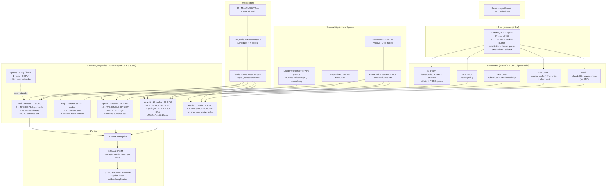

# Blueprint — the inference platform for this repo

Research date **2026-09-19**. This document is the *assembly*: it takes the
decisions already argued and sourced in
[`01-bare-metal-cluster.md`](./01-bare-metal-cluster.md) …
[`09-reference-architectures.md`](./09-reference-architectures.md) and
[`12-inference-providers.md`](./12-inference-providers.md), and the per-GPU /
per-model numbers in [`../METHODOLOGY.md`](../METHODOLOGY.md),
[`../gpus/`](../gpus/), [`../models/`](../models/) and
[`../matrix/`](../matrix/), and writes down **one platform**.

**No number in this document is new.** Every figure is carried from a linked
document or is one stated multiplication on figures carried from linked
documents, marked `est.` with the arithmetic shown. Where two source documents
disagree, both are named and neither is silently picked — the disagreement is
flagged in [§9](#9-risks-and-open-questions). Uncertainty is marked
⚠️ **TO BE VERIFIED**.

**Hardware, fixed** ([`../METHODOLOGY.md` §8](../METHODOLOGY.md)): 8×B300 HGX
nodes, **268 GB/GPU as deployed, 2,144 GB/node**, NVLink in-node,
InfiniBand/RoCE between, local NVMe; plus AWS `p6-b300.48xlarge` for burst
([`../cross-cutting/cloud-pricing.md` §5](../cross-cutting/cloud-pricing.md)).

**Models, fixed**: DeepSeek-V4.1-Flash, DeepSeek-V4.1-Flash-NVFP4,
Qwen3.8-27B, Kimi-K3, Marlin-2B.

**The five sentences this blueprint reduces to.**

1. Five model pools, five different shapes, one gateway — because
   `InferencePool` is one-base-model and the four model classes want four
   different routing policies ([`02` §5.1, §8.7](./02-serving-stack-and-routing.md)).
2. **Nothing is PD-disaggregated at 4 or 16 nodes.** Aggregated TP4/TP2/TP1/TP8
   replicas everywhere, because DSpark is refused under disaggregated SGLang for
   DeepSeek-V4.1-Flash and is worth $1.50 → $4.69 per 1M output
   ([`02` §8.3](./02-serving-stack-and-routing.md),
   [`09` §7.3](./09-reference-architectures.md)).
3. Weights live on every node's NVMe, staged by a DaemonSet, loaded with
   `fastsafetensors`; a cold pull from object store costs 2–7 minutes per
   replica on the two large models ([`06` §8.4, §5.3](./06-cold-start.md)).
4. Autoscale on **engine queue / token backlog / KV occupancy**, never CPU or
   GPU utilisation; Kimi-K3 is not autoscaled at all
   ([`05` §1.3, §8.1](./05-autoscaling-and-predictive-scaling.md)).
5. The money is in utilisation, not silicon: moving DeepSeek-V4.1-Flash from
   30 % to 85 % `U` is worth **2.83×**, and it is the free one
   ([`07` §9.5](./07-cost-engineering.md)).

---

## 1. Target architecture

### 1.1 The layer stack, and who owns what

Five layers, from [`02` §1.1](./02-serving-stack-and-routing.md):

| Layer | Component | Owns |
|---|---|---|
| **L0 client** | SDKs, agent loops | retries with jitter, idempotency keys ([`03` §3.8–3.9](./03-concurrency-and-admission-control.md)) |
| **L1 gateway** | Agent Router (ex-Envoy AI Gateway) v1.1.0 | auth, tenant identity, token quotas, model-name routing, external-API fallback ([`02` §4.2–4.5](./02-serving-stack-and-routing.md)) |
| **L2 router** | GAIE `InferencePool` + EPP per pool (llm-d Router), **or** Dynamo KV router | endpoint choice: prefix affinity, token load, session affinity ([`02` §3](./02-serving-stack-and-routing.md)) |
| **L3 engine** | vLLM / SGLang | batching, admission, KV, speculation ([`03` §1](./03-concurrency-and-admission-control.md)) |
| **L4 platform** | Kubernetes (RKE2), GPU Operator, Kueue/Volcano, Prometheus, DCGM | placement, gang scheduling, quota, telemetry ([`01` §3, §6](./01-bare-metal-cluster.md)) |

### 1.2 Four nodes (32 B300) — the floor

18 GPUs holds one replica of each model; N+1 on the whole-node model plus a
second replica of the interactive models makes **4 nodes the floor for a
deployment that can lose a node**
([`01` §8.1–8.2](./01-bare-metal-cluster.md)).

```
                          clients / agent loops
                                    │
                    ┌───────────────▼────────────────┐
  CONTROL PLANE     │  L1  Agent Router (2 replicas) │   auth · API keys · tenant id
  RKE2 1.36.4 HA    │      AIGatewayRoute            │   llmRequestCosts → token quota
  3 × 1U, no GPU    │      x-ai-eg-model dispatch    │   external-API fallback (§5.5)
  (§01 8.2)         └───────────────┬────────────────┘
                                    │
          ┌──────────────┬──────────┴────────┬──────────────┬─────────────┐
          │              │                   │              │             │
    ┌─────▼─────┐  ┌─────▼─────┐      ┌──────▼─────┐  ┌─────▼─────┐ ┌─────▼─────┐
    │ L2 EPP    │  │ L2 EPP    │      │ L2 EPP     │  │ L2 router │ │  no EPP   │
    │ precise   │  │ precise   │      │ token-load │  │ least-    │ │  plain    │
    │ prefix +  │  │ prefix    │      │ + session  │  │ loaded +  │ │  LOR /    │
    │ token load│  │ (same     │      │ affinity   │  │ HARD      │ │  power-   │
    │           │  │  policy)  │      │            │  │ session   │ │  of-two   │
    └─────┬─────┘  └─────┬─────┘      └──────┬─────┘  └─────┬─────┘ └─────┬─────┘
          │              │                   │              │             │
 ┌────────▼───────┐ ┌────▼──────────┐ ┌──────▼───────┐ ┌────▼────────┐ ┌──▼────────┐
 │ POOL ds-v41    │ │ POOL nvfp4    │ │ POOL qwen    │ │ POOL kimi   │ │POOL marlin│
 │ AGGREGATED     │ │ AGGREGATED    │ │ SINGLE-GPU DP│ │ TP8 SINGLE- │ │SINGLE-GPU │
 │ TP4 × 4 repl   │ │ TP4 × 1 repl  │ │ TP1 × 6 repl │ │ NODE, 1 repl│ │TP1 × 2    │
 │ 16 GPU (n02+   │ │ 4 GPU (n03)   │ │ 6 GPU        │ │ 8 GPU (n01) │ │2 GPU      │
 │  half n03/n04) │ │               │ │ (n03/n04)    │ │ whole node  │ │(n04)      │
 │ DSpark γ=5     │ │ DSpark ships, │ │ MTP γ=3      │ │ DCP8, DSpark│ │no spec    │
 │ prefix cache ON│ │ unexercised ⚠️ │ │ FP8 KV       │ │ FP8 KV mand.│ │no prefix  │
 └────────┬───────┘ └────┬──────────┘ └──────┬───────┘ └────┬────────┘ └──┬────────┘
          └──────────────┴──────────┬────────┴──────────────┴────────────┘
                                    │
        ┌───────────────────────────▼────────────────────────────┐
        │  KV TIER          L1 HBM (per replica)                 │
        │  (§04 8.4)        L2 host DRAM — LMCache **MP mode**,  │
        │                      one unified cache per node        │
        │                   L3 node-local NVMe                   │
        │                   ✗ NO cross-node KV tier at 4 nodes   │
        └────────────────────────────────────────────────────────┘
        ┌────────────────────────────────────────────────────────┐
        │  WEIGHT STORE     S3 / MinIO (source of truth, ≥100 TB)│
        │  (§01 1.8, §06 5.3)  → DaemonSet stages all 5 ckpts on │
        │                        every node's NVMe (8.7 % of     │
        │                        30.7 TB instance store)         │
        │                      → --load-format fastsafetensors   │
        │                      → HF_HUB_OFFLINE=1                │
        │                   ✗ NO Dragonfly at 4 nodes (§01 5.6)  │
        └────────────────────────────────────────────────────────┘
        ┌────────────────────────────────────────────────────────┐
        │  OBSERVABILITY    Prometheus + DCGM exporter v4.8.3    │
        │  (§08 4.1)        OTel traces gateway→router→engine    │
        │                   structured request logs (redacted)   │
        │                   4 planes: metrics / traces / logs /  │
        │                             GPU telemetry              │
        └────────────────────────────────────────────────────────┘

  FABRIC   2 × Spectrum-4 SN5600D 800 GbE — RoCEv2 is defensible at 4 nodes (§01 1.3)
  POWER    ≥ 60 kW, 1 rack, air + rear-door heat exchanger (§01 8.2)
  SCALING  STATIC. KEDA in observe-only, collecting traces for the 16-node step (§09 7.1)
```

**Node allocation** ([`01` §8.2](./01-bare-metal-cluster.md), pool sizes from
[`09` §7.1](./09-reference-architectures.md)):

| Node | Contents | Taint |
|---|---|---|
| node-01 | Kimi-K3 TP8+DCP8, one replica, whole node | `whole-node-model=kimik3:NoSchedule` |
| node-02 | DeepSeek-V4.1-Flash 2 × TP4 | — |
| node-03 | DeepSeek-NVFP4 TP4 + Qwen3.8-27B × 4 | — |
| node-04 | Marlin-2B × 2 + Qwen × 2 + DeepSeek 2 × TP4 / spare / canary | — |

**The honest failure posture at 4 nodes**: Kimi-K3 has one replica on one node.
A node loss is a full Kimi-K3 outage of 3.5–5 minutes (warm NVMe) to 11–13
minutes (cold) ([`06` §8.3–8.4](./06-cold-start.md)). *"If Kimi-K3 has an
availability SLA, Blueprint A does not meet it; that is the honest reason to go
to 16 nodes"* ([`09` §7.1](./09-reference-architectures.md)).

**Deliberately absent at 4 nodes**, each with its trigger
([`01` §8.2–8.3](./01-bare-metal-cluster.md)): Dragonfly (trigger: 25 TB of
correlated pull per rollout), Volcano (trigger: multi-pod replicas), Kueue
(trigger: >1 team competing), parallel FS (trigger: KV-offload beyond local
NVMe), InfiniBand (trigger: multi-node KV traffic), SR-IOV (single-tenant →
`hostNetwork`).

### 1.3 Sixteen nodes (128 B300)

Same building blocks, different pool sizes and three additions: a Kubernetes
Gateway front door, a cluster-wide L3 KV tier, and real autoscaling
([`09` §7.2](./09-reference-architectures.md)).



| Pool | Nodes | GPUs | Shape | Replicas | Aggregate S1 out tok/s (`est.`) |
|---|---:|---:|---|---:|---:|
| Kimi-K3 | 2 | 16 | TP8 + DCP8, one replica per node | 2 | **4,449** |
| DeepSeek-V4.1-Flash | 10 | 80 | TP4 aggregated | 20 | **109,840** |
| Qwen3.8-27B | 2 | 16 | TP1 | 16 | **199,408** |
| Marlin-2B | 1 | 8 | TP1 | 8 | 746,168 (video) |
| Spare / canary / burst | 1 | 8 | — | — | — |
| **Text total** | **16** | **128** (120 serving) | | | **≈ 314k out tok/s** |

All rows from [`09` §7.2](./09-reference-architectures.md), which computes them
by multiplying [`../matrix/pairs.json`](../matrix/pairs.json) B300 per-GPU rates
by GPU counts. They are **capacity envelopes at each model's stated operating
point, not measurements of a cluster**, and they inherit every caveat in
[`../matrix/recommendations.md` §2.4](../matrix/recommendations.md) — above all
the DSpark acceptance rate, which alone swings `$/1M output` by up to **3–3.5×**.

**What 16 nodes adds over 4**, each with its trigger
([`01` §8.3](./01-bare-metal-cluster.md),
[`09` §7.2](./09-reference-architectures.md)):

| Addition | Trigger |
|---|---|
| Kubernetes Gateway + GAIE `InferencePool` per pool, `failureMode: FailOpen` | >2 routing policies to operate centrally |
| InfiniBand (Quantum-X800 Q3400 leaf/spine, UFM 3.5) | multi-node KV traffic tail latency ([`01` §1.3](./01-bare-metal-cluster.md)) |
| Parallel FS (Weka/VAST/Lustre ≥500 TB, GDS-capable) | KV-offload tier beyond local NVMe |
| Dragonfly P2P | 25 TB of correlated pull per rollout ([`01` §5.6](./01-bare-metal-cluster.md)) |
| Volcano + Kueue | multi-pod replicas; >1 team competing for capacity |
| L3 cluster-wide KV with global index | at 20 DeepSeek replicas, Mooncake's *"2.36× higher hit rate than local cache"* and *"up to 48 % savings in prefill computation time"* start to apply ([`09` §1.2](./09-reference-architectures.md)) |
| LeaderWorkerSet for the Kimi node-groups | gang scheduling; LWS's own is Alpha ([`09` §2.6](./09-reference-architectures.md)) |
| NVSentinel/NPD + remediator | 128 GPUs → a bad GPU every week is a statistical certainty ([`01` §6.5](./01-bare-metal-cluster.md)) |

**Still absent at 16 nodes**: PD disaggregation (see
[§8 Phase 5](#8-rollout-plan)), multi-tenant flow control, Dynamo SLA Planner —
all three are Blueprint C (64-node) additions
([`09` §7.3](./09-reference-architectures.md)).

---

## 2. Software bill of materials, 2026-09-19

Every row below is carried verbatim from
[`01` §8.4](./01-bare-metal-cluster.md) (platform) and
[`02` §2.1](./02-serving-stack-and-routing.md) (serving), which are themselves
sourced from the GitHub releases API, PyPI and vendor platform-support pages on
2026-09-19.

### 2.1 The compatibility chain

```
  driver  →  CUDA  →  PyTorch  →  engine  →  attention kernel  →  operator
    ▲          ▲                      ▲              ▲
    │          │                      │              └─ resolved backend is a
    │          │                      │                 RUNTIME fact: grep it out
    │          │                      │                 of the startup log (§08 5.2)
    │          │                      └─ vLLM 0.29.0 EXCEPT DeepSeek-V4.1-Flash,
    │          │                         which is main/nightly only
    │          └─ CUDA 13.x needs driver ≥ 580; ⚠️ NVIDIA's datacenter matrix
    │             lists no CUDA 13.x entry at all (§08 5.2)
    └─ 595.91.07 = GPU Operator 26.7.0 default; Fabric Manager MUST equal it
```

Three constraints in this chain break LLM serving specifically, all from
[`08` §5.2](./08-reliability-and-operations.md):

1. **PTX JIT.** *"Applications that compile device code to PTX will not work on
   older drivers."* FlashInfer and Triton emit PTX, so a container that works on
   a newer driver fails at kernel-JIT time — *after* the 500 GB weight load.
2. **sm_103 ≠ sm_100.** B300 is **sm_103**, B200 is **sm_100**, and they are not
   interchangeable ([`../gpus/b300.md`](../gpus/b300.md)). An image built only
   for sm_100 falls back to PTX JIT on B300 and hits (1).
   `cuobjdump --list-elf <lib>.so | grep sm_103` before trusting any wheel —
   *"the #1 cause of 'works on B200, dies on B300'"*
   ([`../matrix/recommendations.md` §4 risk 2](../matrix/recommendations.md)).
3. **An engine upgrade is a capacity change.** vLLM's `nvfp4_ds_mla` path
   resolves only where `FLASHMLA_MEGA_ATTN_DSV41` is gated on
   `capability.major == 10`; a version bump *"can silently change the KV layout
   from 890 B/token to 1,650 B/token"*, changing `max_concurrency` by ~1.85×
   and therefore whether `max_num_seqs` causes a preemption storm.

### 2.2 Pinned versions

| Layer | Pin | Source |
|---|---|---|
| Kubernetes | **1.36.4** (rel. 2026-08-11, EOL 2027-06-28) — **not 1.37**, per the operator intersection | [`01` §3.1, §8.4](./01-bare-metal-cluster.md) |
| Distribution | RKE2 (current stable for 1.36) | [`01` §8.4](./01-bare-metal-cluster.md) |
| Host OS | Ubuntu 24.04 LTS | ibid. |
| NVIDIA driver | **595.91.07** (GPU Operator 26.7.0 default) | ibid. |
| Fabric Manager | **595.91.07** — must equal the driver | ibid. |
| CUDA | 13.x ⚠️ see §2.1 note 1 and [`08` §5.2](./08-reliability-and-operations.md) | ibid. |
| containerd | 2.0–2.3 | ibid. |
| GPU Operator | **v26.7.0** | ibid. |
| NVIDIA Container Toolkit | 1.20.0 | ibid. |
| NVIDIA Device Plugin | 0.20.0 | ibid. |
| Node Feature Discovery | v0.19.0 | ibid. |
| DCGM Exporter | v4.8.3 | ibid. |
| Network Operator | **v26.7.0** | ibid. |
| DOCA-OFED | `doca3.5.0-26.07-0.7.7.0-0` (GA) | ibid. |
| NCCL | 2.31.x | ibid. |
| CNI | Cilium, native routing | [`01` §4.2](./01-bare-metal-cluster.md) |
| **vLLM** | **0.29.0** (2026-09-09) — **`main`/nightly, pinned digest, for DeepSeek-V4.1-Flash** (`min_vllm_version: 0.30.0` does not exist) | [`02` §2.1](./02-serving-stack-and-routing.md), [`../cross-cutting/inference-engines.md`](../cross-cutting/inference-engines.md) |
| **SGLang** | **v0.5.20** (2026-09-18) | [`02` §2.1](./02-serving-stack-and-routing.md) |
| TensorRT-LLM | 1.2.1 stable / **v1.3.0rc27** — *no V4.1 entry at all*, not used here | ibid.; [`../matrix/recommendations.md` §4 risk 3](../matrix/recommendations.md) |
| NVIDIA Dynamo | v1.4.2 last numbered stable; PyPI `ai-dynamo` **1.5.0** (NIXL v1.3.1/v1.3.0) | [`02` §2.1](./02-serving-stack-and-routing.md) |
| llm-d | **v0.9.0** (2026-08-17) — README still advertises "0.7", stale | ibid. |
| llm-d Router (ex-Inference Scheduler) | **v0.10.0** (v0.11.0-rc.1 2026-09-18) | ibid. |
| Gateway API Inference Extension | **v1.6.2** (2026-09-17) | ibid. |
| Agent Router (ex-Envoy AI Gateway) | **v1.1.0** (2026-08-21) | ibid. |
| Kueue *(16-node only)* | ≥ v0.14 (TAS beta, default-on) | [`01` §8.4](./01-bare-metal-cluster.md) |
| Volcano *(16-node only)* | v1.15.0 | ibid. |
| Dragonfly *(16-node only)* | current CNCF Graduated release | ibid. |

**Two renames that invalidate half the material on the internet**
([`02` §2.2](./02-serving-stack-and-routing.md)): GIE v1.6.0 moved EPP,
`InferenceObjective`, `InferenceModelRewrite` and BBR out to `llm-d/*` repos
(GIE keeps LWEPP and the `InferencePool` API; **there is no `InferenceModel`
CRD in the v1 API**); and llm-d's "Inference Scheduler" is now the "llm-d
Router".

### 2.3 The matrix to maintain per (GPU, model) pair

Regenerate on every upgrade and store in git next to the deployment
([`08` §5.2](./08-reliability-and-operations.md)). The two bold fields are
**captured from the running engine, not declared** — grep them out of the
startup log into an artifact and fail the canary if they change without an
approved note:

| Field | Example | Source of truth |
|---|---|---|
| Driver branch | R595 | node image |
| CUDA runtime | 13.x | container |
| PyTorch | — | container lockfile |
| Engine + digest | vLLM `main` @sha256:… | container tag |
| **Resolved attention backend** | `FLASHMLA_MEGA_ATTN_DSV41` | **engine log, per model, per GPU** |
| **Resolved KV dtype and bytes/token** | 890 B/token | **engine log**; must match [`../METHODOLOGY.md` §8](../METHODOLOGY.md) |
| `max_concurrency(ctx)` | from [`../matrix/fit-matrix.md`](../matrix/fit-matrix.md) | recomputed |

**Node conformance gate** — assert before a node joins the serving pool, fail
closed. The full command list is
[`01` §8.4](./01-bare-metal-cluster.md); the one people skip is the `fio` read
test, because a node that silently dropped to single-drive performance passes
every other check while turning a 35-second Kimi-K3 load into a 22-minute one.

---

## 3. Per-model serving profile

One row per model. Every number links to the document it came from. Read the
per-model launch flags in
[`../matrix/recommendations.md` §2.1](../matrix/recommendations.md) alongside
this table — that document's last column ("the flag that fails silently if
skipped") is not repeated here and is load-bearing for all five.

### 3.1 Engine, parallelism, KV, speculation, caching

| | **DeepSeek-V4.1-Flash** | **DeepSeek-V4.1-Flash-NVFP4** | **Qwen3.8-27B** | **Kimi-K3** | **Marlin-2B** |
|---|---|---|---|---|---|
| **Engine** | vLLM `main`/nightly, **pinned digest** ([rec §2.1](../matrix/recommendations.md)) | vLLM `main`/nightly — *run the base instead* ([rec §2.1](../matrix/recommendations.md)) | vLLM 0.29.0 or SGLang ([rec §2.1](../matrix/recommendations.md)) | vLLM ≥0.27.1 or SGLang ≥0.5.17 — the only `verified: true` K3 cells anywhere are 8×B300 ([rec §2.1](../matrix/recommendations.md)) | vLLM ≥0.29.0 + `--hf-overrides` remap, **CUDA ≥13 image** ([rec §2.1](../matrix/recommendations.md)) |
| **Parallelism** | **Interactive 2 × TP4/node; batch 4 × TP2/node. EP1** — wide-EP *"runs badly"* on an 8-GPU domain; never cross nodes ([rec §2.1](../matrix/recommendations.md), [`04` §8.1](./04-throughput-and-utilization.md)) | 2 × TP4/EP4 per node. **Never TP2 at 268 GB** — `infeasible (KV)` ([rec §2.1](../matrix/recommendations.md)) | **8 × TP1, one per GPU**, behind a router — 2,600 vs TP8's 2,011 concurrent 8K seqs, 8 failure domains ([rec §2.1](../matrix/recommendations.md)) | **TP8 + DCP8, one replica = the whole node.** DCP8 **not** EP8 — `DCP8+EP8` is [sglang#34260](https://github.com/sgl-project/sglang/issues/34260) ([rec §2.1](../matrix/recommendations.md)) | **8 × TP1 + an HTTP load balancer.** `num_key_value_heads: 2` caps clean sharding at TP2 ([rec §2.1](../matrix/recommendations.md)) |
| **KV dtype** | **FP4, 890 B/token native** (`FLASHMLA_SPARSE`/`MEGA_ATTN`, sm_103 passes `major==10`) ([rec §2.1](../matrix/recommendations.md)) | FP4 890 B/token ([rec §2.1](../matrix/recommendations.md)) | **`--kv-cache-dtype fp8` → +41 % concurrency** (231→325 @8K). `auto` silently leaves it BF16 ([rec §2.1](../matrix/recommendations.md)) | **`--kv-cache-dtype fp8` MANDATORY** — *"bf16 KV does not fit 128 requests per replica"* ([rec §2.1](../matrix/recommendations.md)) | BF16. FP8 KV is +88 % concurrency but **forces FA4 hd256 back to FA2**, and the fleet is prefill-bound ([rec §2.1](../matrix/recommendations.md)) |
| **Speculative decoding** | **DSpark γ=5**, `probabilistic` draft, `block` rejection, adaptive verification — **3.13× output per byte**; removing it takes $/1M from **$1.50 → $4.69** ([rec §2.1](../matrix/recommendations.md)) | Ships but **NVIDIA never exercised it** ⚠️ ([rec §2.1](../matrix/recommendations.md)) | **MTP γ=3** (0.425 B head ships in the checkpoint); 1.55× @c4 → 1.15× @c256 ([rec §2.1](../matrix/recommendations.md)) | **DSpark** — 3.00× @c=1, 1.64× @c=64, at admission 101 → **68** (−33 %) ([rec §2.1](../matrix/recommendations.md)) | **Unavailable** — the checkpoint ships **zero `mtp` tensors** ([rec §2.1](../matrix/recommendations.md)) |
| **Prefix caching** | **On.** 90.2–97.0 % hit measured → effective input **$0.036/1M** ([rec §2.1](../matrix/recommendations.md)) | **Turn it back on** — NVIDIA's recipe passes `--no-enable-prefix-caching` with no stated reason ([rec §2.1](../matrix/recommendations.md)) | **On.** Sustained output 3,856 → 10,245 tok/s/GPU across 0/50/90 % hit ([rec §2.1](../matrix/recommendations.md)) | **On, `--prefix-match-unit 128` MANDATORY** or the hit boundary inflates to the Mamba state page. **Do not pair L3 HiCache with DCP** ([rec §2.1](../matrix/recommendations.md)) | **Structurally zero** — cacheable scaffold is <0.2 % of a request ([rec §2.1](../matrix/recommendations.md)) |

### 3.2 Admission, routing, scaling, cold start, SLO

| | **DeepSeek-V4.1-Flash** | **DeepSeek-V4.1-Flash-NVFP4** | **Qwen3.8-27B** | **Kimi-K3** | **Marlin-2B** |
|---|---|---|---|---|---|
| **`max_concurrency` @8K / @128K** | **11,184 / 953** ([`03` §2.2](./03-concurrency-and-admission-control.md)) | **10,199 / 869** (replicated, binding) — ⚠️ `pairs.json` carries 40,801/3,479, the optimistic sharded reading ([`03` §2.2](./03-concurrency-and-admission-control.md), [rec §2.5](../matrix/recommendations.md)) | **325 / 45** ([`03` §2.2](./03-concurrency-and-admission-control.md)) | **101 / 64** ([`03` §2.2](./03-concurrency-and-admission-control.md)) | **1,934 / 142**; at the 23,520 video ctx, **753 concurrent 2-min videos/GPU** ([`03` §2.2, §6.4](./03-concurrency-and-admission-control.md)) |
| **What actually binds** | **Not KV** — *"Weights and batch size, not cache, set the capacity limit"*; measured runs used 2–26 % of the pool ([`03` §2.2](./03-concurrency-and-admission-control.md)) | Same | **The GDN state pool** — 392.2 MB/request (S=5 × 78.4 MB bf16) vs 256 MB KV at 8K ([`03` §2.2](./03-concurrency-and-admission-control.md)) | **The KDA state pool** — 2.25 GB/request node-wide, **95 % of the per-request bill at 8K**; KV only overtakes at ~163K tokens ([`03` §2.2](./03-concurrency-and-admission-control.md)) | The 240-frame cap bounds every video ([`03` §2.2, §6.4](./03-concurrency-and-admission-control.md)) |
| **Admission limits** | `max_num_seqs` **256** (SLO batch, = recipe default); `max_num_queued_reqs` **282**; `max_num_queued_tokens` **64000**; `max_model_len` 131072; `watermark` 0.02; cudagraph ladder ≥ 256×(1+5)=1536 ([`03` §8.3](./03-concurrency-and-admission-control.md)) | `--max-running-requests 16` / `--max-num-seqs 32` per NVIDIA; **vLLM's 256 is the better start** ([rec §2.1](../matrix/recommendations.md)) | `max_num_seqs` ≤ 325 @8K; scale down with context ([`03` §2.2](./03-concurrency-and-admission-control.md)) | **`max-running-requests: 32`** in NVIDIA's own recipe against a measured cap of 101 — *"the pool is tiny, so admission control matters far more than placement"* ([`02` §8.4](./02-serving-stack-and-routing.md)) | `--block-size 128` (turns on FA4 hd256), `--mamba-cache-mode=align` mandatory ([rec §2.1](../matrix/recommendations.md)) |
| **Routing policy** | **KV-aware / precise prefix + token load.** `--router-kv-overlap-score-credit` 1.0 default, up for TTFT-bound, down for TPOT-bound; decay 0.5–1.0 above 2 endpoints ([`02` §8.2–8.3](./02-serving-stack-and-routing.md)) | Same policy, **separate pool** ([`02` §8.2](./02-serving-stack-and-routing.md)) | **`power_of_two` / token-load + session affinity.** Prefix affinity only after an A/B ⚠️ ([`02` §8.5](./02-serving-stack-and-routing.md)) | **`least-loaded` + HARD session affinity** on `X-Dynamo-Session-ID`, + FCFS queue. KV-aware only at ≥2 nodes with HiCache on ([`02` §8.4](./02-serving-stack-and-routing.md)) | **Plain least-outstanding-requests / power-of-two, no EPP** ([`02` §8.6](./02-serving-stack-and-routing.md)) |
| **Scale-up signal + threshold** | `llm_d_epp_inflight_tokens / V_P > 1.5 s` **or** `kv_cache_usage_perc > 0.8` ([`05` §8.1](./05-autoscaling-and-predictive-scaling.md)) | same | backlog-seconds > 1.0 **or** `kv_cache_usage_perc > 0.8` ([`05` §8.1](./05-autoscaling-and-predictive-scaling.md)) | **None — no reactive autoscaling.** Queue depth drives *admission*, not replicas ([`05` §8.1, §8.4](./05-autoscaling-and-predictive-scaling.md)) | `vllm:num_requests_waiting > 0` for 60 s **or** `kv_cache_usage_perc > 0.75` ([`05` §8.1](./05-autoscaling-and-predictive-scaling.md)) |
| **Scale-down** | both below 50 % of threshold for 30 min ([`05` §8.1](./05-autoscaling-and-predictive-scaling.md)) | same | `num_requests_running` < 10 % of `max_num_seqs`, 20 min ([`05` §8.1](./05-autoscaling-and-predictive-scaling.md)) | manual / scheduled ([`05` §8.1](./05-autoscaling-and-predictive-scaling.md)) | `num_requests_running` < 10 % of `max_num_seqs`, 15 min ([`05` §8.1](./05-autoscaling-and-predictive-scaling.md)) |
| **min / max replicas** | **2 / 12** ([`05` §8.1](./05-autoscaling-and-predictive-scaling.md)) | 0 / 4 (variant pool) ([`05` §8.1](./05-autoscaling-and-predictive-scaling.md)) | **0** (night) / **1** (business hours, cron) / max 8 ([`05` §8.1](./05-autoscaling-and-predictive-scaling.md)) | **1 node** (+1 spare, §6.4) ([`05` §8.1](./05-autoscaling-and-predictive-scaling.md)) | **0** / 8 ([`05` §8.1](./05-autoscaling-and-predictive-scaling.md)) |
| **Cold-start budget (warm NVMe / S3-cold)** | **≈2–3 min / ≈4.5–6 min**; weight term alone 25.5–51.0 s ([`06` §8.2–8.4](./06-cold-start.md)) | as base + 17 GB ([`06` §8.2](./06-cold-start.md)) | **≈50–80 s / ≈65–95 s** ([`06` §8.3–8.4](./06-cold-start.md)) | **≈3.5–5 min / ≈11–13 min**; weight term alone 78.0–156.1 s ([`06` §8.3–8.4](./06-cold-start.md)) | **≈35–55 s / ≈37–57 s** ([`06` §8.3–8.4](./06-cold-start.md)) |
| **Pre-warm policy** | `min_replicas` 1 (= P2P seed) + **1 warm standby replica (4 GPUs)**; forecast horizon ≥ `cold_start_p95 + 180 s` ≈ **8 min** ([`06` §8.5](./06-cold-start.md)) | shares the base's standby ([`06` §8.5](./06-cold-start.md)) | `min_replicas` 1, 0–1 standby, reactive + forecast ([`06` §8.5](./06-cold-start.md)) | `min_replicas` **1 whole node**; **1 node standby, or accept the SLO break**; forecast horizon ≥ **10 min**. *"A business decision, not an engineering one"* ([`06` §8.5](./06-cold-start.md)) | `min_replicas` 1, no standby — reactive is fine ([`06` §8.5](./06-cold-start.md)) |
| **SLO (availability / TTFT p95 / TPOT p95)** | interactive **99.9 % / 800 ms ⚠️ / 50 ms**; long-ctx (S2) 99.5 % / 6 s ⚠️ / 50 ms; very-long (S3) 99.0 % / none ([`08` §1.2](./08-reliability-and-operations.md)) | as base | interactive **99.9 % / 400 ms ⚠️ / 50 ms**; batch 99.5 % / none ([`08` §1.2](./08-reliability-and-operations.md)) | **99.5 % ⚠️ / 1.5 s ⚠️ / 50 ms** — the lower availability target is deliberate: a node-sized replica's availability is bounded by node availability ([`08` §1.2](./08-reliability-and-operations.md)) | **99.9 %**, and a **different SLI**: TTFT normalised by input frame count (ms/frame) plus an encoder-queue SLO ⚠️ ([`08` §1.2](./08-reliability-and-operations.md)) |
| **Target MBU / KV util / batch occupancy** | 0.50–0.70 / 0.60–0.80 / 0.6–0.9 (interactive); **0.85–0.95** KV on the TP2 batch pool ([`04` §8.3](./04-throughput-and-utilization.md)) | as base ⚠️ | 0.50–0.70 / 0.60–0.80 / 0.6–0.9 ([`04` §8.3](./04-throughput-and-utilization.md)) | 0.50–0.70 / 0.70–0.85 / 0.6–0.9 ([`04` §8.3](./04-throughput-and-utilization.md)) | **n/a — ViT-bound**; watch `PIPE_TENSOR_ACTIVE`, not MBU ([`04` §8.3](./04-throughput-and-utilization.md)) |
| **L2 host / L3 shared KV tier** | yes / yes ([`04` §8.4](./04-throughput-and-utilization.md)) | yes / yes | yes / **⚠️ measure first** — 32 KiB/token FP8 is 37× DeepSeek's, so L3 fills 37× faster ([`04` §8.4](./04-throughput-and-utilization.md)) | yes / yes — single replica per node, so L3 is what makes a *second* node's cache useful ([`04` §8.4](./04-throughput-and-utilization.md)) | yes / **probably not** — distinct videos ⚠️ unmeasured ([`04` §8.4](./04-throughput-and-utilization.md)) |

**Two things this table deliberately does not do.** It does not set
`max_num_seqs` from `max_concurrency`: for DeepSeek-V4.1-Flash the KV cap is
**136× the SLO cap** (17,408 vs 128 at 4K), and *"a manifest that sets
`max_num_seqs` from `max_concurrency` produces a server that never errors, is
never OOM, and is useless"*
([`03` §2.3](./03-concurrency-and-admission-control.md)). And it does not treat
concurrency as `KV budget ÷ context`: *"A capacity plan written as
'concurrency = KV budget ÷ context' is wrong for four of these five models"*
([`03` §2.2](./03-concurrency-and-admission-control.md)).

### 3.3 The admission-control ladder, applied

Enable in this order; each rung is cheap and each prevents the next incident
class ([`03` §3.10](./03-concurrency-and-admission-control.md)):

| # | Control | Layer | Prevents |
|---|---|---|---|
| 1 | `max_num_seqs` at the **SLO batch**, not the KV batch | engine | TPOT collapse |
| 2 | `--max-num-queued-reqs` | engine | unbounded TTFT |
| 3 | `--max-num-queued-tokens` = `target_TTFT × prefill_throughput` | engine | one 1M prompt blowing everyone's TTFT |
| 4 | `max_model_len` + gateway prompt-length cap | both | oversized-prompt OOM |
| 5 | Per-tenant RPM/TPM | gateway | noisy-neighbour |
| 6 | Per-tenant **concurrency** cap | gateway | the lagging-quota hole (token cost is known only after the response, [`02` §4.3](./02-serving-stack-and-routing.md)) |
| 7 | Priority classes + sheddable tier | router | critical traffic dying with batch traffic |
| 8 | `watermark` > 0 (vLLM) / `--schedule-conservativeness` > 1 (SGLang) | engine | preemption thrash |
| 9 | Circuit breakers + outlier ejection | gateway | one sick replica absorbing traffic |
| 10 | Client backoff+jitter, retry budget, `Retry-After` honoured | client | retry storms |

**Status codes**: **429** when the *tenant* is over quota, **503** when the
*fleet* is full; always set `Retry-After`, computed as the estimated drain time
with server-side jitter `ceil(drain_estimate × U(1.0, 1.5))`, never a constant —
a constant makes every rejected client return in lockstep
([`03` §3.5](./03-concurrency-and-admission-control.md)). Never a 502, and never
an unqueued 503, as cold-start behaviour
([`12` §6.2](./12-inference-providers.md)).

---

## 4. Request path walk-throughs

### 4.1 An interactive chat request (DeepSeek-V4.1-Flash, S1: 4K in / 512 out)

```
 t=0      CLIENT  POST /v1/chat/completions   stream=true
                  Authorization: Bearer <key>    traceparent: 00-<trace>-<span>-01
   │
   ▼
 L1 GATEWAY  (Agent Router)
   1. auth → tenant identity, tier                                 [§02 4.2]
   2. x-ai-eg-model → model name → route to InferencePool ds-v41   [§02 4.2]
   3. token-bucket check against BackendTrafficPolicy budget
      (keyed per user × model). ⚠️ token cost is known only AFTER
      the response, so quota enforcement lags by one request —
      a concurrency cap is the companion control.                  [§02 4.3, §03 3.10 r.6]
   4. prompt-length cap (rung 4). Over → 400, not 503.             [§03 3.7]
   5. forward W3C traceparent. Without it you get two disconnected
      single-span traces and none of the value.                    [§08 4.5]
   ├─ over quota?  → 429 + Retry-After                             [§03 3.5]
   ▼
 L2 ROUTER  (EPP for the ds-v41 pool)
   6. tokenize-free prefix hash of the prompt; look up which
      endpoints hold the prefix, from KV events published by the
      workers (--kv-events-config).                                [§02 3.3]
   7. score = overlap credit (--router-kv-overlap-score-credit 1.0,
      decayed 0.5–1.0 so a cache-rich worker does not win every
      time and a freshly-scaled worker never warms) + queued
      prefill token load + host-cache 0.75 / disk-cache 0.25.      [§02 3.4, 8.3]
   8. pick one of the 4 (4-node) / 20 (16-node) TP4 endpoints.
   ├─ all endpoints at max_num_queued_reqs? → 503 + Retry-After    [§03 3.2, 3.5]
   ▼
 L3 ENGINE  (vLLM TP4, max_num_seqs=256, DSpark γ=5, FP4 KV)
   9.  ADMISSION: queue depth ≤ 282 (256 running + 26 queued);
       queued-token budget ≤ 64,000 (= 2.0 s × 31,752 prefill tok/s).
       Queue wait by construction ≤ TTFT budget − TTFT service.    [§03 8.3]
   10. PREFILL: 4,096 prompt tokens. At 90.2–97.0 % measured agentic
       hit rate most of this is a cache read, not compute:
       effective input cost $0.036/1M.                             [rec §2.1]
       Cold prefill ≈ 129 ms at this shape.                        [§03 8.2]
   11. First token emitted → TTFT. SLO p95 = 800 ms ⚠️; service
       time alone is 129 ms, so the budget is mostly queue.        [§08 1.2, §03 8.3]
   12. DECODE: 511 more tokens at TPOT 35.6 ms (batch 256) or
       17.8 ms (batch 128). Aggregate is FLAT from batch 32 up
       (7,191 tok/s per 4-GPU replica) — above batch 32 you buy
       no throughput and pay TPOT linearly; the larger batch buys
       SEATS, not tokens.                                          [§03 2.3, 8.2]
       Residency = 0.129 + 511 × 0.0356 = 18.32 s.
   13. SSE chunks stream back through router and gateway unbuffered.
       Client disconnect → cancellation must propagate to the engine.
       ⚠️ THE MAPPING IS UNDOCUMENTED — benchmark R3.               [§02 6.2, §02 OQ3]
   ▼
 METRICS EMITTED
   engine   vllm:time_to_first_token_seconds        (histogram, TTFT SLI)
            vllm:time_per_output_token_seconds      (histogram, TPOT SLI —
                                                     the le="0.05" bucket IS
                                                     the good-events count)   [§08 1.3]
            vllm:num_requests_running / _waiting     (scaling signal)          [§05 2.2]
            vllm:kv_cache_usage_perc                 (scaling signal)          [§05 2.2]
            vllm:request_prompt_tokens               (histogram — the thing to
                                                     diff when cache hit
                                                     collapses)                [§08 8.8]
            vllm:request_success_total{finished_reason=...}                    [§02 6.2]
   router   llm_d_epp_inflight_tokens, prefix-hit rate,
            dynamo_router_overhead_*                                           [§08 4.3]
   gateway  per-tenant tokens in/out, 429/503 counts by tenant_tier            [§08 4.7]
   GPU      DCGM_FI_PROF_SM_ACTIVE, DRAM_ACTIVE, XID errors                    [§08 4.4]
   traces   head-sampled 0.1–1 %; tail-sampled 100 % on error, SLO
            breach, or debug header. Never prompts in span attributes.         [§08 4.5]
```

**Do not put `request_id` in a metric label** — *"the classic way to take down
Prometheus"* ([`08` §4.1](./08-reliability-and-operations.md)). Per-tenant
metrics go through the low-cardinality path of
[`08` §4.7](./08-reliability-and-operations.md); tenant identity lives in the
structured request log, not the metric.

### 4.2 An agent / tool-loop request (Kimi-K3, long session)

The shape is different in four ways, and each one changes a decision.

```
 t=0      AGENT  turn 1: POST /v1/chat/completions
                 X-Dynamo-Session-ID: <session>      [the load-bearing header]
   │
   ▼
 L1 GATEWAY
   1. auth, tier. Kimi-K3 traffic is priced against Moonshot's
      $15.00/1M output — the overflow target (§5.5).               [§05 8.4]
   2. HASH THE RAW SESSION HEADER AT INGRESS so the same frontend
      handles the session. Dynamo's own guidance.                  [§02 8.4]
   3. ⚠️ Kimi K3 License §2 gates token RESALE above US$20 M
      aggregate revenue/12 mo. Internal use is exempt. This is a
      gateway-tier policy question, not an engine one.             [rec §4 risk 5]
   ▼
 L2 ROUTER
   4. DYN_ROUTER_MODE=least-loaded — NOT kv. One replica per node
      means there is NO intra-node routing decision at all; the
      router's only job is picking a node.                         [§02 8.4]
   5. HARD session affinity (--router-session-affinity-mode hard,
      --router-session-affinity-ttl-secs). A 1M-token session that
      lands on a different node is a full re-prefill of up to 1M
      tokens, and 14.50 GB of KV you cannot afford to rebuild
      (1,048,576 × 13.5 KiB), plus 2.25 GB of KDA state.           [§02 8.4]
   6. QUEUE, DON'T REJECT. --router-queue-threshold with
      --router-queue-policy fcfs. With 32 concurrent slots the
      arrival process exceeds capacity routinely, and FCFS
      queueing beats 503s on tail TTFT.                            [§02 8.4]
   ▼
 L3 ENGINE  (SGLang/vLLM TP8+DCP8, whole node, FP8 KV, DSpark)
   7.  ADMISSION is the real control: max-running-requests 32 in
       NVIDIA's recipe against a measured cap of 101 @8K (68 under
       DSpark). Replica control is not available — see §5.2.       [§02 8.4, rec §2.1]
   8.  PREFILL turn 1 (cold): TTFT carries a 10,139 ms batch-wave
       artefact at c=111. THIS IS NOT A USER-FACING LATENCY in a
       throughput deployment, but "a customer will notice it" if
       you sell it as interactive.                                 [§04 8.1, §07 9.5]
   9.  DECODE at TPOT 49.9 ms — JUST inside the 50 ms SLO.         [rec §2.2]
   10. TOOL CALL emitted. ⚠️ Kimi-K3 "occasionally emits a tool-call
       format its own parser doesn't expect"; vLLM and SGLang use
       DIFFERENT tool-call parsers for the same chat template
       (qwen3_xml vs qwen3_coder) — a silent failure where calls
       land in message.content. SCHEMA-VALIDATE AND RETRY at the
       gateway.                                                    [rec §4 risk 12]
   11. ⚠️ Structured output and request migration are MUTUALLY
       EXCLUSIVE in Dynamo — a tool-loop using guided decoding
       cannot also be migrated off a draining replica.             [§02 OQ13]
   ▼
 turns 2..N   Same session, same node, prefix now warm
   12. Turn 2's prompt = turn 1's prompt + turn 1's output + tool
       result. The shared prefix is the WHOLE of turn 1. This is
       why hard affinity, not affinity-as-a-hint.
   13. --prefix-match-unit 128 is MANDATORY or the hit boundary
       inflates to the Mamba state page and the reuse evaporates.  [rec §2.1]
   14. Hierarchical cache (enable-hierarchical-cache, hicache-size
       100) gives the router a host tier to credit — but ⚠️ DO NOT
       pair L3 HiCache with DCP: the storage keys are not
       dcp_rank-aware and DCP is SILENTLY DROPPED.                 [rec §2.1]
   ▼
 METRICS EMITTED  (additions over §4.1)
   session-level  re-prefill rate = sessions that changed node ÷ sessions
                  (the single number that says whether affinity works)
   cache          prefix-cache hit rate per pool; vllm:kv_block_reuse_gap_seconds
                  against the tier's eviction age — if reuse_gap > lifetime,
                  blocks die before reuse and the cache is too small.   [§04 4.3, §08 8.8]
   queue          FCFS queue depth and queue-wait p99 (this pool's REAL
                  admission signal — not replica count)                [§05 8.4]
   cost           $/hour attributed to the pool ÷ delivered output tokens,
                  compared against $15.00/1M vendor                     [§08 4.6]
```

**The generalisation.** On agentic traffic the routing decision is a *cache
placement* decision and the scaling decision is an *admission* decision.
[`09` §5.5](./09-reference-architectures.md) names "no KV-aware routing on
agentic traffic" as an anti-pattern for exactly this reason, and
[`02` §3.2](./02-serving-stack-and-routing.md) measures prefix routing at 2×
against a well-tuned load router on the DeepSeek pool — ⚠️ though the published
comparisons are mostly against round-robin, which is the gap benchmark **R2**
closes ([`02` §8.8](./02-serving-stack-and-routing.md)).

---

## 5. Scaling policy

### 5.1 The composition

One expression, per model
([`05` §8.6](./05-autoscaling-and-predictive-scaling.md)):

```
replicas(t) = max(
    cron_floor(t),                                   # known events, started L+8min early
    predictive_p90(t + L) / (C · ρ),                 # DeepSeek only, once σ < 33%
    reactive(backlog_seconds > θ_p, kv_usage > θ_d), # §3.2 thresholds
    min_replicas                                     # §3.2 table
)
clamp to max_replicas = floor(free_GPUs / gpus_per_replica)
scale-up:   step ≤ 2 replicas per L-length period
scale-down: 1 replica per 10 min, 30-min stabilisation, DRAIN FIRST
below the autoscaler:
  Kueue cohort lends idle serving quota to batch; serving reclaims by preemption
  gang-schedule every replica > 1 GPU (Grove / Volcano PodGroup / KAI)
  KV tier (LMCache/KVBM) so a removed replica DEMOTES its cache, not drops it
```

**Never CPU or GPU utilisation as the signal.**
[`09` §5.1](./09-reference-architectures.md) names CPU/GPU-utilization HPA as
anti-pattern #1; [`12` §6.1 #3](./12-inference-providers.md) supplies the
independent corroboration — Together's controlled replay found
`inflight_requests` scaled correctly and improved p95 while *a TTFT p95 target
and a 75 % GPU-utilisation target both never fired during saturation*.

### 5.2 Reactive rules

The per-model signals and thresholds are in
[§3.2](#32-admission-routing-scaling-cold-start-and-slo) above, from
[`05` §8.1](./05-autoscaling-and-predictive-scaling.md). Two calibration notes
travel with them:

- The `1.5 s` prefill-backlog threshold is llm-d's own default for the
  co-located topology. If the S1 TTFT SLO is 2 s and measured prefill is 129 ms,
  1.5 s of backlog is already most of the budget — **0.8 s is defensible**.
  ⚠️ Calibrate `V_P` (peak prefill throughput) on B300 TP4 before deploying;
  it is benchmark **R1** and *"every affinity gate is wrong without it"*
  ([`05` §8.1](./05-autoscaling-and-predictive-scaling.md),
  [`02` §8.8](./02-serving-stack-and-routing.md)).
- **Kimi-K3 has no reactive rule at all.** One replica = one node = 100 %
  capacity granularity, `L` = 8–20 min. Autoscaling is not the tool; admission
  control and a scheduled second node are
  ([`05` §8.4](./05-autoscaling-and-predictive-scaling.md)).

### 5.3 Predictive forecaster — and the gate it must pass

**The forecaster is not deployed until it earns its place.** Given a measured
forecast error σ, it is worth wiring to replicas only if
`1 + z₀.₉·σ < 1/ρ = 1/0.70 = 1.43`, i.e. **σ < 33 % at p90**. Run Dynamo's
`advisory: true` mode or an offline backtest for two weeks and check that first
([`05` §8.3](./05-autoscaling-and-predictive-scaling.md)).

Where it does and does not buy something, on this curve
([`05` §8.3](./05-autoscaling-and-predictive-scaling.md)):

| Case | Reactive enough? | Policy |
|---|---|---|
| Diurnal ramp (≤ 3 sessions/min) | **Yes** | reactive triggers, ρ = 0.70 |
| Known event (launch, campaign, batch kickoff) | No | **KEDA cron floor**, starting `event − L − 8 min` |
| Unknown 2×-in-5-min burst | No | either ρ ≤ 0.385 (2.6× over-provision) **or** p90 forecast + `max()` composition |

**The highest-leverage change is not the forecaster.** Adopting P2P weight
transfer + artifact transfer takes a measured **8 m 1 s → 1 m 44 s**; at 1 m 44 s
DeepSeek-V4.1-Flash boots *within* a single 180 s planner interval and the
oscillation problem disappears without extending the horizon at all
([`06` §8.5](./06-cold-start.md)).

### 5.4 Capacity plan for a 10× diurnal peak

Inputs, all stated so they can be replaced
([`05` §8](./05-autoscaling-and-predictive-scaling.md)): 10× peak/trough;
DeepSeek-V4.1-Flash peak **1,024 concurrent interactive sessions** (S1);
target occupancy **ρ = 0.70**; capacity per TP4 B300 replica **C = 128 seats**
at TPOT 23.31 ms / TTFT 129 ms, from
[`../matrix/pairs.json`](../matrix/pairs.json).

`replicas(h) = ceil( demand(h) / (128 × 0.70) )`, 4 GPUs per replica:

| Hour | Sessions | Repl. | GPUs | Hour | Sessions | Repl. | GPUs |
|---:|---:|---:|---:|---:|---:|---:|---:|
| 00 | 225 | 3 | 12 | 12 | 819 | 10 | 40 |
| 01 | 154 | 2 | 8 | 13 | 850 | 10 | 40 |
| 02 | 113 | 2 | 8 | 14 | 881 | 10 | 40 |
| 03 | 102 | 2 | 8 | 15 | 901 | 11 | 44 |
| 04 | 102 | 2 | 8 | 16 | 922 | 11 | 44 |
| 05 | 123 | 2 | 8 | 17 | 942 | 11 | 44 |
| 06 | 184 | 3 | 12 | 18 | 983 | 11 | 44 |
| 07 | 307 | 4 | 16 | 19 | **1,024** | **12** | **48** |
| 08 | 492 | 6 | 24 | 20 | 1,004 | 12 | 48 |
| 09 | 676 | 8 | 32 | 21 | 922 | 11 | 44 |
| 10 | 799 | 9 | 36 | 22 | 635 | 8 | 32 |
| 11 | 840 | 10 | 40 | 23 | 358 | 4 | 16 |

| Quantity | Value |
|---|---:|
| Peak replicas / GPUs | 12 / **48** |
| Trough replicas / GPUs | 2 / **8** |
| GPU-hours if autoscaled | **696** |
| GPU-hours if statically provisioned at peak | **1,152** |
| Elastic saving | **39.6 %** of GPU-hours |
| At `b300 · low` $7.40/GPU-h | $5,150/day autoscaled vs **$8,525/day** static |

**The bare-metal caveat, which is the whole point on owned hardware.** Those 456
saved GPU-hours are only money *if the GPUs go to something else*. On an owned
cluster the correct reading is **"456 GPU-hours/day are available to the batch
queue"** — worth $3,374/day at the same price, but realised only through
Kueue/Volcano preemption, never through the autoscaler
([`05` §8.2](./05-autoscaling-and-predictive-scaling.md)).

**Ramp check.** The steepest hour is 08→09: +184 sessions/h = 3.07 sessions/min.
One replica covers 89.6 seats at ρ=0.70, so the curve demands **one new replica
every 29 minutes** at its steepest, against `L` = 5–12 min. Reactive scaling is
comfortably fast enough for the diurnal ramp; the forecaster earns nothing there
and everything on the *burst* case
([`05` §8.3](./05-autoscaling-and-predictive-scaling.md)).

**Filling the trough, in order of value**
([`04` §8.5](./04-throughput-and-utilization.md)):

1. **Always on** — batch traffic as low-priority requests on the DeepSeek
   throughput pool. vLLM's priority scheduling costs a measured **3.9 %**
   (14.56 vs 15.15 req/s) and needs no infrastructure
   ([`04` §3.1](./04-throughput-and-utilization.md)).
2. **Off-peak** — drain the second DeepSeek interactive node into the throughput
   pool, re-launched at TP2 × 4 (a shape change, not a model change), nearly
   doubling that node's aggregate KV seats.
3. **Deep trough** — hand the float node to Kueue's batch cohort with
   `reclaimWithinCohort: LowerPriority`.

Expected recovery: **~18 % of peak GPU-hours**, not the 50 %+ a nighttime
traffic graph suggests — calibrated against DeepSeek's published production
peak:mean of **1.226** ([`04` §3.1, §8.5](./04-throughput-and-utilization.md)).

### 5.5 The cloud / API overflow rule

**Own roughly the p90 of demand; burst the rest.** For the §5.4 curve, owning
`K` of the 12 peak replicas at `b300 · res1y` $7.94 and bursting to AWS
`p6-b300` on-demand $17.802
([`05` §8.5](./05-autoscaling-and-predictive-scaling.md)):

| Owned replicas `K` | Owned GPUs | Owned $/day | Burst $/day | **Total $/day** |
|---:|---:|---:|---:|---:|
| 0 | 0 | 0 | 12,390 | 12,390 |
| 4 | 16 | 3,049 | 6,409 | 9,458 |
| 8 | 32 | 6,098 | 2,279 | 8,377 |
| **10** | **40** | **7,622** | **641** | **8,263** ← minimum |
| 11 | 44 | 8,385 | 142 | 8,527 |
| 12 (all owned) | 48 | 9,147 | 0 | 9,147 |

The optimum owns **10 of 12**, saving 9.7 % over owning the peak and 33 % over
pure burst — **but the curve is flat near the optimum** (K=8 is +1.4 %, K=11 is
+3.2 %). *"The exact split barely matters; owning roughly the p90 of demand and
bursting the rest is right, and the decision is dominated by whether burst
capacity is available at all."*

**The rule, as policy** ([`09` §4.5, §7.3](./09-reference-architectures.md),
[`05` §8.4](./05-autoscaling-and-predictive-scaling.md)):

| Model | Overflow target | Rule |
|---|---|---|
| Qwen3.8-27B | cloud GPU (AWS p6-b300 / neocloud) | **Allowed**, priced at roughly 2×. 1 GPU per replica makes burst granular and cheap |
| Marlin-2B | cloud GPU | **Allowed**, same reason |
| DeepSeek-V4.1-Flash | cloud GPU | Allowed for the top ~2 of 12 peak replicas. ⚠️ AWS has **no standard RI on p6-b300**, so burst means on-demand ($17.802 — *above* the `high` tier), Capacity Blocks ($14.04, prepaid fixed-window) or spot ($5.591) — each with a different availability story and **none a guarantee** ([`../cross-cutting/cloud-pricing.md` §5](../cross-cutting/cloud-pricing.md)) |
| DeepSeek-V4.1-Flash | **vendor API** ($0.60/1M out) | **Preferred over cloud GPU.** At 232 % break-even utilisation we cannot match DeepSeek's own price at any utilisation on B300 ([`07` §9.3](./07-cost-engineering.md)) |
| Kimi-K3 | **Moonshot API** ($15.00/1M out) | **Never cloud GPU.** A cold node is 8–20 min away; the API is seconds away at **2.0×** our `b300 · low` interactive cost of $7.3926/1M. ⚠️ Gate on Kimi K3 License §2 before any external endpoint ships ([`05` §8.4](./05-autoscaling-and-predictive-scaling.md), [rec §4 risk 5](../matrix/recommendations.md)) |

The fallback path itself is configured at L1, not L2:
[`02` §4.5](./02-serving-stack-and-routing.md) covers the Agent Router
external-API fallback. The **failure mode to design against** is that a fallback
which fires on latency rather than on saturation will fire during every cold
start and quietly double your bill.

---

## 6. Cost projection

### 6.1 What one node costs

| Basis | $/GPU-hr | $/node-month | Source |
|---|---:|---:|---|
| Rented, `b300 · low` (Hyperstack) | $7.40 | **$43,246** | [`07` §9.1](./07-cost-engineering.md) |
| Rented, `b300 · res1y` (DigitalOcean 12-mo) | $7.94 | $46,402 `est.` | [`../cross-cutting/cloud-pricing.md` §5.14](../cross-cutting/cloud-pricing.md) |
| Rented, `b300 · high` (OCI) | $15.00 | $87,660 `est.` | ibid. |
| AWS `p6-b300` on-demand | $17.802 | — | ibid. |
| Owned, capex + facility only ⚠️ | $3.3295 | $19,457 | [`07` §1.3](./07-cost-engineering.md) |
| Owned, **fully loaded, 4-node fleet** ⚠️ | **$4.687** | — | [`07` §1.4](./07-cost-engineering.md) |
| Owned, **fully loaded, 16-node fleet** ⚠️ | **$4.340** | — | ibid. |

⚠️ The owned rows are **estimates on estimates**: the B300 server price
($600,000), node draw (15.5 kW), colo rate ($180/kW-month) and staffing (1.0 /
2.5 FTE at $260k) are all flagged **TO BE VERIFIED** in
[`07` §1.3–1.4](./07-cost-engineering.md). *"Treat the ratios as robust and the
absolute totals as ±25 %."* Three different owned bases appear in that document
($3.3295 capex+facility, $4.2617 +28 % unmodelled, $4.687/$4.340 fully loaded);
this blueprint uses the **fully-loaded §1.4 figures** because they include
fabric, spares and staff.

### 6.2 Whole-platform monthly

| | **4 nodes (32 B300)** | **16 nodes (128 B300)** |
|---|---:|---:|
| Rented at `b300 · low` | **$172,982**/mo | **$691,930**/mo |
| Rented at `b300 · high` | $350,640/mo `est.` | $1,402,560/mo `est.` |
| **Owned, fully loaded** ⚠️ | **$109,496**/mo | **$405,485**/mo |
| 3-year owned total ⚠️ | $3,941,864 | $14,597,455 |
| Own ÷ rent-`low` | **0.63** | **0.59** |
| Own ÷ rent-`high` | **0.31** | **0.29** |

`est.`, from [`07` §1.4](./07-cost-engineering.md)'s 3-year totals divided by 36,
and §9.1's $43,245.60/node-month × node count. Two readings that matter:

1. **Scale barely helps.** 16 nodes is only **7 % cheaper per GPU-hour** than 4,
   because capex and colo are linear and only staff is sub-linear. *"Do not buy
   a bigger cluster for a volume discount you will not get from the
   datacentre."*
2. **The break-even is a duty-cycle question, not a price question.** If the
   workload runs 8 h/day 5 d/week (`U_wall` ≈ 0.24 of wall-clock hours *held*),
   renting on-demand and releasing wins outright — 0.24 × $6.22M = $1.5M against
   $3.94M owned. Owning wins only when the node is *held* nearly all the time,
   busy or not ([`07` §1.4](./07-cost-engineering.md)).

### 6.3 $/1M output tokens, per model, at 30 / 60 / 85 % utilisation

`$/1M(U) = $/1M(U=1) ÷ U` ([`07` §1.1](./07-cost-engineering.md)). The `U=1`
column reproduces [`../matrix/cost-matrix.md` §2](../matrix/cost-matrix.md)'s
B300 cells exactly. **Rented at `b300 · low` $7.40**, from
[`07` §9.2](./07-cost-engineering.md):

| Model | GPUs/replica | Repl./node | Agg. out tok/s/node | **@ 30 %** | **@ 60 %** | **@ 85 %** | Vendor $/1M out |
|---|---:|---:|---:|---:|---:|---:|---:|
| [DeepSeek-V4.1-Flash](../models/deepseek41f/b300.md) | 4 | 2 | 10,984 | $4.9910 | $2.4955 | **$1.7615** | $0.60 |
| [DeepSeek-V4.1-Flash-NVFP4](../models/deepseek41fnvfp4/b300.md) ⚠️ | 4 | 2 | 3,848 | $14.2467 | $7.1233 | $5.0282 | $0.60 |
| [Qwen3.8-27B](../models/qwen3827b/b300.md) | 1 | 8 | 99,704 | $0.5497 | $0.2748 | **$0.1940** | $3.00 |
| [Kimi-K3](../models/kimik3/b300.md) | 8 | 1 | 2,224 | $24.6380 | $12.3190 | **$8.6958** | $15.00 |
| [Marlin-2B](../models/marlin2b/b300.md) | 1 | 8 | 746,168 | $0.0733 | $0.0367 | **$0.0259** | none |

**The same, on owned fully-loaded silicon** — one stated multiplication,
`$/1M(owned) = $/1M(rented low) × ($4.687 or $4.340 ÷ $7.40)`, i.e. **×0.6334**
at 4 nodes and **×0.5865** at 16 (`est.`, `python3`, from
[`07` §1.4, §9.2](./07-cost-engineering.md)):

| Model | 4-node @30 % | @60 % | @85 % | 16-node @30 % | @60 % | @85 % |
|---|---:|---:|---:|---:|---:|---:|
| DeepSeek-V4.1-Flash | $3.1612 | $1.5806 | **$1.1157** | $2.9272 | $1.4636 | **$1.0331** |
| DeepSeek-NVFP4 ⚠️ | $9.0236 | $4.5117 | $3.1848 | $8.3555 | $4.1777 | $2.9490 |
| Qwen3.8-27B | $0.3482 | $0.1741 | **$0.1229** | $0.3224 | $0.1612 | **$0.1138** |
| Kimi-K3 | $15.6052 | $7.8026 | **$5.5077** | $14.4499 | $7.2249 | **$5.1000** |
| Marlin-2B | $0.0464 | $0.0232 | **$0.0164** | $0.0430 | $0.0215 | **$0.0152** |

**Blended $/1M vs the vendor API**, per METHODOLOGY §6
(`0.4125 × c_in + 0.25 × c_out`), rented `low`, from
[`07` §9.3](./07-cost-engineering.md):

| Model | `U`=1 | @ 30 % | @ 60 % | @ 85 % | Vendor blended | `U` to match the vendor |
|---|---:|---:|---:|---:|---:|---:|
| DeepSeek-V4.1-Flash | $0.4809 | $1.6030 | $0.8015 | $0.5658 | **$0.2074** | **232 % — impossible** |
| DeepSeek-NVFP4 ⚠️ | $1.16 | $3.8667 | $1.9333 | $1.3647 | **$0.2074** | **559 % — impossible** |
| **Qwen3.8-27B** | $0.0602 | $0.2007 | $0.1003 | $0.0708 | **$0.956** | **6.3 %** ✓ |
| **Kimi-K3** | $2.3811 | $7.9370 | $3.9685 | $2.8013 | **$4.99** | **47.7 %** ✓ |
| Marlin-2B | $0.0092 | $0.0307 | $0.0153 | $0.0108 | none | n/a |

### 6.4 Platform-wide, capacity-weighted

⚠️ **A traffic-weighted platform $/1M does not exist in this tree** — no token
mix across the five models is published anywhere in `research/`. What *can* be
computed honestly is a **capacity-weighted** blend: cluster $/hour ÷ the text
pools' aggregate output capacity from
[`09` §7.1–7.2](./09-reference-architectures.md) (`est.`, `python3`):

| | Cluster $/h (`low`) | Text agg. out tok/s | **$/1M @ U=1** | **@ 30 %** | **@ 60 %** | **@ 85 %** |
|---|---:|---:|---:|---:|---:|---:|
| Blueprint A — 4 nodes | $236.80 | ≈ 99,000 | **$0.6644** | $2.2147 | $1.1074 | **$0.7817** |
| Blueprint B — 16 nodes | $947.20 | ≈ 314,000 | **$0.8379** | $2.7931 | $1.3966 | **$0.9858** |

At the `high` tier those `U=1` figures are $1.3468 and $1.6985. **The 16-node
blend is *worse* per capacity-token than the 4-node one** — because Blueprint B
holds a spare node (8 of 128 GPUs idle by design) and gives Kimi-K3, the most
expensive model per token, twice the share. That is the cost of the
availability posture, made explicit; it is not an error.

### 6.5 What the cost rows say, read together

From [`07` §9.5](./07-cost-engineering.md), unchanged:

1. **Qwen3.8-27B is the fleet's profit centre** — clears its vendor API at
   **6.3 %** utilisation, delivers 157 **billion** output tokens per node-month
   at 60 %. Every request routed to it instead of a bigger model is worth 8–40×.
2. **DeepSeek-V4.1-Flash should be bought, not hosted — on B300.** 232 %
   break-even. *"Self-host it for residency, latency or control — not for
   price."*
3. **Kimi-K3 is the one genuine self-hosting win among the big models**, and
   only on B300, and only if one whole node stays ≥ 48 % busy on Kimi traffic
   alone. ⚠️ That 47.7 % rests on an S1 point with a **10.1 s batch-wave TTFT**.
4. **Marlin-2B is free at any sane volume** — $0.0259/1M at 85 %, no vendor
   alternative.
5. **Utilisation outranks hardware on four of five rows.** Moving
   DeepSeek-V4.1-Flash 30 % → 85 % `U` is worth **2.83×**; moving it B300 → B200
   is worth 2.53×. **The free one is the utilisation.**

**Build-vs-buy inverts with the cache-hit rate.** A cache hit costs us ~10 % of
a prefill but costs the vendor 90 % of its input revenue, so break-even falls
~2.0× from 0 % to 90 % hit. OpenRouter measures **92 %** on real Kimi-K3
traffic. For output-heavy traffic the sign flips the other way — output is 5–50×
the price of cached input while costing the same bytes to produce
([`../matrix/recommendations.md` §4 risk 11](../matrix/recommendations.md)).
**Measure your own hit rate before sizing**; benchmark **B5** gives it free.

---

## 7. Provider-derived techniques adopted

From [`12` §6.1](./12-inference-providers.md)'s ranked list — leverage ×
evidence quality, each corroborated by ≥2 independent operators. **Adopt**,
**defer** and **reject** are this blueprint's calls; the evidence column is that
document's.

| # | Technique | Verdict here | Provider evidence | Implemented in |
|---|---|---|---|---|
| **1** | **Prefill/decode disaggregation** | **DEFER to Phase 5** — DSpark is refused under disaggregated SGLang for DeepSeek-V4.1-Flash and is worth $1.50 → $4.69/1M; below ~1,000 GPUs the arithmetic rarely closes, with a measured 20–30 % regression on small or untuned workloads | DeepSeek **EP32 prefill vs EP144 decode** (4.5×); Baseten **up to 6× TPS/GPU**; Together's CPD **+35–40 %** | [`02` §8.3](./02-serving-stack-and-routing.md), [`09` §4.3](./09-reference-architectures.md), [`../cross-cutting/serving-optimizations.md` §3.5](../cross-cutting/serving-optimizations.md) |
| **2** | **KV-aware routing + tiered KV store** | **ADOPT, day one.** Precise prefix routing on both DeepSeek pools; L1 HBM → L2 host DRAM (LMCache MP) → L3 NVMe. L3 *cluster-wide* at 16 nodes only | Baseten **34–62 % in production**; Mooncake **up to 525 %** (sim) / **75 % more requests** (prod); DeepSeek's **56 % input-cache hit rate** | [§1.2](#12-four-nodes-32-b300--the-floor), [§3.2](#32-admission-routing-scaling-cold-start-and-slo); [`02` §3](./02-serving-stack-and-routing.md), [`04` §4](./04-throughput-and-utilization.md) |
| **3** | **Concurrency-based autoscaling, set-point ≠ hard cap, asymmetric windows** | **ADOPT.** ρ = 0.70 set-point against a hard `max_num_seqs`; fast up (≤2 replicas per `L`), slow down (1 per 10 min, 30-min stabilisation) | Together's replay: `inflight_requests` worked where TTFT-p95 and 75 %-GPU-util targets **never fired**; Fireworks **30 s up / 10 min down**; Together **60 s / 300 s** | [§5.1](#51-the-composition); [`05` §2–3](./05-autoscaling-and-predictive-scaling.md) |
| **4** | **Tiered content-addressed weight store with peer fan-out** | **ADOPT at 4 nodes (NVMe stage), full ring at 16 (Dragonfly).** Pulling 1.56 TB to 8 nodes from one object store is 12.5 TB of origin traffic; the ring makes it 1.56 TB | Baseten BDN: **>2 GB/s**, **2–3× faster cold starts**, 50 replicas of a 140 GB model = **1× origin bandwidth**; Modal **~2.5 GiB/s**, mount 1–100 ms | [§1.2–1.3](#12-four-nodes-32-b300--the-floor); [`06` §2](./06-cold-start.md), [`01` §5](./01-bare-metal-cluster.md) |
| **5** | **CPU+GPU snapshot/restore on an explicit ready trigger** | **DEFER — blocked.** ⚠️ `cuda-checkpoint` has **no multi-GPU path**, which rules out every replica in this fleet except Qwen and Marlin; it is also awkward with `torch.compile` and *does not speed up storage reads* | Modal (vLLM Qwen2.5 **45 s → 5 s**, `import torch` 5 s → 1.05 s), Beam, Cerebrium (POST to a sidecar — easiest to bolt on). Driver branches 570/575 | [`06` §4](./06-cold-start.md); ⚠️ [`06` OQ11](./06-cold-start.md) |
| **6** | **Speculative decoding drafted on your own traffic** | **ADOPT — already the largest $/token lever in the tree.** DSpark γ=5 on DeepSeek, MTP γ=3 on Qwen, DSpark on Kimi. ⚠️ Every published gain is at **batch 1** | Together: 20M tokens of a customer's own traffic buys **>1.10×**; custom speculators **1.23–1.45×**, **23–26 % fewer GPU-hours**. Fireworks' warning: a **29 %-acceptance drafter made generation 1.5× *slower*** | [§3.1](#31-engine-parallelism-kv-speculation-caching); [`../cross-cutting/serving-optimizations.md` §2](../cross-cutting/serving-optimizations.md); benchmark **B1** |
| **7** | **Admission control priced on the scarce phase** | **ADOPT in part.** Rungs 1–4 of [§3.3](#33-the-admission-control-ladder-applied) already meter prefill via `max_num_queued_tokens`. **Metering uncached tokens separately at the gateway is a Phase 4 item** | Cerebras rate-limits **uncached tokens separately from total**, so a better hit rate buys more throughput — the only scheme that meters *prefill*. Moonshot: prediction-based early rejection | [`03` §2–§4](./03-concurrency-and-admission-control.md) |
| **8** | **Warm floor *and* warm buffer, costed separately** | **ADOPT.** `min_replicas` is the floor; the standby replica in [§3.2](#32-admission-routing-scaling-cold-start-and-slo) is the buffer, sized for **forecast error only**, not the whole ramp, at `inference-standby` priority | Only Modal (`buffer_containers`) and fal (`concurrency_buffer`) expose capacity held **while busy**. Beam's arithmetic: 1 s boot + 100 ms work + 300 s keep-warm bills **301.1 s** | [`06` §5, §8.5](./06-cold-start.md), [`05` §5](./05-autoscaling-and-predictive-scaling.md) |
| **9** | **A quantization ladder with a published acceptance bar** | **DEFER.** All five checkpoints arrive pre-quantized; there is no ladder to climb. ⚠️ But the *bar* is adoptable now — this tree has **zero accuracy evaluations for any Marlin-2B variant** and no BF16 Kimi-K3 reference at all | Fireworks' L1–L4 judged by **KL divergence and token rejection rate**, bar at **KLD < 0.007** | [`../cross-cutting/quantization-formats.md`](../cross-cutting/quantization-formats.md), [`07` §5](./07-cost-engineering.md) |
| **10** | **Host-affinity scheduling to nodes already holding the checkpoint** | **ADOPT — nearly free.** Label nodes by resident checkpoints on local NVMe and schedule replicas to them. Complements #4 exactly | RunPod: *"starts your workers on hosts that already contain the selected model"*, and **does not bill the download** | [`05` §7](./05-autoscaling-and-predictive-scaling.md), [`01` §3.9](./01-bare-metal-cluster.md) |
| **11** | **Two request paths: durable batch queue + direct interactive** | **ADOPT.** The batch path is what turns [§5.4](#54-capacity-plan-for-a-10-diurnal-peak)'s 456 idle GPU-hours/day into work. **Corollary: shift half the token volume into a long-window queue and you need roughly half the peak capacity** | **Five independent operators price deferral at exactly 50 %** (Anthropic, OpenAI, Groq, Fireworks, Together); Groq goes to **7 days**; OpenAI gives batch a **separate rate-limit pool** | [§5.4](#54-capacity-plan-for-a-10-diurnal-peak); [`04` §3](./04-throughput-and-utilization.md), [`09` §6](./09-reference-architectures.md) |
| **12** | **Multi-LoRA on a shared base with adapter caching** | **REJECT for now.** ⚠️ *"The economics come from aggregating demand across tenants — a single tenant with three adapters gets almost none of it."* Revisit only if adapter count per base model reaches the dozens | Fireworks: **thousands of LoRAs on one cluster**, **~90 % of base-model speed** serving hundreds of adapters, priced at base rates | [`02` §5.2](./02-serving-stack-and-routing.md), [`04` §3.4](./04-throughput-and-utilization.md) |
| **13** | **Phase-specific load balancing — more than one balancer** | **PARTIAL.** Already true here by accident: four different L2 policies for four model shapes ([§1.2](#12-four-nodes-32-b300--the-floor)). The *within-model* three-balancer split is a PD-disaggregation artefact → Phase 5 | DeepSeek runs **three**: prefill balances attention compute + dispatch-send; decode equalises **KV occupancy**; EP balancer minimises max dispatch-receive | [`02` §3](./02-serving-stack-and-routing.md) |
| **14** | **Compile / JIT / CUDA-graph caches on shared storage**, keyed by shape × arch × engine version | **ADOPT — Phase 1.** It is the third of Baseten's four named cold-start bottlenecks and the cache-*miss* figure is 11–21 s at ≤16 B, so a cold cache on DeepSeek/Kimi plausibly costs **minutes** | Replicate ships `torch.compile` caching as a product feature; Cloudflare's Infire builds a CUDA graph per batch size on demand | [`06` §3, §7.5](./06-cold-start.md) |
| **17** | **Active GPU health checking, drain-and-reimage rather than recover** | **ADOPT.** The node conformance gate in [§2.3](#23-the-matrix-to-maintain-per-gpu-model-pair) is the pre-join half; NVSentinel/NPD + remediator at 16 nodes is the running half | Modal: DCGM diags + GPUBurn + weekly NCCL all-reduce — *"we almost never have GPU problems slip through"*. Baseten designs against **~1 GPU failure per 50,000 GPU-hours** | [`01` §6.5](./01-bare-metal-cluster.md), [`08` §2–3](./08-reliability-and-operations.md) |
| **18** | **SIGTERM draining; never a 502 as cold-start behaviour** | **ADOPT.** `terminationGracePeriodSeconds` ≥ p99 generation time, and it must exceed `--shutdown-timeout` | Cerebrium documents SIGTERM handling *"to avoid 502 errors"*. Negative examples: HF documents a **502 during replica init**; Fireworks returns an unqueued **503** at zero | [`03` §5.5](./03-concurrency-and-admission-control.md), [`08` §3.3](./08-reliability-and-operations.md) |
| **19** | **A five-number cold-start metric**: scheduling / image / weights / init / warm-up | **ADOPT — Phase 1, before any pre-warm tuning.** [`06` §8.3](./06-cold-start.md)'s per-stage table is the shape; the fleet has **no end-to-end measurement of any of the five models**, so this is the instrument that closes the tree's largest cold-start gap | Cerebrium splits **queueing vs initialization**; Together publishes per-stage deployment times (**2–14 min by model size**) | [`06` §1, §8](./06-cold-start.md) |
| **22** | **Internal service tiers — and knowing which kind you are selling** | **ADOPT the distinction.** Anthropic's Priority Tier is **reserved capacity**; Fireworks' flat 1.25× is **scheduler weight against a shared pool**. *"Only the first survives a capacity crunch."* This fleet's tiers are scheduler weight — say so | Anthropic: ITPM+OTPM+duration+model version, 99.5 % target. ⚠️ Its burndown rates also expose a modelling gap: a cache **write** costs 1.25×/2.00× an input token while a read costs 0.1×, so prefix caching needs a **write-side cost term** METHODOLOGY §6's 10 % rule does not have | [`03` §4](./03-concurrency-and-admission-control.md), [`07` §4](./07-cost-engineering.md) |

**Explicitly not built**, from [`12` §6.2](./12-inference-providers.md): a
multi-cloud capacity-arbitrage solver (fixed owned fleet — the problem
degenerates to bin-packing); gVisor sandboxing of our own engine (measured cost
vLLM host CPU **140 % → 250 %**, bought to isolate hostile tenants we do not
have); our own inference engine (the one provider who did it and benchmarked
honestly gained **~6.6 %** over vLLM); unified-memory GPU over-commitment
(Cloudflare's numbers are for **5 GB** models; 510 GB or 1.56 TB would thrash
PCIe); platform-level dynamic batching in front of a continuous-batching engine
(adds latency for no throughput); a spot strategy **on the owned metal** (there is
no spot tier on hardware you own — but this does **not** extend to the AWS p6 burst
tier, where EC2 Spot is available and is costed in
[`07` §6.4](./07-cost-engineering.md#64-spot-and-preemptible-capacity): viable for
the batch/flex tier only, because a two-minute interruption notice cannot cover a
2–13 min replica reload); pipeline parallelism as the default split; and a second
packaging format (Cog and Truss both exist).

**Two design patterns copied even though they are not techniques**
([`12` §6.1](./12-inference-providers.md)):

- **fal's knob split** — parameters that can only cost money (`keep_alive`,
  min/max replicas, buffers) are hot-tunable and persist across deploys;
  parameters that can break correctness (`max_num_seqs`, `startup_timeout`,
  machine type) are **versioned with the code and reset on deploy**.
- **Cerebrium's `replica_concurrency` defaulting to 1 on GPU** is the cautionary
  tale: any platform layer in front of a continuous-batching engine must default
  to *high* concurrency, or it silently serialises the batch.

---

## 8. Rollout plan

Six phases. Each has an **exit criterion** that is a measurement, not an
opinion, and names the benchmark that produces it — `B1`–`B10` from
[`../matrix/recommendations.md` §3](../matrix/recommendations.md) and `R1`–`R6`
from [`02` §8.8](./02-serving-stack-and-routing.md). **Pin the engine SHA on
every run**: vLLM moved the Kimi-K3 pair **2.2–2.8× in under a month**, and
*"any number without an engine SHA is worthless"*
([rec §3](../matrix/recommendations.md)).

### Phase 0 — One node, one model, no platform

**Do:** one 8×B300 node, host driver 595.91.07, GPU Operator v26.7.0, plain
`vllm serve` for Qwen3.8-27B TP1 and DeepSeek-V4.1-Flash TP4. No router, no
gateway, no autoscaler. Node conformance gate from
[§2.3](#23-the-matrix-to-maintain-per-gpu-model-pair) wired as a pre-join check.

**Gate:** **B3** (Qwen — the parent of every other Qwen item; no measurement
exists on any datacentre GPU) and **B2** (KV replicated vs sharded, a **4–8×**
difference that decides every capacity column). **B4** for Marlin must also
pass here — *"the remap has never been run, on any GPU"* — because everything
else about Marlin is downstream of it.

**Exit criteria:**
- `cuobjdump --list-elf | grep sm_103` passes on every wheel in the image.
- The resolved attention backend and KV bytes/token are captured from the
  startup log and match [`../METHODOLOGY.md` §8](../METHODOLOGY.md).
- `fio` sequential read ≥ 5 GB/s on the NVMe RAID0.
- B2's measured TP8-pool ÷ TP4-pool ratio settles the replicated-vs-sharded
  reading, and [§3.2](#32-admission-routing-scaling-cold-start-and-slo)'s
  `max_concurrency` row is rewritten from it.

### Phase 1 — Cold start and weight distribution

**Do:** DaemonSet stages all five checkpoints on every node's NVMe (8.7 % of
30.7 TB); `--load-format fastsafetensors`; `HF_HUB_OFFLINE=1`; persisted
compile/JIT/CUDA-graph caches on shared storage keyed by shape × arch × engine
version (technique **#14**); the **five-number cold-start metric** (**#19**)
instrumented before any pre-warm tuning.

**Gate:** measure `cold_start_p95` per model on the real node, per
[`06` §1.2](./06-cold-start.md)'s predictor methodology. This closes the tree's
largest cold-start gap: **no end-to-end cold-start measurement exists for any
of the five models**, and [`05` §5.3](./05-autoscaling-and-predictive-scaling.md)
and [`06` §8.3](./06-cold-start.md) currently carry bands **2–4× apart**.

**Exit criteria:**
- One reconciled cold-start band per model, replacing both documents' estimates.
- Warm-NVMe DeepSeek-V4.1-Flash start ≤ 3 min and Kimi-K3 ≤ 5 min, or the
  discrepancy is explained.
- Re-measured after every engine bump — the MLSys paper's **>4× variance across
  nine vLLM releases** means a cold-start SLO that is not re-measured per release
  is not an SLO ([`06` §8.5](./06-cold-start.md)).

### Phase 2 — The 4-node cluster, static

**Do:** [§1.2](#12-four-nodes-32-b300--the-floor) exactly. Four pools, Dynamo
Platform or a single gateway, `DYN_ROUTER_MODE=kv` on the DeepSeek frontends,
`least-loaded` + hard session affinity on Kimi, plain LOR on Marlin. **KEDA
installed in observe-only mode**, collecting the queue-depth and KV-occupancy
traces Phase 4 needs. Capacity changes by hand.

**Gate:** **B1** (DSpark acceptance on *your own production traffic* — the single
biggest lever in the tree; 3.51 is a synthetic harness constant and the spread
runs 1.88–5.92 by workload), **B5** (batch 32 vs 64 vs 128 — measured decode
peaks at **batch 32** at 1,798 tok/s/GPU and *falls* at 64/128, worth **~1.3×
for free**), **R1** (`peakPrefillThroughput` `V_P` for DeepSeek TP4).

**Exit criteria:**
- A measured acceptance rate replaces 3.51 in every `$/1M output` figure; the
  §6.3 tables are recut.
- The operating point in [§3.2](#32-admission-routing-scaling-cold-start-and-slo)
  is re-pinned from B5 (batch 32 vs the current 256).
- `V_P` measured → the `1.5 s` backlog threshold in
  [§5.2](#52-reactive-rules) is re-derived from the real TTFT budget.
- A full week at ≥ 99.9 % on the Qwen and DeepSeek interactive tiers with the
  burn-rate alerting of [`08` §1.3](./08-reliability-and-operations.md) live.

### Phase 3 — Routing and KV tiering earn their keep

**Do:** LMCache MP mode (one unified host cache per node — the single most
valuable addition on the Qwen node, where 6 TP1 replicas would otherwise keep 6
private caches); L3 node-local NVMe with
`--hicache-write-policy write_through_selective`; `--numa-bind` on every replica
using a host tier.

**Gate:** **R2** — prefix routing vs `power_of_two` (**not** vs round-robin) on
real agentic traffic, three arms. **R4** — does prefix affinity help Qwen3.8-27B
at all, and at what `S` (radix on/off)? **R6** — EPP CPU and added TTFT at our
endpoint count (at 8 replicas × 50 ms metric ticks the EPP does **160
scrapes/s per node** before it routes anything).

**Exit criteria:**
- A measured prefix-routing gain against a *well-tuned load router*, closing the
  tree's standing gap ([`02` OQ2](./02-serving-stack-and-routing.md)).
- `vllm:kv_block_reuse_gap_seconds` below the tier's eviction age on the
  DeepSeek pool — if `reuse_gap > lifetime`, blocks die before reuse and the
  cache is too small ([`04` §4.3](./04-throughput-and-utilization.md)).
- Qwen's routing policy settled: `power_of_two` stays unless R4 says otherwise.

### Phase 4 — Autoscaling, then the forecaster

**Do:** KEDA token-aware on the DeepSeek and Qwen pools (prompt sizes vary 100×
on agentic traffic), queue-depth on Marlin, **nothing on Kimi**. Cron floors for
known events at `event − L − 8 min`. Kueue cohort lending idle serving quota to
batch with `reclaimWithinCohort: LowerPriority`. The batch tier runs as
low-priority requests on the interactive replicas first (3.9 % tax, no
infrastructure) before any pool is built for it.

**Gate:** two weeks of the forecaster in `advisory: true` / offline backtest.
**It is not wired to replicas until measured σ < 33 % at p90**
([`05` §8.3](./05-autoscaling-and-predictive-scaling.md)).

**Exit criteria:**
- Zero scale-down events that dropped an in-flight request (drain works).
- Anti-thrash holds: ≤ 1 scale-down per 10 min, 30-min stabilisation.
- Measured trough recovery, against the ~18 %-of-peak expectation from
  DeepSeek's published 1.226 peak:mean
  ([`04` §8.5](./04-throughput-and-utilization.md)).
- The forecaster is deployed **or explicitly rejected** on the σ test.

### Phase 5 — 16 nodes, and the PD decision

**Do:** [§1.3](#13-sixteen-nodes-128-b300). InfiniBand, parallel FS, Dragonfly,
Kueue+Volcano, LeaderWorkerSet for the two Kimi groups, cluster-wide L3 KV with
a global index, NVSentinel + remediator. Every pool ≥ 2 replicas. Rolling
upgrades go canary → spare node → one pool at a time.

**Gate — the PD question, and it is a benchmark, not an argument.** Run the vLLM
`NixlConnector` PD path against the aggregated+DSpark path **on production
traffic**, and let **$/1M output decide**. The case *for* is that phase-independent
scaling reclaims real stranded capacity (Fireworks' *"without stranding GPUs"*);
the case *against* is that SGLang refuses DSpark under PD for this model and
DSpark is worth **$1.50 → $4.69 per 1M output**
([`09` §7.3](./09-reference-architectures.md)). Related:
[`09` OQ3](./09-reference-architectures.md) — ⚠️ *does vLLM's PD path preserve
DSpark for DeepSeek-V4.1-Flash?* — is unanswered and is the pivot of the whole
decision.

**Exit criteria:**
- A measured $/1M output for both arms on the same traffic, same week, same
  engine SHA. **PD ships only if it wins on that number**, not on throughput.
- Node loss degrades but does not outage, demonstrated by draining a Kimi node
  in business hours.
- **R5** — Kimi-K3 session-affinity hit rate and re-prefill cost at 1M context,
  measured by replaying an agentic trace through `hard` vs no affinity.

### Phase 6 — Dynamo/llm-d SLA-native scaling (64 nodes, Blueprint C territory)

**Do not do this at 16 nodes.** Dynamo's SLA Planner requires a pre-deployment
sweep — budget the `thorough` mode's **2–4 h per model/hardware combination** —
and its objective ("meet the SLO at minimum GPUs") only outranks queue depth at
the ~80-replica scale where [`09` §7.3](./09-reference-architectures.md) puts it.
Multi-tenant flow control and Kueue cohorts with per-model GPU floors land in
the same phase, for the same reason: at that size one tenant's burst is
another's outage.

**Benchmarks deliberately deferred past Phase 5**, from
[rec §3](../matrix/recommendations.md): **B6** (achieved MBU on Blackwell — the
tree carries 0.054–0.215 against gb300.md's planned 0.70, ~8× apart), **B7**
(NVFP4 vs base A/B — *"the single highest-value experiment in the whole tree"*,
but the blueprint's answer is already "run the base"), **B8** (Kimi DCP on/off
and the real admission cap), **B9** (whether the MXFP4 experts really run W4A8),
**B10** (Marlin GDN kernel dispatch — a measured **1.22×–3.31×** spread at
Marlin's exact geometry).

---

## 9. Risks and open questions

Consolidated ⚠️ items that change a decision **in this blueprint**. Each names
the document that owns it; that document's own Open questions section states the
resolution method. Items tracked only in a source document's Open questions and
not load-bearing here are not duplicated.

### 9.1 Numbers that would change the architecture if wrong

| # | Item | Impact here | Owner |
|---|---|---|---|
| 1 | **DSpark / MTP acceptance rates are synthetic.** 3.51 is a harness constant; SGLang pins `SGLANG_SIMULATE_ACC_LEN=4.5`; the only real K3 acceptances anywhere are a community rig's 0.415 / 0.619; measured spread runs 5.51 (HumanEval) → 2.99 (AIME26) | **Swings every `$/1M output` in [§6](#6-cost-projection) by up to 3–3.5×.** It is the largest single uncertainty in this document | [rec §2.4](../matrix/recommendations.md), **B1** |
| 2 | **Replicated vs sharded KV is a 4–8× difference and no engine source states it in words.** `pairs.json` and the per-model guides already disagree by exactly 4× (nvfp4/b300: 40,801 vs 10,199) and 8× (deepseek41f/h200) | Every `max_concurrency` cell in [§3.2](#32-admission-routing-scaling-cold-start-and-slo) and every admission limit derived from it | [rec §2.4–2.5](../matrix/recommendations.md), [`03` §2.2](./03-concurrency-and-admission-control.md), **B2** |
| 3 | **No end-to-end cold-start measurement exists for any of the five models**, and [`05` §5.3](./05-autoscaling-and-predictive-scaling.md) and [`06` §8.3](./06-cold-start.md) carry bands **2–4× apart** (e.g. DeepSeek 5–12 min vs 2–3 min) | Every `L` in [§5.1](#51-the-composition), every pre-warm trigger in [§3.2](#32-admission-routing-scaling-cold-start-and-slo), and whether the forecast horizon needs extending at all | [`06` OQ1](./06-cold-start.md), Phase 1 |
| 4 | **All eight Qwen3.8-27B rows and all eight Marlin-2B rows are `confidence: estimate`** — no throughput, TPOT or TTFT measurement exists on any datacentre GPU for either, and Marlin's `--hf-overrides` remap has never been run anywhere | Two of five pools are sized on arithmetic alone. Qwen is also the fleet's claimed **profit centre** ([§6.5](#65-what-the-cost-rows-say-read-together)) | [rec §2.4](../matrix/recommendations.md), **B3**, **B4** |
| 5 | **Achieved MBU on Blackwell spans ~8×** — b300.md calibrates 0.054–0.215 from two anchors; gb300.md plans 0.70. Measured MFU is 0.0217 decode against METHODOLOGY's 0.25–0.40 bands | [§3.2](#32-admission-routing-scaling-cold-start-and-slo)'s MBU target band (0.50–0.70) is a planning band, not a measurement; alerting on it may alert on nothing | [`04` OQ1](./04-throughput-and-utilization.md), **B6** |
| 6 | **`V_P` (peak prefill throughput) is unmeasured for every (model, B300, parallelism)** | The `1.5 s` backlog threshold — the primary DeepSeek scale-up signal — is llm-d's default, not a derived value | [`05` OQ4](./05-autoscaling-and-predictive-scaling.md), **R1** |
| 7 | **No published prefix-affinity vs *well-tuned-load-router* comparison exists.** Every published gain is against round-robin | The 2× that justifies running EPP on the DeepSeek pools | [`02` OQ2](./02-serving-stack-and-routing.md), **R2** |
| 8 | **Prefix-affinity routing on hybrid linear-attention models is unmeasured.** Qwen3.8-27B holds KV on only 16 of 64 layers; Kimi-K3's KDA state is per-sequence | Whether the Qwen pool's routing policy in [§3.2](#32-admission-routing-scaling-cold-start-and-slo) (`power_of_two`) is right or is leaving 2× on the table | [`02` §8.5, OQ9](./02-serving-stack-and-routing.md), **R4** |
| 9 | **Client-disconnect → engine-abort is undocumented.** An agent loop that cancels may be leaving GPU work running | Agent traffic is the primary workload; a leaked abort is paid-for compute nobody receives | [`02` OQ3](./02-serving-stack-and-routing.md), **R3** |
| 10 | **Does vLLM's PD path preserve DSpark for DeepSeek-V4.1-Flash?** Unanswered | The pivot of the entire Phase 5 PD decision | [`09` OQ3](./09-reference-architectures.md) |

### 9.2 Cost inputs that are estimates on estimates

⚠️ **The B300 server price ($600,000), node draw (15.5 kW), colo rate
($180/kW-month) and staffing (1.0 / 2.5 FTE at $260k/yr) are all TO BE
VERIFIED** ([`07` §1.3–1.4, OQ1–OQ2](./07-cost-engineering.md)). The colo rate
in particular: the cited page was re-fetched 2026-09-19 and *"the $150–$250
liquid-cooled band was not found on it"*; no primary CBRE document was
retrievable. **Treat the ratios in [§6.2](#62-whole-platform-monthly) as robust
and the absolute totals as ±25 %.**

Also unresolved and load-bearing for [§6](#6-cost-projection):

- **No measured goodput-`U` for a dedicated inference fleet was found anywhere**
  ([`07` OQ3](./07-cost-engineering.md)). Every 30/60/85 % column is a scenario,
  not an observation.
- **A traffic-weighted platform $/1M does not exist** — no token mix across the
  five models is published in this tree. [§6.4](#64-platform-wide-capacity-weighted)
  gives a capacity-weighted blend instead and says so.
- **Prefix caching has no write-side cost term.** Anthropic's burndown rates
  show a cache *write* costs **1.25× (5-min TTL) or 2.00× (1-hour TTL)** an input
  token while a read costs 0.1×; METHODOLOGY §6's 10 %-of-uncached-read rule has
  no write term at all ([`12` §6.1 #22](./12-inference-providers.md)).
- **GB300 and MI355X each rest on exactly one published rate.** Not used in this
  blueprint, but every cross-GPU comparison it cites inherits it
  ([rec §4 risk 10](../matrix/recommendations.md)).

### 9.3 Correctness and support risks on paths this blueprint uses

| Risk | Mitigation already in the blueprint |
|---|---|
| **Nothing is in a numbered release.** DeepSeek-V4.1-Flash's `min_vllm_version: 0.30.0` **does not exist**; the measured GB300 runs used three images in six days | Pin a nightly **digest**, not a tag ([§2.2](#22-pinned-versions)). Re-measure quarterly; record the engine SHA with every result |
| **vLLM has no Blackwell CI at all** — CUDA CI covers L4 and H100 only; `sm_100a` binaries do not load on B300 | `cuobjdump --list-elf \| grep sm_103` in the Phase 0 exit criteria |
| **[sglang#34260](https://github.com/sgl-project/sglang/issues/34260)** crashes ~twice daily on 8×B300 with `TP8+DCP8+EP8` + hierarchical caching — **closed with no workaround and no fix version** | **DCP8 without EP8** for Kimi-K3 ([§3.1](#31-engine-parallelism-kv-speculation-caching)) |
| **vLLM #51326** corrupts output on TP8 + expert parallelism | **EP1** for DeepSeek-V4.1-Flash on the node — wide-EP is worthless there anyway |
| **L3 HiCache silently drops DCP** — storage keys are not `dcp_rank`-aware | Do not pair L3 HiCache with DCP on Kimi ([§3.1](#31-engine-parallelism-kv-speculation-caching)) |
| **vLLM and SGLang use different tool-call parsers for the same chat template** (`qwen3_xml` vs `qwen3_coder`) — a silent failure where calls land in `message.content` | Schema-validate and retry tool calls at the gateway ([§4.2](#42-an-agent--tool-loop-request-kimi-k3-long-session)) |
| **Structured output and request migration are mutually exclusive** in Dynamo | A guided-decoding tool loop cannot be migrated off a draining replica — drain must wait it out ([§4.2](#42-an-agent--tool-loop-request-kimi-k3-long-session)) |
| **Kimi K3 License §2** requires a separate Moonshot agreement for MaaS above US$20 M aggregate revenue / 12 mo; §3 requires UI attribution above 100 M MAU | Internal use is exempt; **token resale is gated.** Start the agreement before any external K3 endpoint ships ([§5.5](#55-the-cloud--api-overflow-rule)) |
| **Marlin-2B's `config.json` and `processor_config.json` are gated on HF**, and the gated file *confirms* the Path A / Path B conflict rather than resolving it (a **1.914×** prefill-token gap decided silently at request time) | Secure gate access before scheduling **B4** ([Phase 0](#phase-0--one-node-one-model-no-platform)) |
| **Zero accuracy evaluations exist for any Marlin-2B variant**; no BF16 Kimi-K3 reference exists at all; no multimodal eval exists for any 4-bit Qwen3.8-27B build | Run TimeLens-Bench mIoU before and after **any** Marlin quantisation — otherwise there is no baseline to regress against ([rec §4 risk 7](../matrix/recommendations.md)) |
| **⚠️ No engine supports Marlin-2B as of 2026-09-19** ([`../cross-cutting/inference-engines.md` §6.5](../cross-cutting/inference-engines.md)), so the ms/frame SLI in [§3.2](#32-admission-routing-scaling-cold-start-and-slo) has no metric to attach to yet | It is a design note, not a configuration ([`08` §1.2](./08-reliability-and-operations.md)) |
| **⚠️ Two NVIDIA pages disagree on whether CUDA 13.x is documented for datacenter GPUs** | Read the CUDA Toolkit release notes for the exact version shipped and the datacenter driver release notes for the branch run, and pin both ([`08` §5.2, OQ10](./08-reliability-and-operations.md)) |
| **⚠️ B300 HBM per GPU: 288 GB (NVIDIA HGX AI Factory RA) vs 268 GB (METHODOLOGY §8 pin)** | Every capacity figure in this tree uses **268 GB**. If the RA is right, every `max_concurrency` is conservative by ~7 % ([`01` OQ1](./01-bare-metal-cluster.md)) |
| **⚠️ Dynamo's DeepSeek-V4.1-Flash and Kimi-K3 recipes are GB200/GB300, not B300 HGX** — the recipes this blueprint quotes for router mode, `max-running-requests` and DCP settings were written for a different scale-up domain | The B300 HGX node is a *single* NVLink domain, so `dcp-size: 8` is intra-node; treat recipe constants as starting points, not pins ([`02` §8.4, OQ11](./02-serving-stack-and-routing.md)) |

### 9.4 Things this blueprint deliberately does not answer

- **Whether to disaggregate.** Phase 5's gate, decided by $/1M output on
  production traffic, not by argument ([§8](#8-rollout-plan)).
- **Whether the forecaster ships.** Phase 4's σ < 33 % test
  ([§5.3](#53-predictive-forecaster--and-the-gate-it-must-pass)).
- **Whether Kimi-K3 gets a hot spare.** *"A business decision, not an
  engineering one"* — $59–$142/hour of insurance against an 8–20 minute outage
  ([`06` §8.5](./06-cold-start.md),
  [`05` §8.4](./05-autoscaling-and-predictive-scaling.md)).
- **Whether to own or rent.** [§6.2](#62-whole-platform-monthly) gives the
  ratios; the answer is a commitment-horizon question and the inputs are ±25 %.
- **The traffic mix.** Everything in [§5.4](#54-capacity-plan-for-a-10-diurnal-peak)
  is conditioned on "DeepSeek-V4.1-Flash peak = 1,024 concurrent S1 sessions,
  10× diurnal". Replace that assumption and the capacity plan changes; the
  *method* does not.

---

## Sources

This document introduces no external sources. Every claim is carried from:

**This directory** — [`01-bare-metal-cluster.md`](./01-bare-metal-cluster.md) ·
[`02-serving-stack-and-routing.md`](./02-serving-stack-and-routing.md) ·
[`03-concurrency-and-admission-control.md`](./03-concurrency-and-admission-control.md) ·
[`04-throughput-and-utilization.md`](./04-throughput-and-utilization.md) ·
[`05-autoscaling-and-predictive-scaling.md`](./05-autoscaling-and-predictive-scaling.md) ·
[`06-cold-start.md`](./06-cold-start.md) ·
[`07-cost-engineering.md`](./07-cost-engineering.md) ·
[`08-reliability-and-operations.md`](./08-reliability-and-operations.md) ·
[`09-reference-architectures.md`](./09-reference-architectures.md) ·
[`12-inference-providers.md`](./12-inference-providers.md)

**The rest of the tree** — [`../METHODOLOGY.md`](../METHODOLOGY.md) ·
[`../README.md`](../README.md) ·
[`../matrix/recommendations.md`](../matrix/recommendations.md) ·
[`../matrix/pairs.json`](../matrix/pairs.json) ·
[`../matrix/cost-matrix.md`](../matrix/cost-matrix.md) ·
[`../matrix/fit-matrix.md`](../matrix/fit-matrix.md) ·
[`../gpus/b300.md`](../gpus/b300.md) ·
[`../models/`](../models/) ·
[`../cross-cutting/cloud-pricing.md`](../cross-cutting/cloud-pricing.md) ·
[`../cross-cutting/inference-engines.md`](../cross-cutting/inference-engines.md) ·
[`../cross-cutting/serving-optimizations.md`](../cross-cutting/serving-optimizations.md) ·
[`../cross-cutting/quantization-formats.md`](../cross-cutting/quantization-formats.md)

---

## Verification log (2026-09-19)

**Method.** All ten scaling documents (01–09, 12) were read for section
headings, verdict/summary paragraphs, worked examples and open questions, plus
[`../matrix/recommendations.md`](../matrix/recommendations.md) in full and
[`../matrix/pairs.json`](../matrix/pairs.json)'s structure. Nothing here was
derived from memory or from an external fetch.

**Figures carried verbatim** (source section named at each use): §1.2–1.3 pool
tables and node allocations from [`09` §7.1–7.2](./09-reference-architectures.md)
and [`01` §8.1–8.3](./01-bare-metal-cluster.md); §2.2 version pins from
[`01` §8.4](./01-bare-metal-cluster.md) and
[`02` §2.1](./02-serving-stack-and-routing.md); §3.1 engine/parallelism/KV/spec/
cache columns from [`../matrix/recommendations.md` §2.1](../matrix/recommendations.md);
§3.2 concurrency from [`03` §2.2](./03-concurrency-and-admission-control.md),
admission settings from [`03` §8.3](./03-concurrency-and-admission-control.md),
routing from [`02` §8.2–8.6](./02-serving-stack-and-routing.md), scaling from
[`05` §8.1](./05-autoscaling-and-predictive-scaling.md), cold start from
[`06` §8.3–8.5](./06-cold-start.md), SLOs from
[`08` §1.2](./08-reliability-and-operations.md), target bands and KV tiering
from [`04` §8.3–8.4](./04-throughput-and-utilization.md); §5.4 hourly curve and
totals from [`05` §8.2](./05-autoscaling-and-predictive-scaling.md); §5.5 hybrid
table from [`05` §8.5](./05-autoscaling-and-predictive-scaling.md); §6.1–6.3
from [`07` §1.3–1.4, §9.1–9.5](./07-cost-engineering.md); §7 from
[`12` §6.1–6.3](./12-inference-providers.md); §8 benchmark ids from
[`../matrix/recommendations.md` §3](../matrix/recommendations.md) and
[`02` §8.8](./02-serving-stack-and-routing.md).

**New arithmetic, all `python3`, all one multiplication or division on figures
carried above** — and nothing else in this document is computed:

| Quantity | Computation | Result |
|---|---|---|
| Monthly rented, 4 / 16 nodes | $43,245.60 × 4 / × 16 | $172,982 / $691,930 |
| Monthly rented `high`, 4 / 16 | $15.00 × 8 × 730.5 × 4 / × 16 | $350,640 / $1,402,560 |
| Monthly owned fully loaded | [`07` §1.4](./07-cost-engineering.md) 3-yr totals ÷ 36 | $109,496 / $405,485 |
| Owned ÷ rented `low` ratio | $4.687 ÷ $7.40 ; $4.340 ÷ $7.40 | 0.6334 / 0.5865 |
| §6.3 owned $/1M columns | §9.2 rented cells × the ratios above | as tabulated |
| §6.4 capacity-weighted $/1M | cluster $/h ÷ (agg tok/s × 3600) × 1e6, then ÷ `U` | $0.6644 / $0.8379 at `U`=1 |
| `res1y` node-month | $7.94 × 8 × 730.5 | $46,402 |

**Internal contradictions found and flagged rather than resolved** (each named
where it appears): the `pairs.json` vs per-model-guide `max_concurrency`
disagreements (4× on nvfp4/b300, 8× on deepseek41f/h200) — §3.2 and §9.1 item 2;
the 2–4× cold-start band gap between
[`05` §5.3](./05-autoscaling-and-predictive-scaling.md) and
[`06` §8.3](./06-cold-start.md) — §9.1 item 3 and Phase 1; three different owned
$/GPU-hr bases inside [`07`](./07-cost-engineering.md) ($3.3295 / $4.2617 /
$4.687–$4.340) — §6.1, where this document states which it uses and why; the
DeepSeek-NVFP4 node-total discrepancy (76,248 `estimate` at c=2048 vs 21,248
`measured` at c=128) flagged in [`04` §8.1](./04-throughput-and-utilization.md)
and inherited by §6.3's NVFP4 row; and the 268 GB vs 288 GB B300 HBM pin —
§9.3.

**Not attempted here.** No external source was fetched; no ⚠️ item from any
source document was closed; no per-GPU or per-model number was re-derived.
Every open question in §9 remains open in the document that owns it.

**2026-09-19, gap `G2`.** §7's *"explicitly not built"* list dismissed spot with
*"no spot tier on owned hardware"* — true for the owned 8×B300 nodes, false for the
AWS p6 burst tier this same blueprint provisions, so the clause ruled out the lever
for the one place it applies. Rescoped to owned metal and pointed at the new
[`07` §6.4](./07-cost-engineering.md#64-spot-and-preemptible-capacity), where EC2
Spot's published two-minute notice is tested against
[`06` §1](./06-cold-start.md)'s 2–13 min replica reload. No number in this document
changed.
